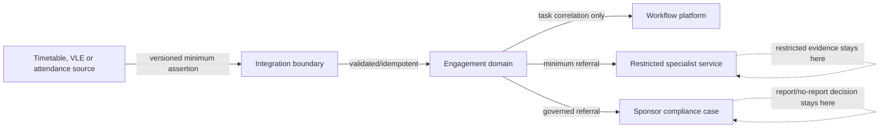

# Attendance and Engagement Privacy and Threat Assessment

> Status: Initial assessment complete; controller DPIA and security approval pending
>
> Date: 2026-07-27
>
> Scope: First attendance and academic-engagement vertical slice

This document is an architecture-level screening and threat assessment. It does not replace an institution's Data Protection Impact Assessment, records schedule, equality assessment, safeguarding procedure or legal advice.

## Screening outcome

A controller DPIA is required before a pilot uses identifiable student data. The proposed processing combines systematic monitoring, behavioural data, multiple source systems, policy evaluation, potentially vulnerable people and decisions that may materially affect students. The design therefore treats the processing as potentially high risk even though the first slice prohibits automated adverse decisions.

The Information Commissioner's Office states that a university must choose and document the lawful basis for each purpose; public task may fit teaching-related processing for public authorities, while another basis may be needed for other institutions or purposes. Sponsor-duty processing is a distinct purpose applying to sponsored students under current UKVI guidance. The SRS cannot select a universal lawful basis for every deploying controller.

## Purpose and data map

| Purpose | Minimum data | Classification | Recipient |
|---|---|---|---|
| Establish expected activity | Person/enrolment, activity, time, mode and source version | Standard Personal | SRS and authorised teaching/engagement roles |
| Record observation | Expected event, outcome, method, source/device/actor and times | Standard or Sensitive Personal depending on method/context | SRS and authorised operational roles |
| Detect possible non-engagement | Policy version, bounded evidence snapshot and explanation | Sensitive Personal (behavioural) | Engagement roles |
| Manage intervention | Contact outcome, response category, operational action and deadline | Sensitive Personal | Assigned engagement/personal-tutor roles |
| Refer for specialist decision | Referral type, target, minimum status and opaque reference | Sensitive Personal; specialist detail may be Special Category | Named target service only |
| Sponsor compliance review | Minimum engagement evidence and governed referral | Sensitive Personal | Student Sponsor Compliance Officer |
| Audit and reconcile | Actor, action, source/version, correlation and disposition | Standard/Sensitive Personal | Audit, DPO and integration roles |

Free-text is avoided in general records. Where operational notes are necessary, their length, visibility and permitted content must be constrained.

## Lawful-basis and transparency controls

| Control | Required implementation evidence |
|---|---|
| Purpose-specific lawful basis | Controller record names Article 6 basis and underlying task, obligation, contract or interests assessment |
| Special-category condition | Article 9 condition and DPA 2018 schedule condition recorded before any specialist data is processed |
| Necessity and proportionality | DPIA compares less intrusive evidence and limits frequency, granularity and retention |
| Transparency | Student notice explains sources, purposes, recipients, retention, human review and challenge/correction route |
| Automated decisions | System documentation and UI state that alerts are not decisions; no automatic academic/sponsor outcome |
| Rights | Access, rectification, restriction and objection handling include source assertions, corrections and case decisions |
| Children/vulnerable students | DPIA and safeguarding review address age, power imbalance and accessibility |
| International/collaborative delivery | Controller/processor roles, transfer mechanism and source authority documented |

The existing data-subject register provides proposed categories and retention placeholders. Each deploying controller must approve its schedule; UKVI relevance must not be applied to non-sponsored students merely because the institution holds a sponsor licence.

## Threat model

| ID | Threat or failure | Harm | Required mitigation | Verification |
|---|---|---|---|---|
| ATT-T01 | Spoofed student check-in or shared credential | False evidence and unfair intervention | Strong authentication, method assurance, anomaly review; never treat one signal as decisive | Contract and abuse-case tests |
| ATT-T02 | Source replay or duplicate batch | Inflated attendance/absence and duplicate alerts | Tenant/source-scoped idempotency, source version uniqueness and deterministic response | Integration tests |
| ATT-T03 | Staff changes an observation without provenance | Loss of trust and inaccurate action | Append-only correction, reason, authority, before/after hash and audit | Database/service tests |
| ATT-T04 | Cancelled/changed event counted as absence | Unfair adverse inference | Version expected events; cancellation suppresses absence; re-evaluate alerts | Domain tests |
| ATT-T05 | Wrong student/activity identity match | Disclosure and erroneous intervention | Canonical identifiers, confidence rules, quarantine ambiguous matches, reconciliation task | Negative matching tests |
| ATT-T06 | Threshold directly triggers withdrawal or sponsor report | Material unfair/legal harm | Architectural prohibition, separate cases, human authority and no such API/event transition | Architecture and workflow tests |
| ATT-T07 | Restricted welfare or disability context leaks | Special-category disclosure and stigma | Minimum referral, opaque reference, field allowlist, response redaction and read audit | Schema snapshot and authorisation tests |
| ATT-T08 | Cross-tenant query or event leakage | Institutional data breach | PostgreSQL RLS, tenant in event envelope, consumer scoping and cross-tenant tests | RLS and API tests |
| ATT-T09 | Over-broad staff access or case browsing | Behavioural surveillance | Assignment/role/context access checks, break-glass governance and read audit | Permission matrix tests |
| ATT-T10 | Sensitive content in logs/DLQ/metrics | Persistent uncontrolled copies | Structured allowlisted telemetry, sanitised errors, payload hash/summary only | Log scanning tests |
| ATT-T11 | Policy changed after alert creation | Irreproducible or biased decision | Immutable policy version and evidence snapshot/hash on alert | Point-in-time tests |
| ATT-T12 | Missing source silently treated as absence | Unfair intervention | `not-captured` and data-quality state; suspend escalation and reconcile | Missing-data tests |
| ATT-T13 | Late correction does not reach open cases/referrals | Continued action on false evidence | Impact analysis, alert re-evaluation, case task and per-target reconciliation | Correction scenario test |
| ATT-T14 | Excessive retention enables longitudinal surveillance | Privacy intrusion | Separate retention classes, hold-aware disposal and minimal audit certificate | Retention test and review |
| ATT-T15 | Biometric/location capture introduced as ordinary method | Disproportionate/high-risk monitoring | Not in core values; separate adapter approval, DPIA, lawful basis and security assessment | Configuration rejection test |
| ATT-T16 | Accessibility or language failure prevents response | Escalation caused by inaccessible contact | Accessible channels, preference-aware Welsh/English communications and alternative response route | Accessibility/demo tests |
| ATT-T17 | Privileged integration sends fabricated corrections | Integrity compromise | Registered source, signed/authenticated transport, least privilege, version check and operator alert | Security integration tests |
| ATT-T18 | Inference model labels risk without explainability | Discrimination and opacity | Predictive scoring excluded; future model requires separate ADR, DPIA and equality review | Static route/event review |

## Security boundaries

Trust boundaries exist at every arrow. Transport acknowledgement is not proof that a target applied the state.

## Required privacy/security tests

1. Cross-tenant reads and writes fail at database and API layers.
2. Every role is tested against every engagement route, including assigned versus unassigned cases.
3. General payload snapshots contain none of the prohibited vocabulary fields.
4. Logs and failure paths expose correlation and sanitised codes, not payload narrative.
5. Duplicate, conflicting, disputed and corrected evidence follows the defined control path.
6. No event, route or workflow transition can directly change academic status or submit a sponsor report.
7. Historical alert reconstruction returns the exact policy and evidence versions.
8. Retention removes eligible operational content while preserving the approved minimal certificate/audit evidence.
9. Welsh-language and accessibility preferences survive every generated contact.

## Residual risks requiring owner acceptance

| Risk | Why it remains | Required owner |
|---|---|---|
| Monitoring may chill participation or disproportionately affect groups | Necessary/proportionate evidence and policy are institution-specific | Product owner, DPO and equality lead |
| Source technologies have differing assurance and accessibility | Adapter and physical environment are outside the core SRS | Integration/security owner |
| Human decisions may reproduce bias | Technical explainability does not replace policy, training and review | Engagement service owner |
| Sponsor duties may change rapidly | Guidance is volatile and policy must be versioned/reviewed | Student Sponsor Compliance Officer |
| Retention obligations differ by purpose and institution | A universal product period would over- or under-retain | Records manager and DPO |

## Authoritative research

- [ICO: A guide to lawful basis](https://ico.org.uk/for-organisations/uk-gdpr-guidance-and-resources/lawful-basis/a-guide-to-lawful-basis/)
- [ICO: Public task](https://ico.org.uk/for-organisations/uk-gdpr-guidance-and-resources/lawful-basis/a-guide-to-lawful-basis/public-task/)
- [UKVI: Student Sponsor Guidance](https://www.gov.uk/government/publications/student-sponsor-guidance)
- [UKVI: Sponsorship duties](https://www.gov.uk/government/publications/student-sponsor-guidance/sponsorship-duties-accessible)

These sources support the control framing. The deploying institution remains responsible for its legal basis, policy interpretation and formal DPIA.
