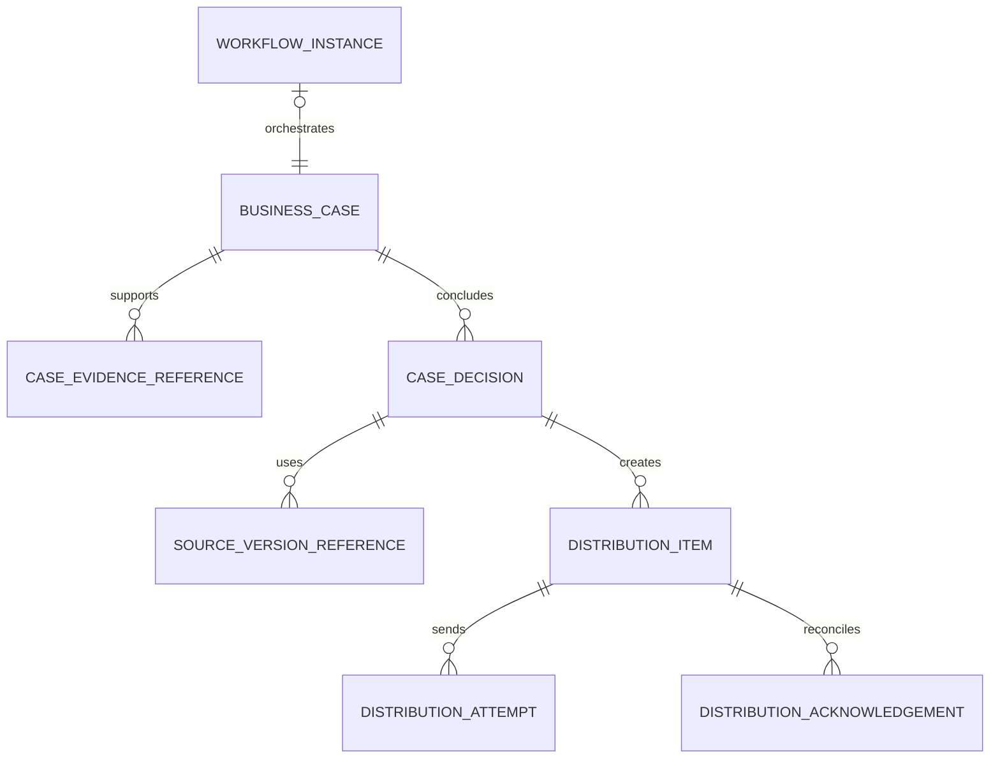
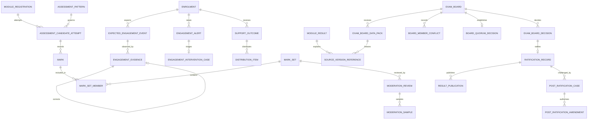
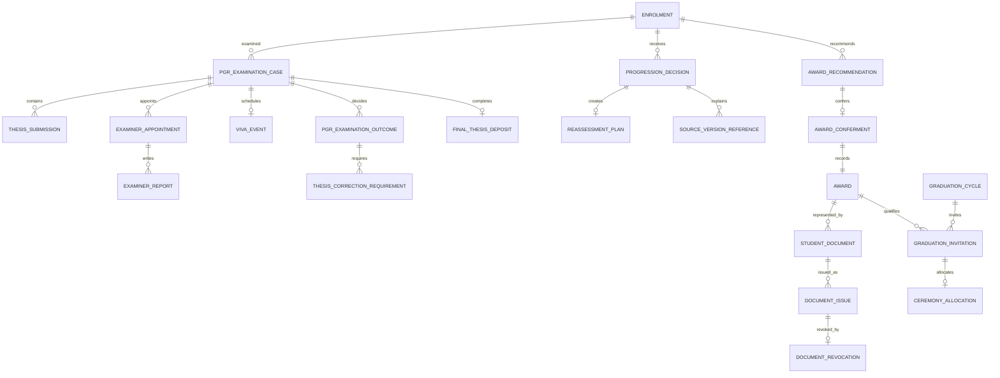

# Business Process Target Data Model

> Status: Proposed
> Date: 2026-07-27
> Governance: apply each aggregate after its relevant ADRs are accepted; attendance-relevant ADRs are accepted for generic implementation

[Delta assessment](business-process-data-model-delta.md) · [Current model](data-model.md) · [Migration plan](business-process-data-migration-plan.md)

## Modelling rules

1. Stable domain facts remain separate from workflow execution state.
2. Mutable facts use ADR-013 bitemporal columns.
3. Evidence-bearing inputs and approved decisions are separate records.
4. Generated/signed artefacts and external submissions are append-only.
5. Decisions reference exact source version IDs where reproducibility matters.
6. Sensitive evidence remains in its specialist store; SRS records opaque evidence references and minimum outcomes.
7. Every tenant-owned table has `tenant_id`, RLS and tenant-consistent foreign keys.
8. External delivery uses a durable target item plus append-only attempts/acknowledgements.

## Shared primitives

| Entity | Temporal form | Purpose |
|---|---|---|
| `business_case` | Bitemporal | Common case identity, subject, process ID, status, owner and effective interval |
| `case_evidence_reference` | Append-only | Opaque evidence reference, classification, source, hash and received metadata |
| `case_decision` | Append-only | Decision type, authority, policy/rule version, reason and effective time |
| `source_version_reference` | Append-only | Exact logical/version IDs used by a decision or generated artefact |
| `distribution_item` | Durable state | One target and authoritative source version requiring application |
| `distribution_attempt` | Append-only | Transport attempt, payload hash, response and error |
| `distribution_acknowledgement` | Append-only | Target application/rejection acknowledgement or snapshot reconciliation |

`business_case` is a shared structural primitive, not a universal table containing domain-specific JSON. Domain aggregates own typed extension tables and invariants.

## Admissions, status, curriculum and PGR

| Capability | Proposed roots and children |
|---|---|
| BPR-D01 | `student_application`, `application_received_payload`, `application_assessment` |
| BPR-D02 | `admissions_offer`, `offer_condition`, `condition_evidence`, `offer_confirmation_decision` |
| BPR-D03 | `cas_case`, `cas_eligibility_check`, `cas_assignment_version`, `sponsor_report_version` |
| BPR-D04 | `student_status_case`, `status_case_condition`, `enrolment_status_transition`, `distribution_item` |
| BPR-D05 | `curriculum_publication`, `curriculum_publication_item`, `enrolment_rule_binding`, `recognised_credit`, `rule_exception` |
| BPR-D06 | `module_selection_proposal`, `module_selection_choice`, `selection_validation_result`, `selection_approval`, `module_capacity_hold`, `registration_change_set` |
| BPR-D07 | `pgr_supervision_case`, `staff_assignment`, `pgr_progress_review`, `pgr_review_member`, `research_milestone` |

```mermaid
erDiagram
    PERSON ||--o{ STUDENT_APPLICATION : makes
    STUDENT_APPLICATION ||--o{ APPLICATION_RECEIVED_PAYLOAD : receives
    STUDENT_APPLICATION ||--o{ APPLICATION_ASSESSMENT : assessed_by
    STUDENT_APPLICATION ||--o{ ADMISSIONS_OFFER : produces
    ADMISSIONS_OFFER ||--o{ OFFER_CONDITION : contains
    OFFER_CONDITION ||--o{ CONDITION_EVIDENCE : satisfied_by
    ADMISSIONS_OFFER ||--o{ OFFER_CONFIRMATION_DECISION : confirms
    STUDENT_APPLICATION ||--o{ CAS_CASE : sponsors
    CAS_CASE ||--o{ CAS_ELIGIBILITY_CHECK : checks
    CAS_CASE ||--o{ CAS_ASSIGNMENT_VERSION : assigns

    ENROLMENT ||--o{ STUDENT_STATUS_CASE : changes
    STUDENT_STATUS_CASE ||--o{ STATUS_CASE_CONDITION : imposes
    STUDENT_STATUS_CASE ||--o| ENROLMENT_STATUS_TRANSITION : authorises
    CURRICULUM_PUBLICATION ||--o{ CURRICULUM_PUBLICATION_ITEM : publishes
    ENROLMENT ||--o{ ENROLMENT_RULE_BINDING : binds
    PROGRAMME_ROUTE ||--o{ ENROLMENT_RULE_BINDING : selects
    PROGRAMME_RULE_SET ||--o{ ENROLMENT_RULE_BINDING : governs

    ENROLMENT ||--o{ MODULE_SELECTION_PROPOSAL : proposes
    MODULE_SELECTION_PROPOSAL ||--o{ MODULE_SELECTION_CHOICE : contains
    MODULE_SELECTION_PROPOSAL ||--o{ SELECTION_VALIDATION_RESULT : validates
    MODULE_SELECTION_PROPOSAL ||--o{ SELECTION_APPROVAL : approves
    SELECTION_APPROVAL ||--o{ MODULE_REGISTRATION : creates

    ENROLMENT ||--o{ PGR_SUPERVISION_CASE : requires
    PGR_SUPERVISION_CASE ||--o{ STAFF_ASSIGNMENT : approves
    ENROLMENT ||--o{ PGR_PROGRESS_REVIEW : reviews
    PGR_PROGRESS_REVIEW ||--o{ PGR_REVIEW_MEMBER : composes
    PGR_PROGRESS_REVIEW ||--o{ RESEARCH_MILESTONE : records
```

## Engagement, support and assessment

| Capability | Proposed roots and children |
|---|---|
| BPR-D08 | `expected_engagement_event`, `engagement_evidence`, `engagement_alert`, `engagement_intervention_case` |
| BPR-D09 | Extended `reasonable_adjustment`, `support_outcome`, shared `distribution_item`/attempt/acknowledgement |
| BPR-D10 | `assessment_candidate_attempt`, `mark_set`, `mark_set_member`, `moderation_review`, `moderation_sample`, calculation evidence |
| BPR-D11 | Extended board/pack entities plus `board_member_conflict`, `board_quorum_decision`, `exam_board_decision`, `ratification_record`, `result_publication` |
| BPR-D13 | Extended `post_ratification_case`, `post_ratification_amendment`, `distribution_item` |

## PGR examination, progression, awards and documents

| Capability | Proposed roots and children |
|---|---|
| BPR-D12 | `pgr_examination_case`, `thesis_submission`, `examiner_appointment`, `examiner_report`, `viva_event`, `pgr_examination_outcome`, `thesis_correction_requirement`, `final_thesis_deposit` |
| BPR-D14 | Extended progression evidence plus `reassessment_plan`, `award_recommendation`, `award_conferment` |
| BPR-D15 | `student_document`, `document_issue`, `document_revocation`, `document_verification`, `graduation_cycle`, `graduation_invitation`, `ceremony_allocation` |

## Regulatory and record governance

| Capability | Proposed roots and children |
|---|---|
| BPR-D16 | `regulatory_collection`, `collection_snapshot`, `regulatory_record`, `regulatory_field_lineage`, `regulatory_validation_issue`, `regulatory_signoff`, `regulatory_submission` |
| BPR-D17 | `identity_resolution_case`, `identity_resolution_candidate`, `identity_resolution_decision`, `person_identity_link`, `identity_redirect`, `data_correction_case` |
| BPR-D18 | `individual_rights_request`, `rights_request_scope`, `rights_search_manifest`, `rights_decision`, `processing_restriction`, `retention_schedule`, `retention_assignment`, `record_hold`, `record_disposition` |
| BPR-D19 | Extended `audit_record`, `audit_partition_seal`, `audit_review_case`, `audit_review_finding` |

```mermaid
erDiagram
    REGULATORY_COLLECTION ||--o{ COLLECTION_SNAPSHOT : versions
    COLLECTION_SNAPSHOT ||--o{ REGULATORY_RECORD : contains
    REGULATORY_RECORD ||--o{ REGULATORY_FIELD_LINEAGE : explains
    REGULATORY_COLLECTION ||--o{ REGULATORY_VALIDATION_ISSUE : validates
    REGULATORY_COLLECTION ||--o{ REGULATORY_SIGNOFF : signs
    REGULATORY_COLLECTION ||--o{ REGULATORY_SUBMISSION : submits
    REGULATORY_SUBMISSION ||--o{ DISTRIBUTION_ATTEMPT : transports

    IDENTITY_RESOLUTION_CASE ||--o{ IDENTITY_RESOLUTION_CANDIDATE : compares
    IDENTITY_RESOLUTION_CASE ||--o| IDENTITY_RESOLUTION_DECISION : decides
    IDENTITY_RESOLUTION_DECISION ||--o{ PERSON_IDENTITY_LINK : links
    IDENTITY_RESOLUTION_DECISION ||--o{ IDENTITY_REDIRECT : propagates
    PERSON ||--o{ DATA_CORRECTION_CASE : corrects

    PERSON ||--o{ INDIVIDUAL_RIGHTS_REQUEST : requests
    INDIVIDUAL_RIGHTS_REQUEST ||--o{ RIGHTS_REQUEST_SCOPE : scopes
    INDIVIDUAL_RIGHTS_REQUEST ||--o{ RIGHTS_SEARCH_MANIFEST : searches
    INDIVIDUAL_RIGHTS_REQUEST ||--o{ RIGHTS_DECISION : decides
    RIGHTS_DECISION ||--o{ PROCESSING_RESTRICTION : restricts
    RETENTION_SCHEDULE ||--o{ RETENTION_ASSIGNMENT : classifies
    RETENTION_ASSIGNMENT ||--o{ RECORD_HOLD : holds
    RETENTION_ASSIGNMENT ||--o{ RECORD_DISPOSITION : disposes

    AUDIT_RECORD ||--o{ AUDIT_PARTITION_SEAL : sealed_by
    AUDIT_REVIEW_CASE ||--o{ AUDIT_REVIEW_FINDING : finds
    AUDIT_REVIEW_FINDING }o--o{ AUDIT_RECORD : cites
```

## Required key semantics

| Key | Rule |
|---|---|
| Logical ID | Stable across bitemporal versions |
| Version ID | Identifies one exact stored version used by a decision/snapshot |
| Case ID | Identifies one governed process instance independent of workflow engine history |
| Correlation ID | Connects case, domain transaction, event and integrations |
| Idempotency key | Unique per tenant, target, operation and authoritative source version |
| External reference | Never used as the sole tenant-wide person or business key |

## Data classification

- `restricted-case`: evidence references, rights decisions, identity investigation and welfare/safeguarding metadata.
- `sensitive-academic`: marks, moderation, results, board and PGR examination.
- `regulatory`: CAS, submissions, validation and sign-off.
- `personal`: applications, enrolments, assignments and documents.
- `operational`: distribution state, hashes and acknowledgements, containing minimum personal data.

The target model requires corresponding RBAC, RLS, read-audit, retention and export controls before production use.
