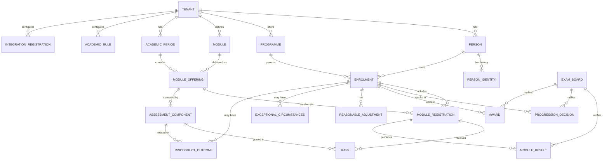

# Data Model

> Status: Draft — Phase 2
> Last updated: 2026-06-04
> This document defines the logical data model, the bitemporal storage pattern, the multi-tenancy strategy, and the naming conventions that govern all database design. Full DDL is produced in Phase 3 as part of the platform foundation.

---

## Principles

1. Every table that represents a fact that changes over time is **bitemporal** — see §Bitemporal Pattern.
2. Every row in every table carries a **`tenant_id`** and is subject to **row-level security** (RLS) — see §Multi-Tenancy.
3. There are **no soft-delete flags**. Historical states are preserved by bitemporal dating; truly deleted data uses hard DELETE only under an approved erasure workflow with audit trail.
4. **UUIDs** (v4) are used as all primary keys. No sequential integer IDs that could leak record counts or ordering information.
5. **`TIMESTAMPTZ`** for all timestamps (timezone-aware, stored in UTC).
6. **`TEXT`** for all string fields (PostgreSQL's `TEXT` is equivalent to `VARCHAR(n)` in performance; length constraints are applied where domain-meaningful via CHECK).

---

## Bitemporal Pattern

All temporally mutable tables include four columns defining two independent time axes.

| Column | Type | Description |
|---|---|---|
| `valid_from` | `TIMESTAMPTZ NOT NULL` | When this fact became true in the real world |
| `valid_to` | `TIMESTAMPTZ` | When this fact ceased to be true (`NULL` = still true) |
| `recorded_at` | `TIMESTAMPTZ NOT NULL DEFAULT now()` | When this row was inserted into the database |
| `recorded_until` | `TIMESTAMPTZ` | When this row was superseded by a correction (`NULL` = current record) |

### Current state query predicate
```sql
WHERE valid_from   <= NOW()
  AND (valid_to    IS NULL OR valid_to > NOW())
  AND recorded_at  <= NOW()
  AND recorded_until IS NULL
```

### Point-in-time query predicate (valid time `$vt`, transaction time `$tt`)
```sql
WHERE valid_from     <= $vt
  AND (valid_to      IS NULL OR valid_to > $vt)
  AND recorded_at    <= $tt
  AND (recorded_until IS NULL OR recorded_until > $tt)
```

### Updating a bitemporal record
Never `UPDATE` a bitemporal row. Instead:
1. `UPDATE` the existing row: set `recorded_until = NOW()`.
2. `INSERT` a new row with the updated values, `recorded_at = NOW()`, `recorded_until = NULL`, and updated `valid_from` / `valid_to` as appropriate.

This is encapsulated in a shared `bitemporalUpdate(table, id, patch, validFrom?, validTo?)` helper in `packages/db`.

### Reusable Drizzle column helper
```typescript
// packages/db/src/temporal.ts
export const bitemporalColumns = {
  validFrom:      timestamp('valid_from',    { withTimezone: true }).notNull(),
  validTo:        timestamp('valid_to',      { withTimezone: true }),
  recordedAt:     timestamp('recorded_at',   { withTimezone: true }).notNull().defaultNow(),
  recordedUntil:  timestamp('recorded_until',{ withTimezone: true }),
};
```

---

## Multi-Tenancy Pattern

Every table includes `tenant_id UUID NOT NULL` as a foreign key to the `tenant` table.

Tenant isolation is enforced at the **PostgreSQL row-level security** layer:

```sql
-- Set once per database connection after authentication
SET app.current_tenant_id = '<tenant-uuid>';

-- Example RLS policy (applied to every user-data table)
ALTER TABLE person ENABLE ROW LEVEL SECURITY;

CREATE POLICY tenant_isolation ON person
  USING (tenant_id = current_setting('app.current_tenant_id')::uuid);
```

The application sets `app.current_tenant_id` on every connection obtained from the pool, derived from the authenticated user's JWT `tenant_id` claim. The `system_administrator` role bypasses RLS (`BYPASSRLS`) for platform-level operations, which are separately audit-logged.

---

## Entity Relationship Diagram



---

## Core Entity Definitions

Tables are grouped by domain. All tables include `tenant_id` (omitted from field lists for brevity) and the standard bitemporal columns where marked *(bitemporal)*.

---

### tenant

| Column | Type | Notes |
|---|---|---|
| `id` | `UUID PK` | |
| `code` | `TEXT UNIQUE NOT NULL` | Short institution code (e.g. `UNIVABC`) |
| `name` | `TEXT NOT NULL` | Full institution name |
| `configuration` | `JSONB NOT NULL DEFAULT '{}'` | Tenant-level config (locale, timezone, branding, etc.) |
| `created_at` | `TIMESTAMPTZ NOT NULL` | |
| `active` | `BOOLEAN NOT NULL DEFAULT true` | |

---

### person *(root identity record — not bitemporal itself)*

| Column | Type | Notes |
|---|---|---|
| `id` | `UUID PK` | |
| `student_number` | `TEXT NOT NULL` | Human-readable; unique per tenant (UNIQUE on tenant_id + student_number) |
| `hesa_id` | `TEXT` | Assigned by HESA; nullable until received |
| `source_system` | `TEXT NOT NULL` | `ucas` / `direct` / `manual` |
| `source_reference` | `TEXT` | E.g. UCAS personal ID |
| `created_at` | `TIMESTAMPTZ NOT NULL` | |

### person_identity *(bitemporal — personal data changes over time)*

| Column | Type | Notes |
|---|---|---|
| `id` | `UUID PK` | |
| `person_id` | `UUID FK → person` | |
| `legal_first_name` | `TEXT NOT NULL` | |
| `legal_family_name` | `TEXT NOT NULL` | |
| `preferred_name` | `TEXT` | |
| `date_of_birth` | `DATE NOT NULL` | |
| `gender_code` | `TEXT` | HESA coding |
| `nationality_code` | `TEXT` | ISO 3166-1 alpha-3 |
| `domicile_code` | `TEXT` | HESA domicile coding |
| `ethnicity_code` | `TEXT` | Special category; RLS-scoped to privileged roles |
| `email_institutional` | `TEXT` | |
| `email_personal` | `TEXT` | |
| `phone` | `TEXT` | |
| *(bitemporal columns)* | | |

---

### programme *(bitemporal)*

| Column | Type | Notes |
|---|---|---|
| `id` | `UUID PK` | |
| `code` | `TEXT NOT NULL` | Unique per tenant + valid time |
| `title` | `TEXT NOT NULL` | |
| `qualification_type_code` | `TEXT NOT NULL` | HESA qualification type |
| `fheq_level` | `SMALLINT NOT NULL` | 4–8 |
| `credit_total` | `SMALLINT NOT NULL` | Total credits required |
| `duration_years` | `SMALLINT NOT NULL` | |
| `mode_of_study_code` | `TEXT NOT NULL` | FT / PT / DL |
| `source_system_reference` | `TEXT` | CM system programme ID |
| *(bitemporal columns)* | | |

### module *(bitemporal)*

| Column | Type | Notes |
|---|---|---|
| `id` | `UUID PK` | |
| `code` | `TEXT NOT NULL` | |
| `title` | `TEXT NOT NULL` | |
| `credit_value` | `SMALLINT NOT NULL` | |
| `fheq_level` | `SMALLINT NOT NULL` | |
| `source_system_reference` | `TEXT` | CM system module ID |
| *(bitemporal columns)* | | |

### academic_period

| Column | Type | Notes |
|---|---|---|
| `id` | `UUID PK` | |
| `academic_year` | `TEXT NOT NULL` | E.g. `2024-25` |
| `period_code` | `TEXT NOT NULL` | E.g. `SEM1`, `SEM2`, `FULL-YEAR` |
| `period_type_code` | `TEXT NOT NULL` | `semester` / `term` / `year` |
| `start_date` | `DATE NOT NULL` | |
| `end_date` | `DATE NOT NULL` | |

### module_offering

| Column | Type | Notes |
|---|---|---|
| `id` | `UUID PK` | |
| `module_id` | `UUID FK → module` | |
| `academic_period_id` | `UUID FK → academic_period` | |
| `delivery_mode_code` | `TEXT NOT NULL` | |
| `capacity` | `INT` | |

---

### enrolment *(bitemporal — status changes over time)*

| Column | Type | Notes |
|---|---|---|
| `id` | `UUID PK` | |
| `person_id` | `UUID FK → person` | |
| `programme_id` | `UUID FK → programme` | |
| `status_code` | `TEXT NOT NULL` | `enrolled` / `intermitting` / `withdrawn` / `suspended` / `graduated` |
| `mode_of_study_code` | `TEXT NOT NULL` | |
| `attendance_type_code` | `TEXT NOT NULL` | |
| `academic_year_of_entry` | `TEXT NOT NULL` | E.g. `2023-24` |
| `start_date` | `DATE NOT NULL` | |
| `expected_end_date` | `DATE` | |
| `actual_end_date` | `DATE` | |
| `fee_band_code` | `TEXT` | |
| `funding_source_code` | `TEXT` | `slc` / `self` / `employer` / `international` |
| `slc_reference` | `TEXT` | |
| `ucas_personal_id` | `TEXT` | |
| *(bitemporal columns)* | | |

### module_registration *(bitemporal)*

| Column | Type | Notes |
|---|---|---|
| `id` | `UUID PK` | |
| `enrolment_id` | `UUID FK → enrolment` | |
| `module_offering_id` | `UUID FK → module_offering` | |
| `status_code` | `TEXT NOT NULL` | `registered` / `withdrawn` / `completed` |
| `registration_date` | `DATE NOT NULL` | |
| *(bitemporal columns)* | | |

---

### assessment_component

| Column | Type | Notes |
|---|---|---|
| `id` | `UUID PK` | |
| `module_offering_id` | `UUID FK → module_offering` | |
| `component_code` | `TEXT NOT NULL` | E.g. `CW1`, `EX1` |
| `component_type_code` | `TEXT NOT NULL` | `exam` / `coursework` / `practical` / `portfolio` |
| `weighting` | `NUMERIC(5,2) NOT NULL` | Percentage; must sum to 100 per module_offering |
| `pass_mark` | `NUMERIC(5,2) NOT NULL` | |
| `max_mark` | `NUMERIC(5,2) NOT NULL DEFAULT 100` | |
| `is_mandatory` | `BOOLEAN NOT NULL DEFAULT true` | |

### mark *(bitemporal — marks can be corrected pre-ratification)*

| Column | Type | Notes |
|---|---|---|
| `id` | `UUID PK` | |
| `module_registration_id` | `UUID FK → module_registration` | |
| `assessment_component_id` | `UUID FK → assessment_component` | |
| `raw_mark` | `NUMERIC(5,2) NOT NULL` | Mark as received |
| `adjusted_mark` | `NUMERIC(5,2)` | After penalty suppression or adjustment |
| `penalty_applied` | `BOOLEAN NOT NULL DEFAULT false` | Whether a late submission penalty was applied |
| `source_system_code` | `TEXT` | `vle` / `manual` / etc. |
| `is_resit` | `BOOLEAN NOT NULL DEFAULT false` | |
| `ratified` | `BOOLEAN NOT NULL DEFAULT false` | |
| `locked` | `BOOLEAN NOT NULL DEFAULT false` | Set by exam board workflow |
| *(bitemporal columns)* | | |

### module_result *(bitemporal)*

| Column | Type | Notes |
|---|---|---|
| `id` | `UUID PK` | |
| `module_registration_id` | `UUID FK → module_registration` | |
| `aggregate_mark` | `NUMERIC(5,2) NOT NULL` | Calculated from marks + weightings |
| `result_code` | `TEXT NOT NULL` | `pass` / `fail` / `compensated` / `condoned` / `deferred` |
| `ratified` | `BOOLEAN NOT NULL DEFAULT false` | |
| `locked` | `BOOLEAN NOT NULL DEFAULT false` | |
| `exam_board_id` | `UUID FK → exam_board` | Populated on ratification |
| *(bitemporal columns)* | | |

### exam_board

| Column | Type | Notes |
|---|---|---|
| `id` | `UUID PK` | |
| `board_type_code` | `TEXT NOT NULL` | `module` / `award` |
| `academic_period_id` | `UUID FK → academic_period` | |
| `meeting_date` | `DATE NOT NULL` | |
| `chair_person_id` | `TEXT` | Actor ID from Keycloak |
| `external_examiner_confirmed_at` | `TIMESTAMPTZ` | |
| `ratified_at` | `TIMESTAMPTZ` | Set when board formally ratifies |
| `data_pack_generated_at` | `TIMESTAMPTZ` | |

### progression_decision *(bitemporal)*

| Column | Type | Notes |
|---|---|---|
| `id` | `UUID PK` | |
| `enrolment_id` | `UUID FK → enrolment` | |
| `academic_year` | `TEXT NOT NULL` | |
| `decision_code` | `TEXT NOT NULL` | `progress` / `resit` / `repeat-year` / `withdraw` |
| `year_of_study` | `SMALLINT NOT NULL` | |
| `exam_board_id` | `UUID FK → exam_board` | |
| `locked` | `BOOLEAN NOT NULL DEFAULT false` | |
| *(bitemporal columns)* | | |

### award

| Column | Type | Notes |
|---|---|---|
| `id` | `UUID PK` | |
| `enrolment_id` | `UUID FK → enrolment` | |
| `qualification_code` | `TEXT NOT NULL` | HESA qualification type |
| `classification_code` | `TEXT` | `1` / `2.1` / `2.2` / `3` / `pass` / `merit` / `distinction` |
| `award_date` | `DATE NOT NULL` | |
| `exam_board_id` | `UUID FK → exam_board` | |
| `hear_generated_at` | `TIMESTAMPTZ` | |
| `certificate_issued_at` | `TIMESTAMPTZ` | |
| `created_at` | `TIMESTAMPTZ NOT NULL` | |

---

### reasonable_adjustment *(bitemporal)*

| Column | Type | Notes |
|---|---|---|
| `id` | `UUID PK` | |
| `enrolment_id` | `UUID FK → enrolment` | |
| `adjustment_type_code` | `TEXT NOT NULL` | E.g. `extra-time` / `separate-room` / `deadline-extension` |
| `description` | `TEXT` | |
| `scope_code` | `TEXT NOT NULL` | `all` / `exam` / `coursework` / `attendance` |
| `approved_at` | `TIMESTAMPTZ NOT NULL` | |
| `source_case_reference` | `TEXT` | Reference from Wellbeing system |
| *(bitemporal columns)* | | |

> Distribution state is tracked per target system in `adjustment_distribution` (see below), not as timestamp columns here.

### adjustment_distribution *(append-only status rows — one per target system per adjustment)*

| Column | Type | Notes |
|---|---|---|
| `id` | `UUID PK` | |
| `adjustment_id` | `UUID FK → reasonable_adjustment` | |
| `target_system_code` | `TEXT NOT NULL` | `vle` / `attendance` / `exams` |
| `status_code` | `TEXT NOT NULL` | `pending` / `distributed` / `failed` / `superseded` |
| `contract_version` | `TEXT NOT NULL` | Version of integration contract used |
| `attempt_count` | `SMALLINT NOT NULL DEFAULT 0` | |
| `last_attempt_at` | `TIMESTAMPTZ` | |
| `last_error` | `TEXT` | |
| `distributed_at` | `TIMESTAMPTZ` | Set on success |
| `created_at` | `TIMESTAMPTZ NOT NULL DEFAULT now()` | |

### exceptional_circumstances *(bitemporal — outcomes can be corrected)*

| Column | Type | Notes |
|---|---|---|
| `id` | `UUID PK` | |
| `enrolment_id` | `UUID FK → enrolment` | |
| `module_offering_id` | `UUID FK → module_offering` | |
| `assessment_component_id` | `UUID FK → assessment_component` | Nullable; specific component if applicable |
| `outcome_code` | `TEXT NOT NULL` | `upheld` / `not-upheld` |
| `outcome_reason` | `TEXT` | |
| `determination_date` | `DATE NOT NULL` | |
| `source_case_reference` | `TEXT` | |
| *(bitemporal columns)* | | |

### exceptional_circumstances_board_visibility *(append-only)*

| Column | Type | Notes |
|---|---|---|
| `id` | `UUID PK` | |
| `exceptional_circumstances_id` | `UUID FK → exceptional_circumstances` | |
| `exam_board_id` | `UUID FK → exam_board` | |
| `included_in_pack_at` | `TIMESTAMPTZ NOT NULL` | |

### misconduct_outcome *(bitemporal — can be corrected pre-ratification)*

| Column | Type | Notes |
|---|---|---|
| `id` | `UUID PK` | |
| `enrolment_id` | `UUID FK → enrolment` | |
| `assessment_component_id` | `UUID FK → assessment_component` | Nullable (programme-level cases) |
| `outcome_code` | `TEXT NOT NULL` | `upheld` / `not-upheld` |
| `penalty_code` | `TEXT` | E.g. `mark-reduction` / `module-fail` / `exclusion` |
| `penalty_effect` | `JSONB` | Structured effect on mark/module/progression |
| `effective_date` | `DATE NOT NULL` | |
| `source_case_reference` | `TEXT` | |
| *(bitemporal columns)* | | |

---

### academic_rule *(bitemporal — rules change per academic year)*

| Column | Type | Notes |
|---|---|---|
| `id` | `UUID PK` | |
| `programme_id` | `UUID FK → programme` | Nullable for tenant-wide rules |
| `rule_type_code` | `TEXT NOT NULL` | `progression` / `classification` / `compensation` / `late-penalty` / `resit-cap` |
| `rule_key` | `TEXT NOT NULL` | Identifies the specific rule within a type |
| `rule_value` | `JSONB NOT NULL` | Structured rule configuration |
| `description` | `TEXT` | Human-readable explanation |
| `applies_to_level` | `SMALLINT` | Nullable; level-specific rules |
| *(bitemporal columns)* | | |

---

### audit_record *(append-only; no RLS — system administrator access only)*

| Column | Type | Notes |
|---|---|---|
| `id` | `UUID PK` | |
| `tenant_id` | `UUID` | Nullable for platform-level events |
| `entity_type` | `TEXT NOT NULL` | E.g. `enrolment` / `mark` |
| `entity_id` | `UUID NOT NULL` | |
| `field_name` | `TEXT` | Null for create/delete events |
| `before_value` | `JSONB` | |
| `after_value` | `JSONB` | |
| `action_type` | `TEXT NOT NULL` | `create` / `update` / `delete` / `read` |
| `actor_type` | `TEXT NOT NULL` | `user` / `system` / `integration` |
| `actor_id` | `TEXT NOT NULL` | Keycloak subject or system name |
| `actor_display_name` | `TEXT` | |
| `occurred_at` | `TIMESTAMPTZ NOT NULL DEFAULT now()` | |
| `correlation_id` | `UUID` | Request correlation ID |
| `workflow_instance_id` | `TEXT` | Temporal workflow ID if applicable |
| `reason_code` | `TEXT` | |
| `reason_text` | `TEXT` | |

---

### integration_registration *(plugin registry)*

| Column | Type | Notes |
|---|---|---|
| `id` | `UUID PK` | |
| `integration_code` | `TEXT NOT NULL` | E.g. `vle-moodle-v2` |
| `display_name` | `TEXT NOT NULL` | |
| `pattern_type` | `TEXT NOT NULL` | `rest` / `event` / `file` |
| `contract_version` | `TEXT NOT NULL` | Semver |
| `enabled` | `BOOLEAN NOT NULL DEFAULT false` | |
| `configuration` | `JSONB NOT NULL DEFAULT '{}'` | Encrypted at application layer |
| `last_health_check_at` | `TIMESTAMPTZ` | |
| `health_status_code` | `TEXT` | `healthy` / `degraded` / `unreachable` |
| `registered_at` | `TIMESTAMPTZ NOT NULL DEFAULT now()` | |
| `last_updated_at` | `TIMESTAMPTZ NOT NULL DEFAULT now()` | |

---

---

## Additional Entities — Admissions and Identity

### student_application *(bitemporal — status progresses through admissions cycle)*

| Column | Type | Notes |
|---|---|---|
| `id` | `UUID PK` | |
| `person_id` | `UUID FK → person` | Nullable until student record created |
| `source_system_code` | `TEXT NOT NULL` | `ucas` / `direct` / `crm` |
| `source_reference` | `TEXT` | E.g. UCAS application number |
| `ucas_personal_id` | `TEXT` | |
| `programme_id` | `UUID FK → programme` | |
| `entry_academic_year` | `TEXT NOT NULL` | |
| `ucas_cycle_code` | `TEXT` | |
| `status_code` | `TEXT NOT NULL` | `received` / `offer-made` / `accepted` / `conditions-pending` / `enrolled` / `withdrawn` / `declined` / `no-show` |
| *(bitemporal columns)* | | |

### admissions_offer *(bitemporal)*

| Column | Type | Notes |
|---|---|---|
| `id` | `UUID PK` | |
| `student_application_id` | `UUID FK → student_application` | |
| `offer_type_code` | `TEXT NOT NULL` | `conditional` / `unconditional` |
| `conditions_description` | `TEXT` | |
| `offer_date` | `DATE NOT NULL` | |
| `acceptance_deadline` | `DATE` | |
| `accepted_at` | `TIMESTAMPTZ` | |
| `declined_at` | `TIMESTAMPTZ` | |
| `conditions_met_at` | `TIMESTAMPTZ` | |
| `conditions_failed_at` | `TIMESTAMPTZ` | |
| *(bitemporal columns)* | | |

### identity_verification_check *(bitemporal)*

| Column | Type | Notes |
|---|---|---|
| `id` | `UUID PK` | |
| `person_id` | `UUID FK → person` | |
| `status_code` | `TEXT NOT NULL` | `requested` / `verified` / `failed` / `fraud-flagged` |
| `confidence_score` | `NUMERIC(5,2)` | |
| `fraud_flag` | `BOOLEAN NOT NULL DEFAULT false` | |
| `provider_reference` | `TEXT` | OIV system reference |
| `requested_at` | `TIMESTAMPTZ NOT NULL` | |
| `completed_at` | `TIMESTAMPTZ` | |
| *(bitemporal columns)* | | |

### disability_declaration *(bitemporal — special category)*

| Column | Type | Notes |
|---|---|---|
| `id` | `UUID PK` | |
| `person_id` | `UUID FK → person` | |
| `disability_category_code` | `TEXT NOT NULL` | HESA disability coding |
| `declaration_status_code` | `TEXT NOT NULL` | `declared` / `withdrawn` / `updated` |
| `declared_at` | `TIMESTAMPTZ NOT NULL` | |
| *(bitemporal columns)* | | |

### student_address *(bitemporal)*

| Column | Type | Notes |
|---|---|---|
| `id` | `UUID PK` | |
| `person_id` | `UUID FK → person` | |
| `address_type_code` | `TEXT NOT NULL` | `home` / `term` / `correspondence` |
| `line1` | `TEXT NOT NULL` | |
| `line2` | `TEXT` | |
| `city` | `TEXT` | |
| `postcode` | `TEXT` | |
| `country_code` | `TEXT NOT NULL` | ISO 3166-1 alpha-2 |
| *(bitemporal columns)* | | |

---

## Additional Entities — Programme and Module Catalogue

### awarding_body

| Column | Type | Notes |
|---|---|---|
| `id` | `UUID PK` | |
| `code` | `TEXT NOT NULL` | |
| `name` | `TEXT NOT NULL` | |
| `active` | `BOOLEAN NOT NULL DEFAULT true` | |

### programme_route *(bitemporal — route/pathway/specialism)*

| Column | Type | Notes |
|---|---|---|
| `id` | `UUID PK` | |
| `programme_id` | `UUID FK → programme` | |
| `route_code` | `TEXT NOT NULL` | |
| `title` | `TEXT NOT NULL` | |
| *(bitemporal columns)* | | |

### module_relationship *(bitemporal)*

| Column | Type | Notes |
|---|---|---|
| `id` | `UUID PK` | |
| `module_id` | `UUID FK → module` | The module that has the requirement |
| `related_module_id` | `UUID FK → module` | The required/excluded module |
| `relationship_type_code` | `TEXT NOT NULL` | `prerequisite` / `co-requisite` / `exclusion` |
| *(bitemporal columns)* | | |

### learning_outcome *(bitemporal)*

| Column | Type | Notes |
|---|---|---|
| `id` | `UUID PK` | |
| `owner_type` | `TEXT NOT NULL` | `programme` / `module` |
| `owner_id` | `UUID NOT NULL` | FK to programme or module |
| `outcome_code` | `TEXT NOT NULL` | |
| `description` | `TEXT NOT NULL` | |
| *(bitemporal columns)* | | |

---

## Additional Entities — Enrolment, Fees, and Holds

### fee_liability *(bitemporal)*

| Column | Type | Notes |
|---|---|---|
| `id` | `UUID PK` | |
| `enrolment_id` | `UUID FK → enrolment` | |
| `academic_year` | `TEXT NOT NULL` | |
| `fee_amount` | `NUMERIC(10,2) NOT NULL` | |
| `fee_type_code` | `TEXT NOT NULL` | `tuition` / `registration` / `resit` |
| `funding_source_code` | `TEXT NOT NULL` | `slc` / `self` / `employer` / `international` |
| `status_code` | `TEXT NOT NULL` | `outstanding` / `paid` / `waived` / `in-dispute` |
| *(bitemporal columns)* | | |

### payment_confirmation *(append-only)*

| Column | Type | Notes |
|---|---|---|
| `id` | `UUID PK` | |
| `enrolment_id` | `UUID FK → enrolment` | |
| `fee_liability_id` | `UUID FK → fee_liability` | Nullable (partial payments) |
| `payment_source_code` | `TEXT NOT NULL` | `slc` / `student` / `employer` |
| `amount` | `NUMERIC(10,2) NOT NULL` | |
| `payment_reference` | `TEXT` | Finance system / SLC reference |
| `confirmed_at` | `TIMESTAMPTZ NOT NULL` | |
| `created_at` | `TIMESTAMPTZ NOT NULL DEFAULT now()` | |

### student_hold *(bitemporal)*

| Column | Type | Notes |
|---|---|---|
| `id` | `UUID PK` | |
| `enrolment_id` | `UUID FK → enrolment` | |
| `hold_type_code` | `TEXT NOT NULL` | `financial` / `library` / `compliance` / `disciplinary` / `document` |
| `reason` | `TEXT` | |
| `applied_by_actor_id` | `TEXT NOT NULL` | |
| `applied_at` | `TIMESTAMPTZ NOT NULL` | |
| `released_at` | `TIMESTAMPTZ` | |
| *(bitemporal columns)* | | |

### reenrolment_period

| Column | Type | Notes |
|---|---|---|
| `id` | `UUID PK` | |
| `academic_year` | `TEXT NOT NULL` | |
| `programme_id` | `UUID FK → programme` | Nullable = all programmes |
| `opens_at` | `TIMESTAMPTZ NOT NULL` | |
| `closes_at` | `TIMESTAMPTZ NOT NULL` | |
| `reminder_at` | `TIMESTAMPTZ` | |

### reenrolment_confirmation *(bitemporal)*

| Column | Type | Notes |
|---|---|---|
| `id` | `UUID PK` | |
| `enrolment_id` | `UUID FK → enrolment` | |
| `reenrolment_period_id` | `UUID FK → reenrolment_period` | |
| `status_code` | `TEXT NOT NULL` | `pending` / `confirmed` / `lapsed` |
| `confirmed_at` | `TIMESTAMPTZ` | |
| *(bitemporal columns)* | | |

---

## Additional Entities — Timetable, Attendance, and Engagement

### timetabled_activity *(versioned by TTB publication)*

| Column | Type | Notes |
|---|---|---|
| `id` | `UUID PK` | |
| `module_offering_id` | `UUID FK → module_offering` | |
| `activity_type_code` | `TEXT NOT NULL` | `lecture` / `seminar` / `lab` / `tutorial` |
| `scheduled_start` | `TIMESTAMPTZ NOT NULL` | |
| `scheduled_end` | `TIMESTAMPTZ NOT NULL` | |
| `room_reference` | `TEXT` | From Timetabling / Estates |
| `source_activity_id` | `TEXT` | TTB system activity ID |
| `published_at` | `TIMESTAMPTZ NOT NULL` | When received from TTB |
| `superseded_at` | `TIMESTAMPTZ` | When replaced by a new publication |

### attendance_record *(append-only with correction support)*

| Column | Type | Notes |
|---|---|---|
| `id` | `UUID PK` | |
| `enrolment_id` | `UUID FK → enrolment` | |
| `timetabled_activity_id` | `UUID FK → timetabled_activity` | Nullable for unscheduled check-ins |
| `status_code` | `TEXT NOT NULL` | `present` / `absent-authorised` / `absent-unauthorised` / `late` |
| `recorded_by_system` | `TEXT NOT NULL` | Source AM system |
| `recorded_at` | `TIMESTAMPTZ NOT NULL DEFAULT now()` | |
| `corrected_at` | `TIMESTAMPTZ` | If corrected; original row retained |
| `correction_reason` | `TEXT` | |
| `ukvi_relevant` | `BOOLEAN NOT NULL DEFAULT false` | Whether this event counts toward UKVI compliance |

### absence_alert *(bitemporal — alerts can be resolved)*

| Column | Type | Notes |
|---|---|---|
| `id` | `UUID PK` | |
| `enrolment_id` | `UUID FK → enrolment` | |
| `alert_type_code` | `TEXT NOT NULL` | `consecutive-absences` / `threshold-breach` / `ukvi-threshold-breach` |
| `threshold_value` | `NUMERIC(5,2)` | E.g. attendance percentage |
| `current_value` | `NUMERIC(5,2)` | |
| `status_code` | `TEXT NOT NULL` | `open` / `reviewed` / `escalated` / `resolved` |
| `raised_at` | `TIMESTAMPTZ NOT NULL` | |
| *(bitemporal columns)* | | |

---

## Additional Entities — Exam Operations

### exam_entry *(bitemporal)*

| Column | Type | Notes |
|---|---|---|
| `id` | `UUID PK` | |
| `enrolment_id` | `UUID FK → enrolment` | |
| `assessment_component_id` | `UUID FK → assessment_component` | |
| `entry_status_code` | `TEXT NOT NULL` | `entered` / `withdrawn` / `absent` / `sat` |
| `sent_to_exams_at` | `TIMESTAMPTZ` | |
| *(bitemporal columns)* | | |

### exam_candidate

| Column | Type | Notes |
|---|---|---|
| `id` | `UUID PK` | |
| `exam_entry_id` | `UUID FK → exam_entry` | |
| `candidate_number` | `TEXT NOT NULL` | Anonymous identifier for exam room |
| `seat_reference` | `TEXT` | |
| `assigned_at` | `TIMESTAMPTZ NOT NULL DEFAULT now()` | |

### exam_timetable_entry *(versioned by publication)*

| Column | Type | Notes |
|---|---|---|
| `id` | `UUID PK` | |
| `exam_entry_id` | `UUID FK → exam_entry` | |
| `scheduled_start` | `TIMESTAMPTZ NOT NULL` | |
| `scheduled_end` | `TIMESTAMPTZ NOT NULL` | |
| `venue_reference` | `TEXT` | |
| `room_reference` | `TEXT` | |
| `published_at` | `TIMESTAMPTZ NOT NULL` | |
| `superseded_at` | `TIMESTAMPTZ` | |

### exam_accommodation_distribution *(per-target status)*

| Column | Type | Notes |
|---|---|---|
| `id` | `UUID PK` | |
| `adjustment_id` | `UUID FK → reasonable_adjustment` | |
| `exam_entry_id` | `UUID FK → exam_entry` | |
| `status_code` | `TEXT NOT NULL` | `pending` / `distributed` / `failed` |
| `distributed_at` | `TIMESTAMPTZ` | |
| `attempt_count` | `SMALLINT NOT NULL DEFAULT 0` | |
| `last_error` | `TEXT` | |

---

## Additional Entities — Exam Board Governance

### exam_board_data_pack *(append-only — immutable generated artefact)*

| Column | Type | Notes |
|---|---|---|
| `id` | `UUID PK` | |
| `exam_board_id` | `UUID FK → exam_board` | |
| `version` | `SMALLINT NOT NULL DEFAULT 1` | Increments when pack is regenerated |
| `generated_at` | `TIMESTAMPTZ NOT NULL` | When the pack was generated |
| `source_transaction_time` | `TIMESTAMPTZ NOT NULL` | The `recorded_at` cutoff used for source data — enables exact reproduction |
| `candidate_count` | `INT NOT NULL` | |
| `publication_state_code` | `TEXT NOT NULL` | `draft` / `distributed` / `superseded` |
| `superseded_by_id` | `UUID FK → exam_board_data_pack` | Nullable |

### exam_board_candidate_profile *(append-only per pack version)*

| Column | Type | Notes |
|---|---|---|
| `id` | `UUID PK` | |
| `data_pack_id` | `UUID FK → exam_board_data_pack` | |
| `enrolment_id` | `UUID FK → enrolment` | |
| `profile_snapshot` | `JSONB NOT NULL` | Full candidate profile as at pack generation time |

### exam_board_member_attendance *(append-only)*

| Column | Type | Notes |
|---|---|---|
| `id` | `UUID PK` | |
| `exam_board_id` | `UUID FK → exam_board` | |
| `actor_id` | `TEXT NOT NULL` | Keycloak subject |
| `actor_display_name` | `TEXT NOT NULL` | |
| `role_code` | `TEXT NOT NULL` | `chair` / `member` / `observer` |
| `attended_at` | `TIMESTAMPTZ NOT NULL` | |

### external_examiner_signoff *(append-only)*

| Column | Type | Notes |
|---|---|---|
| `id` | `UUID PK` | |
| `exam_board_id` | `UUID FK → exam_board` | |
| `examiner_actor_id` | `TEXT NOT NULL` | Keycloak subject |
| `examiner_display_name` | `TEXT NOT NULL` | |
| `commentary` | `TEXT` | |
| `confirmed_at` | `TIMESTAMPTZ NOT NULL` | |

### post_ratification_case *(bitemporal — case status changes)*

| Column | Type | Notes |
|---|---|---|
| `id` | `UUID PK` | |
| `enrolment_id` | `UUID FK → enrolment` | |
| `case_type_code` | `TEXT NOT NULL` | `appeal` / `administrative-correction` |
| `grounds` | `TEXT` | |
| `status_code` | `TEXT NOT NULL` | `submitted` / `under-review` / `upheld` / `dismissed` / `not-eligible` |
| `workflow_instance_id` | `TEXT` | Temporal workflow ID |
| `submitted_at` | `TIMESTAMPTZ NOT NULL` | |
| *(bitemporal columns)* | | |

### post_ratification_amendment *(append-only — authorised changes to locked records)*

| Column | Type | Notes |
|---|---|---|
| `id` | `UUID PK` | |
| `post_ratification_case_id` | `UUID FK → post_ratification_case` | |
| `entity_type` | `TEXT NOT NULL` | |
| `entity_id` | `UUID NOT NULL` | |
| `before_value` | `JSONB NOT NULL` | |
| `after_value` | `JSONB NOT NULL` | |
| `authorised_by_actor_id` | `TEXT NOT NULL` | |
| `amended_at` | `TIMESTAMPTZ NOT NULL` | |

---

## Additional Entities — Regulatory Exchange State

### ucas_exchange_record *(append-only)*

| Column | Type | Notes |
|---|---|---|
| `id` | `UUID PK` | |
| `student_application_id` | `UUID FK → student_application` | |
| `exchange_type_code` | `TEXT NOT NULL` | `application-received` / `offer-sent` / `enrolment-confirmed` / `withdrawal-notified` / `deferral-notified` / `no-show-notified` |
| `exchange_direction` | `TEXT NOT NULL` | `inbound` / `outbound` |
| `exchange_reference` | `TEXT` | UCAS transaction reference |
| `exchanged_at` | `TIMESTAMPTZ NOT NULL` | |
| `payload_summary` | `JSONB` | Key fields for audit; not full message |

### hesa_return *(append-only — each return is a new record)*

| Column | Type | Notes |
|---|---|---|
| `id` | `UUID PK` | |
| `academic_year` | `TEXT NOT NULL` | E.g. `2024-25` |
| `return_type_code` | `TEXT NOT NULL` | `student` / `AP` |
| `generated_at` | `TIMESTAMPTZ NOT NULL` | |
| `source_transaction_time` | `TIMESTAMPTZ NOT NULL` | Bitemporal cutoff for source data |
| `student_count` | `INT NOT NULL` | |
| `status_code` | `TEXT NOT NULL` | `generated` / `validated` / `submitted` / `accepted` / `rejected` |
| `submitted_at` | `TIMESTAMPTZ` | |
| `accepted_at` | `TIMESTAMPTZ` | |

### hesa_submission *(append-only — each submission attempt)*

| Column | Type | Notes |
|---|---|---|
| `id` | `UUID PK` | |
| `hesa_return_id` | `UUID FK → hesa_return` | |
| `attempt_number` | `SMALLINT NOT NULL` | |
| `submitted_at` | `TIMESTAMPTZ NOT NULL` | |
| `response_received_at` | `TIMESTAMPTZ` | |
| `outcome_code` | `TEXT` | `accepted` / `rejected` |
| `hesa_submission_reference` | `TEXT` | |

### hesa_validation_issue *(bitemporal — issues can be resolved)*

| Column | Type | Notes |
|---|---|---|
| `id` | `UUID PK` | |
| `hesa_return_id` | `UUID FK → hesa_return` | |
| `issue_code` | `TEXT NOT NULL` | HESA rule code |
| `severity_code` | `TEXT NOT NULL` | `error` / `warning` |
| `description` | `TEXT NOT NULL` | |
| `affected_student_id` | `UUID FK → person` | Nullable for global issues |
| `status_code` | `TEXT NOT NULL` | `open` / `resolved` / `deferred` |
| *(bitemporal columns)* | | |

### hesa_identifier_assignment

| Column | Type | Notes |
|---|---|---|
| `id` | `UUID PK` | |
| `person_id` | `UUID FK → person` | |
| `hesa_id` | `TEXT NOT NULL` | |
| `academic_year` | `TEXT NOT NULL` | Year in which identifier was first assigned |
| `assigned_at` | `TIMESTAMPTZ NOT NULL` | |

### slc_notification *(append-only)*

| Column | Type | Notes |
|---|---|---|
| `id` | `UUID PK` | |
| `enrolment_id` | `UUID FK → enrolment` | |
| `notification_type_code` | `TEXT NOT NULL` | `enrolment-confirmed` / `status-changed` / `withdrawal` / `intermission` |
| `academic_year` | `TEXT NOT NULL` | |
| `sent_at` | `TIMESTAMPTZ NOT NULL` | |
| `slc_reference` | `TEXT` | |

### slc_entitlement *(bitemporal)*

| Column | Type | Notes |
|---|---|---|
| `id` | `UUID PK` | |
| `enrolment_id` | `UUID FK → enrolment` | |
| `academic_year` | `TEXT NOT NULL` | |
| `tuition_fee_loan_amount` | `NUMERIC(10,2)` | |
| `entitlement_status_code` | `TEXT NOT NULL` | `entitled` / `suspended` / `recovered` |
| `received_at` | `TIMESTAMPTZ NOT NULL` | |
| *(bitemporal columns)* | | |

### slc_payment_status *(bitemporal)*

| Column | Type | Notes |
|---|---|---|
| `id` | `UUID PK` | |
| `enrolment_id` | `UUID FK → enrolment` | |
| `payment_type_code` | `TEXT NOT NULL` | `tuition-fee` / `maintenance` |
| `status_code` | `TEXT NOT NULL` | `pending` / `released` / `overpaid` / `recovered` |
| `amount` | `NUMERIC(10,2)` | |
| `received_at` | `TIMESTAMPTZ NOT NULL` | |
| *(bitemporal columns)* | | |

### cas_request *(bitemporal — request status progresses)*

| Column | Type | Notes |
|---|---|---|
| `id` | `UUID PK` | |
| `enrolment_id` | `UUID FK → enrolment` | |
| `request_type_code` | `TEXT NOT NULL` | `new` / `renewal` |
| `status_code` | `TEXT NOT NULL` | `draft` / `submitted` / `assigned` / `issued` |
| `submitted_at` | `TIMESTAMPTZ` | |
| *(bitemporal columns)* | | |

### cas_assignment

| Column | Type | Notes |
|---|---|---|
| `id` | `UUID PK` | |
| `cas_request_id` | `UUID FK → cas_request` | |
| `cas_reference` | `TEXT NOT NULL` | UKVI CAS reference |
| `assigned_at` | `TIMESTAMPTZ NOT NULL` | |
| `issued_to_student_at` | `TIMESTAMPTZ` | |
| `expires_at` | `DATE` | |

### visa_status *(bitemporal)*

| Column | Type | Notes |
|---|---|---|
| `id` | `UUID PK` | |
| `person_id` | `UUID FK → person` | |
| `visa_type_code` | `TEXT NOT NULL` | `student` / `graduate` / `other` |
| `status_code` | `TEXT NOT NULL` | `granted` / `refused` / `curtailed` / `expired` |
| `expiry_date` | `DATE` | |
| `received_from_ukvi_at` | `TIMESTAMPTZ NOT NULL` | |
| *(bitemporal columns)* | | |

### ukvi_compliance_case *(bitemporal)*

| Column | Type | Notes |
|---|---|---|
| `id` | `UUID PK` | |
| `enrolment_id` | `UUID FK → enrolment` | |
| `trigger_type_code` | `TEXT NOT NULL` | `attendance-threshold` / `visa-status-change` |
| `status_code` | `TEXT NOT NULL` | `open` / `under-review` / `resolved` / `reported-to-ukvi` |
| `workflow_instance_id` | `TEXT` | |
| `opened_at` | `TIMESTAMPTZ NOT NULL` | |
| *(bitemporal columns)* | | |

---

## Additional Entities — Staff Assignments and Research

### staff_assignment *(bitemporal)*

| Column | Type | Notes |
|---|---|---|
| `id` | `UUID PK` | |
| `enrolment_id` | `UUID FK → enrolment` | |
| `assignment_type_code` | `TEXT NOT NULL` | `personal-tutor` / `supervisor` / `module-tutor` |
| `staff_actor_id` | `TEXT NOT NULL` | HR / Keycloak identity |
| `staff_display_name` | `TEXT NOT NULL` | |
| `source_system_reference` | `TEXT` | HR system assignment ID |
| *(bitemporal columns)* | | |

### research_milestone *(bitemporal)*

| Column | Type | Notes |
|---|---|---|
| `id` | `UUID PK` | |
| `enrolment_id` | `UUID FK → enrolment` | |
| `milestone_type_code` | `TEXT NOT NULL` | `confirmation-of-registration` / `upgrade` / `thesis-submission` / `viva` |
| `outcome_code` | `TEXT` | E.g. `pass` / `pass-with-corrections` / `resubmission` |
| `milestone_date` | `DATE NOT NULL` | |
| `source_system_reference` | `TEXT` | CRIS reference |
| *(bitemporal columns)* | | |

---

## Additional Entities — Enterprise Integration Feedback

### student_risk_flag *(bitemporal)*

| Column | Type | Notes |
|---|---|---|
| `id` | `UUID PK` | |
| `enrolment_id` | `UUID FK → enrolment` | |
| `flag_type_code` | `TEXT NOT NULL` | E.g. `at-risk-retention` / `academic-concern` |
| `source_system_code` | `TEXT NOT NULL` | `bi` / `vle` / `attendance` |
| `severity_code` | `TEXT NOT NULL` | `low` / `medium` / `high` |
| `status_code` | `TEXT NOT NULL` | `open` / `actioned` / `resolved` |
| `raised_at` | `TIMESTAMPTZ NOT NULL` | |
| *(bitemporal columns)* | | |

### data_quality_issue *(bitemporal)*

| Column | Type | Notes |
|---|---|---|
| `id` | `UUID PK` | |
| `source_system_code` | `TEXT NOT NULL` | `dw` / `hesa` |
| `entity_type` | `TEXT` | Affected entity type |
| `entity_id` | `UUID` | Affected record |
| `issue_description` | `TEXT NOT NULL` | |
| `status_code` | `TEXT NOT NULL` | `open` / `under-investigation` / `resolved` / `deferred` |
| `received_at` | `TIMESTAMPTZ NOT NULL` | |
| *(bitemporal columns)* | | |

### student_document *(append-only — each version is a new row)*

| Column | Type | Notes |
|---|---|---|
| `id` | `UUID PK` | |
| `enrolment_id` | `UUID FK → enrolment` | |
| `document_type_code` | `TEXT NOT NULL` | `transcript` / `certificate` / `enrolment-confirmation` / `hear` |
| `version` | `SMALLINT NOT NULL DEFAULT 1` | |
| `generated_at` | `TIMESTAMPTZ NOT NULL` | |
| `edrms_reference` | `TEXT` | Populated after archival |
| `archived_at` | `TIMESTAMPTZ` | |

---

## Modifications to Existing Entities

The following existing entities require changes identified during Phase 2 remediation.

| Entity | Required change |
|---|---|
| `person` | Add `status_code` (`prospective` / `enrolled` / `graduated` / `deceased`) for statuses not represented by enrolment alone (SID-009) |
| `programme` | Add `awarding_body_id FK → awarding_body`, `owning_school`, `credit_framework_code` |
| `module` | Add `assessment_pattern_description` (reference to catalogue-level assessment before delivery offering) |
| `mark` | Add `attempt_number SMALLINT` (1 = first sit, 2 = first resit, etc.), `mark_status_code` (`provisional` / `confirmed`), `moderation_state_code` |
| `award` | Make bitemporal to support post-ratification correction and certificate reissue |
| `exceptional_circumstances` | Already updated above (made bitemporal, added scope and outcome reason) |
| `reasonable_adjustment` | Already updated above (removed timestamp columns; use `adjustment_distribution`) |
| `integration_registration` | Extended in integration-layer.md |

---

## Naming Conventions

| Convention | Rule |
|---|---|
| Table names | `snake_case`, plural noun: `enrolments`, `module_registrations` |
| Column names | `snake_case`: `valid_from`, `tenant_id` |
| Primary keys | Always named `id`, type `UUID` |
| Foreign keys | Named `{referenced_table_singular}_id`: `person_id`, `enrolment_id` |
| Status/type columns | Suffix `_code`; stored as `TEXT` with CHECK constraint against allowed values |
| Timestamps | Suffix `_at` for events, `_from`/`_to`/`_until` for ranges |
| Boolean flags | Named as positive assertions: `locked`, `ratified`, `enabled` |
| JSONB config columns | Named `configuration` or `{purpose}_data` |
| Audit columns | Always `recorded_at`, `recorded_until`, `valid_from`, `valid_to` — never abbreviated |
