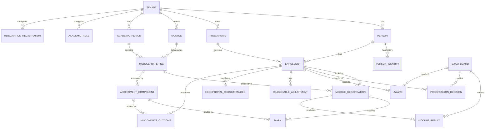

# Data Model

> Status: Draft — Phase 2
> Last updated: 2026-06-04
> This document defines the logical data model, the bitemporal storage pattern, the multi-tenancy strategy, and the naming conventions that govern all database design. Full DDL is produced in Phase 3 as part of the platform foundation.

---

## Principles

1. Every table that represents a fact that changes over time is **bitemporal** — see §Bitemporal Pattern.
2. Every row in every table carries a **`tenant_id`** and is subject to **row-level security** (RLS) — see §Multi-Tenancy.
3. There are **no soft-delete flags**. Historical states are preserved by bitemporal dating; truly deleted data uses hard DELETE only under an approved erasure workflow with audit trail.
4. **UUIDs** (v4) are used as all primary keys. No sequential integer IDs that could leak record counts or ordering information.
5. **`TIMESTAMPTZ`** for all timestamps (timezone-aware, stored in UTC).
6. **`TEXT`** for all string fields (PostgreSQL's `TEXT` is equivalent to `VARCHAR(n)` in performance; length constraints are applied where domain-meaningful via CHECK).

---

## Bitemporal Pattern

All temporally mutable tables include four columns defining two independent time axes.

| Column | Type | Description |
|---|---|---|
| `valid_from` | `TIMESTAMPTZ NOT NULL` | When this fact became true in the real world |
| `valid_to` | `TIMESTAMPTZ` | When this fact ceased to be true (`NULL` = still true) |
| `recorded_at` | `TIMESTAMPTZ NOT NULL DEFAULT now()` | When this row was inserted into the database |
| `recorded_until` | `TIMESTAMPTZ` | When this row was superseded by a correction (`NULL` = current record) |

### Current state query predicate
```sql
WHERE valid_from   <= NOW()
  AND (valid_to    IS NULL OR valid_to > NOW())
  AND recorded_at  <= NOW()
  AND recorded_until IS NULL
```

### Point-in-time query predicate (valid time `$vt`, transaction time `$tt`)
```sql
WHERE valid_from     <= $vt
  AND (valid_to      IS NULL OR valid_to > $vt)
  AND recorded_at    <= $tt
  AND (recorded_until IS NULL OR recorded_until > $tt)
```

### Updating a bitemporal record
Never `UPDATE` a bitemporal row. Instead:
1. `UPDATE` the existing row: set `recorded_until = NOW()`.
2. `INSERT` a new row with the updated values, `recorded_at = NOW()`, `recorded_until = NULL`, and updated `valid_from` / `valid_to` as appropriate.

This is encapsulated in a shared `bitemporalUpdate(table, id, patch, validFrom?, validTo?)` helper in `packages/db`.

### Reusable Drizzle column helper
```typescript
// packages/db/src/temporal.ts
export const bitemporalColumns = {
  validFrom:      timestamp('valid_from',    { withTimezone: true }).notNull(),
  validTo:        timestamp('valid_to',      { withTimezone: true }),
  recordedAt:     timestamp('recorded_at',   { withTimezone: true }).notNull().defaultNow(),
  recordedUntil:  timestamp('recorded_until',{ withTimezone: true }),
};
```

---

## Multi-Tenancy Pattern

Every table includes `tenant_id UUID NOT NULL` as a foreign key to the `tenant` table.

Tenant isolation is enforced at the **PostgreSQL row-level security** layer:

```sql
-- Set once per database connection after authentication
SET app.current_tenant_id = '<tenant-uuid>';

-- Example RLS policy (applied to every user-data table)
ALTER TABLE person ENABLE ROW LEVEL SECURITY;

CREATE POLICY tenant_isolation ON person
  USING (tenant_id = current_setting('app.current_tenant_id')::uuid);
```

The application sets `app.current_tenant_id` on every connection obtained from the pool, derived from the authenticated user's JWT `tenant_id` claim. The `system_administrator` role bypasses RLS (`BYPASSRLS`) for platform-level operations, which are separately audit-logged.

---

## Entity Relationship Diagram



---

## Core Entity Definitions

Tables are grouped by domain. All tables include `tenant_id` (omitted from field lists for brevity) and the standard bitemporal columns where marked *(bitemporal)*.

---

### tenant

| Column | Type | Notes |
|---|---|---|
| `id` | `UUID PK` | |
| `code` | `TEXT UNIQUE NOT NULL` | Short institution code (e.g. `UNIVABC`) |
| `name` | `TEXT NOT NULL` | Full institution name |
| `configuration` | `JSONB NOT NULL DEFAULT '{}'` | Tenant-level config (locale, timezone, branding, etc.) |
| `created_at` | `TIMESTAMPTZ NOT NULL` | |
| `active` | `BOOLEAN NOT NULL DEFAULT true` | |

---

### person *(root identity record — not bitemporal itself)*

| Column | Type | Notes |
|---|---|---|
| `id` | `UUID PK` | |
| `student_number` | `TEXT NOT NULL` | Human-readable; unique per tenant (UNIQUE on tenant_id + student_number) |
| `hesa_id` | `TEXT` | Assigned by HESA; nullable until received |
| `source_system` | `TEXT NOT NULL` | `ucas` / `direct` / `manual` |
| `source_reference` | `TEXT` | E.g. UCAS personal ID |
| `created_at` | `TIMESTAMPTZ NOT NULL` | |

### person_identity *(bitemporal — personal data changes over time)*

| Column | Type | Notes |
|---|---|---|
| `id` | `UUID PK` | |
| `person_id` | `UUID FK → person` | |
| `legal_first_name` | `TEXT NOT NULL` | |
| `legal_family_name` | `TEXT NOT NULL` | |
| `preferred_name` | `TEXT` | |
| `date_of_birth` | `DATE NOT NULL` | |
| `gender_code` | `TEXT` | HESA coding |
| `nationality_code` | `TEXT` | ISO 3166-1 alpha-3 |
| `domicile_code` | `TEXT` | HESA domicile coding |
| `ethnicity_code` | `TEXT` | Special category; RLS-scoped to privileged roles |
| `email_institutional` | `TEXT` | |
| `email_personal` | `TEXT` | |
| `phone` | `TEXT` | |
| *(bitemporal columns)* | | |

---

### programme *(bitemporal)*

| Column | Type | Notes |
|---|---|---|
| `id` | `UUID PK` | |
| `code` | `TEXT NOT NULL` | Unique per tenant + valid time |
| `title` | `TEXT NOT NULL` | |
| `qualification_type_code` | `TEXT NOT NULL` | HESA qualification type |
| `fheq_level` | `SMALLINT NOT NULL` | 4–8 |
| `credit_total` | `SMALLINT NOT NULL` | Total credits required |
| `duration_years` | `SMALLINT NOT NULL` | |
| `mode_of_study_code` | `TEXT NOT NULL` | FT / PT / DL |
| `source_system_reference` | `TEXT` | CM system programme ID |
| *(bitemporal columns)* | | |

### module *(bitemporal)*

| Column | Type | Notes |
|---|---|---|
| `id` | `UUID PK` | |
| `code` | `TEXT NOT NULL` | |
| `title` | `TEXT NOT NULL` | |
| `credit_value` | `SMALLINT NOT NULL` | |
| `fheq_level` | `SMALLINT NOT NULL` | |
| `source_system_reference` | `TEXT` | CM system module ID |
| *(bitemporal columns)* | | |

### academic_period

| Column | Type | Notes |
|---|---|---|
| `id` | `UUID PK` | |
| `academic_year` | `TEXT NOT NULL` | E.g. `2024-25` |
| `period_code` | `TEXT NOT NULL` | E.g. `SEM1`, `SEM2`, `FULL-YEAR` |
| `period_type_code` | `TEXT NOT NULL` | `semester` / `term` / `year` |
| `start_date` | `DATE NOT NULL` | |
| `end_date` | `DATE NOT NULL` | |

### module_offering

| Column | Type | Notes |
|---|---|---|
| `id` | `UUID PK` | |
| `module_id` | `UUID FK → module` | |
| `academic_period_id` | `UUID FK → academic_period` | |
| `delivery_mode_code` | `TEXT NOT NULL` | |
| `capacity` | `INT` | |

---

### enrolment *(bitemporal — status changes over time)*

| Column | Type | Notes |
|---|---|---|
| `id` | `UUID PK` | |
| `person_id` | `UUID FK → person` | |
| `programme_id` | `UUID FK → programme` | |
| `status_code` | `TEXT NOT NULL` | `enrolled` / `intermitting` / `withdrawn` / `suspended` / `graduated` |
| `mode_of_study_code` | `TEXT NOT NULL` | |
| `attendance_type_code` | `TEXT NOT NULL` | |
| `academic_year_of_entry` | `TEXT NOT NULL` | E.g. `2023-24` |
| `start_date` | `DATE NOT NULL` | |
| `expected_end_date` | `DATE` | |
| `actual_end_date` | `DATE` | |
| `fee_band_code` | `TEXT` | |
| `funding_source_code` | `TEXT` | `slc` / `self` / `employer` / `international` |
| `slc_reference` | `TEXT` | |
| `ucas_personal_id` | `TEXT` | |
| *(bitemporal columns)* | | |

### module_registration *(bitemporal)*

| Column | Type | Notes |
|---|---|---|
| `id` | `UUID PK` | |
| `enrolment_id` | `UUID FK → enrolment` | |
| `module_offering_id` | `UUID FK → module_offering` | |
| `status_code` | `TEXT NOT NULL` | `registered` / `withdrawn` / `completed` |
| `registration_date` | `DATE NOT NULL` | |
| *(bitemporal columns)* | | |

---

### assessment_component

| Column | Type | Notes |
|---|---|---|
| `id` | `UUID PK` | |
| `module_offering_id` | `UUID FK → module_offering` | |
| `component_code` | `TEXT NOT NULL` | E.g. `CW1`, `EX1` |
| `component_type_code` | `TEXT NOT NULL` | `exam` / `coursework` / `practical` / `portfolio` |
| `weighting` | `NUMERIC(5,2) NOT NULL` | Percentage; must sum to 100 per module_offering |
| `pass_mark` | `NUMERIC(5,2) NOT NULL` | |
| `max_mark` | `NUMERIC(5,2) NOT NULL DEFAULT 100` | |
| `is_mandatory` | `BOOLEAN NOT NULL DEFAULT true` | |

### mark *(bitemporal — marks can be corrected pre-ratification)*

| Column | Type | Notes |
|---|---|---|
| `id` | `UUID PK` | |
| `module_registration_id` | `UUID FK → module_registration` | |
| `assessment_component_id` | `UUID FK → assessment_component` | |
| `raw_mark` | `NUMERIC(5,2) NOT NULL` | Mark as received |
| `adjusted_mark` | `NUMERIC(5,2)` | After penalty suppression or adjustment |
| `penalty_applied` | `BOOLEAN NOT NULL DEFAULT false` | Whether a late submission penalty was applied |
| `source_system_code` | `TEXT` | `vle` / `manual` / etc. |
| `is_resit` | `BOOLEAN NOT NULL DEFAULT false` | |
| `ratified` | `BOOLEAN NOT NULL DEFAULT false` | |
| `locked` | `BOOLEAN NOT NULL DEFAULT false` | Set by exam board workflow |
| *(bitemporal columns)* | | |

### module_result *(bitemporal)*

| Column | Type | Notes |
|---|---|---|
| `id` | `UUID PK` | |
| `module_registration_id` | `UUID FK → module_registration` | |
| `aggregate_mark` | `NUMERIC(5,2) NOT NULL` | Calculated from marks + weightings |
| `result_code` | `TEXT NOT NULL` | `pass` / `fail` / `compensated` / `condoned` / `deferred` |
| `ratified` | `BOOLEAN NOT NULL DEFAULT false` | |
| `locked` | `BOOLEAN NOT NULL DEFAULT false` | |
| `exam_board_id` | `UUID FK → exam_board` | Populated on ratification |
| *(bitemporal columns)* | | |

### exam_board

| Column | Type | Notes |
|---|---|---|
| `id` | `UUID PK` | |
| `board_type_code` | `TEXT NOT NULL` | `module` / `award` |
| `academic_period_id` | `UUID FK → academic_period` | |
| `meeting_date` | `DATE NOT NULL` | |
| `chair_person_id` | `TEXT` | Actor ID from Keycloak |
| `external_examiner_confirmed_at` | `TIMESTAMPTZ` | |
| `ratified_at` | `TIMESTAMPTZ` | Set when board formally ratifies |
| `data_pack_generated_at` | `TIMESTAMPTZ` | |

### progression_decision *(bitemporal)*

| Column | Type | Notes |
|---|---|---|
| `id` | `UUID PK` | |
| `enrolment_id` | `UUID FK → enrolment` | |
| `academic_year` | `TEXT NOT NULL` | |
| `decision_code` | `TEXT NOT NULL` | `progress` / `resit` / `repeat-year` / `withdraw` |
| `year_of_study` | `SMALLINT NOT NULL` | |
| `exam_board_id` | `UUID FK → exam_board` | |
| `locked` | `BOOLEAN NOT NULL DEFAULT false` | |
| *(bitemporal columns)* | | |

### award

| Column | Type | Notes |
|---|---|---|
| `id` | `UUID PK` | |
| `enrolment_id` | `UUID FK → enrolment` | |
| `qualification_code` | `TEXT NOT NULL` | HESA qualification type |
| `classification_code` | `TEXT` | `1` / `2.1` / `2.2` / `3` / `pass` / `merit` / `distinction` |
| `award_date` | `DATE NOT NULL` | |
| `exam_board_id` | `UUID FK → exam_board` | |
| `hear_generated_at` | `TIMESTAMPTZ` | |
| `certificate_issued_at` | `TIMESTAMPTZ` | |
| `created_at` | `TIMESTAMPTZ NOT NULL` | |

---

### reasonable_adjustment *(bitemporal — adjustments have effective periods)*

| Column | Type | Notes |
|---|---|---|
| `id` | `UUID PK` | |
| `enrolment_id` | `UUID FK → enrolment` | |
| `adjustment_type_code` | `TEXT NOT NULL` | E.g. `extra-time` / `separate-room` / `deadline-extension` |
| `description` | `TEXT` | |
| `scope_code` | `TEXT NOT NULL` | `all` / `exam` / `coursework` / `attendance` |
| `approved_at` | `TIMESTAMPTZ NOT NULL` | |
| `source_case_reference` | `TEXT` | Reference from Wellbeing system |
| `distributed_to_vle_at` | `TIMESTAMPTZ` | |
| `distributed_to_exams_at` | `TIMESTAMPTZ` | |
| `distributed_to_attendance_at` | `TIMESTAMPTZ` | |
| *(bitemporal columns)* | | |

### exceptional_circumstances

| Column | Type | Notes |
|---|---|---|
| `id` | `UUID PK` | |
| `enrolment_id` | `UUID FK → enrolment` | |
| `module_offering_id` | `UUID FK → module_offering` | |
| `outcome_code` | `TEXT NOT NULL` | `upheld` / `not-upheld` |
| `determination_date` | `DATE NOT NULL` | |
| `source_case_reference` | `TEXT` | Reference from Wellbeing system |
| `surfaced_to_board` | `BOOLEAN NOT NULL DEFAULT false` | |
| `created_at` | `TIMESTAMPTZ NOT NULL` | |

### misconduct_outcome

| Column | Type | Notes |
|---|---|---|
| `id` | `UUID PK` | |
| `enrolment_id` | `UUID FK → enrolment` | |
| `assessment_component_id` | `UUID FK → assessment_component` | Nullable (programme-level cases) |
| `outcome_code` | `TEXT NOT NULL` | `upheld` / `not-upheld` |
| `penalty_code` | `TEXT` | E.g. `mark-reduction` / `module-fail` / `exclusion` |
| `effective_date` | `DATE NOT NULL` | |
| `source_case_reference` | `TEXT` | |
| `created_at` | `TIMESTAMPTZ NOT NULL` | |

---

### academic_rule *(bitemporal — rules change per academic year)*

| Column | Type | Notes |
|---|---|---|
| `id` | `UUID PK` | |
| `programme_id` | `UUID FK → programme` | Nullable for tenant-wide rules |
| `rule_type_code` | `TEXT NOT NULL` | `progression` / `classification` / `compensation` / `late-penalty` / `resit-cap` |
| `rule_key` | `TEXT NOT NULL` | Identifies the specific rule within a type |
| `rule_value` | `JSONB NOT NULL` | Structured rule configuration |
| `description` | `TEXT` | Human-readable explanation |
| `applies_to_level` | `SMALLINT` | Nullable; level-specific rules |
| *(bitemporal columns)* | | |

---

### audit_record *(append-only; no RLS — system administrator access only)*

| Column | Type | Notes |
|---|---|---|
| `id` | `UUID PK` | |
| `tenant_id` | `UUID` | Nullable for platform-level events |
| `entity_type` | `TEXT NOT NULL` | E.g. `enrolment` / `mark` |
| `entity_id` | `UUID NOT NULL` | |
| `field_name` | `TEXT` | Null for create/delete events |
| `before_value` | `JSONB` | |
| `after_value` | `JSONB` | |
| `action_type` | `TEXT NOT NULL` | `create` / `update` / `delete` / `read` |
| `actor_type` | `TEXT NOT NULL` | `user` / `system` / `integration` |
| `actor_id` | `TEXT NOT NULL` | Keycloak subject or system name |
| `actor_display_name` | `TEXT` | |
| `occurred_at` | `TIMESTAMPTZ NOT NULL DEFAULT now()` | |
| `correlation_id` | `UUID` | Request correlation ID |
| `workflow_instance_id` | `TEXT` | Temporal workflow ID if applicable |
| `reason_code` | `TEXT` | |
| `reason_text` | `TEXT` | |

---

### integration_registration *(plugin registry)*

| Column | Type | Notes |
|---|---|---|
| `id` | `UUID PK` | |
| `integration_code` | `TEXT NOT NULL` | E.g. `vle-moodle-v2` |
| `display_name` | `TEXT NOT NULL` | |
| `pattern_type` | `TEXT NOT NULL` | `rest` / `event` / `file` |
| `contract_version` | `TEXT NOT NULL` | Semver |
| `enabled` | `BOOLEAN NOT NULL DEFAULT false` | |
| `configuration` | `JSONB NOT NULL DEFAULT '{}'` | Encrypted at application layer |
| `last_health_check_at` | `TIMESTAMPTZ` | |
| `health_status_code` | `TEXT` | `healthy` / `degraded` / `unreachable` |
| `registered_at` | `TIMESTAMPTZ NOT NULL DEFAULT now()` | |
| `last_updated_at` | `TIMESTAMPTZ NOT NULL DEFAULT now()` | |

---

## Naming Conventions

| Convention | Rule |
|---|---|
| Table names | `snake_case`, plural noun: `enrolments`, `module_registrations` |
| Column names | `snake_case`: `valid_from`, `tenant_id` |
| Primary keys | Always named `id`, type `UUID` |
| Foreign keys | Named `{referenced_table_singular}_id`: `person_id`, `enrolment_id` |
| Status/type columns | Suffix `_code`; stored as `TEXT` with CHECK constraint against allowed values |
| Timestamps | Suffix `_at` for events, `_from`/`_to`/`_until` for ranges |
| Boolean flags | Named as positive assertions: `locked`, `ratified`, `enabled` |
| JSONB config columns | Named `configuration` or `{purpose}_data` |
| Audit columns | Always `recorded_at`, `recorded_until`, `valid_from`, `valid_to` — never abbreviated |
