# Data Model

> Status: Draft — Phase 2
> Last updated: 2026-06-04
> This document defines the logical data model, the bitemporal storage pattern, the multi-tenancy strategy, and the naming conventions that govern all database design. Full DDL is produced in Phase 3 as part of the platform foundation.

---

## Principles

1. Every table that represents a fact that changes over time is **bitemporal** — see §Bitemporal Pattern.
2. Every row in every table carries a **`tenant_id`** and is subject to **row-level security** (RLS) — see §Multi-Tenancy.
3. There are **no soft-delete flags**. Historical states are preserved by bitemporal dating; truly deleted data uses hard DELETE only under an approved erasure workflow with audit trail.
4. **UUIDs** (v4) are used as all identifiers. No sequential integer IDs that could leak record counts or ordering information.
5. **`TIMESTAMPTZ`** for all timestamps (timezone-aware, stored in UTC).
6. **`TEXT`** for all string fields (PostgreSQL's `TEXT` is equivalent to `VARCHAR(n)` in performance; length constraints are applied where domain-meaningful via CHECK).

---

## Bitemporal Pattern

Bitemporal tables distinguish **logical identity** from **row version identity**.

- `id` is the stable logical identifier for the real-world fact, such as an enrolment, mark, fee liability, or programme.
- `version_id` is the physical primary key for a specific recorded version of that fact.
- Foreign keys normally reference logical `id` values and join to the version that was valid at the relevant valid-time and transaction-time.
- Generated artefacts and formal decisions that must bind to an exact historical version may additionally store `*_version_id` fields.

All bitemporal tables include the following standard columns:

| Column | Type | Description |
|---|---|---|
| `version_id` | `UUID PK` | Unique physical row version identifier |
| `id` | `UUID NOT NULL` | Stable logical identifier shared by all versions of the same fact |
| `valid_from` | `TIMESTAMPTZ NOT NULL` | When this fact became true in the real world |
| `valid_to` | `TIMESTAMPTZ` | When this fact ceased to be true (`NULL` = still true) |
| `recorded_at` | `TIMESTAMPTZ NOT NULL DEFAULT now()` | When this row was inserted into the database |
| `recorded_until` | `TIMESTAMPTZ` | When this row was superseded by a correction (`NULL` = current record) |

### Required constraints for every bitemporal table

```sql
PRIMARY KEY (version_id);

-- A logical fact may have many recorded versions, but not two identical
-- transaction-start versions.
UNIQUE (tenant_id, id, recorded_at);

CHECK (valid_to IS NULL OR valid_to > valid_from);
CHECK (recorded_until IS NULL OR recorded_until > recorded_at);

-- Only one current transaction-time version per logical fact.
CREATE UNIQUE INDEX {table}_current_version_unique
  ON {table} (tenant_id, id)
  WHERE recorded_until IS NULL;
```

### Current state query predicate
```sql
WHERE valid_from   <= NOW()
  AND (valid_to    IS NULL OR valid_to > NOW())
  AND recorded_at  <= NOW()
  AND recorded_until IS NULL
```

### Point-in-time query predicate (valid time `$vt`, transaction time `$tt`)
```sql
WHERE valid_from     <= $vt
  AND (valid_to      IS NULL OR valid_to > $vt)
  AND recorded_at    <= $tt
  AND (recorded_until IS NULL OR recorded_until > $tt)
```

### Updating a bitemporal record
Never mutate the domain fields of a bitemporal row. Instead:
1. Close the current row version by setting `recorded_until = NOW()`.
2. Insert a new row with the same logical `id`, a new `version_id`, the updated domain values, `recorded_at = NOW()`, `recorded_until = NULL`, and updated `valid_from` / `valid_to` as appropriate.

This is encapsulated in a shared `bitemporalUpdate(table, id, patch, validFrom?, validTo?)` helper in `packages/db`.

### Referencing bitemporal records

| Reference type | Usage | Columns |
|---|---|---|
| Logical reference | Operational relationships that should resolve to the correct version at query time | `{entity}_id` |
| Exact version reference | Generated artefacts, board packs, regulatory returns, or corrections that must prove the exact source row used | `{entity}_id`, `{entity}_version_id` |
| Snapshot | Immutable external artefact where source structures may evolve | `snapshot JSONB`, plus source transaction-time metadata |

Example: `module_registration.enrolment_id` is a logical reference. An `exam_board_candidate_profile` stores a snapshot and may also store source version IDs for the exact `module_result` and `progression_decision` rows used when the pack was generated.

### Reusable Drizzle column helper
```typescript
// packages/db/src/temporal.ts
export const bitemporalColumns = {
  versionId:     uuid('version_id').primaryKey().defaultRandom(),
  id:            uuid('id').notNull(),
  validFrom:      timestamp('valid_from',    { withTimezone: true }).notNull(),
  validTo:        timestamp('valid_to',      { withTimezone: true }),
  recordedAt:     timestamp('recorded_at',   { withTimezone: true }).notNull().defaultNow(),
  recordedUntil:  timestamp('recorded_until',{ withTimezone: true }),
};
```

---

## Multi-Tenancy Pattern

Every table includes `tenant_id UUID NOT NULL` as a foreign key to the `tenant` table.

Tenant isolation is enforced at the **PostgreSQL row-level security** layer:

```sql
-- Set once per database connection after authentication
SET app.current_tenant_id = '<tenant-uuid>';

-- Example RLS policy (applied to every user-data table)
ALTER TABLE person ENABLE ROW LEVEL SECURITY;

CREATE POLICY tenant_isolation ON person
  USING (tenant_id = current_setting('app.current_tenant_id')::uuid);
```

The application sets `app.current_tenant_id` on every connection obtained from the pool, derived from the authenticated user's JWT `tenant_id` claim. The `system_administrator` role bypasses RLS (`BYPASSRLS`) for platform-level operations, which are separately audit-logged.

---

## Domain-Level Entity Relationship Diagram

The diagram below shows aggregate roots and major relationships. Detailed table-level relationships are defined in the entity sections that follow. This document intentionally avoids one giant diagram for every table because the remediated model spans admissions, core records, assessment, governance, statutory exchange, integration state, and enterprise feedback.

```mermaid
erDiagram
    TENANT ||--o{ PERSON : "has"
    TENANT ||--o{ STUDENT_APPLICATION : "receives"
    TENANT ||--o{ PROGRAMME : "offers"
    TENANT ||--o{ MODULE : "defines"
    TENANT ||--o{ ACADEMIC_PERIOD : "has"
    TENANT ||--o{ ACADEMIC_RULE : "configures"
    TENANT ||--o{ INTEGRATION_CONTRACT : "publishes"
    TENANT ||--o{ INTEGRATION_REGISTRATION : "configures"

    PERSON ||--o{ PERSON_IDENTITY : "has history"
    PERSON ||--o{ STUDENT_ADDRESS : "has"
    PERSON ||--o{ STUDENT_CONTACT_METHOD : "has"
    PERSON ||--o{ DISABILITY_DECLARATION : "declares"
    PERSON ||--o{ IDENTITY_VERIFICATION_CHECK : "verified by"
    PERSON ||--o{ ENROLMENT : "has"
    PERSON ||--o{ VISA_STATUS : "has"
    PERSON ||--o{ HESA_IDENTIFIER_ASSIGNMENT : "assigned"

    STUDENT_APPLICATION ||--o{ ADMISSIONS_OFFER : "has"
    STUDENT_APPLICATION ||--o{ UCAS_EXCHANGE_RECORD : "exchanged via"

    PROGRAMME ||--o{ ENROLMENT : "governs"
    PROGRAMME ||--o{ PROGRAMME_ROUTE : "has"
    PROGRAMME ||--o{ PROGRAMME_RULE_SET : "uses"
    AWARDING_BODY ||--o{ PROGRAMME : "awards"
    MODULE ||--o{ MODULE_OFFERING : "delivered as"
    MODULE ||--o{ MODULE_RELATIONSHIP : "requires"
    MODULE ||--o{ ASSESSMENT_PATTERN : "defines"
    PROGRAMME ||--o{ LEARNING_OUTCOME : "defines"
    MODULE ||--o{ LEARNING_OUTCOME : "defines"
    ACADEMIC_PERIOD ||--o{ MODULE_OFFERING : "contains"

    ENROLMENT ||--o{ MODULE_REGISTRATION : "includes"
    ENROLMENT ||--o{ FEE_LIABILITY : "incurs"
    ENROLMENT ||--o{ STUDENT_HOLD : "may have"
    ENROLMENT ||--o{ REENROLMENT_CONFIRMATION : "confirms"
    ENROLMENT ||--o{ PROGRESSION_DECISION : "results in"
    ENROLMENT ||--o{ AWARD : "leads to"
    ENROLMENT ||--o{ REASONABLE_ADJUSTMENT : "has"
    ENROLMENT ||--o{ EXCEPTIONAL_CIRCUMSTANCES : "may have"
    ENROLMENT ||--o{ ATTENDANCE_RECORD : "records"
    ENROLMENT ||--o{ ABSENCE_ALERT : "raises"
    ENROLMENT ||--o{ STAFF_ASSIGNMENT : "assigned"
    ENROLMENT ||--o{ RESEARCH_MILESTONE : "records"
    ENROLMENT ||--o{ STUDENT_RISK_FLAG : "may have"

    MODULE_OFFERING ||--o{ MODULE_REGISTRATION : "enrolled via"
    MODULE_OFFERING ||--o{ ASSESSMENT_COMPONENT : "assessed by"
    MODULE_OFFERING ||--o{ TIMETABLED_ACTIVITY : "scheduled as"

    MODULE_REGISTRATION ||--o{ MARK : "receives"
    MODULE_REGISTRATION ||--o{ MODULE_RESULT : "produces"

    ASSESSMENT_COMPONENT ||--o{ MARK : "graded in"
    ASSESSMENT_COMPONENT ||--o{ EXAM_ENTRY : "entered for"

    EXAM_BOARD ||--o{ MODULE_RESULT : "ratifies"
    EXAM_BOARD ||--o{ PROGRESSION_DECISION : "ratifies"
    EXAM_BOARD ||--o{ AWARD : "confers"
    EXAM_BOARD ||--o{ EXAM_BOARD_DATA_PACK : "generates"
    EXAM_BOARD ||--o{ EXAM_BOARD_MEMBER_ATTENDANCE : "records"
    EXAM_BOARD ||--o{ EXTERNAL_EXAMINER_SIGNOFF : "receives"

    ENROLMENT ||--o{ MISCONDUCT_OUTCOME : "may have"
    ASSESSMENT_COMPONENT ||--o{ MISCONDUCT_OUTCOME : "related to"

    REASONABLE_ADJUSTMENT ||--o{ ADJUSTMENT_DISTRIBUTION : "distributed as"
    REASONABLE_ADJUSTMENT ||--o{ EXAM_ACCOMMODATION_DISTRIBUTION : "distributed to exams"
    EXAM_ENTRY ||--o{ EXAM_CANDIDATE : "assigned"
    EXAM_ENTRY ||--o{ EXAM_TIMETABLE_ENTRY : "scheduled"

    ENROLMENT ||--o{ SLC_NOTIFICATION : "notifies"
    ENROLMENT ||--o{ SLC_ENTITLEMENT : "has"
    ENROLMENT ||--o{ SLC_PAYMENT_STATUS : "has"
    ENROLMENT ||--o{ CAS_REQUEST : "requires"
    ENROLMENT ||--o{ UKVI_COMPLIANCE_CASE : "may trigger"
    HESA_RETURN ||--o{ HESA_SUBMISSION : "submitted as"
    HESA_RETURN ||--o{ HESA_VALIDATION_ISSUE : "has"

    ENROLMENT ||--o{ STUDENT_DOCUMENT : "generates"
    STUDENT_DOCUMENT ||--o{ DOCUMENT_ARCHIVE_CONFIRMATION : "archived by"
    INTEGRATION_CONTRACT ||--o{ INTEGRATION_REGISTRATION : "registered by tenant"
    INTEGRATION_REGISTRATION ||--o{ INTEGRATION_EXCHANGE : "exchanges"
```



---

## Core Entity Definitions

Tables are grouped by domain. All tables include `tenant_id` (omitted from field lists for brevity) and are subject to RLS unless explicitly stated otherwise.

For non-bitemporal tables, `id UUID PK` means the physical primary key. For bitemporal tables, `id UUID` in the entity tables means the stable logical identifier; `version_id UUID PK` and the other bitemporal columns are supplied by the standard bitemporal pattern above.

---

### tenant

| Column | Type | Notes |
|---|---|---|
| `id` | `UUID PK` | |
| `code` | `TEXT UNIQUE NOT NULL` | Short institution code (e.g. `UNIVABC`) |
| `name` | `TEXT NOT NULL` | Full institution name |
| `configuration` | `JSONB NOT NULL DEFAULT '{}'` | Tenant-level config (locale, timezone, branding, etc.) |
| `created_at` | `TIMESTAMPTZ NOT NULL` | |
| `active` | `BOOLEAN NOT NULL DEFAULT true` | |

---

### person *(root identity record — not bitemporal itself)*

| Column | Type | Notes |
|---|---|---|
| `id` | `UUID PK` | |
| `student_number` | `TEXT NOT NULL` | Human-readable; unique per tenant (UNIQUE on tenant_id + student_number) |
| `hesa_id` | `TEXT` | Assigned by HESA; nullable until received |
| `person_status_code` | `TEXT NOT NULL` | `prospective` / `student` / `alumnus` / `deceased` / `merged` |
| `source_system` | `TEXT NOT NULL` | `ucas` / `direct` / `manual` |
| `source_reference` | `TEXT` | E.g. UCAS personal ID |
| `created_at` | `TIMESTAMPTZ NOT NULL` | |

### person_identity *(bitemporal — personal data changes over time)*

| Column | Type | Notes |
|---|---|---|
| `id` | `UUID NOT NULL` | Stable logical identifier; physical PK is `version_id` from bitemporal columns |
| `person_id` | `UUID FK → person` | |
| `legal_first_name` | `TEXT NOT NULL` | |
| `legal_family_name` | `TEXT NOT NULL` | |
| `preferred_name` | `TEXT` | |
| `date_of_birth` | `DATE NOT NULL` | |
| `gender_code` | `TEXT` | HESA coding |
| `nationality_code` | `TEXT` | ISO 3166-1 alpha-3 |
| `domicile_code` | `TEXT` | HESA domicile coding |
| `ethnicity_code` | `TEXT` | Special category; RLS-scoped to privileged roles |
| `email_institutional` | `TEXT` | |
| `email_personal` | `TEXT` | |
| `phone` | `TEXT` | |
| *(bitemporal columns)* | | |

---

### programme *(bitemporal)*

| Column | Type | Notes |
|---|---|---|
| `id` | `UUID NOT NULL` | Stable logical identifier; physical PK is `version_id` from bitemporal columns |
| `code` | `TEXT NOT NULL` | Unique per tenant + valid time |
| `title` | `TEXT NOT NULL` | |
| `qualification_type_code` | `TEXT NOT NULL` | HESA qualification type |
| `awarding_body_id` | `UUID FK → awarding_body` | |
| `owning_school` | `TEXT` | Institution-specific school/faculty owner |
| `credit_framework_code` | `TEXT NOT NULL` | E.g. `CATS`, `ECTS`, institutional framework |
| `fheq_level` | `SMALLINT NOT NULL` | 4–8 |
| `credit_total` | `SMALLINT NOT NULL` | Total credits required |
| `duration_years` | `SMALLINT NOT NULL` | |
| `mode_of_study_code` | `TEXT NOT NULL` | FT / PT / DL |
| `source_system_reference` | `TEXT` | CM system programme ID |
| *(bitemporal columns)* | | |

### module *(bitemporal)*

| Column | Type | Notes |
|---|---|---|
| `id` | `UUID NOT NULL` | Stable logical identifier; physical PK is `version_id` from bitemporal columns |
| `code` | `TEXT NOT NULL` | |
| `title` | `TEXT NOT NULL` | |
| `credit_value` | `SMALLINT NOT NULL` | |
| `fheq_level` | `SMALLINT NOT NULL` | |
| `default_assessment_pattern_id` | `UUID FK → assessment_pattern` | Nullable; current default catalogue pattern |
| `source_system_reference` | `TEXT` | CM system module ID |
| *(bitemporal columns)* | | |

### academic_period

| Column | Type | Notes |
|---|---|---|
| `id` | `UUID PK` | |
| `academic_year` | `TEXT NOT NULL` | E.g. `2024-25` |
| `period_code` | `TEXT NOT NULL` | E.g. `SEM1`, `SEM2`, `FULL-YEAR` |
| `period_type_code` | `TEXT NOT NULL` | `semester` / `term` / `year` |
| `start_date` | `DATE NOT NULL` | |
| `end_date` | `DATE NOT NULL` | |

### module_offering

| Column | Type | Notes |
|---|---|---|
| `id` | `UUID PK` | |
| `module_id` | `UUID FK → module` | |
| `academic_period_id` | `UUID FK → academic_period` | |
| `delivery_mode_code` | `TEXT NOT NULL` | |
| `capacity` | `INT` | |

---

### enrolment *(bitemporal — status changes over time)*

| Column | Type | Notes |
|---|---|---|
| `id` | `UUID NOT NULL` | Stable logical identifier; physical PK is `version_id` from bitemporal columns |
| `person_id` | `UUID FK → person` | |
| `programme_id` | `UUID FK → programme` | |
| `status_code` | `TEXT NOT NULL` | `enrolled` / `intermitting` / `withdrawn` / `suspended` / `graduated` |
| `mode_of_study_code` | `TEXT NOT NULL` | |
| `attendance_type_code` | `TEXT NOT NULL` | |
| `academic_year_of_entry` | `TEXT NOT NULL` | E.g. `2023-24` |
| `start_date` | `DATE NOT NULL` | |
| `expected_end_date` | `DATE` | |
| `actual_end_date` | `DATE` | |
| `fee_band_code` | `TEXT` | |
| `funding_source_code` | `TEXT` | `slc` / `self` / `employer` / `international` |
| `slc_reference` | `TEXT` | |
| `ucas_personal_id` | `TEXT` | |
| *(bitemporal columns)* | | |

### module_registration *(bitemporal)*

| Column | Type | Notes |
|---|---|---|
| `id` | `UUID NOT NULL` | Stable logical identifier; physical PK is `version_id` from bitemporal columns |
| `enrolment_id` | `UUID FK → enrolment` | |
| `module_offering_id` | `UUID FK → module_offering` | |
| `status_code` | `TEXT NOT NULL` | `registered` / `withdrawn` / `completed` |
| `registration_date` | `DATE NOT NULL` | |
| *(bitemporal columns)* | | |

---

### assessment_component

| Column | Type | Notes |
|---|---|---|
| `id` | `UUID PK` | |
| `module_offering_id` | `UUID FK → module_offering` | |
| `component_code` | `TEXT NOT NULL` | E.g. `CW1`, `EX1` |
| `component_type_code` | `TEXT NOT NULL` | `exam` / `coursework` / `practical` / `portfolio` |
| `weighting` | `NUMERIC(5,2) NOT NULL` | Percentage; must sum to 100 per module_offering |
| `pass_mark` | `NUMERIC(5,2) NOT NULL` | |
| `max_mark` | `NUMERIC(5,2) NOT NULL DEFAULT 100` | |
| `is_mandatory` | `BOOLEAN NOT NULL DEFAULT true` | |

### assessment_submission *(append-only with correction/supersession support)*

| Column | Type | Notes |
|---|---|---|
| `id` | `UUID PK` | |
| `module_registration_id` | `UUID FK → module_registration` | |
| `assessment_component_id` | `UUID FK → assessment_component` | |
| `source_system_code` | `TEXT NOT NULL` | `vle` / `manual` / institutional code |
| `source_submission_reference` | `TEXT NOT NULL` | VLE/submission system reference |
| `submitted_at` | `TIMESTAMPTZ` | Student submission time if known |
| `submission_status_code` | `TEXT NOT NULL` | `submitted` / `late` / `missing` / `superseded` |
| `artefact_reference` | `TEXT` | Opaque reference to submitted work where SRS stores or proxies it |
| `received_at` | `TIMESTAMPTZ NOT NULL DEFAULT now()` | When SRS received the submission context |
| `superseded_at` | `TIMESTAMPTZ` | |

### mark *(bitemporal — marks can be corrected pre-ratification)*

| Column | Type | Notes |
|---|---|---|
| `id` | `UUID NOT NULL` | Stable logical identifier; physical PK is `version_id` from bitemporal columns |
| `module_registration_id` | `UUID FK → module_registration` | |
| `assessment_component_id` | `UUID FK → assessment_component` | |
| `assessment_submission_id` | `UUID FK → assessment_submission` | Nullable; mark may be manually entered without a submission artefact |
| `raw_mark` | `NUMERIC(5,2) NOT NULL` | Mark as received |
| `adjusted_mark` | `NUMERIC(5,2)` | After penalty suppression or adjustment |
| `attempt_number` | `SMALLINT NOT NULL DEFAULT 1` | `1` = first sit, `2` = first resit, etc. |
| `mark_status_code` | `TEXT NOT NULL DEFAULT 'provisional'` | `provisional` / `confirmed` |
| `moderation_state_code` | `TEXT` | `not-required` / `pending` / `moderated` / `queried` |
| `penalty_applied` | `BOOLEAN NOT NULL DEFAULT false` | Whether a late submission penalty was applied |
| `source_system_code` | `TEXT` | `vle` / `manual` / etc. |
| `is_resit` | `BOOLEAN NOT NULL DEFAULT false` | |
| `ratified` | `BOOLEAN NOT NULL DEFAULT false` | |
| `locked` | `BOOLEAN NOT NULL DEFAULT false` | Set by exam board workflow |
| *(bitemporal columns)* | | |

### module_result *(bitemporal)*

| Column | Type | Notes |
|---|---|---|
| `id` | `UUID NOT NULL` | Stable logical identifier; physical PK is `version_id` from bitemporal columns |
| `module_registration_id` | `UUID FK → module_registration` | |
| `aggregate_mark` | `NUMERIC(5,2) NOT NULL` | Calculated from marks + weightings |
| `result_code` | `TEXT NOT NULL` | `pass` / `fail` / `compensated` / `condoned` / `deferred` |
| `ratified` | `BOOLEAN NOT NULL DEFAULT false` | |
| `locked` | `BOOLEAN NOT NULL DEFAULT false` | |
| `exam_board_id` | `UUID FK → exam_board` | Populated on ratification |
| *(bitemporal columns)* | | |

### exam_board

| Column | Type | Notes |
|---|---|---|
| `id` | `UUID PK` | |
| `board_type_code` | `TEXT NOT NULL` | `module` / `award` |
| `academic_period_id` | `UUID FK → academic_period` | |
| `meeting_date` | `DATE NOT NULL` | |
| `chair_person_id` | `TEXT` | Actor ID from Keycloak |
| `external_examiner_confirmed_at` | `TIMESTAMPTZ` | |
| `ratified_at` | `TIMESTAMPTZ` | Set when board formally ratifies |
| `data_pack_generated_at` | `TIMESTAMPTZ` | |

### progression_decision *(bitemporal)*

| Column | Type | Notes |
|---|---|---|
| `id` | `UUID NOT NULL` | Stable logical identifier; physical PK is `version_id` from bitemporal columns |
| `enrolment_id` | `UUID FK → enrolment` | |
| `academic_year` | `TEXT NOT NULL` | |
| `decision_code` | `TEXT NOT NULL` | `progress` / `resit` / `repeat-year` / `withdraw` |
| `year_of_study` | `SMALLINT NOT NULL` | |
| `exam_board_id` | `UUID FK → exam_board` | |
| `locked` | `BOOLEAN NOT NULL DEFAULT false` | |
| *(bitemporal columns)* | | |

### award *(bitemporal — award/certificate facts can be corrected post-ratification)*

| Column | Type | Notes |
|---|---|---|
| `id` | `UUID NOT NULL` | Stable logical identifier; physical PK is `version_id` from bitemporal columns |
| `enrolment_id` | `UUID FK → enrolment` | |
| `qualification_code` | `TEXT NOT NULL` | HESA qualification type |
| `classification_code` | `TEXT` | `1` / `2.1` / `2.2` / `3` / `pass` / `merit` / `distinction` |
| `award_date` | `DATE NOT NULL` | |
| `exam_board_id` | `UUID FK → exam_board` | |
| `hear_generated_at` | `TIMESTAMPTZ` | |
| `certificate_issued_at` | `TIMESTAMPTZ` | |
| *(bitemporal columns)* | | |

---

### reasonable_adjustment *(bitemporal)*

| Column | Type | Notes |
|---|---|---|
| `id` | `UUID NOT NULL` | Stable logical identifier; physical PK is `version_id` from bitemporal columns |
| `enrolment_id` | `UUID FK → enrolment` | |
| `adjustment_type_code` | `TEXT NOT NULL` | E.g. `extra-time` / `separate-room` / `deadline-extension` |
| `description` | `TEXT` | |
| `scope_code` | `TEXT NOT NULL` | `all` / `exam` / `coursework` / `attendance` |
| `approved_at` | `TIMESTAMPTZ NOT NULL` | |
| `source_case_reference` | `TEXT` | Reference from Wellbeing system |
| *(bitemporal columns)* | | |

> Distribution state is tracked per target system in `adjustment_distribution` (see below), not as timestamp columns here.

### adjustment_distribution *(append-only status rows — one per target system per adjustment)*

| Column | Type | Notes |
|---|---|---|
| `id` | `UUID PK` | |
| `adjustment_id` | `UUID FK → reasonable_adjustment` | |
| `target_system_code` | `TEXT NOT NULL` | `vle` / `attendance` / `exams` |
| `status_code` | `TEXT NOT NULL` | `pending` / `distributed` / `failed` / `superseded` |
| `contract_version` | `TEXT NOT NULL` | Version of integration contract used |
| `attempt_count` | `SMALLINT NOT NULL DEFAULT 0` | |
| `last_attempt_at` | `TIMESTAMPTZ` | |
| `last_error` | `TEXT` | |
| `distributed_at` | `TIMESTAMPTZ` | Set on success |
| `created_at` | `TIMESTAMPTZ NOT NULL DEFAULT now()` | |

### exceptional_circumstances *(bitemporal — outcomes can be corrected)*

| Column | Type | Notes |
|---|---|---|
| `id` | `UUID NOT NULL` | Stable logical identifier; physical PK is `version_id` from bitemporal columns |
| `enrolment_id` | `UUID FK → enrolment` | |
| `module_offering_id` | `UUID FK → module_offering` | |
| `assessment_component_id` | `UUID FK → assessment_component` | Nullable; specific component if applicable |
| `outcome_code` | `TEXT NOT NULL` | `upheld` / `not-upheld` |
| `outcome_reason` | `TEXT` | |
| `determination_date` | `DATE NOT NULL` | |
| `source_case_reference` | `TEXT` | |
| *(bitemporal columns)* | | |

### exceptional_circumstances_board_visibility *(append-only)*

| Column | Type | Notes |
|---|---|---|
| `id` | `UUID PK` | |
| `exceptional_circumstances_id` | `UUID FK → exceptional_circumstances` | |
| `exam_board_id` | `UUID FK → exam_board` | |
| `included_in_pack_at` | `TIMESTAMPTZ NOT NULL` | |

### misconduct_case_reference *(bitemporal — external AI case metadata)*

| Column | Type | Notes |
|---|---|---|
| `id` | `UUID` | Logical misconduct case reference ID |
| `enrolment_id` | `UUID FK → enrolment` | |
| `source_system_code` | `TEXT NOT NULL` | `academic-integrity` / institutional code |
| `source_case_reference` | `TEXT NOT NULL` | External case reference |
| `case_status_code` | `TEXT NOT NULL` | `open` / `concluded` / `withdrawn` |
| `opened_at` | `TIMESTAMPTZ` | |
| `concluded_at` | `TIMESTAMPTZ` | |
| *(bitemporal columns)* | | |

### misconduct_outcome *(bitemporal — can be corrected pre-ratification)*

| Column | Type | Notes |
|---|---|---|
| `id` | `UUID NOT NULL` | Stable logical identifier; physical PK is `version_id` from bitemporal columns |
| `enrolment_id` | `UUID FK → enrolment` | |
| `misconduct_case_reference_id` | `UUID FK → misconduct_case_reference` | |
| `assessment_component_id` | `UUID FK → assessment_component` | Nullable (programme-level cases) |
| `outcome_code` | `TEXT NOT NULL` | `upheld` / `not-upheld` |
| `penalty_code` | `TEXT` | E.g. `mark-reduction` / `module-fail` / `exclusion` |
| `effective_date` | `DATE NOT NULL` | |
| `source_case_reference` | `TEXT` | |
| *(bitemporal columns)* | | |

### misconduct_penalty_effect *(bitemporal — structured penalty impact)*

| Column | Type | Notes |
|---|---|---|
| `id` | `UUID` | Logical penalty effect ID |
| `misconduct_outcome_id` | `UUID FK → misconduct_outcome` | |
| `effect_type_code` | `TEXT NOT NULL` | `mark-reduction` / `mark-cap` / `module-fail` / `progression-block` / `exclusion` |
| `affected_mark_id` | `UUID FK → mark` | Nullable |
| `affected_module_registration_id` | `UUID FK → module_registration` | Nullable |
| `affected_enrolment_id` | `UUID FK → enrolment` | Nullable |
| `effect_value` | `JSONB` | Structured details, e.g. cap value or exclusion period |
| *(bitemporal columns)* | | |

---

### academic_rule *(bitemporal — rules change per academic year)*

| Column | Type | Notes |
|---|---|---|
| `id` | `UUID NOT NULL` | Stable logical identifier; physical PK is `version_id` from bitemporal columns |
| `programme_id` | `UUID FK → programme` | Nullable for tenant-wide rules |
| `rule_type_code` | `TEXT NOT NULL` | `progression` / `classification` / `compensation` / `late-penalty` / `resit-cap` |
| `rule_key` | `TEXT NOT NULL` | Identifies the specific rule within a type |
| `rule_value` | `JSONB NOT NULL` | Structured rule configuration |
| `description` | `TEXT` | Human-readable explanation |
| `applies_to_level` | `SMALLINT` | Nullable; level-specific rules |
| *(bitemporal columns)* | | |

---

### audit_record *(append-only; no RLS — system administrator access only)*

| Column | Type | Notes |
|---|---|---|
| `id` | `UUID PK` | |
| `tenant_id` | `UUID` | Nullable for platform-level events |
| `entity_type` | `TEXT NOT NULL` | E.g. `enrolment` / `mark` |
| `entity_id` | `UUID NOT NULL` | |
| `field_name` | `TEXT` | Null for create/delete events |
| `before_value` | `JSONB` | |
| `after_value` | `JSONB` | |
| `action_type` | `TEXT NOT NULL` | `create` / `update` / `delete` / `read` |
| `actor_type` | `TEXT NOT NULL` | `user` / `system` / `integration` |
| `actor_id` | `TEXT NOT NULL` | Keycloak subject or system name |
| `actor_display_name` | `TEXT` | |
| `occurred_at` | `TIMESTAMPTZ NOT NULL DEFAULT now()` | |
| `correlation_id` | `UUID` | Request correlation ID |
| `workflow_instance_id` | `TEXT` | Temporal workflow ID if applicable |
| `reason_code` | `TEXT` | |
| `reason_text` | `TEXT` | |

---

### integration_contract *(catalogue of supported integration contracts)*

| Column | Type | Notes |
|---|---|---|
| `id` | `UUID PK` | |
| `contract_id` | `TEXT NOT NULL UNIQUE` | Stable logical contract ID, e.g. `vle-course-provisioning.v1` |
| `display_name` | `TEXT NOT NULL` | |
| `owner_module_code` | `TEXT NOT NULL` | `student-identity` / `enrolment` / `assessment` / `regulatory` / etc. |
| `direction_code` | `TEXT NOT NULL` | `inbound` / `outbound` / `bidirectional` / `context` |
| `pattern_type` | `TEXT NOT NULL` | `rest` / `event` / `file` / `mixed` |
| `current_contract_version` | `TEXT NOT NULL` | Semver or statutory cycle/year |
| `data_classification_code` | `TEXT NOT NULL` | `standard` / `sensitive` / `special-category` |
| `created_at` | `TIMESTAMPTZ NOT NULL DEFAULT now()` | |

### integration_registration *(tenant plugin registry)*

| Column | Type | Notes |
|---|---|---|
| `id` | `UUID PK` | |
| `integration_contract_id` | `UUID FK → integration_contract` | |
| `integration_code` | `TEXT NOT NULL` | Tenant-specific adapter code, e.g. `vle-moodle-prod` |
| `display_name` | `TEXT NOT NULL` | |
| `contract_version` | `TEXT NOT NULL` | Semver |
| `transport_code` | `TEXT NOT NULL` | `rest` / `event` / `sftp` / `https-file` |
| `subject_filter` | `TEXT` | NATS subject filter for event consumers |
| `consumer_group` | `TEXT` | NATS durable consumer group name |
| `endpoint_url` | `TEXT` | External REST endpoint where applicable |
| `file_schedule` | `TEXT` | Cron expression or `manual` |
| `secret_ref` | `TEXT` | OpenBao path to credentials; never the credential value |
| `replay_supported` | `BOOLEAN NOT NULL DEFAULT false` | Whether backfill can be requested |
| `retry_policy` | `JSONB` | `{ maxAttempts, backoffCoefficient, initialInterval, deadLetterSubject }` |
| `enabled` | `BOOLEAN NOT NULL DEFAULT false` | |
| `configuration` | `JSONB NOT NULL DEFAULT '{}'` | Encrypted at application layer |
| `last_health_check_at` | `TIMESTAMPTZ` | |
| `health_status_code` | `TEXT` | `healthy` / `degraded` / `unreachable` |
| `last_successful_exchange_at` | `TIMESTAMPTZ` | |
| `registered_at` | `TIMESTAMPTZ NOT NULL DEFAULT now()` | |
| `last_updated_at` | `TIMESTAMPTZ NOT NULL DEFAULT now()` | |

Unique constraint: `(tenant_id, integration_code)`.

### integration_exchange *(append-only integration message/exchange ledger)*

| Column | Type | Notes |
|---|---|---|
| `id` | `UUID PK` | |
| `integration_registration_id` | `UUID FK → integration_registration` | |
| `contract_id` | `TEXT NOT NULL` | Denormalised for audit/search |
| `direction_code` | `TEXT NOT NULL` | `inbound` / `outbound` |
| `exchange_type_code` | `TEXT NOT NULL` | Contract-specific exchange/action type |
| `idempotency_key` | `TEXT NOT NULL` | External or generated duplicate-suppression key |
| `correlation_id` | `UUID` | Request/event correlation ID |
| `source_reference` | `TEXT` | External message, file, or transaction reference |
| `status_code` | `TEXT NOT NULL` | `received` / `validated` / `processed` / `sent` / `failed` / `dead-lettered` |
| `attempt_count` | `SMALLINT NOT NULL DEFAULT 0` | |
| `last_attempt_at` | `TIMESTAMPTZ` | |
| `last_error` | `TEXT` | Sanitised error summary |
| `payload_hash` | `TEXT` | Hash of canonical payload or file |
| `payload_summary` | `JSONB` | Minimal audit/search payload, not full sensitive content |
| `received_at` | `TIMESTAMPTZ` | Inbound only |
| `sent_at` | `TIMESTAMPTZ` | Outbound only |
| `created_at` | `TIMESTAMPTZ NOT NULL DEFAULT now()` | |

Unique constraint: `(tenant_id, integration_registration_id, idempotency_key)`.

---

## Additional Entities — Admissions and Identity

### student_application *(bitemporal — status progresses through admissions cycle)*

| Column | Type | Notes |
|---|---|---|
| `id` | `UUID NOT NULL` | Stable logical identifier; physical PK is `version_id` from bitemporal columns |
| `person_id` | `UUID FK → person` | Nullable until student record created |
| `source_system_code` | `TEXT NOT NULL` | `ucas` / `direct` / `crm` |
| `source_reference` | `TEXT` | E.g. UCAS application number |
| `ucas_personal_id` | `TEXT` | |
| `programme_id` | `UUID FK → programme` | |
| `entry_academic_year` | `TEXT NOT NULL` | |
| `ucas_cycle_code` | `TEXT` | |
| `status_code` | `TEXT NOT NULL` | `received` / `offer-made` / `accepted` / `conditions-pending` / `enrolled` / `withdrawn` / `declined` / `no-show` |
| *(bitemporal columns)* | | |

### admissions_offer *(bitemporal)*

| Column | Type | Notes |
|---|---|---|
| `id` | `UUID NOT NULL` | Stable logical identifier; physical PK is `version_id` from bitemporal columns |
| `student_application_id` | `UUID FK → student_application` | |
| `offer_type_code` | `TEXT NOT NULL` | `conditional` / `unconditional` |
| `conditions_description` | `TEXT` | |
| `offer_date` | `DATE NOT NULL` | |
| `acceptance_deadline` | `DATE` | |
| `accepted_at` | `TIMESTAMPTZ` | |
| `declined_at` | `TIMESTAMPTZ` | |
| `conditions_met_at` | `TIMESTAMPTZ` | |
| `conditions_failed_at` | `TIMESTAMPTZ` | |
| *(bitemporal columns)* | | |

### identity_verification_check *(bitemporal)*

| Column | Type | Notes |
|---|---|---|
| `id` | `UUID NOT NULL` | Stable logical identifier; physical PK is `version_id` from bitemporal columns |
| `person_id` | `UUID FK → person` | |
| `status_code` | `TEXT NOT NULL` | `requested` / `verified` / `failed` / `fraud-flagged` |
| `confidence_score` | `NUMERIC(5,2)` | |
| `fraud_flag` | `BOOLEAN NOT NULL DEFAULT false` | |
| `provider_reference` | `TEXT` | OIV system reference |
| `requested_at` | `TIMESTAMPTZ NOT NULL` | |
| `completed_at` | `TIMESTAMPTZ` | |
| *(bitemporal columns)* | | |

### disability_declaration *(bitemporal — special category)*

| Column | Type | Notes |
|---|---|---|
| `id` | `UUID NOT NULL` | Stable logical identifier; physical PK is `version_id` from bitemporal columns |
| `person_id` | `UUID FK → person` | |
| `disability_category_code` | `TEXT NOT NULL` | HESA disability coding |
| `declaration_status_code` | `TEXT NOT NULL` | `declared` / `withdrawn` / `updated` |
| `declared_at` | `TIMESTAMPTZ NOT NULL` | |
| *(bitemporal columns)* | | |

### student_address *(bitemporal)*

| Column | Type | Notes |
|---|---|---|
| `id` | `UUID NOT NULL` | Stable logical identifier; physical PK is `version_id` from bitemporal columns |
| `person_id` | `UUID FK → person` | |
| `address_type_code` | `TEXT NOT NULL` | `home` / `term` / `correspondence` |
| `line1` | `TEXT NOT NULL` | |
| `line2` | `TEXT` | |
| `city` | `TEXT` | |
| `postcode` | `TEXT` | |
| `country_code` | `TEXT NOT NULL` | ISO 3166-1 alpha-2 |
| *(bitemporal columns)* | | |

### student_contact_method *(bitemporal)*

| Column | Type | Notes |
|---|---|---|
| `id` | `UUID` | Logical contact method ID |
| `person_id` | `UUID FK → person` | |
| `contact_type_code` | `TEXT NOT NULL` | `institutional-email` / `personal-email` / `mobile-phone` / `landline` |
| `contact_value` | `TEXT NOT NULL` | Email address or phone number |
| `is_primary` | `BOOLEAN NOT NULL DEFAULT false` | Primary within contact type |
| `verified_at` | `TIMESTAMPTZ` | |
| `source_system_reference` | `TEXT` | Source reference where imported |
| *(bitemporal columns)* | | |

---

## Additional Entities — Programme and Module Catalogue

### awarding_body

| Column | Type | Notes |
|---|---|---|
| `id` | `UUID PK` | |
| `code` | `TEXT NOT NULL` | |
| `name` | `TEXT NOT NULL` | |
| `active` | `BOOLEAN NOT NULL DEFAULT true` | |

### programme_route *(bitemporal — route/pathway/specialism)*

| Column | Type | Notes |
|---|---|---|
| `id` | `UUID NOT NULL` | Stable logical identifier; physical PK is `version_id` from bitemporal columns |
| `programme_id` | `UUID FK → programme` | |
| `route_code` | `TEXT NOT NULL` | |
| `title` | `TEXT NOT NULL` | |
| *(bitemporal columns)* | | |

### programme_rule_set *(bitemporal — cohort/rule binding)*

| Column | Type | Notes |
|---|---|---|
| `id` | `UUID` | Logical rule-set binding ID |
| `programme_id` | `UUID FK → programme` | |
| `programme_route_id` | `UUID FK → programme_route` | Nullable; route-specific rule binding |
| `entry_academic_year` | `TEXT` | Nullable; cohort-specific binding |
| `rule_set_code` | `TEXT NOT NULL` | Institution-defined rule set identifier |
| `description` | `TEXT` | |
| *(bitemporal columns)* | | |

### assessment_pattern *(bitemporal — catalogue-level assessment structure)*

| Column | Type | Notes |
|---|---|---|
| `id` | `UUID` | Logical assessment pattern ID |
| `module_id` | `UUID FK → module` | |
| `pattern_code` | `TEXT NOT NULL` | Institution or CM pattern code |
| `description` | `TEXT` | |
| `component_schema` | `JSONB NOT NULL` | Catalogue-level component structure before delivery offering |
| `source_system_reference` | `TEXT` | CM system pattern/version ID |
| *(bitemporal columns)* | | |

### module_relationship *(bitemporal)*

| Column | Type | Notes |
|---|---|---|
| `id` | `UUID NOT NULL` | Stable logical identifier; physical PK is `version_id` from bitemporal columns |
| `module_id` | `UUID FK → module` | The module that has the requirement |
| `related_module_id` | `UUID FK → module` | The required/excluded module |
| `relationship_type_code` | `TEXT NOT NULL` | `prerequisite` / `co-requisite` / `exclusion` |
| *(bitemporal columns)* | | |

### learning_outcome *(bitemporal)*

| Column | Type | Notes |
|---|---|---|
| `id` | `UUID` | Logical learning outcome ID |
| `programme_id` | `UUID FK → programme` | Nullable; exactly one of programme/module must be set |
| `module_id` | `UUID FK → module` | Nullable; exactly one of programme/module must be set |
| `outcome_code` | `TEXT NOT NULL` | |
| `description` | `TEXT NOT NULL` | |
| *(bitemporal columns)* | | |

Constraint: exactly one of `programme_id` or `module_id` must be non-null.

---

## Additional Entities — Enrolment, Fees, and Holds

### fee_liability *(bitemporal)*

| Column | Type | Notes |
|---|---|---|
| `id` | `UUID NOT NULL` | Stable logical identifier; physical PK is `version_id` from bitemporal columns |
| `enrolment_id` | `UUID FK → enrolment` | |
| `academic_year` | `TEXT NOT NULL` | |
| `fee_amount` | `NUMERIC(10,2) NOT NULL` | |
| `fee_type_code` | `TEXT NOT NULL` | `tuition` / `registration` / `resit` |
| `funding_source_code` | `TEXT NOT NULL` | `slc` / `self` / `employer` / `international` |
| `status_code` | `TEXT NOT NULL` | `outstanding` / `paid` / `waived` / `in-dispute` |
| *(bitemporal columns)* | | |

### payment_confirmation *(append-only)*

| Column | Type | Notes |
|---|---|---|
| `id` | `UUID PK` | |
| `enrolment_id` | `UUID FK → enrolment` | |
| `fee_liability_id` | `UUID FK → fee_liability` | Nullable (partial payments) |
| `payment_source_code` | `TEXT NOT NULL` | `slc` / `student` / `employer` |
| `amount` | `NUMERIC(10,2) NOT NULL` | |
| `payment_reference` | `TEXT` | Finance system / SLC reference |
| `confirmed_at` | `TIMESTAMPTZ NOT NULL` | |
| `created_at` | `TIMESTAMPTZ NOT NULL DEFAULT now()` | |

### student_hold *(bitemporal)*

| Column | Type | Notes |
|---|---|---|
| `id` | `UUID NOT NULL` | Stable logical identifier; physical PK is `version_id` from bitemporal columns |
| `enrolment_id` | `UUID FK → enrolment` | |
| `hold_type_code` | `TEXT NOT NULL` | `financial` / `library` / `compliance` / `disciplinary` / `document` |
| `reason` | `TEXT` | |
| `applied_by_actor_id` | `TEXT NOT NULL` | |
| `applied_at` | `TIMESTAMPTZ NOT NULL` | |
| `released_at` | `TIMESTAMPTZ` | |
| *(bitemporal columns)* | | |

### student_obligation *(bitemporal — external or institutional obligation)*

| Column | Type | Notes |
|---|---|---|
| `id` | `UUID` | Logical obligation ID |
| `enrolment_id` | `UUID FK → enrolment` | |
| `source_system_code` | `TEXT NOT NULL` | `library` / `finance` / `registry` / `compliance` |
| `obligation_type_code` | `TEXT NOT NULL` | `fine` / `loan-overdue` / `document-required` / `payment-due` / `other` |
| `source_reference` | `TEXT` | External system reference |
| `description` | `TEXT` | |
| `amount` | `NUMERIC(10,2)` | Nullable; financial obligations only |
| `due_at` | `TIMESTAMPTZ` | |
| `status_code` | `TEXT NOT NULL` | `open` / `satisfied` / `waived` / `cancelled` |
| *(bitemporal columns)* | | |

### reenrolment_period

| Column | Type | Notes |
|---|---|---|
| `id` | `UUID PK` | |
| `academic_year` | `TEXT NOT NULL` | |
| `programme_id` | `UUID FK → programme` | Nullable = all programmes |
| `opens_at` | `TIMESTAMPTZ NOT NULL` | |
| `closes_at` | `TIMESTAMPTZ NOT NULL` | |
| `reminder_at` | `TIMESTAMPTZ` | |

### reenrolment_confirmation *(bitemporal)*

| Column | Type | Notes |
|---|---|---|
| `id` | `UUID NOT NULL` | Stable logical identifier; physical PK is `version_id` from bitemporal columns |
| `enrolment_id` | `UUID FK → enrolment` | |
| `reenrolment_period_id` | `UUID FK → reenrolment_period` | |
| `status_code` | `TEXT NOT NULL` | `pending` / `confirmed` / `lapsed` |
| `confirmed_at` | `TIMESTAMPTZ` | |
| *(bitemporal columns)* | | |

---

## Additional Entities — Timetable, Attendance, and Engagement

### timetabled_activity *(versioned by TTB publication)*

| Column | Type | Notes |
|---|---|---|
| `id` | `UUID PK` | |
| `module_offering_id` | `UUID FK → module_offering` | |
| `activity_type_code` | `TEXT NOT NULL` | `lecture` / `seminar` / `lab` / `tutorial` |
| `scheduled_start` | `TIMESTAMPTZ NOT NULL` | |
| `scheduled_end` | `TIMESTAMPTZ NOT NULL` | |
| `room_reference` | `TEXT` | From Timetabling / Estates |
| `source_activity_id` | `TEXT` | TTB system activity ID |
| `published_at` | `TIMESTAMPTZ NOT NULL` | When received from TTB |
| `superseded_at` | `TIMESTAMPTZ` | When replaced by a new publication |

### student_timetable_entry *(bitemporal — student-visible timetable membership)*

| Column | Type | Notes |
|---|---|---|
| `id` | `UUID` | Logical timetable entry ID |
| `enrolment_id` | `UUID FK → enrolment` | |
| `timetabled_activity_id` | `UUID FK → timetabled_activity` | |
| `module_registration_id` | `UUID FK → module_registration` | Nullable for non-module activities |
| `visibility_status_code` | `TEXT NOT NULL` | `visible` / `hidden` / `cancelled` |
| `published_to_student_at` | `TIMESTAMPTZ` | |
| *(bitemporal columns)* | | |

### attendance_record *(append-only with correction support)*

| Column | Type | Notes |
|---|---|---|
| `id` | `UUID PK` | |
| `enrolment_id` | `UUID FK → enrolment` | |
| `timetabled_activity_id` | `UUID FK → timetabled_activity` | Nullable for unscheduled check-ins |
| `status_code` | `TEXT NOT NULL` | `present` / `absent-authorised` / `absent-unauthorised` / `late` |
| `recorded_by_system` | `TEXT NOT NULL` | Source AM system |
| `source_recorded_at` | `TIMESTAMPTZ` | Timestamp supplied by Attendance Monitoring |
| `received_at` | `TIMESTAMPTZ NOT NULL DEFAULT now()` | When SRS received the record |
| `corrected_at` | `TIMESTAMPTZ` | If corrected; original row retained |
| `correction_reason` | `TEXT` | |
| `ukvi_relevant` | `BOOLEAN NOT NULL DEFAULT false` | Whether this event counts toward UKVI compliance |

### absence_alert *(bitemporal — alerts can be resolved)*

| Column | Type | Notes |
|---|---|---|
| `id` | `UUID NOT NULL` | Stable logical identifier; physical PK is `version_id` from bitemporal columns |
| `enrolment_id` | `UUID FK → enrolment` | |
| `alert_type_code` | `TEXT NOT NULL` | `consecutive-absences` / `threshold-breach` / `ukvi-threshold-breach` |
| `threshold_value` | `NUMERIC(5,2)` | E.g. attendance percentage |
| `current_value` | `NUMERIC(5,2)` | |
| `status_code` | `TEXT NOT NULL` | `open` / `reviewed` / `escalated` / `resolved` |
| `raised_at` | `TIMESTAMPTZ NOT NULL` | |
| *(bitemporal columns)* | | |

### engagement_summary *(bitemporal snapshot)*

| Column | Type | Notes |
|---|---|---|
| `id` | `UUID` | Logical engagement summary ID |
| `enrolment_id` | `UUID FK → enrolment` | |
| `summary_period_start` | `DATE NOT NULL` | |
| `summary_period_end` | `DATE NOT NULL` | |
| `attendance_percentage` | `NUMERIC(5,2)` | |
| `absence_count` | `INT` | |
| `ukvi_threshold_status_code` | `TEXT` | `ok` / `warning` / `breach` / `not-applicable` |
| `source_system_code` | `TEXT NOT NULL` | `attendance` / `bi` / `srs` |
| `calculated_at` | `TIMESTAMPTZ NOT NULL` | |
| *(bitemporal columns)* | | |

---

## Additional Entities — Exam Operations

### exam_entry *(bitemporal)*

| Column | Type | Notes |
|---|---|---|
| `id` | `UUID NOT NULL` | Stable logical identifier; physical PK is `version_id` from bitemporal columns |
| `enrolment_id` | `UUID FK → enrolment` | |
| `assessment_component_id` | `UUID FK → assessment_component` | |
| `entry_status_code` | `TEXT NOT NULL` | `entered` / `withdrawn` / `absent` / `sat` |
| `sent_to_exams_at` | `TIMESTAMPTZ` | |
| *(bitemporal columns)* | | |

### exam_candidate

| Column | Type | Notes |
|---|---|---|
| `id` | `UUID PK` | |
| `exam_entry_id` | `UUID FK → exam_entry` | |
| `candidate_number` | `TEXT NOT NULL` | Anonymous identifier for exam room |
| `seat_reference` | `TEXT` | |
| `assigned_at` | `TIMESTAMPTZ NOT NULL DEFAULT now()` | |

### exam_timetable_entry *(versioned by publication)*

| Column | Type | Notes |
|---|---|---|
| `id` | `UUID PK` | |
| `exam_entry_id` | `UUID FK → exam_entry` | |
| `scheduled_start` | `TIMESTAMPTZ NOT NULL` | |
| `scheduled_end` | `TIMESTAMPTZ NOT NULL` | |
| `venue_reference` | `TEXT` | |
| `room_reference` | `TEXT` | |
| `published_at` | `TIMESTAMPTZ NOT NULL` | |
| `superseded_at` | `TIMESTAMPTZ` | |

### exam_accommodation_distribution *(per-target status)*

| Column | Type | Notes |
|---|---|---|
| `id` | `UUID PK` | |
| `adjustment_id` | `UUID FK → reasonable_adjustment` | |
| `exam_entry_id` | `UUID FK → exam_entry` | |
| `status_code` | `TEXT NOT NULL` | `pending` / `distributed` / `failed` |
| `distributed_at` | `TIMESTAMPTZ` | |
| `attempt_count` | `SMALLINT NOT NULL DEFAULT 0` | |
| `last_error` | `TEXT` | |

---

## Additional Entities — Exam Board Governance

### exam_board_data_pack *(append-only — immutable generated artefact)*

| Column | Type | Notes |
|---|---|---|
| `id` | `UUID PK` | |
| `exam_board_id` | `UUID FK → exam_board` | |
| `version` | `SMALLINT NOT NULL DEFAULT 1` | Increments when pack is regenerated |
| `generated_at` | `TIMESTAMPTZ NOT NULL` | When the pack was generated |
| `generated_by_actor_id` | `TEXT NOT NULL` | User/system actor that generated the pack |
| `source_transaction_time` | `TIMESTAMPTZ NOT NULL` | The `recorded_at` cutoff used for source data — enables exact reproduction |
| `candidate_count` | `INT NOT NULL` | |
| `publication_state_code` | `TEXT NOT NULL` | `draft` / `distributed` / `superseded` |
| `artefact_uri` | `TEXT` | Object/document store URI for rendered pack |
| `content_hash` | `TEXT` | Hash of canonical rendered artefact |
| `format_code` | `TEXT` | `pdf` / `html` / `json` |
| `schema_version` | `TEXT` | Board-pack schema/template version |
| `retention_class_code` | `TEXT NOT NULL` | Links to data retention policy |
| `superseded_by_id` | `UUID FK → exam_board_data_pack` | Nullable |

### exam_board_candidate_profile *(append-only per pack version)*

| Column | Type | Notes |
|---|---|---|
| `id` | `UUID PK` | |
| `data_pack_id` | `UUID FK → exam_board_data_pack` | |
| `enrolment_id` | `UUID FK → enrolment` | |
| `profile_snapshot` | `JSONB NOT NULL` | Full candidate profile as at pack generation time |

### exam_board_member_attendance *(append-only)*

| Column | Type | Notes |
|---|---|---|
| `id` | `UUID PK` | |
| `exam_board_id` | `UUID FK → exam_board` | |
| `actor_id` | `TEXT NOT NULL` | Keycloak subject |
| `actor_display_name` | `TEXT NOT NULL` | |
| `role_code` | `TEXT NOT NULL` | `chair` / `member` / `observer` |
| `attended_at` | `TIMESTAMPTZ NOT NULL` | |

### external_examiner_signoff *(append-only)*

| Column | Type | Notes |
|---|---|---|
| `id` | `UUID PK` | |
| `exam_board_id` | `UUID FK → exam_board` | |
| `examiner_actor_id` | `TEXT NOT NULL` | Keycloak subject |
| `examiner_display_name` | `TEXT NOT NULL` | |
| `commentary` | `TEXT` | |
| `confirmed_at` | `TIMESTAMPTZ NOT NULL` | |

### post_ratification_case *(bitemporal — case status changes)*

| Column | Type | Notes |
|---|---|---|
| `id` | `UUID NOT NULL` | Stable logical identifier; physical PK is `version_id` from bitemporal columns |
| `enrolment_id` | `UUID FK → enrolment` | |
| `case_type_code` | `TEXT NOT NULL` | `appeal` / `administrative-correction` |
| `grounds` | `TEXT` | |
| `status_code` | `TEXT NOT NULL` | `submitted` / `under-review` / `upheld` / `dismissed` / `not-eligible` |
| `workflow_instance_id` | `TEXT` | Temporal workflow ID |
| `submitted_at` | `TIMESTAMPTZ NOT NULL` | |
| *(bitemporal columns)* | | |

### post_ratification_amendment *(append-only — authorised changes to locked records)*

| Column | Type | Notes |
|---|---|---|
| `id` | `UUID PK` | |
| `post_ratification_case_id` | `UUID FK → post_ratification_case` | |
| `entity_type` | `TEXT NOT NULL` | |
| `entity_id` | `UUID NOT NULL` | |
| `before_value` | `JSONB NOT NULL` | |
| `after_value` | `JSONB NOT NULL` | |
| `authorised_by_actor_id` | `TEXT NOT NULL` | |
| `amended_at` | `TIMESTAMPTZ NOT NULL` | |

---

## Additional Entities — Regulatory Exchange State

### ucas_exchange_record *(append-only)*

| Column | Type | Notes |
|---|---|---|
| `id` | `UUID PK` | |
| `student_application_id` | `UUID FK → student_application` | |
| `exchange_type_code` | `TEXT NOT NULL` | `application-received` / `offer-sent` / `enrolment-confirmed` / `withdrawal-notified` / `deferral-notified` / `no-show-notified` |
| `exchange_direction` | `TEXT NOT NULL` | `inbound` / `outbound` |
| `exchange_reference` | `TEXT` | UCAS transaction reference |
| `exchanged_at` | `TIMESTAMPTZ NOT NULL` | |
| `payload_summary` | `JSONB` | Key fields for audit; not full message |

### hesa_return *(append-only — each return is a new record)*

| Column | Type | Notes |
|---|---|---|
| `id` | `UUID PK` | |
| `academic_year` | `TEXT NOT NULL` | E.g. `2024-25` |
| `return_type_code` | `TEXT NOT NULL` | `student` / `AP` |
| `generated_at` | `TIMESTAMPTZ NOT NULL` | |
| `generated_by_actor_id` | `TEXT NOT NULL` | |
| `source_transaction_time` | `TIMESTAMPTZ NOT NULL` | Bitemporal cutoff for source data |
| `student_count` | `INT NOT NULL` | |
| `status_code` | `TEXT NOT NULL` | `generated` / `validated` / `submitted` / `accepted` / `rejected` |
| `artefact_uri` | `TEXT` | Stored HESA return file / payload URI |
| `content_hash` | `TEXT` | Hash of submitted/generated artefact |
| `format_code` | `TEXT NOT NULL` | HESA format, e.g. `xml` |
| `schema_version` | `TEXT NOT NULL` | HESA coding manual/schema version |
| `retention_class_code` | `TEXT NOT NULL` | Links to retention policy |
| `submitted_at` | `TIMESTAMPTZ` | |
| `accepted_at` | `TIMESTAMPTZ` | |

Status semantics: `hesa_return` is an immutable generated artefact/version. Submission attempts, validation responses, and acceptance/rejection outcomes are recorded as append-only `hesa_submission`, `hesa_validation_issue`, and `integration_exchange` rows. `status_code`, `submitted_at`, and `accepted_at` on `hesa_return` are denormalised lifecycle summary fields updated only by controlled system actions after the corresponding append-only evidence row has been written atomically.

### hesa_submission *(append-only — each submission attempt)*

| Column | Type | Notes |
|---|---|---|
| `id` | `UUID PK` | |
| `hesa_return_id` | `UUID FK → hesa_return` | |
| `attempt_number` | `SMALLINT NOT NULL` | |
| `submitted_at` | `TIMESTAMPTZ NOT NULL` | |
| `response_received_at` | `TIMESTAMPTZ` | |
| `outcome_code` | `TEXT` | `accepted` / `rejected` |
| `hesa_submission_reference` | `TEXT` | |

### hesa_validation_issue *(bitemporal — issues can be resolved)*

| Column | Type | Notes |
|---|---|---|
| `id` | `UUID NOT NULL` | Stable logical identifier; physical PK is `version_id` from bitemporal columns |
| `hesa_return_id` | `UUID FK → hesa_return` | |
| `issue_code` | `TEXT NOT NULL` | HESA rule code |
| `severity_code` | `TEXT NOT NULL` | `error` / `warning` |
| `description` | `TEXT NOT NULL` | |
| `affected_student_id` | `UUID FK → person` | Nullable for global issues |
| `status_code` | `TEXT NOT NULL` | `open` / `resolved` / `deferred` |
| *(bitemporal columns)* | | |

### hesa_identifier_assignment

| Column | Type | Notes |
|---|---|---|
| `id` | `UUID PK` | |
| `person_id` | `UUID FK → person` | |
| `hesa_id` | `TEXT NOT NULL` | |
| `academic_year` | `TEXT NOT NULL` | Year in which identifier was first assigned |
| `assigned_at` | `TIMESTAMPTZ NOT NULL` | |

### slc_notification *(append-only)*

| Column | Type | Notes |
|---|---|---|
| `id` | `UUID PK` | |
| `enrolment_id` | `UUID FK → enrolment` | |
| `notification_type_code` | `TEXT NOT NULL` | `enrolment-confirmed` / `status-changed` / `withdrawal` / `intermission` |
| `academic_year` | `TEXT NOT NULL` | |
| `sent_at` | `TIMESTAMPTZ NOT NULL` | |
| `slc_reference` | `TEXT` | |

### slc_entitlement *(bitemporal)*

| Column | Type | Notes |
|---|---|---|
| `id` | `UUID NOT NULL` | Stable logical identifier; physical PK is `version_id` from bitemporal columns |
| `enrolment_id` | `UUID FK → enrolment` | |
| `academic_year` | `TEXT NOT NULL` | |
| `tuition_fee_loan_amount` | `NUMERIC(10,2)` | |
| `entitlement_status_code` | `TEXT NOT NULL` | `entitled` / `suspended` / `recovered` |
| `received_at` | `TIMESTAMPTZ NOT NULL` | |
| *(bitemporal columns)* | | |

### slc_payment_status *(bitemporal)*

| Column | Type | Notes |
|---|---|---|
| `id` | `UUID NOT NULL` | Stable logical identifier; physical PK is `version_id` from bitemporal columns |
| `enrolment_id` | `UUID FK → enrolment` | |
| `payment_type_code` | `TEXT NOT NULL` | `tuition-fee` / `maintenance` |
| `status_code` | `TEXT NOT NULL` | `pending` / `released` / `overpaid` / `recovered` |
| `amount` | `NUMERIC(10,2)` | |
| `received_at` | `TIMESTAMPTZ NOT NULL` | |
| *(bitemporal columns)* | | |

### cas_request *(bitemporal — request status progresses)*

| Column | Type | Notes |
|---|---|---|
| `id` | `UUID NOT NULL` | Stable logical identifier; physical PK is `version_id` from bitemporal columns |
| `enrolment_id` | `UUID FK → enrolment` | |
| `request_type_code` | `TEXT NOT NULL` | `new` / `renewal` |
| `status_code` | `TEXT NOT NULL` | `draft` / `submitted` / `assigned` / `issued` |
| `submitted_at` | `TIMESTAMPTZ` | |
| *(bitemporal columns)* | | |

### cas_assignment

| Column | Type | Notes |
|---|---|---|
| `id` | `UUID PK` | |
| `cas_request_id` | `UUID FK → cas_request` | |
| `cas_reference` | `TEXT NOT NULL` | UKVI CAS reference |
| `assigned_at` | `TIMESTAMPTZ NOT NULL` | |
| `issued_to_student_at` | `TIMESTAMPTZ` | |
| `expires_at` | `DATE` | |

### visa_status *(bitemporal)*

| Column | Type | Notes |
|---|---|---|
| `id` | `UUID NOT NULL` | Stable logical identifier; physical PK is `version_id` from bitemporal columns |
| `person_id` | `UUID FK → person` | |
| `visa_type_code` | `TEXT NOT NULL` | `student` / `graduate` / `other` |
| `status_code` | `TEXT NOT NULL` | `granted` / `refused` / `curtailed` / `expired` |
| `expiry_date` | `DATE` | |
| `received_from_ukvi_at` | `TIMESTAMPTZ NOT NULL` | |
| *(bitemporal columns)* | | |

### ukvi_compliance_case *(bitemporal)*

| Column | Type | Notes |
|---|---|---|
| `id` | `UUID NOT NULL` | Stable logical identifier; physical PK is `version_id` from bitemporal columns |
| `enrolment_id` | `UUID FK → enrolment` | |
| `trigger_type_code` | `TEXT NOT NULL` | `attendance-threshold` / `visa-status-change` |
| `status_code` | `TEXT NOT NULL` | `open` / `under-review` / `resolved` / `reported-to-ukvi` |
| `workflow_instance_id` | `TEXT` | |
| `opened_at` | `TIMESTAMPTZ NOT NULL` | |
| *(bitemporal columns)* | | |

### sponsor_evidence_record *(append-only — UKVI inspection evidence)*

| Column | Type | Notes |
|---|---|---|
| `id` | `UUID PK` | |
| `ukvi_compliance_case_id` | `UUID FK → ukvi_compliance_case` | Nullable; evidence may be retained outside a specific case |
| `enrolment_id` | `UUID FK → enrolment` | |
| `evidence_type_code` | `TEXT NOT NULL` | `attendance-summary` / `contact-log` / `visa-document` / `sponsor-report` |
| `artefact_uri` | `TEXT` | Stored evidence artefact URI where applicable |
| `content_hash` | `TEXT` | Hash of evidence artefact where applicable |
| `summary` | `TEXT` | Minimal human-readable description |
| `retention_class_code` | `TEXT NOT NULL` | Links to retention policy |
| `created_at` | `TIMESTAMPTZ NOT NULL DEFAULT now()` | |

---

## Additional Entities — Staff Assignments and Research

### staff_assignment *(bitemporal)*

| Column | Type | Notes |
|---|---|---|
| `id` | `UUID NOT NULL` | Stable logical identifier; physical PK is `version_id` from bitemporal columns |
| `enrolment_id` | `UUID FK → enrolment` | Nullable for module-level staff assignments |
| `module_offering_id` | `UUID FK → module_offering` | Nullable for student-level tutor/supervisor assignments |
| `assignment_type_code` | `TEXT NOT NULL` | `personal-tutor` / `supervisor` / `module-tutor` |
| `staff_actor_id` | `TEXT NOT NULL` | HR / Keycloak identity |
| `staff_display_name` | `TEXT NOT NULL` | |
| `source_system_reference` | `TEXT` | HR system assignment ID |
| *(bitemporal columns)* | | |

Constraint: at least one of `enrolment_id` or `module_offering_id` must be non-null.

### research_milestone *(bitemporal)*

| Column | Type | Notes |
|---|---|---|
| `id` | `UUID NOT NULL` | Stable logical identifier; physical PK is `version_id` from bitemporal columns |
| `enrolment_id` | `UUID FK → enrolment` | |
| `milestone_type_code` | `TEXT NOT NULL` | `confirmation-of-registration` / `upgrade` / `thesis-submission` / `viva` |
| `outcome_code` | `TEXT` | E.g. `pass` / `pass-with-corrections` / `resubmission` |
| `milestone_date` | `DATE NOT NULL` | |
| `source_system_reference` | `TEXT` | CRIS reference |
| *(bitemporal columns)* | | |

---

## Additional Entities — Enterprise Integration Feedback

### account_access_state *(bitemporal — IAM account feedback)*

| Column | Type | Notes |
|---|---|---|
| `id` | `UUID` | Logical access-state ID |
| `person_id` | `UUID FK → person` | |
| `source_system_code` | `TEXT NOT NULL` | `iam` / institutional IAM code |
| `account_identifier` | `TEXT` | IAM account/user reference |
| `account_state_code` | `TEXT NOT NULL` | `active` / `locked` / `disabled` / `pending` |
| `role_assignment_summary` | `JSONB` | Summary of IAM-side assignments received; SRS RBAC remains authoritative for SRS permissions |
| `source_system_reference` | `TEXT` | IAM event/reference ID |
| `received_at` | `TIMESTAMPTZ NOT NULL` | |
| *(bitemporal columns)* | | |

### student_risk_flag *(bitemporal)*

| Column | Type | Notes |
|---|---|---|
| `id` | `UUID NOT NULL` | Stable logical identifier; physical PK is `version_id` from bitemporal columns |
| `enrolment_id` | `UUID FK → enrolment` | |
| `flag_type_code` | `TEXT NOT NULL` | E.g. `at-risk-retention` / `academic-concern` |
| `source_system_code` | `TEXT NOT NULL` | `bi` / `vle` / `attendance` |
| `severity_code` | `TEXT NOT NULL` | `low` / `medium` / `high` |
| `status_code` | `TEXT NOT NULL` | `open` / `actioned` / `resolved` |
| `raised_at` | `TIMESTAMPTZ NOT NULL` | |
| *(bitemporal columns)* | | |

### data_quality_issue *(bitemporal)*

| Column | Type | Notes |
|---|---|---|
| `id` | `UUID NOT NULL` | Stable logical identifier; physical PK is `version_id` from bitemporal columns |
| `source_system_code` | `TEXT NOT NULL` | `dw` / `hesa` |
| `entity_type` | `TEXT` | Affected entity type |
| `entity_id` | `UUID` | Affected record |
| `issue_description` | `TEXT NOT NULL` | |
| `status_code` | `TEXT NOT NULL` | `open` / `under-investigation` / `resolved` / `deferred` |
| `received_at` | `TIMESTAMPTZ NOT NULL` | |
| *(bitemporal columns)* | | |

### student_document *(append-only — each version is a new row)*

| Column | Type | Notes |
|---|---|---|
| `id` | `UUID PK` | |
| `enrolment_id` | `UUID FK → enrolment` | |
| `document_type_code` | `TEXT NOT NULL` | `transcript` / `certificate` / `enrolment-confirmation` / `hear` |
| `version` | `SMALLINT NOT NULL DEFAULT 1` | |
| `generated_at` | `TIMESTAMPTZ NOT NULL` | |
| `generated_by_actor_id` | `TEXT NOT NULL` | User/system actor |
| `artefact_uri` | `TEXT NOT NULL` | Object/document store URI |
| `content_hash` | `TEXT NOT NULL` | Hash of canonical artefact |
| `format_code` | `TEXT NOT NULL` | `pdf` / `html` / `json` / `xml` |
| `schema_version` | `TEXT` | Template/schema version |
| `retention_class_code` | `TEXT NOT NULL` | Links to retention policy |

### document_archive_confirmation *(append-only — EDRMS acknowledgement)*

| Column | Type | Notes |
|---|---|---|
| `id` | `UUID PK` | |
| `student_document_id` | `UUID FK → student_document` | |
| `integration_exchange_id` | `UUID FK → integration_exchange` | |
| `edrms_reference` | `TEXT NOT NULL` | EDRMS archive/document ID |
| `archive_status_code` | `TEXT NOT NULL` | `archived` / `rejected` / `superseded` |
| `document_link` | `TEXT` | EDRMS link or opaque reference |
| `archived_at` | `TIMESTAMPTZ NOT NULL` | |
| `access_log_reference` | `TEXT` | EDRMS access-log reference where supplied |

### policy_publication_notice *(bitemporal — CMS policy/regulatory notice)*

| Column | Type | Notes |
|---|---|---|
| `id` | `UUID` | Logical notice ID |
| `source_system_reference` | `TEXT NOT NULL` | CMS publication ID |
| `policy_type_code` | `TEXT NOT NULL` | `regulatory` / `procedure` / `course-information` / `consumer-terms` |
| `title` | `TEXT NOT NULL` | |
| `published_at` | `TIMESTAMPTZ NOT NULL` | |
| `effective_from` | `DATE` | Policy effective date if supplied |
| `target_scope` | `JSONB` | Programme/cohort/faculty targeting |
| `status_code` | `TEXT NOT NULL` | `received` / `annotated` / `superseded` |
| *(bitemporal columns)* | | |

---

## Remediation Consolidation Notes

The Phase 2 remediation changes are incorporated directly into the entity definitions above. There is no separate "modifications to apply" table; `data-model.md` is the canonical logical schema source for Phase 3 DDL design.

Key applied changes include:

- `person` now carries person lifecycle status, while `enrolment` carries enrolment lifecycle status.
- `programme` includes awarding body, owning school, and credit framework fields.
- `module` links to a structured catalogue-level `assessment_pattern`.
- `mark` links to `assessment_submission` where submission context exists.
- `award` is bitemporal so post-ratification corrections and certificate reissues can be reconstructed.
- `reasonable_adjustment` uses `adjustment_distribution` for per-target distribution state.
- `exceptional_circumstances` and `misconduct_outcome` are bitemporal.
- `integration_contract`, `integration_registration`, and `integration_exchange` are the canonical integration registry and exchange-state model.

---

## Append-Only and Status History Rules

Tables labelled append-only are immutable except for explicitly named operational acknowledgement fields where the document says otherwise. Where an append-only concept needs status history, prefer a new status/exchange row over mutating the original business fact.

| Pattern | Tables | Rule |
|---|---|---|
| Immutable artefact/version | `exam_board_data_pack`, `exam_board_candidate_profile`, `student_document`, `hesa_return`, `hesa_submission` | Create a new row for each generated version or attempt. |
| Integration exchange ledger | `integration_exchange`, `ucas_exchange_record`, `slc_notification`, `document_archive_confirmation` | Create a new row per inbound/outbound exchange. |
| Source event with correction marker | `attendance_record`, `assessment_submission` | Retain the original source event; corrections create a new row or mark supersession without changing the original domain values. |
| Bitemporal status fact | `student_hold`, `fee_liability`, `absence_alert`, `ukvi_compliance_case`, `student_risk_flag`, `data_quality_issue` | Use the bitemporal update pattern for status changes. |

---

## Data Classification and Read Audit

Every table is assigned a default data classification. Implementations may classify individual fields more restrictively than their table default.

| Classification | Tables / examples | Required controls |
|---|---|---|
| `standard` | `programme`, `module`, `academic_period`, `module_offering`, non-sensitive configuration | Tenant RLS, authenticated access, write audit. |
| `personal` | `person`, `person_identity`, `student_address`, `student_contact_method`, `student_application`, `enrolment`, `module_registration`, `student_document` | Tenant RLS, scoped RBAC, write audit, DSAR inclusion. |
| `sensitive` | `mark`, `module_result`, `progression_decision`, `award`, `fee_liability`, `payment_confirmation`, `student_hold`, `attendance_record`, `absence_alert`, `engagement_summary`, `student_risk_flag`, `data_quality_issue`, `staff_assignment`, `research_milestone` | Scoped RBAC, read audit where configured by data subject register, write audit. |
| `special-category` | `disability_declaration`, `reasonable_adjustment`, `exceptional_circumstances`, health-related Wellbeing references, relevant `student_risk_flag` records | Explicit role assignment, mandatory read audit, minimised payloads in events and integrations. |
| `regulatory` | `hesa_return`, `hesa_submission`, `hesa_validation_issue`, `slc_entitlement`, `slc_payment_status`, `cas_request`, `visa_status`, `ukvi_compliance_case`, `sponsor_evidence_record` | Retention class, audit, immutable exchange evidence, controlled export. |

Read access to `special-category` tables is always audited. Read access to `sensitive` and `regulatory` tables is audited according to the data subject register and role-specific policy.

---

## Naming Conventions

| Convention | Rule |
|---|---|
| Table names | `snake_case`, singular noun in logical docs and generated Drizzle schema: `enrolment`, `module_registration` |
| Column names | `snake_case`: `valid_from`, `tenant_id` |
| Primary keys | Non-bitemporal tables use `id UUID PK`; bitemporal tables use `version_id UUID PK` plus logical `id UUID` |
| Foreign keys | Named `{referenced_table_singular}_id`: `person_id`, `enrolment_id` |
| Status/type columns | Suffix `_code`; stored as `TEXT` with CHECK constraint against allowed values |
| Timestamps | Suffix `_at` for events, `_from`/`_to`/`_until` for ranges |
| Boolean flags | Named as positive assertions: `locked`, `ratified`, `enabled` |
| JSONB config columns | Named `configuration` or `{purpose}_data` |
| Audit columns | Always `recorded_at`, `recorded_until`, `valid_from`, `valid_to` — never abbreviated |
