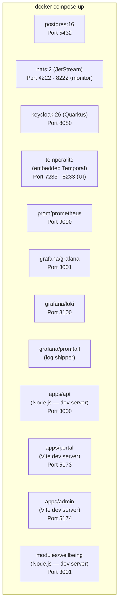

# Deployment Architecture

> Status: Draft — Phase 2
> Last updated: 2026-06-04

---

## Deployment Tiers

| Tier | Configuration | Target |
|---|---|---|
| **Local development** | Docker Compose (single machine) | Developer Mac Mini with OrbStack |
| **Single institution** | Docker Compose or small Kubernetes cluster | On-premises or hosted per-institution |
| **Multi-institution** | Kubernetes | Cloud or on-premises; multi-tenant SaaS |

All tiers use the same container images; differences are in composition and configuration only.

---

## Local Development Stack (Docker Compose)

The complete development environment starts with `docker compose up` from the repository root. OrbStack provides the Docker runtime on macOS.

```
infra/compose/
├── docker-compose.yml          # Core stack (database, messaging, auth, workflow, observability)
├── docker-compose.apps.yml     # Application services (override for local dev)
├── docker-compose.adapters.yml # Optional: external adapters for integration testing
└── .env.example                # Required environment variables (no secrets; values in .env)
```

### Service inventory



**Temporalite** is the embedded single-binary Temporal development server. It requires no separate database (stores state in memory) and has the Temporal UI built in. It is replaced by a production-grade Temporal Server with PostgreSQL backend in staging/production.

### Resource allocation guidance (Mac Mini)

| Service | RAM target |
|---|---|
| PostgreSQL | 512 MB |
| Keycloak | 512 MB |
| Temporal (dev) | 256 MB |
| NATS | 64 MB |
| Prometheus + Grafana + Loki | 256 MB |
| Application services | 512 MB |
| **Total** | **~2.1 GB** |

A Mac Mini with **8 GB RAM** comfortably runs the full stack. 16 GB+ is recommended when running tests alongside the development stack.

### Single-command setup

```bash
cp .env.example .env          # Add development secrets
docker compose up -d          # Start all platform services
pnpm install                  # Install Node.js dependencies
pnpm dev                      # Start application services in watch mode
```

---

## Container Design

### Dockerfile pattern

Every service follows this structure:

```dockerfile
# infra/docker/api/Dockerfile
FROM node:22-alpine AS base
WORKDIR /app
RUN addgroup -S srs && adduser -S srs -G srs    # Non-root user

FROM base AS deps
COPY package.json pnpm-lock.yaml ./
RUN corepack enable && pnpm install --frozen-lockfile

FROM base AS build
COPY --from=deps /app/node_modules ./node_modules
COPY . .
RUN pnpm build

FROM base AS runtime
COPY --from=build /app/dist ./dist
COPY --from=deps /app/node_modules ./node_modules
USER srs
EXPOSE 3000
HEALTHCHECK --interval=30s CMD wget -qO- http://localhost:3000/health || exit 1
CMD ["node", "dist/main.js"]
```

Rules applied to all images:
- Non-root user (`srs` or service-specific).
- Pinned base image tag (updated on a defined schedule; PRs auto-raised by Dependabot).
- Multi-stage build to exclude dev dependencies and build tools from runtime image.
- `HEALTHCHECK` instruction on every service image.
- No secrets in image; all configuration injected at runtime.

---

## Environment Configuration

All runtime configuration is injected as environment variables. No configuration is baked into images.

### Configuration categories

| Category | Variable pattern | Example |
|---|---|---|
| Database | `DB_*` | `DB_HOST`, `DB_PORT`, `DB_NAME` |
| Auth | `KEYCLOAK_*` | `KEYCLOAK_URL`, `KEYCLOAK_REALM` |
| NATS | `NATS_*` | `NATS_URL`, `NATS_CREDENTIALS_PATH` |
| Temporal | `TEMPORAL_*` | `TEMPORAL_ADDRESS`, `TEMPORAL_NAMESPACE` |
| App | `APP_*` | `APP_PORT`, `APP_LOG_LEVEL` |
| Observability | `OTEL_*` | `OTEL_EXPORTER_OTLP_ENDPOINT` |

In development: values from `.env` file (gitignored). In production: injected from OpenBao via the container orchestrator.

---

## Production Topology (Single Institution — Docker Compose)

A single-institution production deployment adds:

- PostgreSQL with streaming replication replica.
- Temporal Server (production distribution) pointing at PostgreSQL `temporal` schema.
- Keycloak in production mode with an external PostgreSQL database.
- NATS in clustered mode (3 nodes for HA).
- Reverse proxy (Nginx or Caddy) for TLS termination and routing.
- OpenBao for secrets management.

```
infra/compose/
└── docker-compose.production.yml   # Production overrides
```

---

## Production Topology (Multi-Institution — Kubernetes)

For multi-institution SaaS deployment:

```
infra/kubernetes/
├── base/                           # Kustomize base manifests
│   ├── api/
│   ├── portal/
│   ├── wellbeing/
│   ├── keycloak/
│   ├── nats/
│   ├── temporal/
│   └── observability/
└── overlays/
    ├── staging/
    └── production/
```

Kubernetes-specific provisions:
- Horizontal Pod Autoscaler on the SRS Core API (scale on CPU/memory).
- Dedicated PostgreSQL instance per Kubernetes namespace (or a managed RDS/Cloud SQL instance).
- NATS cluster with 3 replicas.
- Temporal Server cluster with PostgreSQL backend.
- Keycloak cluster with shared PostgreSQL.
- OpenBao Agent sidecar for secrets injection into pods.

---

## CI/CD Pipeline

```mermaid
graph LR
    PR["Pull Request"] --> L["Lint + Type Check"]
    L --> UT["Unit Tests\n(Vitest)"]
    UT --> IT["Integration Tests\n(Testcontainers)"]
    IT --> CT["Contract Tests\n(Dredd)"]
    CT --> ACC["Accessibility Scan\n(axe-core + Playwright)"]
    ACC --> SEC["Security Scan\n(Semgrep + npm audit)"]
    SEC --> IMG["Build & Scan Images\n(Docker + Trivy)"]
    IMG --> MERGE["Merge permitted"]
    MERGE --> MAIN["Push to main"]
    MAIN --> PUB["Publish images\nghcr.io"]
    PUB --> DEP["Deploy to staging"]
```



### Scheduled pipelines (not on every PR)

| Pipeline | Trigger | Purpose |
|---|---|---|
| Performance tests | Nightly | k6 load tests against staging |
| Full E2E tests | Nightly | Playwright golden path tests |
| Dependency updates | Weekly | Dependabot PRs for base images + npm packages |
| DAST | Weekly | Dynamic security scan against staging |

---

## Health and Readiness Endpoints

Every service exposes two standard endpoints:

| Endpoint | Purpose | Checks |
|---|---|---|
| `GET /health` | Liveness — is the process alive? | Process running; no fatal internal error |
| `GET /ready` | Readiness — can it serve traffic? | Database connection pool healthy; NATS connected; Temporal worker running; Keycloak JWKS reachable |

Format (both endpoints):
```json
{
  "status": "ok",
  "checks": {
    "database":  { "status": "ok",    "latencyMs": 2  },
    "nats":      { "status": "ok"                      },
    "temporal":  { "status": "ok"                      },
    "keycloak":  { "status": "ok",    "latencyMs": 15 }
  },
  "version": "1.2.3",
  "uptime":  3600
}
```

On readiness failure: `503 Service Unavailable`; container orchestrator routes traffic away until recovery.
