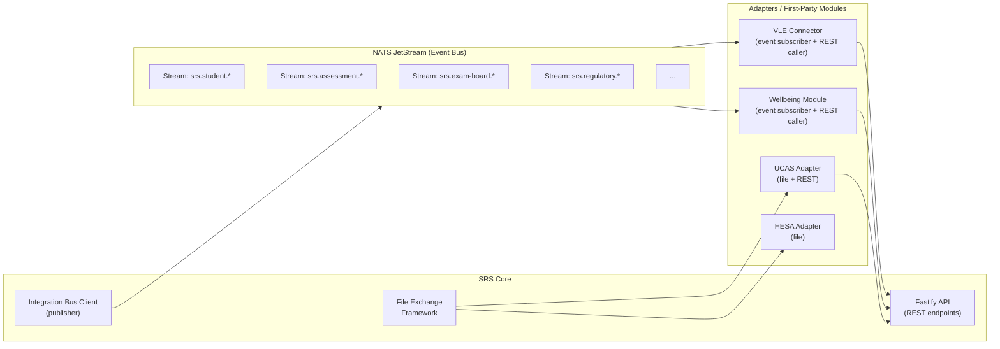
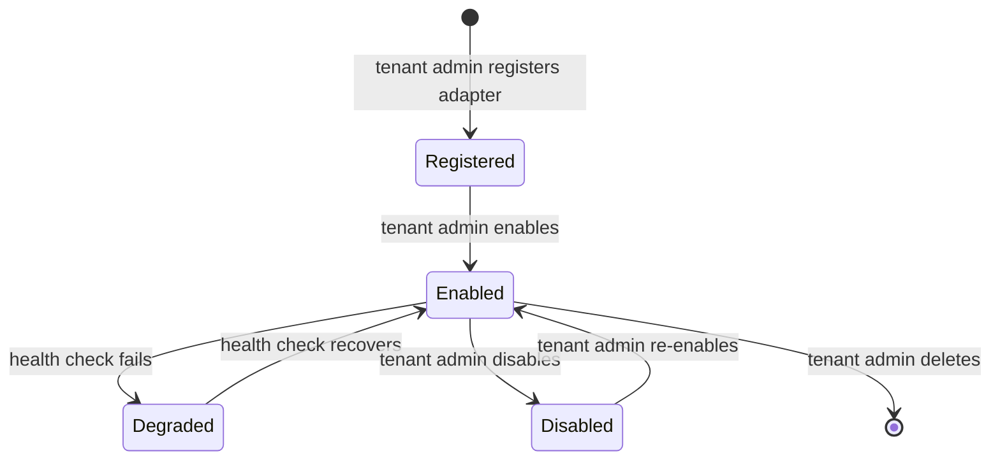

# Integration Layer Architecture

> Status: Draft — Phase 2
> Last updated: 2026-06-04

---

## Overview

The integration layer is the mechanism by which the SRS Core communicates with first-party modules, external institutional systems, and statutory bodies. It is composed of three complementary integration patterns, all governed by versioned contracts and the plugin registry.



---

## Pattern 1 — Event-Driven (NATS JetStream)

### Role

The primary pattern for asynchronous, high-volume, and real-time integration. The SRS Core publishes a domain event whenever a significant state change occurs. Subscribers react to events without polling.

### NATS JetStream Topology

| Stream | Subject prefix | Retention | Consumers |
|---|---|---|---|
| `SRS_STUDENT` | `srs.student.*` | 7 days / 1M messages | VLE, IAM, Wellbeing, CRM |
| `SRS_ASSESSMENT` | `srs.assessment.*` | 7 days | VLE, BI, DW |
| `SRS_EXAM_BOARD` | `srs.exam-board.*` | 30 days | VLE, EWP, SLC |
| `SRS_REGULATORY` | `srs.regulatory.*` | 90 days | UCAS, SLC, UKVI, HESA |
| `SRS_ADJUSTMENT` | `srs.adjustment.*` | 7 days | VLE, AM, EXAMS |
| `SRS_WORKFLOW` | `srs.workflow.*` | 7 days | Notification service |
| `SRS_AUDIT` | `srs.audit.*` | 365 days | DW, compliance tooling |

All streams use **`WorkQueuePolicy`** — messages are acknowledged by the consumer once processed. Unacknowledged messages are redelivered up to the configured `MaxDeliver` count, then moved to a dead-letter subject.

### Dead-Letter Policy

| Stream | Dead-letter subject | Max deliver |
|---|---|---|
| All | `srs.dlq.{original-subject}` | 5 |

Failed events in the DLQ trigger an alert and are reviewed manually or via the admin portal's integration health view.

### Event Envelope

Every event published to NATS carries a standard JSON envelope:

```typescript
interface DomainEventEnvelope<T> {
  id:           string;     // UUID v4 — unique event ID
  type:         string;     // e.g. "srs.student.enrolled"
  version:      string;     // Semver: "1.0.0"
  tenantId:     string;     // UUID of the publishing tenant
  occurredAt:   string;     // ISO 8601 UTC timestamp
  correlationId: string;    // UUID — traces the originating request
  source:       string;     // "srs-core" / "wellbeing-module" / etc.
  payload:      T;          // Event-specific typed payload
}
```

### Consumer Registration

External adapters register as NATS consumer groups via the plugin registry. The registry stores the consumer group name and subject filter for each registered integration. On startup, an adapter declares its consumer group; NATS JetStream tracks its position in the stream independently.

```typescript
// Adapter startup (example — VLE Connector)
const js = natsClient.jetstream();
const consumer = await js.consumers.get('SRS_STUDENT', 'vle-connector');
for await (const msg of await consumer.consume()) {
  await handleStudentEvent(msg.json<DomainEventEnvelope<StudentEnrolledPayload>>());
  msg.ack();
}
```

---

## Pattern 2 — REST API

### Role

Synchronous request/response integration. Used for:
- Inbound data from external systems (grade submission from VLE, payment status from Finance).
- Direct querying by adapters that need current record state.
- First-party module interactions with the Core that are synchronous (e.g. Wellbeing transmitting an approved adjustment outcome).

### API Gateway Design

All REST endpoints are served by the SRS Core Fastify application. There is no separate API gateway service; Fastify's plugin architecture handles cross-cutting concerns.

```
Request → Fastify
            → CORS middleware
            → JWT validation plugin (Keycloak JWKS)
            → Tenant context plugin (sets app.current_tenant_id)
            → Rate limiting plugin
            → Route handler
              → JSON Schema validation (automatic, schema-first)
              → Domain module service
              → Audit write
              → Response
```

### Versioning

All REST API endpoints are prefixed `/api/v{N}/`. The current version is `v1`. A new major version is created only for breaking changes; additions and non-breaking changes are made within the current version.

---

## Pattern 3 — File Exchange

### Role

Bulk data exchange with external systems and statutory bodies that do not support real-time API integration. Primarily used for regulatory flows (HESA, SLC, UCAS) and legacy institutional systems.

### Architecture

The File Exchange Framework is a library within `apps/api/src/platform/file-exchange/`. It provides:

```
inbound-processor/
  ├── validator.ts          # Schema-based file format validation
  ├── parser.ts             # Parses supported formats (CSV, XML, fixed-width)
  ├── transformer.ts        # Maps file fields to SRS domain model
  └── importer.ts           # Writes validated records to domain services

outbound-processor/
  ├── extractor.ts          # Queries domain services for required data
  ├── formatter.ts          # Formats to target specification (HESA XML, etc.)
  └── transmitter.ts        # Transfers file via configured transport (SFTP, HTTPS)

transports/
  ├── sftp.ts               # SSH/SFTP upload/download
  └── https.ts              # HTTPS file POST/GET

registry/
  └── file-integration.ts   # Per-integration format and transport configuration
```

### File Integration Lifecycle

1. **Outbound**: Scheduled or manually triggered → extractor queries SIS data → formatter applies specification rules → transmitter delivers file → event `srs.regulatory.hesa-return-submitted` published.
2. **Inbound**: File placed in configured SFTP inbox → watcher detects → validator rejects non-conforming files (error logged + alerted) → parser + transformer produce domain events → importer writes to domain services.

### Format Registry

Each integration specifies its file format configuration in the plugin registry:

```jsonc
{
  "integration_code": "hesa-student-return",
  "pattern_type": "file",
  "contract_version": "2024-25",
  "configuration": {
    "format": "xml",
    "schema_url": "https://www.hesa.ac.uk/schemas/student/2024-25",
    "transport": "sftp",
    "sftp_host": "...",    // stored in secrets store
    "direction": "outbound",
    "schedule": "manual"  // or cron expression
  }
}
```

---

## Plugin Registry

### Purpose

The plugin registry is the runtime record of all active integrations for a tenant. It governs which integrations are enabled, at what contract version, with what configuration, and what their current health state is.

### Schema

The canonical schema is defined in [data-model.md](data-model.md) using three tables:

| Table | Purpose |
|---|---|
| `integration_contract` | Platform catalogue of supported contracts and their current versions. |
| `integration_registration` | Tenant-specific enabled adapter/endpoint configuration for a contract. |
| `integration_exchange` | Append-only inbound/outbound exchange ledger for idempotency, retry, replay, and reconciliation. |

The integration layer must not maintain a divergent copy of these columns. Phase 3 migrations are generated from the data model.

### Lifecycle



### Health Checks

Each registered integration with an active health check URL is polled by the Core on a configurable interval (default: 60 seconds). Results are stored in `integration_registration.health_status_code` and surfaced on the admin portal's integration dashboard.

REST integrations: HTTP GET to configured health endpoint, expect 2xx.
Event integrations: check NATS consumer group lag; flag as degraded if lag exceeds threshold.
File integrations: check last successful exchange timestamp against expected schedule.

---

## Contract Versioning

| Change type | Version increment | Action required |
|---|---|---|
| New optional field added | Patch | Consumers may ignore; no migration needed |
| New required field added | Minor | Consumers must be updated before upgrade |
| Field removed or renamed | Major | New version (`v2`); `v1` maintained for deprecation period |
| Event schema breaking change | Major | New event type (`srs.student.enrolled.v2`); dual-publish during transition |

### Deprecation Policy

Breaking changes:
- Announced minimum 90 days before enforcement.
- Previous version continues to be published in parallel during the transition window.
- Deprecated version endpoints/event types are removed after the transition window closes.

---

## First-Party Module Integration Contract

First-party modules (Wellbeing, etc.) have a privileged integration pattern compared to external adapters.

| Capability | External adapter | First-party module |
|---|---|---|
| Direct PostgreSQL access | No | Own schema only; reads SRS schema via RLS |
| NATS event subscription | Yes (via consumer group) | Yes (direct) |
| REST API calls to Core | Yes (authenticated) | Yes (service account) |
| Transmit outcomes to Core | Via REST API only | Via REST API (internal service interface) |
| Publish domain events | No | Yes (to own subjects; Core re-publishes downstream) |

The rule is preserved: **no downstream system receives adjustment, EC, or misconduct outcome data directly from a first-party module**. All such outcomes flow through the Core's domain services (REST API call), which records them bitemporally and distributes via events.
