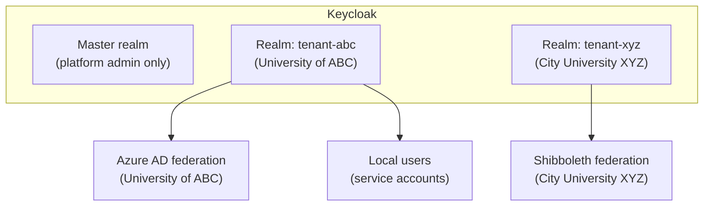
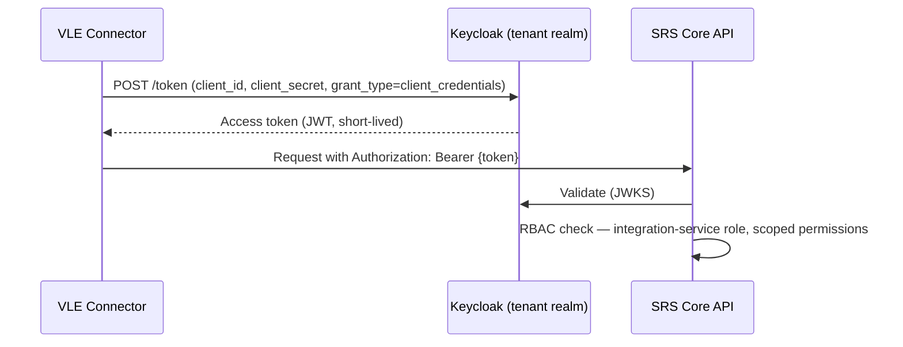

# Security Architecture

> Status: Draft — Phase 2
> Last updated: 2026-06-04

---

## Overview

Security is enforced at multiple independent layers. Failure of any single layer does not expose data. The layers are:

1. **Transport** — TLS 1.2+ on all connections.
2. **Authentication** — Keycloak validates identity; no request proceeds without a verified JWT.
3. **Authorisation** — RBAC enforced in application middleware.
4. **Data isolation** — RLS enforced at the database layer.
5. **Audit** — all access to sensitive data and all writes are logged immutably.

---

## Identity Provider — Keycloak Multi-Realm Architecture

Each tenant (institution) maps to a **Keycloak realm**. Realms are fully isolated: users, roles, clients, and identity federation configuration in one realm have no visibility into another.



### Realm structure per tenant

| Component | Description |
|---|---|
| **Identity federation** | Configured per realm to connect the institution's existing IdP (Azure AD, ADFS, Shibboleth). Users authenticate via their institutional credentials; Keycloak brokers the identity. |
| **Realm roles** | Application-level roles mapped from IdP group membership. See RBAC section. |
| **SRS API client** | A confidential Keycloak client representing the SRS Core API. Validates tokens; no client secret embedded in frontend code. |
| **Service account clients** | One client per integration (VLE connector, HESA adapter, etc.) using client credentials flow. |
| **Local users** | Used for service accounts and platform-level operations only. Not used for end-user access where an institutional IdP is available. |

### Tenant provisioning

Realm creation is automated via the Keycloak Admin REST API as part of the tenant onboarding workflow. The tenant administrator then configures identity federation through the realm admin UI or API.

---

## Authentication Flows

### Human user (browser → frontend → API)

```mermaid
sequenceDiagram
    participant Browser
    participant Portal as Student/Admin Portal
    participant KC as Keycloak (tenant realm)
    participant API as SRS Core API

    Browser->>Portal: Navigate
    Portal->>KC: OIDC Authorization Code flow (redirect)
    KC->>KC: Authenticate via institutional IdP (SAML/OIDC federation)
    KC-->>Portal: Authorization code
    Portal->>KC: Exchange code for tokens
    KC-->>Portal: Access token (JWT) + Refresh token
    Portal->>API: Request with Authorization: Bearer {access_token}
    API->>KC: Validate token (JWKS endpoint — cached)
    KC-->>API: Token valid (or 401)
    API->>API: Extract claims: sub, tenant_id, roles[]
    API->>API: Set app.current_tenant_id; check RBAC
```

Access tokens expire after **60 minutes** (configurable per realm). The frontend transparently refreshes using the refresh token before expiry.

### Service-to-service (integration adapter → API)

Adapters use **OAuth 2.0 Client Credentials** flow. No human user is involved.



Client secrets are stored in OpenBao (production) or `.env` files (development) — never in source code or container images.

---

## JWT Token Structure

All JWTs issued by Keycloak for the SRS include the following claims:

```jsonc
{
  "sub":         "f47ac10b-...",          // Keycloak user subject (UUID)
  "iss":         "https://auth.srs.example.com/realms/tenant-abc",
  "aud":         "srs-api",              // The SRS API client ID
  "exp":         1717511640,
  "iat":         1717508040,
  "tenant_id":   "a1b2c3d4-...",         // Institution UUID (custom claim)
  "realm_roles": ["registry-administrator", "exam-board-member"],
  "name":        "Jane Smith",
  "email":       "j.smith@universityabc.ac.uk",
  "preferred_username": "jsmith"
}
```

The `tenant_id` claim is a custom mapper configured in the Keycloak realm client scope. It maps to the institution's UUID in the SRS `tenant` table.

---

## Role-Based Access Control (RBAC)

### Permission check flow

```
JWT validated → roles[] extracted → RBAC middleware → permission check → handler
                                                         ↓ denied → 403
```

Permissions are checked at the route handler level using a declarative decorator pattern:

```typescript
// Route-level permission declaration
fastify.get('/students/:id', {
  preHandler: [requirePermission('student:read')],
  ...
});
```

### Permission matrix

| Permission | student | registry-admin | module-tutor | exam-board-chair | wellbeing-advisor | tenant-admin |
|---|---|---|---|---|---|---|
| `student:read:own` | ✓ | | | | | |
| `student:read:all` | | ✓ | | ✓ | ✓ | |
| `student:write` | | ✓ | | | | |
| `enrolment:read` | ✓ (own) | ✓ | | ✓ | ✓ | |
| `enrolment:write` | | ✓ | | | | |
| `mark:read` | ✓ (own, post-pub) | ✓ | ✓ (own modules) | ✓ | | |
| `mark:write` | | ✓ | ✓ (own modules) | | | |
| `exam-board:read` | | ✓ | | ✓ | | |
| `exam-board:ratify` | | | | ✓ | | |
| `adjustment:read` | ✓ (own) | ✓ | | | ✓ | |
| `adjustment:write` | | ✓ | | | ✓ | |
| `special-category:read` | | | | | ✓ | |
| `config:write` | | | | | | ✓ |
| `integration:manage` | | | | | | ✓ |

Roles and permissions are defined in `packages/auth/src/permissions.ts` as a static map. Roles are assigned in Keycloak; permissions are checked in the application.

---

## Row-Level Security

RLS policies ensure a tenant's data cannot be accessed by another tenant's users even if application-layer authorisation were bypassed.

```sql
-- Applied to every user-data table
CREATE POLICY tenant_isolation ON {table}
  USING (tenant_id = current_setting('app.current_tenant_id', true)::uuid);
```

The `system_administrator` application role uses a dedicated PostgreSQL role with `BYPASSRLS`, exclusively for platform-level operations. All such operations are audit-logged.

### Special category data — additional RLS

Tables containing special category data (ethnicity, disability, health data) have an additional policy restricting access to roles with the `special-category:read` permission:

```sql
CREATE POLICY sensitive_data_access ON person_identity
  USING (
    tenant_id = current_setting('app.current_tenant_id', true)::uuid
    AND (
      -- Ethnicity column is only returned when role allows; handled at query layer
      current_setting('app.current_role', true) = ANY(ARRAY['wellbeing-advisor','registry-administrator','dpo'])
    )
  );
```

In practice, special category fields are also **column-level filtered** at the repository layer — the query only SELECTs sensitive columns when the role is authorised. RLS is the defence-in-depth layer.

---

## Secrets Management

| Environment | Mechanism |
|---|---|
| Development (local) | `.env` files (gitignored); Docker Compose `env_file` |
| Staging / Production | OpenBao (MPL 2.0 Vault fork); dynamic secrets for PostgreSQL credentials |

### Secrets never stored in:
- Source code
- Container images
- Docker Compose files committed to the repository
- Unencrypted environment variable files

### Secret categories

| Secret | Mechanism |
|---|---|
| PostgreSQL credentials | OpenBao dynamic secrets (rotated automatically) |
| Keycloak client secrets | OpenBao KV store |
| NATS authentication | NATS NKey credentials via OpenBao |
| Integration adapter secrets (SFTP keys, API keys) | OpenBao KV store, per tenant |
| JWT signing keys | Managed by Keycloak |

---

## API Security Controls

| Control | Implementation |
|---|---|
| TLS | Enforced at reverse proxy / load balancer; minimum TLS 1.2 |
| No unauthenticated endpoints | All routes wrapped in JWT validation plugin; health/ready probes exempted |
| CORS | Strict allowlist of frontend origins per tenant; no wildcard |
| Rate limiting | Per tenant, per endpoint tier (see api-standards.md) |
| Input validation | Fastify JSON Schema validation; no handler receives unvalidated input |
| Error sanitisation | RFC 7807 errors never expose stack traces or internal detail |
| CSRF | Mitigated by `Authorization: Bearer` header requirement (not cookie-based auth) |
| Content-Security-Policy | Set on all frontend responses; restricts script sources |
| Dependency scanning | `npm audit` + Trivy on every CI build; critical CVEs block deployment |
| SAST | Semgrep on every PR; high/critical findings block merge |

---

## Audit of Security Events

The following security events are written to the audit trail in addition to data-change audit records:

| Event | Recorded |
|---|---|
| Successful authentication | Actor, timestamp, IP (where available) |
| Failed authentication (≥3 attempts) | Actor, timestamp, attempt count |
| Account locked | Actor, timestamp |
| Access to special category data | Actor, entity, timestamp |
| Token refresh | Actor, timestamp |
| Service account token issued | Client ID, timestamp, scopes |
| Configuration change (tenant rules, integrations) | Actor, before/after, timestamp |
| RLS bypass (system admin operations) | Actor, operation, timestamp |
