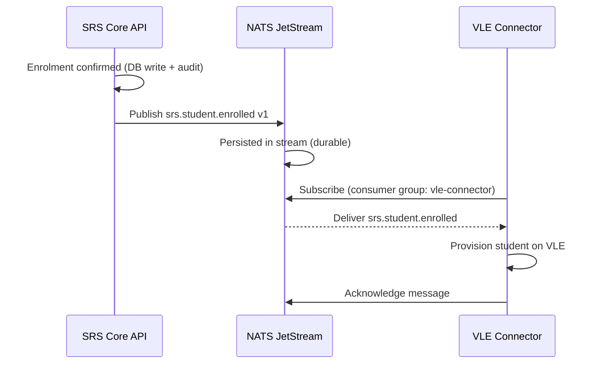

# System Architecture

> Status: Draft — Phase 2
> Last updated: 2026-06-04

---

## Architectural Style — Modular Monolith

The SRS core is a **modular monolith**: a single deployable application divided into well-defined internal domain modules with enforced boundaries. This is the correct approach for the current stage of the project because:

- No distributed system complexity (no network overhead between domain modules, no partial failure scenarios between them).
- Simpler to test: integration tests spin up a single process.
- Simpler for institutions to deploy: one container for the API.
- Internal boundaries are enforced by ESLint import rules and TypeScript project references, providing the discipline of a service boundary without the operational cost.
- The architecture does not prevent splitting individual modules into independent services later — the module boundaries are the seams.

First-party modules (e.g. Wellbeing & Disability) and external adapters (e.g. VLE Connector) are **separate deployable units** that communicate with the SRS core via the integration layer.

---

## System Overview

```mermaid
graph TB
    subgraph Users["Users & Browsers"]
        STU["Student Browser"]
        STF["Staff Browser"]
    end

    subgraph Frontend["Frontend Applications"]
        SP["Student Portal\n(React + Vite)"]
        AP["Admin Portal\n(React + Vite)"]
    end

    subgraph Core["SRS Core API  ·  Fastify (Node.js + TypeScript)"]
        direction TB
        subgraph Domains["Domain Modules"]
            M1["Student Identity"]
            M2["Enrolment & Registration"]
            M3["Assessment & Results"]
            M4["Progression & Awards"]
            M5["Exam Board & Governance"]
            M6["Regulatory Compliance"]
        end
        subgraph Platform["Platform Infrastructure"]
            AUD["Audit Service"]
            RLS["Rules Engine"]
            INT["Integration Bus Client"]
        end
    end

    subgraph FirstParty["First-Party Module"]
        WEL["Student Wellbeing\n& Disability"]
    end

    subgraph IntLayer["Integration Layer"]
        NATS["NATS JetStream\n(Event Bus)"]
        FEX["File Exchange\nFramework"]
        PR["Plugin Registry"]
    end

    subgraph Adapters["External Adapters"]
        VLE["VLE Connector"]
        UA["UCAS Adapter"]
        HA["HESA Adapter"]
        SA["SLC Adapter"]
        UV["UKVI Adapter"]
    end

    subgraph Platform2["Platform Services"]
        KC["Keycloak\n(Identity Provider)"]
        TMP["Temporal\n(Workflow Engine)"]
        PG["PostgreSQL 16\n(Primary Database)"]
        OBS["Prometheus + Grafana\n+ Loki (Observability)"]
    end

    STU --> SP
    STF --> AP
    SP --> Core
    AP --> Core

    Core --> PG
    Core --> KC
    Core --> TMP
    Core --> INT
    INT --> NATS

    WEL --> PG
    WEL --> NATS

    NATS --> VLE
    NATS --> UA
    NATS --> HA
    NATS --> SA
    NATS --> UV

    VLE --> Core
    UA --> FEX
    HA --> FEX
    SA --> FEX
    FEX --> Core

    Core --> OBS
    WEL --> OBS
```



---

## Layer Descriptions

### Frontend Applications

Two React + TypeScript applications built with Vite.

| Application | Primary users | Responsibilities |
|---|---|---|
| **Student Portal** | Enrolled students | Self-service: personal data, module selection, results, timetable, exam info, notifications |
| **Admin Portal** | Registry, academic staff, tenant administrators | Student record management, exam board tooling, regulatory returns, workflow task inbox, configuration |

Both consume the SRS Core REST API exclusively. No direct database access.

---

### SRS Core API

The central deployable service. Built as a Fastify application with internal domain modules enforced by TypeScript project references and ESLint import rules.

#### Domain Modules

Each module owns its own service classes, repository layer, and internal types. Cross-module calls are made through defined internal interfaces, not by importing repository classes across module boundaries.

| Module | Responsibility |
|---|---|
| **Student Identity** | Student record creation, personal data management, identity verification, HESA ID |
| **Enrolment & Registration** | Programme enrolment lifecycle, module registration, re-enrolment, fee liability |
| **Assessment & Results** | Mark ingestion, aggregation, adjustment application, resit management |
| **Progression & Awards** | Progression rule evaluation, degree classification, award management, HEAR |
| **Exam Board & Governance** | Board data pack generation, ratification, record locking, appeal workflows |
| **Regulatory Compliance** | HESA return, SLC, UKVI, UCAS, OfS compliance workflows |

#### Platform Infrastructure

Shared services used by all domain modules.

| Service | Responsibility |
|---|---|
| **Audit Service** | Appends an audit record to every write operation; read-access auditing for sensitive data |
| **Rules Engine** | Evaluates configured institutional business rules (progression, classification, penalties) against current or historical rule versions |
| **Integration Bus Client** | Publishes domain events to NATS JetStream; provides the event publishing interface for all domain modules |

---

### First-Party Modules

Separate deployable Node.js services that share the SRS PostgreSQL database (with their own schemas) and communicate via NATS JetStream events. They are subject to the same tenant isolation and RLS policies as the core.

The only first-party module in scope is **Student Wellbeing & Disability** (Phase 8). It:
- Has its own database schema (`wellbeing`) within the shared PostgreSQL cluster.
- Reads from the `srs` schema (student data it needs for casework) subject to RLS.
- Writes approved outcomes to the `srs` schema via a well-defined internal API on the Core (not by direct writes to Core-owned tables).
- Publishes domain events to NATS JetStream.

---

### Integration Layer

The integration layer is not a separate service — it is the collection of NATS JetStream, the file exchange framework, and the plugin registry, all of which are consumed by the Core and by adapters.

| Component | Purpose |
|---|---|
| **NATS JetStream** | Durable event bus for domain events. The Core publishes; external adapters and first-party modules subscribe. |
| **File Exchange Framework** | A library within the Core that handles structured inbound/outbound file operations (format validation, SFTP transport, retry). |
| **Plugin Registry** | A database-backed registry of active integrations, their contract versions, enabled status, and health. Managed per tenant. |

---

### External Adapters

Separate deployable services that connect external institutional systems to the SRS via the integration layer only. No direct database access to the SRS PostgreSQL.

| Adapter | Pattern | Flows |
|---|---|---|
| VLE Connector | NATS subscriber (outbound) + REST consumer (inbound) | F015, F016, F059 |
| UCAS Adapter | REST + file | F045, F046 |
| HESA Adapter | File (outbound annual) | F047, F048 |
| SLC Adapter | REST + file | F049, F050 |
| UKVI Adapter | REST + file | F051, F052 |

---

### Platform Services

| Service | Technology | Role |
|---|---|---|
| Identity Provider | Keycloak (Quarkus) | OAuth 2.0 / OIDC; one realm per tenant |
| Workflow Engine | Temporal Server | Durable workflow execution |
| Primary Database | PostgreSQL 16 | All persistent data; multi-tenant via RLS |
| Metrics | Prometheus | Scrapes metrics from all services |
| Dashboards | Grafana | Metrics dashboards and alerting |
| Log Aggregation | Loki + Promtail | Structured log ingestion and retention |

---

## Repository Structure

The project uses a **pnpm monorepo** with workspaces.

```
revelation-srs/
├── apps/
│   ├── api/                  # SRS Core API (Fastify)
│   │   └── src/
│   │       ├── modules/
│   │       │   ├── student-identity/
│   │       │   ├── enrolment/
│   │       │   ├── assessment/
│   │       │   ├── progression/
│   │       │   ├── exam-board/
│   │       │   └── regulatory/
│   │       └── platform/
│   │           ├── audit/
│   │           ├── rules-engine/
│   │           └── integration-bus/
│   ├── portal/               # Student Portal (React + Vite)
│   └── admin/                # Admin Portal (React + Vite)
├── modules/
│   └── wellbeing/            # Student Wellbeing & Disability (first-party module)
├── adapters/
│   ├── vle/                  # VLE Connector (example external adapter)
│   ├── ucas/
│   ├── hesa/
│   ├── slc/
│   └── ukvi/
├── packages/
│   ├── domain/               # Shared domain types, event schemas, enums
│   ├── db/                   # Drizzle schema, migrations, bitemporal helpers, RLS
│   ├── workflow/             # Temporal workflow and activity definitions
│   ├── auth/                 # JWT validation, RBAC middleware
│   └── testing/              # Testcontainers helpers, fixture factories, test utilities
├── infra/
│   ├── docker/               # Per-service Dockerfiles
│   └── compose/              # Docker Compose configurations
├── docs/
└── .github/
    └── workflows/            # GitHub Actions CI/CD
```

---

## Module Boundary Enforcement

Inter-module dependencies within `apps/api` are governed by:

1. **TypeScript project references**: each domain module is a TypeScript project; references between them are explicit and compile-time checked.
2. **ESLint import rules**: `eslint-plugin-boundaries` enforces that a domain module may only import from:
   - Its own files.
   - `packages/` shared packages.
   - `platform/` shared infrastructure.
   - Explicit, declared dependencies on other domain modules (cross-module interfaces only, not repository internals).
3. **No direct repository access across modules**: a module may call another module's *service interface*, never its repository layer.

---

## Request Flow — Read Path

```mermaid
sequenceDiagram
    participant Browser
    participant Portal
    participant CoreAPI as SRS Core API
    participant KC as Keycloak
    participant PG as PostgreSQL

    Browser->>Portal: User navigates
    Portal->>KC: OAuth2 token refresh (if needed)
    KC-->>Portal: Access token (JWT)
    Portal->>CoreAPI: GET /api/v1/students/:id  (Bearer token)
    CoreAPI->>KC: Validate token (JWKS)
    CoreAPI->>PG: SET app.current_tenant_id; SELECT ...
    Note over PG: RLS enforces tenant scope
    PG-->>CoreAPI: Student record
    CoreAPI->>PG: INSERT INTO audit_records (read event)
    CoreAPI-->>Portal: 200 { student }
    Portal-->>Browser: Rendered view
```

---

## Request Flow — Domain Event Path


