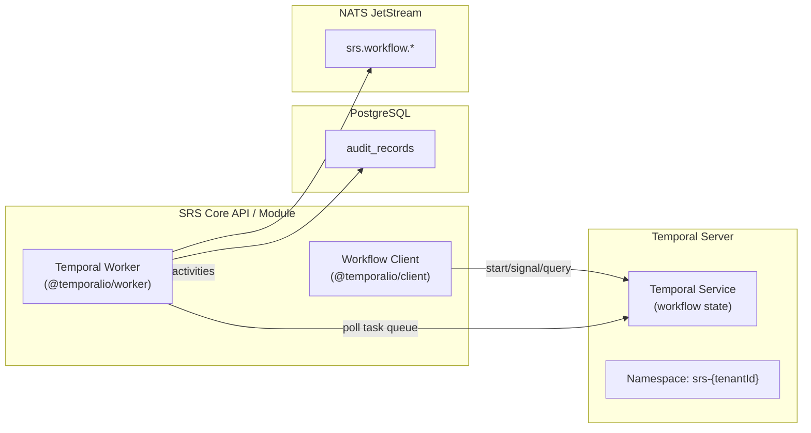

# Workflow Engine Integration

> Status: Draft — Phase 2
> Last updated: 2026-06-04
> Describes how Temporal is integrated into the SRS and the patterns used for workflow definition, human task management, and audit integration.

---

## Architecture



The local Temporal Server uses **PostgreSQL as its persistence backend** through the `temporalio/auto-setup` container in `infra/compose/docker-compose.yml`. Production uses the same persistence pattern with production-grade Temporal Server configuration.

---

## Namespacing

Each tenant has a dedicated **Temporal namespace**: `srs-{tenantId}`. This provides:

- Workflow history isolation between tenants.
- Independent retention policies per tenant.
- Task queue separation.

Namespace creation is automated as part of tenant provisioning.

---

## Package Structure

```
packages/workflow/
├── src/
│   ├── workflows/
│   │   └── index.ts              # Phase 3 minimal audit workflow scaffold
│   ├── activities/
│   │   └── audit.activities.ts
│   └── worker.ts                  # Worker registration and startup
```

Domain-specific workflows, signals, queries, and activities are added in the phases that introduce those processes.

---

## Workflow Definition Pattern

Workflows are deterministic TypeScript functions in `packages/workflow/src/workflows/`. They must never make direct I/O calls; all I/O is done through activities.

```typescript
// packages/workflow/src/workflows/admissions.workflow.ts
import { proxyActivities, defineSignal, setHandler, sleep, condition } from '@temporalio/workflow';
import type { EnrolmentActivities } from '../activities/enrolment.activities.js';

const { confirmEnrolment, notifySlc, createCasRequest, assignTask } =
  proxyActivities<EnrolmentActivities>({ startToCloseTimeout: '30 seconds' });

export const offerAcceptedSignal = defineSignal<[{ acceptedAt: string }]>('offerAccepted');
export const conditionsMetSignal  = defineSignal<[{ confirmedAt: string }]>('conditionsMet');

export async function admissionsWorkflow(input: AdmissionsInput): Promise<AdmissionsResult> {
  let offerAccepted = false;
  let conditionsMet = false;

  setHandler(offerAcceptedSignal, () => { offerAccepted = true; });
  setHandler(conditionsMetSignal,  () => { conditionsMet = true; });

  // Wait for offer acceptance (deadline enforced)
  const accepted = await condition(() => offerAccepted, input.offerExpiryDuration);
  if (!accepted) {
    return { outcome: 'offer-lapsed' };
  }

  if (input.isConditional) {
    const met = await condition(() => conditionsMet, input.conditionsDeadlineDuration);
    if (!met) {
      return { outcome: 'conditions-not-met' };
    }
  }

  // Assign pre-enrolment task to registry
  await assignTask({ type: 'pre-enrolment', assigneeRole: 'registry-administrator', ... });

  // Confirm enrolment (activity → domain service → DB write + audit)
  const enrolment = await confirmEnrolment({ personId: input.personId, ... });

  // Trigger downstream notifications (activities)
  await Promise.all([
    notifySlc({ enrolmentId: enrolment.id }),
    ...(input.requiresVisa ? [createCasRequest({ enrolmentId: enrolment.id })] : []),
  ]);

  return { outcome: 'enrolled', enrolmentId: enrolment.id };
}
```

---

## Activity Pattern

Activities are async TypeScript functions registered on the Temporal worker. They are the only place where I/O (database, API calls, file operations) is performed.

```typescript
// packages/workflow/src/activities/enrolment.activities.ts
export const enrolmentActivities = {
  async confirmEnrolment(input: ConfirmEnrolmentInput): Promise<Enrolment> {
    // Calls the SRS Core domain service
    const enrolment = await enrolmentService.confirm(input);
    // Audit write is performed by the domain service — no double-write needed
    return enrolment;
  },

  async notifySlc(input: { enrolmentId: string }): Promise<void> {
    await slcAdapter.sendEnrolmentConfirmation(input.enrolmentId);
  },
};
```

Activities have configurable retry policies:

```typescript
proxyActivities<EnrolmentActivities>({
  startToCloseTimeout: '30 seconds',
  retry: {
    maximumAttempts: 3,
    backoffCoefficient: 2,
    initialInterval: '1 second',
    maximumInterval: '10 seconds',
    nonRetryableErrorTypes: ['ValidationError', 'RecordLockedError'],
  },
});
```

---

## Human Task Pattern

Human tasks are implemented using **Temporal signals**. A workflow pauses waiting for a signal (with an optional timeout for deadline enforcement), and the signal is sent when a human actor completes their task via the API.

```mermaid
sequenceDiagram
    participant WF as Temporal Workflow
    participant API as SRS Core API
    participant Actor as Human Actor (Registry)

    WF->>WF: condition(() => taskComplete, deadline)
    WF->>API: assignTask activity → POST /api/v1/workflow-tasks
    API->>NATS: srs.workflow.task-assigned published
    NATS-->>Actor: Notification (via EWP)
    Actor->>API: POST /api/v1/workflow-tasks/:id/complete
    API->>WF: temporalClient.signal(workflowId, 'taskCompleted', { ... })
    WF->>WF: condition satisfied; proceed
```

The SRS Core API exposes a `/api/v1/workflow-tasks` resource that human actors use to view and complete assigned tasks. The Admin Portal renders this as a task inbox.

---

## Deadline Enforcement

Temporal timers provide durable deadline enforcement:

```typescript
// Wait up to 28 days for offer acceptance; escalate if not received
const accepted = await condition(() => offerAccepted, '28 days');
if (!accepted) {
  await escalateTask({ type: 'offer-lapsed', escalateTo: 'admissions-manager' });
  return { outcome: 'offer-lapsed' };
}
```

Timers survive service restarts. When the deadline fires, Temporal resolves the `condition` as `false` and the workflow proceeds to the escalation/timeout path.

---

## Audit Trail Integration

Every workflow state transition is written to the SRS audit trail via a dedicated `audit.activities.ts` activity. This ensures the audit record is durable — if the audit write fails, Temporal retries it.

```typescript
// Every workflow calls this at each significant transition
await recordWorkflowEvent({
  workflowId:     workflowInfo().workflowId,
  workflowType:   workflowInfo().workflowType,
  event:          'offer-accepted',
  actorId:        input.acceptedByActorId,
  occurredAt:     new Date().toISOString(),
  metadata:       { enrolmentId: input.enrolmentId },
});
```

The Temporal UI provides its own event history for debugging. The SRS audit trail provides the regulatory-grade immutable record with actor identity and reason, independent of Temporal's operational UI.

---

## Workflow Versioning

When workflow logic changes (new state added, transition changed), Temporal's `patched()` API ensures running instances are not broken:

```typescript
import { patched } from '@temporalio/workflow';

// In an updated workflow
if (patched('add-external-examiner-step')) {
  await externalExaminerReview({ examBoardId: input.examBoardId });
}
```

Old instances (started before the patch) skip the new step; new instances execute it. This allows safe deployment of updated workflow logic alongside in-flight instances.

---

## Worker Registration

Each service that executes workflow activities registers a Temporal worker on startup. Phase 3 provides the reusable worker bootstrap in `packages/workflow/src/worker.ts`; domain services add their own activities and task queues when their workflows are introduced.

```typescript
// Target pattern for a domain service worker
const worker = await Worker.create({
  workflowsPath: require.resolve('../../packages/workflow/src/workflows'),
  activities:    { ...enrolmentActivities, ...notificationActivities, ...auditActivities },
  taskQueue:     `srs-core-${tenantId}`,
  namespace:     `srs-${tenantId}`,
});
await worker.run();
```

The Core API worker handles core SRS workflow activities once those workflows are implemented. First-party modules register their own workers for module-specific activities.
