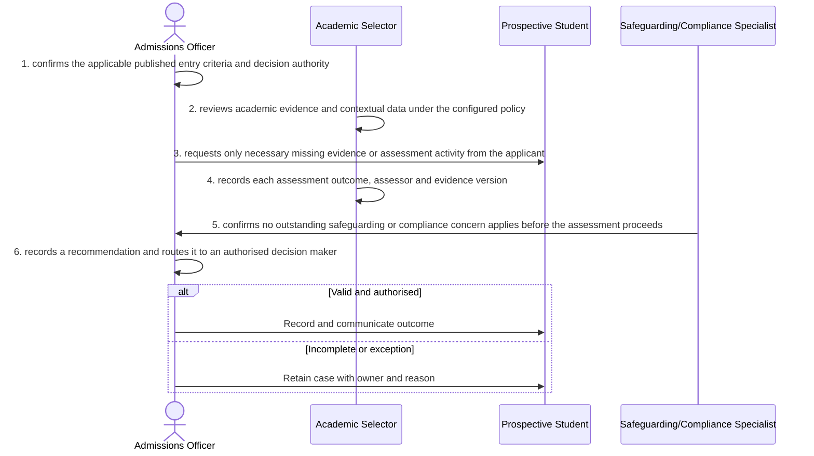

# BP-01-002 — Assess an application

> Status: Draft
> Domain: 01 — Recruitment and admissions
> Owner: TBC
> Version: 0.1
> Last reviewed: 2026-07-26
> Review by: 2027-01-26

[Previous: BP-01-001](../01-recruitment-and-admissions/bp-01-001-receive-an-application.md) · [Domain index](README.md) · [Next: BP-01-003](../01-recruitment-and-admissions/bp-01-003-make-and-manage-an-offer.md) · [Library home](../README.md)

## Applicability

| Dimension | Applies |
|---|---|
| Common | UK |
| Nations | England; Scotland; Wales; Northern Ireland |
| Provider types | Providers operating this process; exact regulatory scope is configured |
| Levels and modes | UG; PGT; PGR; full-time; part-time; distance and collaborative provision where relevant |
| Exclusions | Activities outside the stated start/end boundary |

## Traceability

| Type | References |
|---|---|
| Revelation workflows | W001 |
| Reference-model flows | See integration contract catalogue; confirm detailed F-number mapping during architecture review |
| Functional requirements | See functional requirements; detailed mapping remains an SME/architecture review action |
| Data entities | assessment evidence and admissions decision recommendation; supporting identity, evidence, decision and integration-exchange records |
| Domain events | Proposed: `srs.assess.an.application.completed` |
| Integration contracts | SRS ↔ document/assessment services |

## Purpose and outcome

Assessing an application turns a validated intake record into a reasoned admissions recommendation. Academic evidence, and where relevant safeguarding or compliance considerations, are gathered and evaluated against the published entry criteria for the course, so the eventual offer decision rests on a documented, defensible judgement rather than an unrecorded personal view. The process keeps each piece of evidence, its assessor and its version identifiable, so a later challenge or audit can reconstruct exactly what was considered and by whom.

## Scope

**Starts when:** A complete application enters an assessable queue.

**Ends when:** The authorised outcome is recorded, communicated and reconciled, or the case is closed with an owned reason.

**In scope:** Intake, validation, evidence, decision, effective dating, communication and downstream reconciliation.

**Out of scope:** Upstream policy creation and later lifecycle processes referenced under Related processes.

## Actors and responsibilities

| Actor/system | Responsibility |
|---|---|
| Admissions Officer | Initiates or owns the principal business action |
| Academic Selector | Provides evidence, decision, system processing or governed support |
| Prospective Student | Provides evidence, decision, system processing or governed support |
| Safeguarding/Compliance Specialist | Provides evidence, decision, system processing or governed support |

**Accountable owner:** Admissions Officer service owner or delegated authority (TBC)

**System of record:** SRS for the student-record outcome; specialist systems retain their governed source evidence.

## Preconditions

1. Canonical person, programme/period and source identifiers are available where applicable.
2. The current policy/rule version and decision authority are configured.
3. Required interfaces use stable identifiers, provenance and reconciliation controls.

## Trigger

A complete application enters an assessable queue.

## Main flow

1. **Admissions Officer** confirm the applicable published entry criteria and decision authority.
2. **Academic Selector** review academic evidence and contextual data under the configured policy.
3. **Admissions Officer** request only necessary missing evidence or assessment activity from the applicant.
4. **Academic Selector** record each assessment outcome, assessor and evidence version.
5. **Safeguarding/Compliance Specialist** confirm no outstanding safeguarding or compliance concern applies before the assessment proceeds.
6. **Admissions Officer** record a recommendation and route it to an authorised decision maker.

## Alternative flows

### A1 — Variant

- **A1.1** Contextual admissions or recognition-of-prior-learning rules add governed factors.

### A2 — Variant

- **A2.1** PGR assessment includes proposal, supervisory capacity and research fit.

## Exception flows

### E1 — Control exception

- **E1.1** Conflict of interest causes reassignment.

### E2 — Control exception

- **E2.1** Suspected fraud follows a restricted investigation and is not encoded as an adverse identity fact without authority.

## Postconditions

### Successful

- The assessment evidence and admissions decision recommendation is authoritative, effective-dated and linked to its evidence and decision authority.
- Each required consumer has acknowledged the correct version or has an owned reconciliation item.

### Unsuccessful or incomplete

- No unapproved outcome is represented as final; the case retains reason, owner and next action.

## Business rules and controls

| ID | Classification | Rule/control | Applicability | Source |
|---|---|---|---|---|
| BR-1 | SECTOR | Apply the current authoritative requirement and provider regulation for the person, level, mode and nation | UK/configured | SRC-052–SRC-054 |
| BR-2 | INSTITUTION | Decision roles, deadlines, evidence and permitted discretion are policy-versioned | Provider | Provider regulations |
| BR-3 | REVELATION | Assessment criteria versions, evidence and recommendations are not durable first-class records. | Revelation | SRC-015–SRC-019 |
| BR-4 | PROPOSED | Proposed, approved, rejected and superseded states remain distinguishable | Revelation target | Process control |
| BR-5 | PROPOSED | Corrections append provenance and trigger impact/reconciliation; they do not silently overwrite | Revelation target | Data governance |

## National and institutional variations

### England

UCAS cycle rules and provider admissions policy apply; qualification and safeguarding routes may differ by applicant.

### Scotland

Qualifications Scotland result dates, Scottish qualifications and typically four-year degree entry patterns must be configurable.

### Wales

Welsh-language service and communication preferences, Welsh qualifications and provider policy must be preserved.

### Northern Ireland

Northern Ireland qualifications, cross-border applicants and provider admissions policy must be supported.

### Institutional policy points

Terminology, authority, deadlines, evidence, thresholds, communication, appeals/reviews, partner responsibility and target-system ownership.

## Data impact

| Data concept | Action | System of record | Effective/provenance requirement | Sensitivity |
|---|---|---|---|---|
| assessment evidence and admissions decision recommendation | Create/version | SRS or governed specialist source | Policy, actor, evidence, decision and effective/transaction times | Personal; may be sensitive |
| Workflow/case evidence | Append | Owning service | Immutable source and restricted access | Personal/confidential |
| Integration exchange | Append/update | SRS integration ledger | Contract version, correlation, attempts and acknowledgement | Personal |

## Integration impact

| From | To | Information/purpose | Contract/pattern | Failure and reconciliation |
|---|---|---|---|---|
| SRS ↔ document/assessment services | Connected system | evidence and outcome | Versioned/idempotent contract | Retry, quarantine, acknowledge and reconcile |

## Sequence diagram

## Open questions and decisions

| ID | Question/decision | Owner | Status |
|---|---|---|---|
| OQ-1 | Confirm the authoritative owner, workflow boundary and detailed requirement/contract mapping | Process owner/architect | Open |
| OQ-2 | Which national, provider-type and mode variants require configuration? | Four-nation SME | Open |
| OQ-3 | Which evidence stays in a specialist system and what minimum outcome enters the SRS? | Data protection/data owner | Open |

## Sources

| Source | Supported content |
|---|---|
| [SRC-052–SRC-054](../source-register.md) | External process, regulatory or sector evidence |
| [SRC-015–SRC-019](../source-register.md) | Revelation workflows, actors, contracts, data and requirements |

## Related processes

[Process inventory](../process-inventory.md); adjacent lifecycle processes in the [process map](../process-map.md).

## Review record

| Review | Reviewer | Date | Outcome |
|---|---|---|---|
| Research/documentation | Codex implementation role | 2026-07-26 | Drafted |
| Required reviews | Process, national, data and integration SMEs (TBC) | — | Pending |

## Change history

| Version | Date | Author | Change |
|---|---|---|---|
| 0.1 | 2026-07-26 | Codex | Initial research draft |
