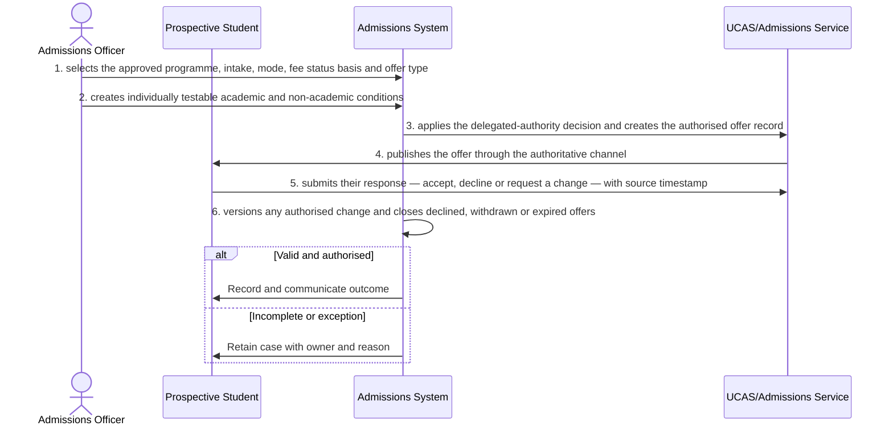

# BP-01-003 — Make and manage an offer

> Status: Draft
> Domain: 01 — Recruitment and admissions
> Owner: TBC
> Version: 0.1
> Last reviewed: 2026-07-26
> Review by: 2027-01-26

[Previous: BP-01-002](../01-recruitment-and-admissions/bp-01-002-assess-an-application.md) · [Domain index](README.md) · [Next: BP-01-004](../01-recruitment-and-admissions/bp-01-004-confirm-offer-conditions.md) · [Library home](../README.md)

## Applicability

| Dimension | Applies |
|---|---|
| Common | UK |
| Nations | England; Scotland; Wales; Northern Ireland |
| Provider types | Providers operating this process; exact regulatory scope is configured |
| Levels and modes | UG; PGT; PGR; full-time; part-time; distance and collaborative provision where relevant |
| Exclusions | Activities outside the stated start/end boundary |

## Traceability

| Type | References |
|---|---|
| Revelation workflows | W001 |
| Reference-model flows | See integration contract catalogue; confirm detailed F-number mapping during architecture review |
| Functional requirements | See functional requirements; detailed mapping remains an SME/architecture review action |
| Data entities | offer, conditions, response and history; supporting identity, evidence, decision and integration-exchange records |
| Domain events | Proposed: `srs.make.and.manage.an.offer.completed` |
| Integration contracts | SRS ↔ UCAS/admissions service; SRS → communications |

## Purpose and outcome

Making and managing an offer turns an authorised admissions decision into a formal offer the applicant can respond to, with any conditions stated in a form that can later be tested individually against evidence. Because an offer may be amended, declined, withdrawn or allowed to expire, the process keeps every version and the applicant's response on record, so the institution and UCAS always agree on the current status of the offer and can explain how it reached that status.

## Scope

**Starts when:** An authorised admissions decision permits an offer.

**Ends when:** The authorised outcome is recorded, communicated and reconciled, or the case is closed with an owned reason.

**In scope:** Intake, validation, evidence, decision, effective dating, communication and downstream reconciliation.

**Out of scope:** Upstream policy creation and later lifecycle processes referenced under Related processes.

## Actors and responsibilities

| Actor/system | Responsibility |
|---|---|
| Admissions Officer | Initiates or owns the principal business action |
| Prospective Student | Provides evidence, decision, system processing or governed support |
| Admissions System | Provides evidence, decision, system processing or governed support |
| UCAS/Admissions Service | Provides evidence, decision, system processing or governed support |

**Accountable owner:** Admissions Officer service owner or delegated authority (TBC)

**System of record:** SRS for the student-record outcome; specialist systems retain their governed source evidence.

## Preconditions

1. Canonical person, programme/period and source identifiers are available where applicable.
2. The current policy/rule version and decision authority are configured.
3. Required interfaces use stable identifiers, provenance and reconciliation controls.

## Trigger

An authorised admissions decision permits an offer.

## Main flow

1. **Admissions Officer** select the approved programme, intake, mode, fee status basis and offer type.
2. **Admissions Officer** create individually testable academic and non-academic conditions.
3. **Admissions System** applies the delegated-authority decision and creates the authorised offer record.
4. **UCAS/Admissions Service** publish the offer through the authoritative channel.
5. **Prospective Student** submits their response — accept, decline or request a change — with source timestamp.
6. **Admissions System** version any authorised change and close declined, withdrawn or expired offers.

## Alternative flows

### A1 — Variant

- **A1.1** An alternative-course or deferred-entry offer requires explicit applicant acceptance.

### A2 — Variant

- **A2.1** A direct offer follows provider response rules without inventing UCAS statuses.

## Exception flows

### E1 — Control exception

- **E1.1** Conflicting responses are quarantined and reconciled with the authoritative channel.

### E2 — Control exception

- **E2.1** An offer change after acceptance requires impact review and a new auditable version.

## Postconditions

### Successful

- The offer, conditions, response and history is authoritative, effective-dated and linked to its evidence and decision authority.
- Each required consumer has acknowledged the correct version or has an owned reconciliation item.

### Unsuccessful or incomplete

- No unapproved outcome is represented as final; the case retains reason, owner and next action.

## Business rules and controls

| ID | Classification | Rule/control | Applicability | Source |
|---|---|---|---|---|
| BR-1 | SECTOR | Apply the current authoritative requirement and provider regulation for the person, level, mode and nation | UK/configured | SRC-051–SRC-053 |
| BR-2 | INSTITUTION | Decision roles, deadlines, evidence and permitted discretion are policy-versioned | Provider | Provider regulations |
| BR-3 | REVELATION | Offer conditions and authoritative response reconciliation need finer-grained records. | Revelation | SRC-015–SRC-019 |
| BR-4 | PROPOSED | Proposed, approved, rejected and superseded states remain distinguishable | Revelation target | Process control |
| BR-5 | PROPOSED | Corrections append provenance and trigger impact/reconciliation; they do not silently overwrite | Revelation target | Data governance |

## National and institutional variations

### England

UCAS cycle rules and provider admissions policy apply; qualification and safeguarding routes may differ by applicant.

### Scotland

Qualifications Scotland result dates, Scottish qualifications and typically four-year degree entry patterns must be configurable.

### Wales

Welsh-language service and communication preferences, Welsh qualifications and provider policy must be preserved.

### Northern Ireland

Northern Ireland qualifications, cross-border applicants and provider admissions policy must be supported.

### Institutional policy points

Terminology, authority, deadlines, evidence, thresholds, communication, appeals/reviews, partner responsibility and target-system ownership.

## Data impact

| Data concept | Action | System of record | Effective/provenance requirement | Sensitivity |
|---|---|---|---|---|
| offer, conditions, response and history | Create/version | SRS or governed specialist source | Policy, actor, evidence, decision and effective/transaction times | Personal; may be sensitive |
| Workflow/case evidence | Append | Owning service | Immutable source and restricted access | Personal/confidential |
| Integration exchange | Append/update | SRS integration ledger | Contract version, correlation, attempts and acknowledgement | Personal |

## Integration impact

| From | To | Information/purpose | Contract/pattern | Failure and reconciliation |
|---|---|---|---|---|
| SRS ↔ UCAS/admissions service | Connected system | decision and reply | Versioned/idempotent contract | Retry, quarantine, acknowledge and reconcile |
| SRS | communications | offer | Versioned/idempotent contract | Retry, quarantine, acknowledge and reconcile |

## Sequence diagram

## Open questions and decisions

| ID | Question/decision | Owner | Status |
|---|---|---|---|
| OQ-1 | Confirm the authoritative owner, workflow boundary and detailed requirement/contract mapping | Process owner/architect | Open |
| OQ-2 | Which national, provider-type and mode variants require configuration? | Four-nation SME | Open |
| OQ-3 | Which evidence stays in a specialist system and what minimum outcome enters the SRS? | Data protection/data owner | Open |

## Sources

| Source | Supported content |
|---|---|
| [SRC-051–SRC-053](../source-register.md) | External process, regulatory or sector evidence |
| [SRC-015–SRC-019](../source-register.md) | Revelation workflows, actors, contracts, data and requirements |

## Related processes

[Process inventory](../process-inventory.md); adjacent lifecycle processes in the [process map](../process-map.md).

## Review record

| Review | Reviewer | Date | Outcome |
|---|---|---|---|
| Research/documentation | Codex implementation role | 2026-07-26 | Drafted |
| Required reviews | Process, national, data and integration SMEs (TBC) | — | Pending |

## Change history

| Version | Date | Author | Change |
|---|---|---|---|
| 0.1 | 2026-07-26 | Codex | Initial research draft |
