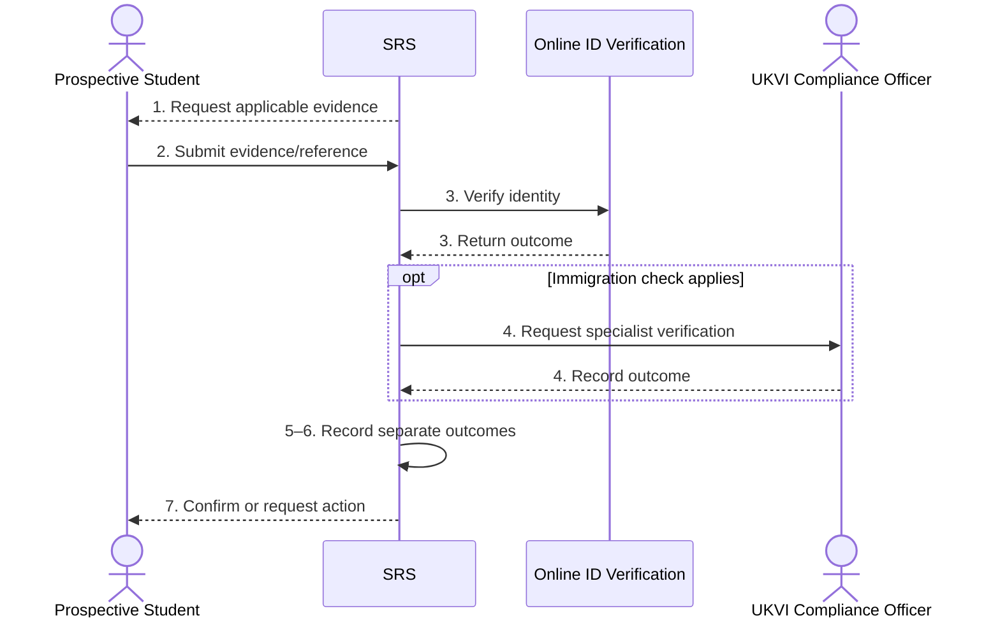

# BP-009 — Verify identity, nationality and right to study

> Status: Draft
> Domain: 02 — Registration and student status
> Owner: TBC
> Version: 0.1
> Last reviewed: 2026-07-26
> Review by: 2026-10-26

[Previous: BP-008](bp-008-prepare-initial-registration.md) · [Domain index](README.md) · [Next: BP-010](bp-010-complete-initial-academic-registration.md) · [Library home](../README.md)

## Applicability

| Dimension | Applies |
|---|---|
| Common | UK identity assurance core |
| Nations | England; Scotland; Wales; Northern Ireland |
| Provider types | All; sponsor duties apply only to relevant licensed sponsors/students |
| Levels and modes | All |
| Exclusions | Employment right-to-work checks |

## Traceability

| Type | References |
|---|---|
| Revelation workflows | W001/W012 partial |
| Reference-model flows | F025–F026, F051–F052 |
| Functional requirements | SID identity requirements; UKV regulatory requirements |
| Data entities | `person_identity`, `identity_verification_check`, `student_document`, `visa_status`, `sponsor_evidence_record` |
| Domain events | `srs.identity.verification-requested`, `srs.identity.verification-completed` |
| Integration contracts | `identity-verification-request.v1`, `identity-verification-outcome.v1`, `ukvi-sponsor-compliance.v1` |

## Purpose and outcome

This process verifies that the person registering is the person represented in the student record and, where immigration control applies, records whether current evidence permits the intended study. Identity assurance and immigration permission are related but distinct checks with different evidence, access and review obligations.

## Scope

**Starts when:** Registration requires identity and/or immigration evidence.

**Ends when:** Verification is approved, rejected, expired/pending, or routed to specialist review.

**In scope:** Documentary/digital identity, nationality, immigration permission and sponsored-student evidence.

**Out of scope:** CAS assignment, fee-status assessment and employment checks.

## Actors and responsibilities

| Actor/system | Responsibility |
|---|---|
| Prospective Student | Supplies authentic evidence/share code and attends where required |
| Registry Administrator | Completes general identity assurance |
| UKVI Compliance Officer | Evaluates immigration/sponsor evidence |
| Online ID Verification | Returns verification result where configured |
| SRS | Stores minimal outcome, evidence reference, validity and audit |

**Accountable owner:** Registry/immigration compliance owner (TBC)

**System of record:** SRS for provider verification outcome; UKVI for immigration status; document store for governed evidence.

## Preconditions

1. Person and intended programme/intake exist.
2. Required evidence set is derived without using fee status as a substitute for nationality/immigration status.
3. Accessible/manual routes exist where automated verification is unsuitable.

## Trigger

The student begins identity checks or a prior verification expires/changes.

## Main flow

1. **SRS** determines the identity evidence and, where applicable, immigration check required.
2. **Prospective Student** submits the requested evidence or share code through the approved channel.
3. **Registry Administrator/Online ID Verification** verifies identity, authenticity and match to the person record.
4. Where applicable, **UKVI Compliance Officer** verifies immigration permission, study conditions and sponsor evidence.
5. **SRS** records separate identity and right-to-study outcomes, evidence references, checker/method, checked/expiry dates and restrictions.
6. **SRS** permits BP-010 when required checks pass and schedules recheck where time-limited.
7. **SRS** notifies the student of completion or specific next action.

## Alternative flows

### A2 — Digital immigration status

- **A2.1** Verify current status through the approved UKVI mechanism and retain the minimum evidence/reference.

### A3 — Distance learner or inaccessible automated route

- **A3.1** Use an approved remote/manual equivalent and record method/authority.

### A4 — Not subject to immigration control

- **A4.1** Complete identity assurance and record immigration check as not applicable with basis.

## Exception flows

### E3 — Possible fraud or mismatch

- **E3.1** Stop automatic registration, restrict disclosure and route securely to trained staff/BP-058.

### E4 — Permission missing, expired or incompatible

- **E4.1** Do not declare the student eligible; record specialist decision/action and review route.

## Postconditions

### Successful

- Identity and applicable immigration outcomes are current, separate and auditable.

### Unsuccessful or incomplete

- Academic registration remains blocked or conditional under authorised policy; evidence is protected.

## Business rules and controls

| ID | Classification | Rule/control | Applicability | Source |
|---|---|---|---|---|
| BR-1 | SECTOR | Providers verify new-student identity before full registration | UK | SRC-031–SRC-036 |
| BR-2 | MANDATED | Licensed sponsors must meet current record-keeping/reporting duties | UK; applicable sponsored students | SRC-001–SRC-002 |
| BR-3 | INSTITUTIONAL | Providers may verify wider student identity for security/data quality | UK | SRC-031–SRC-036 |
| BR-4 | PROPOSED | Store outcomes and governed evidence references, not unnecessary document copies in core tables | Revelation | Privacy control |

## National and institutional variations

### England

Provider identity methods vary; immigration duties are UK-wide, while OfS evidence considerations are England-specific.

### Scotland

Identity/visa verification may be a component of matriculation and separate visa registration.

### Wales

Providers may require pre-enrolment immigration checks and share codes before questionnaire access.

### Northern Ireland

Providers may combine identity/qualification verification with an onsite registration check.

### Institutional policy points

Evidence sets, in-person/remote method, verifier authority, document retention, recheck triggers and failure route.

## Data impact

| Data concept | Action | System of record | Effective/provenance requirement | Sensitivity |
|---|---|---|---|---|
| Identity outcome | Create/version | SRS | Method/checker/date/evidence ref | Sensitive |
| Immigration outcome | Create/version | SRS/UKVI | Permission/restrictions/expiry | Sensitive/regulatory |
| Evidence | Store/reference | EDRMS/verification service | Access audit/retention | Highly sensitive |

## Integration impact

| From | To | Information/purpose | Contract/pattern | Failure and reconciliation |
|---|---|---|---|---|
| SRS | Online ID Verification | Verification request | Existing identity contracts | Manual fallback/replay |
| SRS | UKVI mechanisms | Status/sponsor evidence | Approved UKVI pattern | Specialist reconciliation |

## Sequence diagram

## Open questions and decisions

| ID | Question/decision | Owner | Status |
|---|---|---|---|
| OQ-1 | Canonical evidence retention and automated-biometric governance? | DPO/security owner | Open |

## Sources

| Source | Supported content |
|---|---|
| [SRC-001–SRC-002, SRC-031–SRC-036](../source-register.md) | Sponsor and provider verification practices |
| [SRC-015–SRC-019](../source-register.md) | Revelation baseline |

## Related processes

[BP-008](bp-008-prepare-initial-registration.md); [BP-010](bp-010-complete-initial-academic-registration.md); BP-052; BP-058.

## Review record

| Review | Reviewer | Date | Outcome |
|---|---|---|---|
| Research/documentation | Codex implementation role | 2026-07-26 | Drafted |
| Required reviews | TBC | — | Pending |

## Change history

| Version | Date | Author | Change |
|---|---|---|---|
| 0.1 | 2026-07-26 | Codex | Initial draft |

