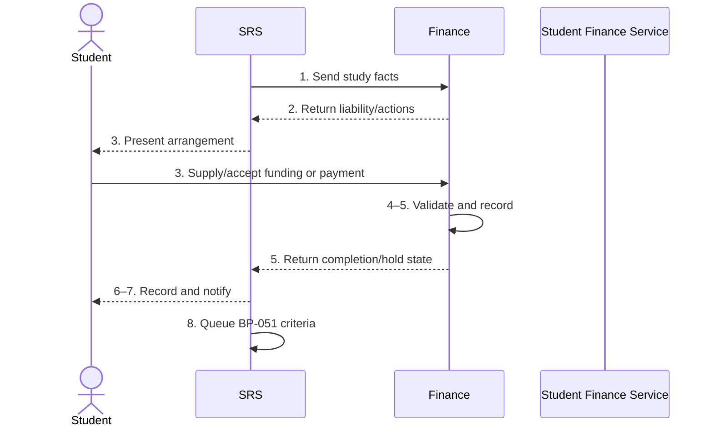

# BP-011 — Complete financial registration

> Status: Draft
> Domain: 02 — Registration and student status
> Owner: TBC
> Version: 0.1
> Last reviewed: 2026-07-26
> Review by: 2027-01-26

[Previous: BP-010](bp-010-complete-initial-academic-registration.md) · [Domain index](README.md) · [Next: BP-012](bp-012-activate-access-and-entitlements.md) · [Library home](../README.md)

## Applicability

| Dimension | Applies |
|---|---|
| Common | UK outcome; scheme details vary |
| Nations | England; Scotland; Wales; Northern Ireland |
| Provider types | All charging/recording fees or sponsorship |
| Levels and modes | All |
| Exclusions | Student-finance attendance confirmation itself (BP-051) |

## Traceability

| Type | References |
|---|---|
| Revelation workflows | W001 partial |
| Reference-model flows | F009–F010, F049–F050 |
| Functional requirements | ENR-003, ENR-005–ENR-006; FIN and SLC requirements |
| Data entities | `fee_liability`, `payment_confirmation`, `student_hold`, `slc_entitlement`, `slc_notification` |
| Domain events | Fee-liability update is documented but in event backlog |
| Integration contracts | `finance-fee-liability.v1`, `finance-payment-and-hold.v1`, `slc-enrolment-exchange.v1` |

## Purpose and outcome

Financial registration establishes the fee liability, payer/funding source and acceptable payment/sponsorship arrangement for the study period. It records whether the provider's financial stage is complete without treating a student-finance application or expected funding as cash received.

## Scope

**Starts when:** Programme, mode, fee status and academic registration facts permit liability calculation.

**Ends when:** Arrangement is confirmed, waived/not applicable, or held for finance action.

**In scope:** Self-funded, sponsor, scholarship/bursary and SLC/SAAS/SFW/SFNI-supported routes.

**Out of scope:** Fee-status assessment policy, payment collection engine and attendance confirmation.

## Actors and responsibilities

| Actor/system | Responsibility |
|---|---|
| Enrolled Student | Supplies funding/payer information and accepts arrangement |
| Finance Administrator | Validates liability, sponsorship and exceptions |
| SRS | Supplies authoritative study facts and records stage outcome |
| Finance | Calculates/holds account and payment facts |
| Student Finance Service | Holds scheme entitlement/payment state |

**Accountable owner:** Finance/Registry joint owner (TBC)

**Systems of record:** SRS for study facts; Finance for liability/account/payment; finance body for entitlement.

## Preconditions

1. Programme/mode/dates and fee-status decision exist.
2. Applicable fee schedule and funding-source codes are effective.
3. Student finance/sponsor references can be matched.

## Trigger

Academic registration or provider-defined precondition opens financial registration.

## Main flow

1. **SRS** sends programme, mode, dates and fee-status facts to Finance.
2. **Finance** calculates liability and returns amount, payer/funding expectations and required actions.
3. **Student** reviews the liability and supplies/accepts payment, sponsorship or funding arrangement.
4. **Finance Administrator** validates sponsor evidence, exceptions and mismatches.
5. **Finance** records the authoritative arrangement and returns completion/hold state.
6. **SRS** records financial-registration outcome and links the Finance reference without duplicating payment ledger detail.
7. **SRS** notifies the student and enables BP-012 subject to provider policy.
8. Applicable student-finance confirmation remains queued for BP-051 at the correct evidence point.

## Alternative flows

### A3 — Student finance expected

- **A3.1** Match scheme/application reference and record expected payer.
- **A3.2** Do not mark external registration/attendance confirmed until BP-051 criteria are met.

### A3b — External sponsor/scholarship

- **A3b.1** Validate authority, amount/period and residual student liability.

### A5 — Academic registration allowed with finance action pending

- **A5.1** Record separate academic and financial states; apply only published, proportionate holds.

## Exception flows

### E2 — Liability dispute or source fact mismatch

- **E2.1** Preserve both source references and route correction to Finance or BP-013/BP-059.

### E5 — Finance integration unavailable

- **E5.1** Retain pending state; do not infer debt or payment and provide an assisted route.

## Postconditions

### Successful

- Authoritative liability and funding arrangement are linked; stage outcome is explicit.

### Unsuccessful or incomplete

- Pending action/hold is owned and distinct from academic registration.

## Business rules and controls

| ID | Classification | Rule/control | Applicability | Source |
|---|---|---|---|---|
| BR-1 | SECTOR | Providers commonly require fee payment, plan, sponsor or funding evidence | UK | SRC-006, SRC-014, SRC-031, SRC-034, SRC-036–SRC-037 |
| BR-2 | INSTITUTIONAL | Whether financial registration blocks academic status/access varies | UK | Same sources |
| BR-3 | MANDATED/contractual | Student-finance payment requires applicable provider confirmations | Relevant schemes | SRC-003–SRC-005 |
| BR-4 | PROPOSED | SRS stores outcome/reference; Finance remains authoritative for ledger facts | Revelation | Architecture principle |

## National and institutional variations

### England

Student Finance England is one funding route; provider fee/debt policy controls the institutional stage.

### Scotland

SAAS and other funding arrangements apply; academic and financial registration may be distinct.

### Wales

Student Finance Wales and provider payment/sponsorship arrangements apply.

### Northern Ireland

Student Finance NI and provider financial-registration/payment-plan steps apply.

### Institutional policy points

Blocking holds, deposit/payment thresholds, sponsor evidence, instalments, exceptions and activation consequences.

## Data impact

| Data concept | Action | System of record | Effective/provenance requirement | Sensitivity |
|---|---|---|---|---|
| Fee liability/arrangement | Create/update | Finance | Study source version and period | Financial |
| Financial-registration state | Create | SRS | Finance reference/time | Financial |
| Funding entitlement | Read/reference | Scheme service | Scheme/application reference | Financial |

## Integration impact

| From | To | Information/purpose | Contract/pattern | Failure and reconciliation |
|---|---|---|---|---|
| SRS | Finance | Study/liability facts | `finance-fee-liability.v1` | Replay current snapshot |
| Finance | SRS | Payment/hold state | `finance-payment-and-hold.v1` | Source-owned correction |
| SRS | SLC | Later controlled confirmation | BP-051 contract | Separate worklist |

## Sequence diagram

## Open questions and decisions

| ID | Question/decision | Owner | Status |
|---|---|---|---|
| OQ-1 | Add explicit academic/financial registration sub-statuses? | Data/product owner | Open |

## Sources

| Source | Supported content |
|---|---|
| [SRC-003–SRC-006, SRC-014, SRC-031, SRC-034, SRC-036–SRC-037](../source-register.md) | Finance/funding patterns |
| [SRC-015–SRC-019](../source-register.md) | Revelation baseline |

## Related processes

[BP-010](bp-010-complete-initial-academic-registration.md); [BP-012](bp-012-activate-access-and-entitlements.md); BP-051.

## Review record

| Review | Reviewer | Date | Outcome |
|---|---|---|---|
| Research/documentation | Codex implementation role | 2026-07-26 | Drafted |
| Required reviews | TBC | — | Pending |

## Change history

| Version | Date | Author | Change |
|---|---|---|---|
| 0.1 | 2026-07-26 | Codex | Initial draft |
