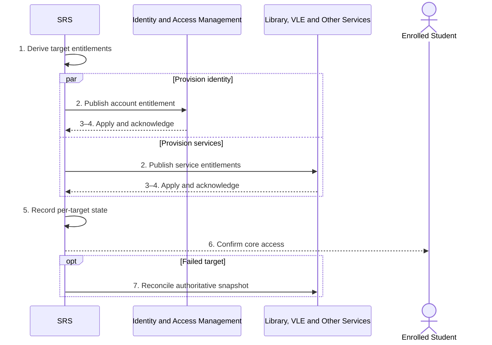

# BP-012 — Activate student access and entitlements

> Status: Draft
> Domain: 02 — Registration and student status
> Owner: TBC
> Version: 0.1
> Last reviewed: 2026-07-26
> Review by: 2027-01-26

[Previous: BP-011](bp-011-complete-financial-registration.md) · [Domain index](README.md) · [Next: BP-013](bp-013-transfer-programme-route-or-mode.md) · [Library home](../README.md)

## Applicability

| Dimension | Applies |
|---|---|
| Common | UK |
| Nations | England; Scotland; Wales; Northern Ireland |
| Provider types | All with integrated services |
| Levels and modes | All; entitlements vary by mode/location |
| Exclusions | Access unrelated to student status |

## Traceability

| Type | References |
|---|---|
| Revelation workflows | W001 partial |
| Reference-model flows | F008, F012, F014–F015, F017, F021, F041 |
| Functional requirements | EWP, LIB, ATT, VLE, IAM and related integration requirements |
| Data entities | `enrolment`, `account_access_state`, `module_registration`, `student_timetable_entry`, `integration_exchange` |
| Domain events | `srs.student.enrolled` and registration/module events |
| Integration contracts | IAM, Library, VLE, attendance, timetable, portal and CMS contracts |

## Purpose and outcome

This process translates authoritative registered status and confirmed study scope into least-privilege access and service entitlements. It records each target independently so one failure does not erase registration or conceal partial provisioning.

## Scope

**Starts when:** Academic registration and provider-defined activation conditions are satisfied.

**Ends when:** All applicable targets acknowledge or have owned reconciliation exceptions.

**In scope:** Identity account, portal, library, VLE, timetable/attendance and related service access.

**Out of scope:** Module selection decision and financial/regulatory payment release.

## Actors and responsibilities

| Actor/system | Responsibility |
|---|---|
| Enrolled Student | Uses access and reports missing/incorrect service |
| SRS | Derives authoritative entitlement worklist |
| Identity and Access Management | Provisions identity/account roles |
| Library, VLE and Other Services | Apply service-specific entitlement |
| Integration Administrator | Resolves failed/orphan provisioning |

**Accountable owner:** Integration/service ownership group (TBC)

**System of record:** SRS for student status/registration; target systems for applied access state.

## Preconditions

1. Authoritative enrolment exists.
2. Activation policy identifies applicable services and minimum data.
3. Contracts, idempotency keys and reconciliation routes exist.

## Trigger

Registration/financial condition or module-registration event makes an entitlement effective.

## Main flow

1. **SRS** derives target services and effective entitlements from enrolment, mode, location, programme and confirmed module registrations.
2. **SRS** publishes minimal versioned entitlement messages with stable idempotency keys.
3. Each **Target System** validates and applies the requested state.
4. Each **Target System** returns acknowledgement/current state.
5. **SRS** records per-target outcome and exposes overall provisioning status without treating partial success as complete.
6. **SRS** notifies the student when core access is ready and provides a support route.
7. **Integration Administrator** reconciles pending/failed targets from authoritative snapshots.

## Alternative flows

### A1 — Limited pre-registration access already exists

- **A1.1** Upgrade the existing identity rather than creating a duplicate account.

### A1b — Distance, partner, placement or interruption variant

- **A1b.1** Apply the service matrix for actual mode/location; do not grant campus/course access by default.

### A5 — Module access pending

- **A5.1** Activate base services and wait for BP-025 before module-specific VLE/roster access.

## Exception flows

### E3 — Target rejects or cannot match identity

- **E3.1** Retain registered status, queue repair and resolve identity mapping without asking the student to re-register.

### E3b — Duplicate/orphan account

- **E3b.1** Stop unsafe provisioning, reconcile through BP-058 and record corrective action.

## Postconditions

### Successful

- Applicable access states match authoritative status and are acknowledged.

### Unsuccessful or incomplete

- Each missing target has an owner/retry state; academic registration remains intact.

## Business rules and controls

| ID | Classification | Rule/control | Applicability | Source |
|---|---|---|---|---|
| BR-1 | SECTOR | Registration commonly enables teaching, digital, library, timetable and document services | UK | SRC-006, SRC-014, SRC-031, SRC-034, SRC-036–SRC-037 |
| BR-2 | PROPOSED | Entitlements are least-privilege, effective-dated and per-target reconciled | Revelation | Integration architecture |
| BR-3 | REVELATION | Current contracts cover IAM, Library, VLE, attendance and portal boundaries | Revelation | SRC-017 |

## National and institutional variations

### England

No single national service matrix; provider/IAM policy governs access.

### Scotland

Matriculation/course-enrolment stages may activate different services.

### Wales

Provider enrolment may gate ID cards, timetable, learning resources and certificates.

### Northern Ireland

Online/onsite registration completion may gate ID and facilities.

### Institutional policy points

Core-ready definition, finance holds, partner services, alumni/placement access, target SLA and support routing.

## Data impact

| Data concept | Action | System of record | Effective/provenance requirement | Sensitivity |
|---|---|---|---|---|
| Entitlement intent | Derive/report | SRS | Source enrolment/module version | Personal |
| Applied account state | Receive | Target/IAM | Target ref/time/status | Sensitive |
| Integration exchange | Append | SRS | Attempts/ack/reconciliation | Sensitive |

## Integration impact

| From | To | Information/purpose | Contract/pattern | Failure and reconciliation |
|---|---|---|---|---|
| SRS | IAM/Library/VLE/Attendance/Portal | Effective entitlement | Existing contracts | Retry/DLQ/snapshot |
| Target systems | SRS | Applied state | Acknowledgement/feedback | High-water mark reconciliation |

## Sequence diagram

## Open questions and decisions

| ID | Question/decision | Owner | Status |
|---|---|---|---|
| OQ-1 | Define canonical entitlement policy matrix and core-ready threshold? | Integration/product owner | Open |

## Sources

| Source | Supported content |
|---|---|
| [SRC-006, SRC-014, SRC-031, SRC-034, SRC-036–SRC-037](../source-register.md) | Access consequences |
| [SRC-015–SRC-019](../source-register.md) | Revelation baseline |

## Related processes

[BP-010](bp-010-complete-initial-academic-registration.md); [BP-011](bp-011-complete-financial-registration.md); BP-025; [BP-019](bp-019-close-leaver-record.md).

## Review record

| Review | Reviewer | Date | Outcome |
|---|---|---|---|
| Research/documentation | Codex implementation role | 2026-07-26 | Drafted |
| Required reviews | TBC | — | Pending |

## Change history

| Version | Date | Author | Change |
|---|---|---|---|
| 0.1 | 2026-07-26 | Codex | Initial draft |
