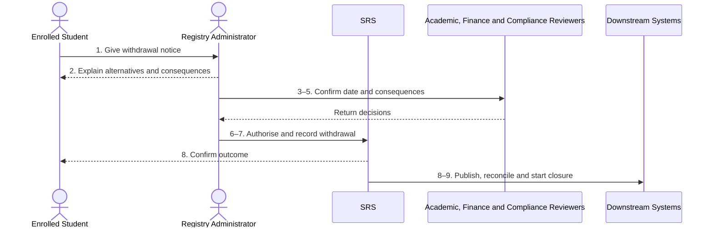

# BP-016 — Withdraw from studies

> Status: Draft
> Domain: 02 — Registration and student status
> Owner: TBC
> Version: 0.1
> Last reviewed: 2026-07-26
> Review by: 2027-01-26

[Previous: BP-015](bp-015-return-from-interruption.md) · [Domain index](README.md) · [Next: BP-017](bp-017-complete-annual-re-registration.md) · [Library home](../README.md)

## Applicability

| Dimension | Applies |
|---|---|
| Common | UK |
| Nations | England; Scotland; Wales; Northern Ireland |
| Provider types | All |
| Levels and modes | UG; PGT; PGR; all modes |
| Exclusions | Award completion and provider-to-provider transfer intake |

## Traceability

| Type | References |
|---|---|
| Revelation workflows | W007 partial |
| Reference-model flows | F006–F010, F015, F021, F023, F037, F049, F051 |
| Functional requirements | ENR-002–ENR-003, ENR-006; regulatory and audit requirements |
| Data entities | `enrolment`, `fee_liability`, `student_obligation`, `slc_notification`, `ukvi_compliance_case`, `student_document` |
| Domain events | `srs.student.status-changed` |
| Integration contracts | Finance, CRM, Library, VLE, IAM, SLC, UKVI and EDRMS contracts |

## Purpose and outcome

This process ends an enrolment through a voluntary or authorised institutional decision, with an evidenced effective date and clear academic, fee, funding, immigration, access and record consequences. It protects prior achievement and determines whether an exit award/transcript review is required.

## Scope

**Starts when:** The student gives clear notice or an authorised institutional process supplies a withdrawal outcome.

**Ends when:** Withdrawal is recorded/notified and closure work passes to BP-019.

**In scope:** Voluntary, non-registration, non-engagement and institution-required outcomes after due process.

**Out of scope:** The underlying disciplinary/fitness/appeal process and graduation.

## Actors and responsibilities

| Actor/system | Responsibility |
|---|---|
| Enrolled Student | Gives informed notice where voluntary |
| Academic, Finance and Compliance Reviewers | Provide advice and confirm academic, finance and sponsor context |
| Registry Administrator | Verifies authority/effective date and records outcome |
| SRS | Versions status and coordinates downstream closure |
| Downstream Systems | Apply authorised finance, sponsor, award and entitlement changes |

**Accountable owner:** Registry owner (TBC)

**System of record:** SRS for withdrawal; Finance/regulatory systems for their resulting decisions.

## Preconditions

1. Identity and authority of the requester/decision are verified.
2. Advice, alternatives and consequences are available.
3. The effective date can be supported by notice, engagement and policy evidence.

## Trigger

Voluntary notice or authorised institutional outcome.

## Main flow

1. **Student or authorised decision-maker** submits withdrawal outcome and proposed effective date.
2. **Registry Administrator** confirms informed intent/authority and explains alternatives, academic record, fees, funding, visa and service consequences.
3. **Registry Administrator** establishes the effective date from applicable policy and evidence; retrospective dates require explicit authority.
4. **Academic Approver** identifies completed credit, pending assessments and exit-award/ transcript treatment.
5. **Finance Administrator** recalculates liability and **UKVI Compliance Officer** determines sponsor action where applicable.
6. **Registry Administrator** authorises withdrawal.
7. **SRS** creates a `withdrawn` enrolment version with reason category, authority and effective date, preserving prior academic facts.
8. **SRS** notifies the student and publishes applicable SLC, UKVI, Finance, IAM, Library, VLE and CRM changes.
9. **SRS** records acknowledgements and starts BP-019.

## Alternative flows

### A1 — Institution-required withdrawal

- **A1.1** Reference the completed authorised process and review/appeal rights.
- **A1.2** Do not expose or duplicate unnecessary case evidence in the enrolment record.

### A2 — Student chooses interruption

- **A2.1** If viable and requested, stop withdrawal and continue under BP-014.

### A4 — Exit award possible

- **A4.1** Route achieved credit through the applicable board/award process before issuing documents.

## Exception flows

### E1 — Ambiguous intent or third-party request

- **E1.1** Do not withdraw; verify direct authority or a valid representative basis.

### E3 — Effective date disputed

- **E3.1** Retain proposed dates/evidence and route for authorised decision/review.

### E8 — Regulatory exchange rejected

- **E8.1** Retain provider outcome, repair/replay the message and reconcile the external record.

## Postconditions

### Successful

- Withdrawal is effective-dated, auditable and communicated.
- Prior results/credits remain intact.
- Closure, exit-award and downstream tasks are owned.

### Unsuccessful or incomplete

- Existing status remains until authority and intent/date are resolved.

## Business rules and controls

| ID | Classification | Rule/control | Applicability | Source |
|---|---|---|---|---|
| BR-1 | SECTOR | Providers advise on alternatives and academic/financial consequences | UK | SRC-020–SRC-025 |
| BR-2 | INSTITUTIONAL | Effective-date and fee rules vary and must be published | UK | SRC-020, SRC-023–SRC-025 |
| BR-3 | MANDATED/contractual | Applicable SLC and sponsor changes must be reported | Applicable students | SRC-001–SRC-003 |
| BR-4 | PROPOSED | A status-ending decision requires explicit authority and reason; no destructive overwrite | Revelation | SRC-018 |

## National and institutional variations

### England

Provider withdrawal and fee policies govern dates; Student Finance England reporting is separate.

### Scotland

Withdrawal is distinct from authorised interruption; PGR and sponsor processes may differ.

### Wales

Welsh examples state that notice/effective dates, partner reporting and exit awards require explicit treatment.

### Northern Ireland

Temporary and permanent withdrawal are distinct; provider contact/due-process rules govern presumed withdrawal.

### Institutional policy points

Notice method, cooling-off/advice, retrospective date, fee liability, exit award, appeal and access end dates.

## Data impact

| Data concept | Action | System of record | Effective/provenance requirement | Sensitivity |
|---|---|---|---|---|
| Enrolment | Version withdrawn | SRS | Effective/recorded date, authority, category | Sensitive |
| Academic history | Preserve/read | SRS | No deletion/rewrite | Sensitive |
| Fee/funding/sponsor | Update/report | Owning systems | Message evidence and acknowledgement | Regulatory |

## Integration impact

| From | To | Information/purpose | Contract/pattern | Failure and reconciliation |
|---|---|---|---|---|
| SRS | Finance/SLC/UKVI | Status/effective date | Existing contracts | Validate/replay |
| SRS | IAM/Library/VLE/CRM | End/change entitlement | Existing contracts | Snapshot reconcile |
| SRS | EDRMS | Archive final documents | Existing contract | Retry/confirmation |

## Sequence diagram

## Open questions and decisions

| ID | Question/decision | Owner | Status |
|---|---|---|---|
| OQ-1 | Separate voluntary/institutional withdrawal workflows and reason visibility? | Registry/product/DPO | Open |

## Sources

| Source | Supported content |
|---|---|
| [SRC-020–SRC-025](../source-register.md) | Four-nation withdrawal rules/patterns |
| [SRC-001–SRC-003, SRC-015–SRC-019](../source-register.md) | Regulatory/Revelation baseline |

## Related processes

[BP-014](bp-014-interrupt-or-suspend-studies.md); [BP-018](bp-018-resolve-failure-to-register.md); [BP-019](bp-019-close-leaver-record.md); BP-046.

## Review record

| Review | Reviewer | Date | Outcome |
|---|---|---|---|
| Research/documentation | Codex implementation role | 2026-07-26 | Drafted |
| Required reviews | TBC | — | Pending |

## Change history

| Version | Date | Author | Change |
|---|---|---|---|
| 0.1 | 2026-07-26 | Codex | Initial draft |
