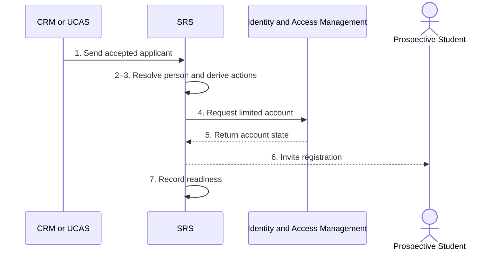

# BP-02-001 — Prepare a student for initial registration

> Status: Draft
> Domain: 02 — Registration and student status
> Owner: TBC
> Version: 0.1
> Last reviewed: 2026-07-26
> Review by: 2027-01-26

[Domain index](README.md) · [Next: BP-02-002](bp-02-002-verify-identity-and-right-to-study.md) · [Library home](../README.md)

## Applicability

| Dimension | Applies |
|---|---|
| Common | UK |
| Nations | England; Scotland; Wales; Northern Ireland |
| Provider types | All, including partner-delivered provision |
| Levels and modes | UG; PGT; PGR; all modes |
| Exclusions | Annual re-registration |

## Traceability

| Type | References |
|---|---|
| Revelation workflows | W001 partial |
| Reference-model flows | F-CRM-SIS-01, F-SIS-IAM-01, F-SIS-OIV-01, F-UCAS-SIS-01 |
| Functional requirements | SID-001 onward; ENR-001, ENR-007, ENR-009 |
| Data entities | `person`, `person_identity`, `student_application`, `admissions_offer`, `student_obligation`, `identity_verification_check` |
| Domain events | `srs.student.created`, identity verification events |
| Integration contracts | CRM/UCAS admissions, IAM provisioning and identity-verification contracts |

## Purpose and outcome

Before a newly accepted applicant can actually register, the institution needs their identity resolved, a limited pre-registration account set up, and a clear checklist of what still has to happen — proving identity, sorting out finance, accepting declarations — before registration can complete. This process does that preparatory work and builds the checklist, but does not itself make the person a registered student: that only happens once every required action (identity verification, academic registration, financial registration) is separately completed in the processes that follow.

## Scope

**Starts when:** An accepted offer is confirmed for an approaching intake.

**Ends when:** A registration worklist and secure access route exist, or the case is held for resolution.

**In scope:** UCAS/direct, taught/research and partner applicants.

**Out of scope:** Identity approval (BP-02-002), academic registration (BP-02-003), financial registration (BP-02-004).

## Actors and responsibilities

| Actor/system | Responsibility |
|---|---|
| Prospective Student | Activates secure account and receives actions |
| Registry Administrator | Owns registration readiness/exceptions |
| SRS | Resolves identity and creates registration worklist |
| CRM or UCAS | Supplies accepted application/offer outcome |
| Identity and Access Management | Creates controlled pre-registration access |

**Accountable owner:** Registry/admissions hand-off owner (TBC)

**System of record:** Admissions source for offer; SRS for person/registration readiness; IAM for credentials.

## Preconditions

1. Accepted offer, programme, intake and applicant reference exist.
2. The registration period and required action rules are configured.
3. Identity matching and duplicate-resolution controls are available.

## Trigger

Accepted applicant reaches the provider's registration preparation point.

## Main flow

1. **Admissions source** sends the accepted offer, applicant identity, programme, intake and source reference to the SRS.
2. **SRS** validates the hand-off and matches or creates the root person without duplicating an existing identity.
3. **SRS** creates a prospective registration context and derives required actions from programme, domicile, delivery mode, funding and immigration indicators.
4. **SRS** requests a limited pre-registration account from **Identity and Access Management**.
5. **Identity and Access Management** returns the account reference/state.
6. **SRS** invites the **Prospective Student** through a verified contact route and displays applicable deadlines/actions.
7. **SRS** records delivery/account acknowledgement and makes the case ready for BP-02-002–BP-02-004.

## Alternative flows

### A2 — Existing or concurrent student

- **A2.1** Link the accepted offer to the existing person after identity resolution.
- **A2.2** Preserve concurrent enrolment/application facts; do not overwrite an existing programme.

### A3 — Partner-delivered provision

- **A3.1** Apply the agreement-defined registration owner and require partner evidence through an auditable hand-off.

## Exception flows

### E1 — Invalid/incomplete admissions hand-off

- **E1.1** Reject/quarantine the message, retain the prior source state and return validation details.

### E2 — Possible duplicate identity

- **E2.1** Route to BP-08-001; do not issue a second permanent identity.

## Postconditions

### Successful

- One resolved person, intended programme/intake, action worklist and limited account exist.

### Unsuccessful or incomplete

- No enrolment is asserted; the source issue has an owner.

## Business rules and controls

| ID | Classification | Rule/control | Applicability | Source |
|---|---|---|---|---|
| BR-1 | SECTOR | Providers commonly issue credentials and pre-registration tasks before formal registration | UK | SRC-031, SRC-034, SRC-036–SRC-037 |
| BR-2 | PROPOSED | Pre-registration access does not constitute academic registration | Revelation | Process boundary |
| BR-3 | REVELATION | W001 combines this hand-off with later enrolment states | Revelation | SRC-015 |

## National and institutional variations

### England

Provider processes determine preparation stages; OfS registration does not prescribe one student journey.

### Scotland

Preparation may lead into a wider matriculation process.

### Wales

Enrolment preparation may combine account creation, pre-checks and a later questionnaire.

### Northern Ireland

Providers may require online registration followed by an onsite check.

### Institutional policy points

Invitation timing, credential strength, action derivation, partner responsibility and late-arrival handling.

## Data impact

| Data concept | Action | System of record | Effective/provenance requirement | Sensitivity |
|---|---|---|---|---|
| Person/application link | Create/link | SRS/admissions source | Source reference and match evidence | Personal |
| Registration worklist | Create | SRS | Rules/version and status | Personal |
| Pre-registration account | Report | IAM | Limited entitlement and acknowledgement | Personal |

## Integration impact

| From | To | Information/purpose | Contract/pattern | Failure and reconciliation |
|---|---|---|---|---|
| CRM/UCAS | SRS | Accepted applicant | Existing admissions contracts | Validation and replay |
| SRS | IAM | Limited account | `iam-account-provisioning.v1` | Idempotent retry/reconcile |

## Sequence diagram

## Open questions and decisions

| ID | Question/decision | Owner | Status |
|---|---|---|---|
| OQ-1 | Explicit registration-case/worklist entity required? | Data/product owner | Open |

## Sources

| Source | Supported content |
|---|---|
| [SRC-031, SRC-033–SRC-037](../source-register.md) | Four-nation preparation patterns |
| [SRC-015–SRC-019](../source-register.md) | Revelation baseline |

## Related processes

BP-01-007; [BP-02-002](bp-02-002-verify-identity-and-right-to-study.md); BP-02-003; BP-02-004.

## Review record

| Review | Reviewer | Date | Outcome |
|---|---|---|---|
| Research/documentation | Codex implementation role | 2026-07-26 | Drafted |
| Required reviews | TBC | — | Pending |

## Change history

| Version | Date | Author | Change |
|---|---|---|---|
| 0.1 | 2026-07-26 | Codex | Initial draft |
