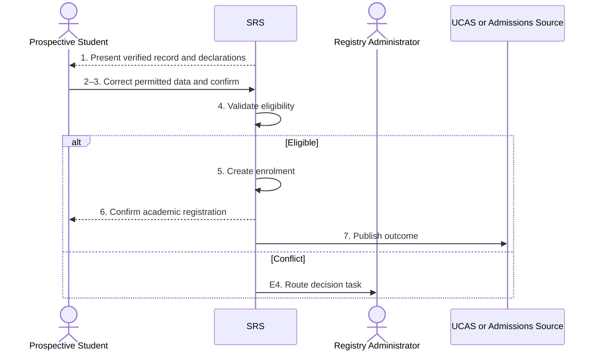

# BP-02-003 — Complete initial academic registration

> Status: Draft
> Domain: 02 — Registration and student status
> Owner: TBC
> Version: 0.1
> Last reviewed: 2026-07-26
> Review by: 2027-01-26

[Previous: BP-02-002](bp-02-002-verify-identity-and-right-to-study.md) · [Domain index](README.md) · [Next: BP-02-004](bp-02-004-complete-financial-registration.md) · [Library home](../README.md)

## Applicability

| Dimension | Applies |
|---|---|
| Common | UK |
| Nations | England; Scotland; Wales; Northern Ireland |
| Provider types | All |
| Levels and modes | UG; PGT; PGR; all modes |
| Exclusions | Annual re-registration |

## Traceability

| Type | References |
|---|---|
| Revelation workflows | W001 |
| Reference-model flows | F005, F011, F045–F046 |
| Functional requirements | ENR-001, ENR-004, ENR-008–ENR-010 |
| Data entities | `person`, `enrolment`, `programme_route`, `student_address`, `student_contact_method`, `student_obligation` |
| Domain events | `srs.student.created`, `srs.student.enrolled` |
| Integration contracts | Admissions/UCAS and portal self-service contracts |

## Purpose and outcome

Initial academic registration establishes the formal provider–student relationship for a programme and period. It confirms current study facts, declarations and terms and creates the authoritative enrolment independently from later entitlement, student-finance or attendance confirmations.

## Scope

**Starts when:** Registration preparation and mandatory identity/eligibility checks permit academic confirmation.

**Ends when:** Enrolment is created/confirmed or the case is routed for resolution.

**In scope:** Taught/research, partner and concurrent enrolments.

**Out of scope:** Financial registration, module registration and service activation.

## Actors and responsibilities

| Actor/system | Responsibility |
|---|---|
| Prospective Student | Reviews facts, declarations and terms; confirms intention |
| Registry Administrator | Resolves academic exceptions and assisted registration |
| SRS | Validates and creates authoritative enrolment |
| UCAS or Admissions Source | Supplies or receives authoritative admissions status where applicable |

**Accountable owner:** Registry owner (TBC)

**System of record:** SRS for academic enrolment.

## Preconditions

1. Accepted study offer/intake and resolved person exist.
2. Required identity/right-to-study outcomes permit registration.
3. Programme/route/rules and registration period are current.

## Trigger

Student enters academic registration or Registry begins an authorised assisted route.

## Main flow

1. **SRS** presents the verified programme, route, level, mode, start/end expectations, personal/contact facts and current declarations.
2. **Prospective Student** reviews and reports inaccuracies rather than overwriting governed academic facts.
3. **Prospective Student** supplies permitted updates, confirms intention to study and accepts versioned terms/regulations/data notices.
4. **SRS** validates completeness, eligibility, concurrent enrolment and outstanding academic obligations.
5. **SRS** creates the effective-dated enrolment and records actor, channel, declaration versions and source provenance.
6. **SRS** confirms academic registration to the student and makes BP-02-004/BP-02-005 and module processes eligible.
7. **SRS** sends the applicable UCAS/provider admissions confirmation and records acknowledgement.

## Alternative flows

### A2 — Academic fact is wrong

- **A2.1** Route to Registry/BP-02-006; re-present the corrected fact before confirmation.

### A5 — Assisted registration

- **A5.1** Authorised staff record identity verification, reason, authority, channel and declarations presented.

### A5b — Concurrent enrolment

- **A5b.1** Apply provider rules and create a separate enrolment linked to the same person.

## Exception flows

### E4 — Eligibility conflict

- **E4.1** Preserve submission, prevent confirmation and route to an owned data-quality/decision task.

### E7 — Admissions/UCAS acknowledgement fails

- **E7.1** Keep academic registration valid; repair and reconcile the exchange.

## Postconditions

### Successful

- Authoritative enrolment and accepted terms/declarations exist with provenance.

### Unsuccessful or incomplete

- No active enrolment is asserted; actions and ownership remain visible.

## Business rules and controls

| ID | Classification | Rule/control | Applicability | Source |
|---|---|---|---|---|
| BR-1 | SECTOR | Students confirm current data, programme relationship and provider terms | UK | SRC-031, SRC-033–SRC-037 |
| BR-2 | INSTITUTIONAL | Component ordering and onsite requirements vary | UK | SRC-031, SRC-034–SRC-037 |
| BR-3 | PROPOSED | Enrolment confirmation is distinct from financial and downstream confirmations | Revelation | Process boundary |

## National and institutional variations

### England

Providers may use online pre-registration plus a final check; institution rules define completion.

### Scotland

Academic registration commonly forms part of matriculation and may be distinct from course/class enrolment.

### Wales

Providers may call the process enrolment and combine questionnaire, terms and optional-module steps.

### Northern Ireland

Online registration and onsite verification may both be required for full registration.

### Institutional policy points

Required declarations, onsite/remote stages, concurrent enrolments, partner authority and late registration.

## Data impact

| Data concept | Action | System of record | Effective/provenance requirement | Sensitivity |
|---|---|---|---|---|
| Enrolment | Create | SRS | Effective dates/source/actor | Sensitive |
| Declarations/terms | Create | SRS | Version, time and channel | Personal/legal |
| Personal/contact data | Version | SRS | Student provenance | Personal |

## Integration impact

| From | To | Information/purpose | Contract/pattern | Failure and reconciliation |
|---|---|---|---|---|
| Portal | SRS | Registration confirmation | `portal-self-service-update.v1` | Audited retry/assisted route |
| SRS | UCAS/admissions | Take-up/registration outcome | Existing contracts | Repair/replay |

## Sequence diagram

## Open questions and decisions

| ID | Question/decision | Owner | Status |
|---|---|---|---|
| OQ-1 | Add declaration/terms version and channel to enrolment/registration entity? | Data/DPO owner | Open |

## Sources

| Source | Supported content |
|---|---|
| [SRC-031, SRC-033–SRC-037](../source-register.md) | National provider patterns |
| [SRC-015–SRC-019](../source-register.md) | Revelation baseline |

## Related processes

[BP-02-001](bp-02-001-prepare-initial-registration.md); [BP-02-002](bp-02-002-verify-identity-and-right-to-study.md); [BP-02-004](bp-02-004-complete-financial-registration.md); [BP-02-005](bp-02-005-activate-access-and-entitlements.md).

## Review record

| Review | Reviewer | Date | Outcome |
|---|---|---|---|
| Research/documentation | Codex implementation role | 2026-07-26 | Drafted |
| Required reviews | TBC | — | Pending |

## Change history

| Version | Date | Author | Change |
|---|---|---|---|
| 0.1 | 2026-07-26 | Codex | Initial draft |
