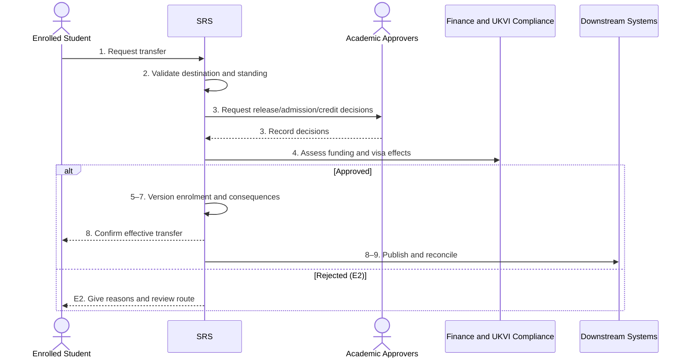

# BP-02-006 — Transfer programme, route or mode

> Status: Draft
> Domain: 02 — Registration and student status
> Owner: TBC
> Version: 0.1
> Last reviewed: 2026-07-26
> Review by: 2027-01-26

[Domain index](README.md) · [Library home](../README.md)

## Applicability

| Dimension | Applies |
|---|---|
| Common | UK |
| Nations | England; Scotland; Wales; Northern Ireland |
| Provider types | All; partner-delivered transfers require agreement-defined authority |
| Levels and modes | UG; PGT; PGR; full-time; part-time; placement |
| Exclusions | Transfer to another provider, which ends one provider record and starts another |

## Traceability

| Type | References |
|---|---|
| Revelation workflows | Gap — no complete durable workflow |
| Reference-model flows | F003, F006, F009, F014–F015, F021, F037, F049, F051 |
| Functional requirements | ENR-001–ENR-003, ENR-006–ENR-010; REG-002, REG-004–REG-007 |
| Data entities | `enrolment`, `programme_route`, `programme_rule_set`, `module_registration`, `fee_liability`, `cas_request`, `slc_notification` |
| Domain events | `srs.student.status-changed`; more specific transfer event is a gap |
| Integration contracts | Finance, CRM, timetable, attendance, VLE, IAM, SLC and UKVI contracts |

## Purpose and outcome

This process makes an authorised change to a student's programme, route/pathway, study mode, intensity, location or attendance pattern while preserving academic history and the effective date of each fact. The outcome is an approved and reconciled new study configuration, or a rejected request with the original enrolment unchanged.

## Scope

**Starts when:** A student or authorised academic/administrative actor requests a material study change.

**Ends when:** The request is rejected or the effective-dated change and downstream consequences are acknowledged.

**In scope:** Internal programme/route/mode transfers and PGR degree-aim changes.

**Out of scope:** Module-only changes (BP-03-005), provider-to-provider transfer, and initial changed-course offers.

## Actors and responsibilities

| Actor/system | Responsibility |
|---|---|
| Enrolled Student | Requests change after advice |
| Academic Approvers `PROPOSED` | Assess release, admission, credit and capacity |
| Registry Administrator | Validates authority and commits record change |
| Finance and UKVI Compliance | Assess fee, funding and visa consequences |
| SRS | Preserves history and coordinates hand-offs |
| Downstream Systems | Apply authorised curriculum, finance, regulatory and entitlement changes |

**Accountable owner:** Registry/academic administration owner (TBC)

**System of record:** SRS for programme enrolment; Curriculum Management for effective curriculum; Finance and regulatory bodies for their outcomes.

## Preconditions

1. The student has a current enrolment.
2. The destination curriculum and effective rules exist.
3. Required academic, capacity, finance and immigration reviewers are identifiable.

## Trigger

The student submits a transfer/change request or an authorised board outcome proposes one.

## Main flow

1. **Student** discusses implications and submits the proposed destination, effective date and reason.
2. **SRS** validates the destination, application window, capacity, entry requirements and current academic standing.
3. **Current Academic Approver** records release/advice and **Destination Academic Approver** records admission, level and credit mapping.
4. **Finance Administrator** assesses fee/funding consequences and **UKVI Compliance Officer** assesses CAS/visa consequences where applicable.
5. **Registry Administrator** reviews all decisions and approves or rejects the transfer.
6. **SRS** closes/supersedes the old effective enrolment version and creates the new programme/route/mode version without rewriting prior results.
7. **SRS** recalculates rules, expected end date, fee liability and module-registration implications.
8. **SRS** notifies the student and publishes the change to downstream systems.
9. **SRS** records acknowledgements, repairs rejected regulatory messages, and closes the case.

## Alternative flows

### A3 — Transfer takes effect next academic year

- **A3.1** Destination entry cannot occur during the current period.
- **A3.2** Record an approved future-dated transfer and, if required, route the intervening period through BP-02-007.

### A3b — Credit or level mapping differs

- **A3b.1** Destination approver records recognised credit, lost credit and resulting level/end date.
- **A3b.2** Student accepts the material consequence before approval.

### A4 — Sponsored student

- **A4.1** Compliance checks whether the change is permitted under current sponsor rules and whether a new CAS/permission is required.
- **A4.2** Do not commit an effective change that the student cannot lawfully undertake.

## Exception flows

### E2 — Destination unavailable or criteria not met

- **E2.1** Reject with reasons and review route; retain the original enrolment.

### E8 — Downstream system applies only part of the change

- **E8.1** Keep per-target exchange status, retry/reconcile from the authoritative SRS snapshot, and prevent duplicate enrolments.

## Postconditions

### Successful

- Old and new study facts have explicit effective periods and provenance.
- Credit/results history is preserved.
- Fee, funding, CAS and entitlement consequences are reconciled.

### Unsuccessful or incomplete

- Original enrolment remains authoritative and the request/decision is auditable.

## Business rules and controls

| ID | Classification | Rule/control | Applicability | Source |
|---|---|---|---|---|
| BR-1 | SECTOR | Transfer is not an automatic right; destination academic approval is common | UK | SRC-026–SRC-029 |
| BR-2 | INSTITUTIONAL | Windows, capacity, entry criteria and credit treatment vary | UK | SRC-026–SRC-029 |
| BR-3 | MANDATED/contractual | Funding and sponsor consequences require applicable notifications/permission | Applicable students | SRC-001–SRC-003 |
| BR-4 | PROPOSED | Prior enrolment/result versions must never be overwritten by transfer | Revelation | SRC-018 |

## National and institutional variations

### England

Provider criteria and Student Finance England consequences are assessed separately.

### Scotland

Programme/course enrolment and Scottish credit structures may affect mapping; provider rules remain authoritative.

### Wales

Welsh examples explicitly require academic approval and assessment of student-finance and visa consequences.

### Northern Ireland

Queen's uses staged current-adviser endorsement, destination review and outcome notification; Ulster similarly requires discussion and approval. These are institutional patterns.

### Institutional policy points

Transfer window, approval roles, capacity, credit mapping, effective date, fee recalculation and whether a new application is required.

## Data impact

| Data concept | Action | System of record | Effective/provenance requirement | Sensitivity |
|---|---|---|---|---|
| Enrolment/programme route | Version | SRS | Old/new effective dates and authority | Sensitive |
| Credit/rule mapping | Create | SRS | Destination decision/version | Sensitive |
| Fees/funding/visa | Read/report | Owning systems | Linked decision references | Regulatory |

## Integration impact

| From | To | Information/purpose | Contract/pattern | Failure and reconciliation |
|---|---|---|---|---|
| SRS | Finance/SLC/UKVI | Changed course/mode/dates | Existing contracts | Validate, retry, reconcile |
| SRS | VLE/IAM/Library/Attendance/Timetable | Entitlement and roster change | Existing contracts | Snapshot reconciliation |

## Sequence diagram

## Open questions and decisions

| ID | Question/decision | Owner | Status |
|---|---|---|---|
| OQ-1 | New transfer workflow/event and credit-mapping entity required? | Product/data owners | Open |

## Sources

| Source | Supported content |
|---|---|
| [SRC-026–SRC-029](../source-register.md) | Four-nation provider transfer patterns |
| [SRC-001–SRC-003, SRC-015–SRC-019](../source-register.md) | Regulatory and Revelation baseline |

## Related processes

BP-02-007; BP-02-010; BP-03-002; BP-03-005; BP-07-002; BP-07-003.

## Review record

| Review | Reviewer | Date | Outcome |
|---|---|---|---|
| Research/documentation | Codex implementation role | 2026-07-26 | Drafted |
| Required SME/architecture/editorial reviews | TBC | — | Pending |

## Change history

| Version | Date | Author | Change |
|---|---|---|---|
| 0.1 | 2026-07-26 | Codex | Initial draft |
