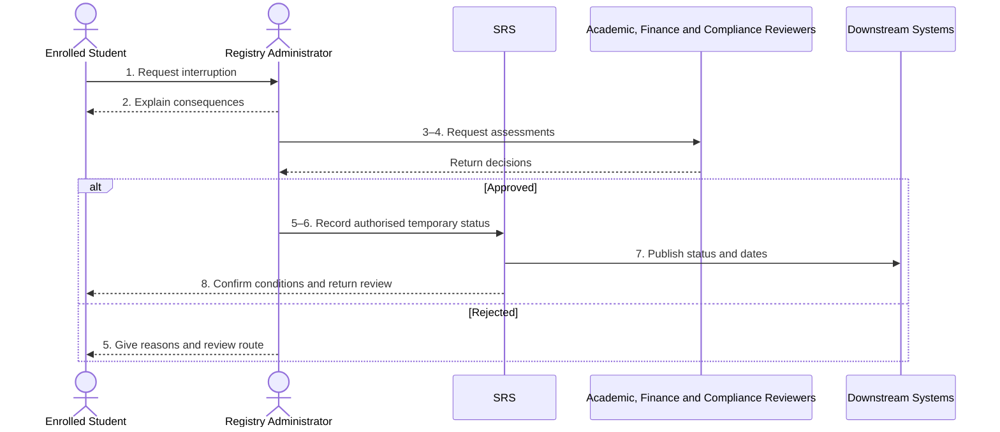

# BP-02-007 — Interrupt or suspend studies

> Status: Draft
> Domain: 02 — Registration and student status
> Owner: TBC
> Version: 0.1
> Last reviewed: 2026-07-26
> Review by: 2027-01-26

[Previous: BP-02-006](bp-02-006-transfer-programme-route-or-mode.md) · [Domain index](README.md) · [Next: BP-02-008](bp-02-008-return-from-interruption.md) · [Library home](../README.md)

## Applicability

| Dimension | Applies |
|---|---|
| Common | UK |
| Nations | England; Scotland; Wales; Northern Ireland |
| Provider types | All, including partner-delivered provision |
| Levels and modes | UG; PGT; PGR; all modes |
| Exclusions | Short authorised absence that does not change enrolment status |

## Traceability

| Type | References |
|---|---|
| Revelation workflows | W007 partial |
| Reference-model flows | F-SIS-CRM-01, F-SIS-LIB-01, F-SIS-FIN-01, F-SIS-VLE-01, F-SIS-IAM-01, F-SIS-CRIS-01, F-SIS-SLC-01, F-SIS-UKVI-01 |
| Functional requirements | ENR-002–ENR-003, ENR-006; UKV and SLC requirements |
| Data entities | `enrolment`, `fee_liability`, `student_obligation`, `slc_notification`, `ukvi_compliance_case`, `research_milestone` |
| Domain events | `srs.student.status-changed` |
| Integration contracts | Finance, SLC, UKVI, IAM, Library, VLE and CRM contracts |

## Purpose and outcome

Sometimes a student needs to pause their studies temporarily — for health, personal or other reasons — while keeping the right to come back and continue, rather than having to withdraw and reapply from scratch. This process records who authorised the pause, a reason category (without necessarily recording sensitive personal detail beyond what the decision actually needs), when it takes effect, when the student is expected to return, and what it means for their fees, funding and any external body — the Student Loans Company or UKVI, for a sponsored international student — that needs to be told.

## Scope

**Starts when:** A student requests a break or an authorised institutional process proposes/requires suspension.

**Ends when:** The interruption is rejected or the temporary status and downstream consequences are recorded.

**In scope:** Voluntary interruption, required suspension, PGR interruption and partner cases.

**Out of scope:** Short absence, disciplinary casework itself, and return (BP-02-008).

## Actors and responsibilities

| Actor/system | Responsibility |
|---|---|
| Enrolled Student | Requests and supplies proportionate evidence |
| Academic, Finance and Compliance Reviewers | Advise on academic feasibility and downstream consequences |
| Registry Administrator | Coordinates decision and records status |
| Authorised Decision-maker `PROPOSED` | Approves duration/conditions |
| SRS | Preserves evidence references and versions status |
| Downstream Systems | Apply authorised finance, sponsor and entitlement changes |

**Accountable owner:** Registry/academic governance owner (TBC)

**System of record:** SRS for enrolment status; case owner for sensitive evidence; Finance/UKVI/SLC for their outcomes.

## Preconditions

1. A current enrolment exists.
2. The provider has an interruption/suspension rule and approval authority.
3. Relevant maximum-registration, assessment and sponsor constraints can be evaluated.

## Trigger

Student request or authorised institutional outcome.

## Main flow

1. **Student or authorised actor** submits reason category, proposed last engagement/effective date and expected return period.
2. **Registry Administrator** explains academic, fee, funding, visa, service-access and maximum-period consequences.
3. **Academic Approver** assesses programme feasibility, completed credit/assessment treatment and return point.
4. **Finance Administrator** and **UKVI Compliance Officer** assess applicable consequences.
5. **Authorised Decision-maker** approves, varies or rejects the request and records conditions.
6. **SRS** creates a bitemporal `intermitting`/`suspended` enrolment version with effective and expected return dates.
7. **SRS** updates liabilities/obligations and publishes the governed change to SLC, UKVI and entitlement systems as applicable.
8. **SRS** notifies the student and schedules return review under BP-02-008.

## Alternative flows

### A1 — Institution-required suspension

- **A1.1** Link the authorised fitness, conduct, finance or academic-governance outcome without copying unnecessary case detail.
- **A1.2** Record review/appeal rights and return conditions.

### A3 — PGR interruption

- **A3.1** Apply PGR maximum-period, funding, supervision and milestone rules.
- **A3.2** Adjust expected submission/milestone dates only under authorised policy.

### A5 — Partial or different study arrangement

- **A5.1** If the student will continue at reduced intensity, use BP-02-006 rather than interruption.

## Exception flows

### E4 — Sponsor or programme constraint prevents proposed break

- **E4.1** Do not commit the requested dates; present lawful/academically viable alternatives or BP-02-009.

### E7 — External rejection

- **E7.1** Retain the provider decision, repair the message and reconcile; escalate any conflict affecting lawful status.

## Postconditions

### Successful

- Temporary status, dates, authority, conditions and successor review exist.
- Access and external reports reflect the governed outcome.

### Unsuccessful or incomplete

- Active status remains unless another authorised process changes it.

## Business rules and controls

| ID | Classification | Rule/control | Applicability | Source |
|---|---|---|---|---|
| BR-1 | SECTOR | Interruption is normally approved, time-bound and academically assessed | UK | SRC-020–SRC-025 |
| BR-2 | INSTITUTIONAL | Grounds, evidence, duration and maximum-period treatment vary | UK | SRC-020–SRC-025 |
| BR-3 | MANDATED/contractual | Provider must make applicable finance and sponsor reports | Applicable students | SRC-001–SRC-003 |
| BR-4 | PROPOSED | Sensitive evidence stays with the case owner; SRS stores outcome/references | Revelation | Data protection control |

## National and institutional variations

### England

Providers commonly call the outcome interruption of study; deadlines and maximum-period effects are institutional.

### Scotland

Interruption is often a complete agreed break; PGR rules and sponsor consequences may use separate procedures.

### Wales

Providers may use suspension; Swansea rules distinguish requested and required suspension and define return evidence.

### Northern Ireland

Providers may use temporary withdrawal or leave of absence; local regulations determine status and return rules.

### Institutional policy points

Grounds, evidence, retrospective dates, duration/extensions, assessment treatment, access, fee liability and return conditions.

## Data impact

| Data concept | Action | System of record | Effective/provenance requirement | Sensitivity |
|---|---|---|---|---|
| Enrolment status | Version | SRS | Effective date, authority, expected return | Sensitive |
| Evidence | Reference | Case owner | Minimise reason detail | Special-category possible |
| Fees/funding/sponsorship | Update/report | Owning systems | Exchange acknowledgement | Regulatory |

## Integration impact

| From | To | Information/purpose | Contract/pattern | Failure and reconciliation |
|---|---|---|---|---|
| SRS | Finance/SLC/UKVI | Temporary status and dates | Existing contracts | Retry and reconcile |
| SRS | IAM/Library/VLE/CRM | Access/lifecycle change | Existing contracts | Snapshot replay |

## Sequence diagram

## Open questions and decisions

| ID | Question/decision | Owner | Status |
|---|---|---|---|
| OQ-1 | Split interruption and institution-required suspension status/reason taxonomies? | Registry/data owner | Open |

## Sources

| Source | Supported content |
|---|---|
| [SRC-020–SRC-025](../source-register.md) | Four-nation interruption variants |
| [SRC-001–SRC-003, SRC-015–SRC-019](../source-register.md) | Regulatory/Revelation baseline |

## Related processes

[BP-02-006](bp-02-006-transfer-programme-route-or-mode.md); [BP-02-008](bp-02-008-return-from-interruption.md); BP-02-009; BP-07-002; BP-07-003.

## Review record

| Review | Reviewer | Date | Outcome |
|---|---|---|---|
| Research/documentation | Codex implementation role | 2026-07-26 | Drafted |
| Required reviews | TBC | — | Pending |

## Change history

| Version | Date | Author | Change |
|---|---|---|---|
| 0.1 | 2026-07-26 | Codex | Initial draft |
