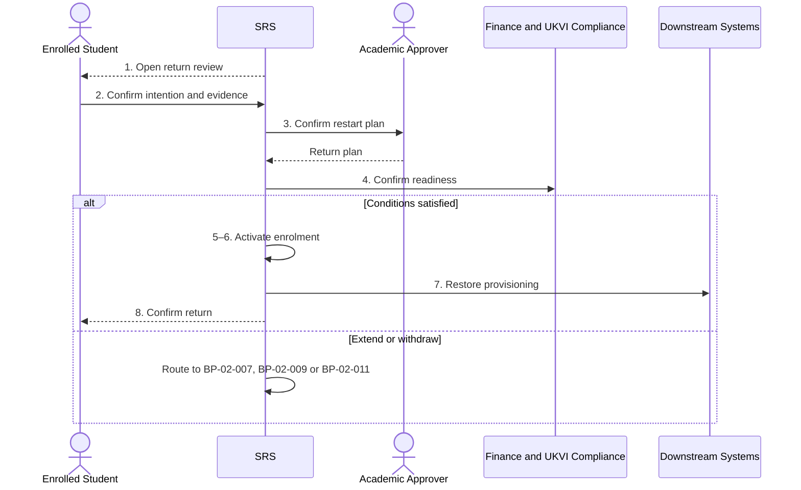

# BP-02-008 — Return from interruption

> Status: Draft
> Domain: 02 — Registration and student status
> Owner: TBC
> Version: 0.1
> Last reviewed: 2026-07-26
> Review by: 2027-01-26

[Previous: BP-02-007](bp-02-007-interrupt-or-suspend-studies.md) · [Domain index](README.md) · [Next: BP-02-009](bp-02-009-withdraw-from-studies.md) · [Library home](../README.md)

## Applicability

| Dimension | Applies |
|---|---|
| Common | UK |
| Nations | England; Scotland; Wales; Northern Ireland |
| Provider types | All |
| Levels and modes | UG; PGT; PGR; all modes |
| Exclusions | Readmission after permanent withdrawal |

## Traceability

| Type | References |
|---|---|
| Revelation workflows | Gap — W007 does not specify return |
| Reference-model flows | F003, F006, F008–F009, F014–F015, F021, F037, F049, F051 |
| Functional requirements | ENR-001–ENR-003, ENR-005–ENR-009 |
| Data entities | `enrolment`, `student_obligation`, `fee_liability`, `module_registration`, `visa_status`, `research_milestone` |
| Domain events | `srs.student.status-changed` |
| Integration contracts | Finance, SLC, UKVI and entitlement/provisioning contracts |

## Purpose and outcome

This process establishes whether and how a student returns after an authorised interruption. It verifies conditions, determines the correct academic restart point and creates a new active enrolment version and downstream entitlements.

## Scope

**Starts when:** The agreed return-review point approaches or the student asks to return.

**Ends when:** Return is confirmed and reconciled, extended/varied, or routed to withdrawal.

**In scope:** Standard, conditional, PGR and partner-mediated returns.

**Out of scope:** New admission/readmission after permanent withdrawal.

## Actors and responsibilities

| Actor/system | Responsibility |
|---|---|
| Enrolled Student | Confirms intention and supplies required evidence |
| Registry Administrator | Coordinates readiness and status |
| Academic Approver | Confirms restart point and conditions |
| Finance and UKVI Compliance | Confirms applicable readiness |
| SRS | Activates effective status and provisioning |
| Downstream Systems | Apply authorised finance, sponsor and entitlement changes |

**Accountable owner:** Registry owner (TBC)

**System of record:** SRS for return/enrolment; source roles for evidence and external outcomes.

## Preconditions

1. An authorised interruption with expected return point exists.
2. Return conditions and current curriculum can be evaluated.
3. The student has not permanently withdrawn.

## Trigger

Scheduled return review or student request.

## Main flow

1. **SRS** opens a return review before the expected date and notifies the student.
2. **Student** confirms intention and supplies required, proportionate evidence.
3. **Academic Approver** confirms programme availability, restart level/point, retained credit, module plan and maximum end date.
4. **Finance Administrator** and **UKVI Compliance Officer** confirm applicable funding, fee and immigration readiness.
5. **Registry Administrator** decides whether return conditions are satisfied.
6. **SRS** versions enrolment from temporary status to active with the authorised effective date and updated study facts.
7. **SRS** starts applicable re-registration/module processes and restores downstream entitlements.
8. **SRS** notifies the student and reconciles acknowledgements.

## Alternative flows

### A3 — Curriculum changed

- **A3.1** Academic approver maps the student to a current route/rule set and records transitional arrangements.
- **A3.2** Student accepts material duration/assessment consequences before step 5.

### A5 — Extension of interruption

- **A5.1** Assess a time-limited extension under BP-02-007 and maximum-period rules.

### A5b — Conditional return

- **A5b.1** Record lawful, proportionate support/fitness conditions and review dates.

## Exception flows

### E2 — No response or student will not return

- **E2.1** Follow BP-02-011 contact and decision controls; route an informed request through BP-02-009.

### E4 — Immigration/funding prevents planned date

- **E4.1** Do not activate status; record a revised lawful outcome and responsible owner.

## Postconditions

### Successful

- Active enrolment and curriculum facts reflect the restart.
- Entitlements and required external confirmations are acknowledged or queued.

### Unsuccessful or incomplete

- Temporary status remains until an authorised extension or withdrawal outcome.

## Business rules and controls

| ID | Classification | Rule/control | Applicability | Source |
|---|---|---|---|---|
| BR-1 | SECTOR | Return requires confirmation of academic restart point and any stated conditions | UK | SRC-020, SRC-022–SRC-025 |
| BR-2 | INSTITUTIONAL | Health/fitness evidence and curriculum transition rules vary | UK | SRC-020, SRC-022–SRC-023 |
| BR-3 | PROPOSED | Return is a distinct workflow, not a direct status edit | Revelation | Gap analysis |

## National and institutional variations

### England

Provider policies set deadlines, placement availability and maximum-period effects.

### Scotland

Return may be accompanied by supportive check-ins and separate PGR rules.

### Wales

Welsh examples may require medical fitness evidence after health suspension; this is provider policy, not a universal requirement.

### Northern Ireland

Temporary-withdrawal regulations and registration portal timing determine return mechanics.

### Institutional policy points

Evidence, approval, return points, curriculum transition, conditions, extensions and failure-to-return rules.

## Data impact

| Data concept | Action | System of record | Effective/provenance requirement | Sensitivity |
|---|---|---|---|---|
| Enrolment | Version active | SRS | Authorised return date | Sensitive |
| Return evidence/conditions | Reference/create | Case owner/SRS | Minimise health detail | Special-category possible |
| Curriculum/modules | Assign/version | SRS/CM | Current rules and transition | Sensitive |

## Integration impact

| From | To | Information/purpose | Contract/pattern | Failure and reconciliation |
|---|---|---|---|---|
| SRS | IAM/Library/VLE/Attendance/Timetable | Restore access/rosters | Existing contracts | Snapshot reconcile |
| SRS | Finance/SLC/UKVI | Return and applicable confirmation | Existing contracts | Validate/replay |

## Sequence diagram

## Open questions and decisions

| ID | Question/decision | Owner | Status |
|---|---|---|---|
| OQ-1 | New durable return workflow and return-plan entity? | Product/data owners | Open |

## Sources

| Source | Supported content |
|---|---|
| [SRC-020, SRC-022–SRC-025](../source-register.md) | Return conditions and variants |
| [SRC-015–SRC-019](../source-register.md) | Revelation baseline |

## Related processes

[BP-02-007](bp-02-007-interrupt-or-suspend-studies.md); [BP-02-009](bp-02-009-withdraw-from-studies.md); [BP-02-010](bp-02-010-complete-annual-re-registration.md); [BP-02-011](bp-02-011-resolve-failure-to-register.md).

## Review record

| Review | Reviewer | Date | Outcome |
|---|---|---|---|
| Research/documentation | Codex implementation role | 2026-07-26 | Drafted |
| Required reviews | TBC | — | Pending |

## Change history

| Version | Date | Author | Change |
|---|---|---|---|
| 0.1 | 2026-07-26 | Codex | Initial draft |
