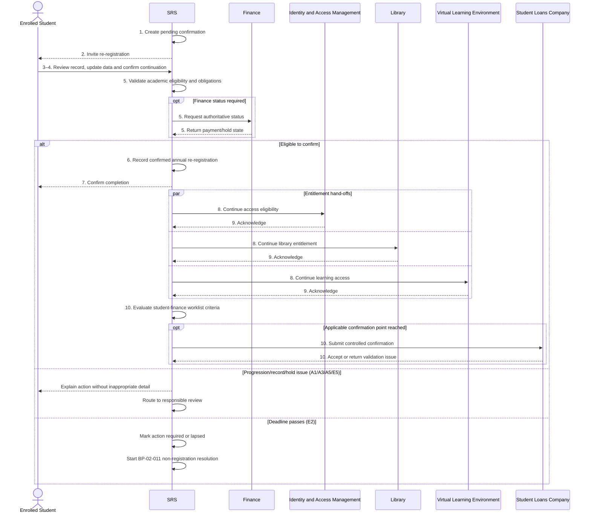

# BP-02-010 — Complete annual re-registration

> Status: Draft
> Domain: 02 — Registration and student status
> Owner: TBC
> Version: 0.1
> Last reviewed: 2026-07-26
> Review by: 2027-01-26

[Domain index](README.md) · [Process inventory](../process-inventory.md) · [Library home](../README.md)

## Applicability

| Dimension | Applies |
|---|---|
| Common | UK |
| Nations | England; Scotland; Wales; Northern Ireland |
| Provider types | Higher education providers; further education providers delivering HE; alternative providers; partner-delivered provision subject to agreement |
| Levels and modes | UG; PGT; PGR; full-time; part-time; distance; placement |
| Exclusions | Initial registration; return from interruption; students starting a new programme where the provider treats them as new entrants |

## Traceability

| Type | References |
|---|---|
| Revelation workflows | W010; W007 may follow unresolved non-registration |
| Reference-model flows | F009, F011, F015, F021, F049 and related entitlement flows, depending on provider design |
| Functional requirements | ENR-003, ENR-005, ENR-008, ENR-009, ENR-010; REG-001–REG-007 where module selection is coupled |
| Data entities | `enrolment`, `reenrolment_period`, `reenrolment_confirmation`, `person_identity`, `student_address`, `student_contact_method`, `student_hold`, `student_obligation`, `fee_liability`, `slc_notification`, `integration_exchange` |
| Domain events | `srs.student.re-enrolled` is documented but remains in the not-implemented backlog; `srs.student.status-changed` applies only if a later status decision is made |
| Integration contracts | `portal-self-service-update.v1`, `finance-fee-liability.v1`, `slc-enrolment-exchange.v1`, `iam-account-provisioning.v1`, `vle-course-provisioning.v1`, `library-access-entitlement.v1` |

## Purpose and outcome

Annual re-registration records a continuing student's intention and eligibility to continue on their programme for a new academic year or study period. It refreshes material personal and study information, reconfirms the relationship between student and provider, and enables status-dependent services and downstream processes.

Institutions call this process re-registration, re-enrolment, annual registration, or—in Scotland particularly—as part of matriculation. Those labels do not always mean exactly the same thing locally. This page documents the common outcome rather than imposing one institution's terminology.

Completion of provider re-registration and confirmation to a student finance body are related but distinct acts. A provider must apply the applicable student-finance scheme and attendance rules before sending a confirmation; the SRS must not treat a student's online declaration alone as evidence that every external confirmation criterion has been met.

## Scope

**Starts when:** The provider opens a re-registration period and identifies a continuing student as eligible or potentially eligible.

**Ends when:** The SRS has recorded a confirmed annual re-registration, notified the student, and created or queued applicable downstream hand-offs; or the student's case has been routed to an exception/status process.

**In scope:** Continuing students on taught and research programmes, including part-time, distance, placement and partner-delivered provision where the provider retains registration responsibility.

**Out of scope:** Initial registration (BP-02-003), return from interruption (BP-02-008), module selection and approval (BP-03-003/BP-03-004), non-registration resolution (BP-02-011), and attendance confirmations after the applicable liability/attendance point (BP-07-002).

## Actors and responsibilities

| Actor/system | Responsibility in this process |
|---|---|
| Enrolled Student | Reviews current record, supplies changes, accepts current declarations/terms, and confirms intention to continue |
| Registry Administrator | Owns the registration period, resolves academic/status exceptions, and authorises manual outcomes |
| Finance Administrator | Resolves fee status, sponsorship, funding or debt conditions where these affect registration |
| UKVI Compliance Officer | Completes any required immigration/right-to-study check and separates sponsor compliance evidence from general registration |
| SRS | Determines workflow eligibility, records the annual confirmation and provenance, and controls downstream hand-offs |
| Finance | Supplies financial status and receives liability changes |
| Student Loans Company | Receives scheme-appropriate registration/attendance confirmation through a separate controlled hand-off |
| Identity and Access Management | Applies access state arising from confirmed student status |
| Virtual Learning Environment | Receives applicable course/module provisioning after confirmation |
| Library | Receives applicable access entitlement after confirmation |

**Accountable owner:** Registry/student administration owner (TBC)

**Systems of record:** The SRS is authoritative for annual re-registration and enrolment status. Finance is authoritative for payment/account facts. The relevant student finance service is authoritative for its payment/entitlement state. UKVI systems are authoritative for immigration decisions, while the provider must retain its own sponsor evidence.

## Preconditions

1. The student has an existing enrolment that is expected to continue into the target academic year or study period.
2. A re-registration period exists for the relevant programme/intake and is open.
3. The student's progression or continuation outcome permits re-registration, or the student is explicitly routed for manual review.
4. The SRS can identify open holds, obligations, immigration checks, fee issues, and concurrent enrolments that may affect the process.
5. The student can authenticate to the approved self-service channel, or an authorised Registry Administrator is acting through an audited assisted route.

## Trigger

A configured re-registration period opens. The SRS evaluates potentially continuing enrolments and invites eligible students, while routing unresolved cases for review.

## Main flow

1. **SRS** creates a `pending` annual re-registration confirmation for the target enrolment and period after determining that the student may continue.
2. **SRS** notifies the **Enrolled Student** that re-registration is open, provides the deadline, and identifies actions that can be disclosed safely.
3. **Enrolled Student** authenticates and reviews their programme, route, study mode, expected study period, personal/contact information, and required declarations.
4. **Enrolled Student** supplies permitted personal/contact changes, confirms their intention to continue, and accepts the provider's current terms, regulations and data notices.
5. **SRS** validates academic eligibility, open obligations/holds, concurrent-enrolment rules, required fields, and whether separate finance or immigration action remains outstanding.
6. **SRS** records the annual confirmation as `confirmed`, including the effective period, confirmation time, actor, channel, accepted declaration/terms version, and source references for changed data.
7. **SRS** confirms successful re-registration to the **Enrolled Student** and enables the applicable successor processes, including module selection where this is not part of re-registration.
8. **SRS** publishes confirmed status or eligibility to **Identity and Access Management**, **Library**, and the **Virtual Learning Environment** through the applicable integration contracts.
9. **Receiving Systems** acknowledge or reconcile the entitlement/provisioning messages; the SRS retains each exchange outcome independently.
10. **SRS** places any student-finance confirmation on the controlled BP-07-002 worklist, applying the relevant scheme, course, mode and attendance criteria rather than sending it solely because step 6 completed.

## Alternative flows

### A1 — Progression or reassessment outcome is pending

- **A1.1** At main step 1, the SRS finds that the relevant progression/assessment board outcome is not final.
- **A1.2** The SRS does not present the student as fully eligible and records the blocking reason without exposing inappropriate assessment detail.
- **A1.3** When the decision becomes final, the SRS re-evaluates eligibility and returns to main step 1.
- **A1.4** If the outcome requires repeat or assessment-only study, continue in BP-06-002 and create the correct registration variant rather than assuming standard continuation.

### A3 — Programme, route, mode or study location is incorrect

- **A3.1** At main step 3, the student reports that a material study fact is wrong or expected to change.
- **A3.2** The SRS creates a governed review task; it does not allow the student to overwrite an authoritative academic fact.
- **A3.3** A Registry Administrator resolves the change through BP-02-006.
- **A3.4** Rejoin at main step 3 after the corrected effective-dated record is available.

### A4 — Personal or contact data changes

- **A4.1** At main step 4, the student updates a self-service field.
- **A4.2** The SRS records a new effective/transaction-time version with student provenance.
- **A4.3** A change requiring evidence or approval is routed to BP-08-002.
- **A4.4** Rejoin at main step 4 when required fields are complete.

### A5 — Financial condition requires action

- **A5.1** At main step 5, Finance reports a missing payment arrangement, sponsorship/funding decision, or policy-defined debt hold.
- **A5.2** The SRS shows an appropriate action and routes the case to Finance without revealing unnecessary financial detail.
- **A5.3** The provider applies its published policy to decide whether academic confirmation may proceed while financial registration remains incomplete.
- **A5.4** Rejoin at main step 5 after Finance supplies an updated authoritative status, or end with `pending-financial-action`.

### A5b — Immigration or right-to-study check is required

- **A5b.1** At main step 5, the SRS identifies an expiring, missing or review-required immigration/right-to-study record.
- **A5b.2** The UKVI Compliance Officer completes the applicable evidence check under BP-02-002/BP-07-003.
- **A5b.3** The SRS records only the necessary verification outcome and evidence reference in the registration context.
- **A5b.4** Rejoin at main step 5 when the check permits continuation, or route to a governed compliance/status decision.

### A5c — PGR, placement, distance or partner-delivered student

- **A5c.1** At main step 5, the SRS applies the student's actual study mode, location, research milestone and registration-responsibility rules.
- **A5c.2** Where a supervisor, partner or placement team must confirm continued participation, the SRS obtains and records that evidence.
- **A5c.3** Rejoin at main step 5; do not require campus attendance solely because the standard taught-student route does.

### A6 — Assisted or authorised administrative confirmation

- **A6.1** If the student cannot use self-service, an authorised Registry Administrator verifies identity and records the confirmation through an assisted route.
- **A6.2** The SRS records the administrator, authority, reason, evidence, channel and declarations presented.
- **A6.3** Rejoin at main step 7.

### A10 — No student-finance confirmation applies

- **A10.1** At main step 10, the student has no relevant SLC-administered support, or the applicable confirmation point has not been reached.
- **A10.2** The SRS records `not-applicable` or `not-yet-eligible` for that hand-off and completes this process without sending a confirmation.

## Exception flows

### E2 — Student does not respond

- **E2.1** At the configured reminder point, the SRS notifies the student again and records the communication.
- **E2.2** At the deadline, the SRS marks the confirmation `lapsed` or `action-required` according to approved status codes.
- **E2.3** The SRS opens BP-02-011 for contact, evidence review and a governed status decision.
- **E2.4** Non-response does not silently become retrospective withdrawal; the applicable regulations, published provider policy, sponsorship duties and evidence determine the effective outcome.

### E5 — Conflicting or incomplete records

- **E5.1** The SRS detects conflicting enrolment, identity, progression, fee or immigration facts.
- **E5.2** The SRS prevents automatic confirmation, preserves the submitted information, and creates a data-quality task.
- **E5.3** The responsible actor resolves the source fact through BP-08-001 or BP-08-002.
- **E5.4** Rejoin at main step 5.

### E8 — Downstream message fails

- **E8.1** A receiving system rejects or does not acknowledge an entitlement/provisioning message.
- **E8.2** The SRS retains the confirmed re-registration and records the individual exchange as failed or pending; it does not ask the student to re-register.
- **E8.3** The integration service retries under the contract and alerts the responsible service owner.
- **E8.4** The SRS reconciles the target system from a current-state snapshot and records the outcome.

### E10 — Student-finance confirmation is rejected

- **E10.1** The student finance service rejects or cannot match a confirmation.
- **E10.2** The SRS retains the provider re-registration outcome and records the rejected exchange separately.
- **E10.3** A Registry Administrator/Student Data Officer resolves course, year, student or provider-reference differences under BP-07-002.
- **E10.4** The corrected message is resubmitted with an idempotent reference and reconciled.

## Postconditions

### Successful

- The annual confirmation is `confirmed` for the specific enrolment and period.
- Changed personal/contact data has traceable effective and recorded history.
- The accepted declarations/terms version and confirming actor/channel are auditable.
- Downstream entitlement exchanges are acknowledged or individually pending reconciliation.
- Applicable student-finance work is queued with its own eligibility and evidence controls.
- The student can enter the appropriate module-registration or continuation process.

### Unsuccessful or incomplete

- The submitted information and blocking reason are retained.
- The confirmation remains pending, action-required, or lapsed.
- A named team owns the exception and the student receives an appropriate explanation.
- Enrolment status, access, funding and sponsorship consequences are not inferred until the relevant governed decision is made.

## Business rules and controls

| ID | Classification | Rule/control | Applicability | Source |
|---|---|---|---|---|
| BR-1 | SECTOR | Continuing students commonly reconfirm their status each academic year/period; terminology and component stages differ | UK | SRC-006–SRC-014 |
| BR-2 | INSTITUTIONAL | Eligibility normally depends on a valid continuing programme position and may depend on progression, finance, immigration or other holds | UK provider policy | SRC-006, SRC-008, SRC-010, SRC-012, SRC-013 |
| BR-3 | INSTITUTIONAL | Providers determine whether academic and financial registration are separate stages and whether a financial issue blocks completion | UK provider policy | SRC-006, SRC-009, SRC-013, SRC-014 |
| BR-4 | MANDATED/contractual | A provider must not claim SLC-administered funding for a student who does not satisfy applicable attendance/participation and service-agreement rules | Applicable SLC schemes | SRC-003 |
| BR-5 | SECTOR | Registration confirmation commonly enables access, timetable/module services, documents and funding-related actions | UK | SRC-004–SRC-014 |
| BR-6 | MANDATED | Student sponsors must retain required evidence and report applicable sponsored-student circumstances under current sponsor guidance | UK; sponsored students | SRC-001, SRC-002 |
| BR-7 | REVELATION | W010 currently moves from an open window through confirmed/reminder/lapsed and routes lapse towards W007 | Revelation | SRC-015 |
| BR-8 | REVELATION | The current data model stores period, status and confirmation time but not accepted terms version, channel or assisted-confirmation authority | Revelation | SRC-018 |
| BR-9 | REVELATION | `srs.student.re-enrolled` is documented but explicitly listed as not implemented | Revelation | SRC-017 and Domain Events catalogue |
| BR-10 | PROPOSED | Failure to re-register must enter BP-02-011 before a withdrawal/status change is committed | Revelation target | Process analysis |

## National and institutional variations

### England

- Student Finance England operates England-domiciled student-support processes; provider confirmation of registration and, where applicable, attendance affects payment.
- Office for Students registration conditions do not define a single institutional re-registration sequence. Provider policy remains material.
- England-specific rules must not be applied solely because the provider is physically in England; student domicile, course and funding route matter.

### Scotland

- Providers may describe the wider status process as **matriculation**, with annual registration as one component.
- Scottish provider processes may separate academic registration, financial registration, course/class enrolment, and visa registration.
- Student Awards Agency Scotland and SLC-administered interactions must be mapped by the applicable support scheme rather than treated as Student Finance England.

### Wales

- Providers commonly use **enrolment** or **re-enrolment** and may combine personal-data confirmation, module choice and financial actions.
- Student Finance Wales/SLC confirmation must be based on the applicable Welsh support scheme and provider controls.
- Welsh-language service and communication obligations are an operating requirement to assess; they do not change the core record outcome.

### Northern Ireland

- Provider regulations may use **enrolment and registration** as linked stages and may restrict access to facilities or student finance until all required stages complete.
- Student Finance Northern Ireland releases applicable payment after provider attendance confirmation and other eligibility checks.
- A provider's presumed-withdrawal rule and contact period are institutional rules unless a separate binding requirement applies; they must be configured and sourced.

### Institutional policy points

- Period opening, reminder and deadline dates.
- Whether declarations/terms are reconfirmed and versioned.
- Academic versus financial registration stages.
- Which debt/obligation types block completion.
- Whether module choice is embedded or a successor process.
- Evidence required for PGR, placement, distance and partner students.
- Assisted/manual confirmation authority.
- Non-registration contact, escalation and status-decision policy.

## Data impact

| Data concept | Action | System of record | Effective/provenance requirement | Sensitivity |
|---|---|---|---|---|
| Re-registration period | Read | SRS | Programme/intake scope and open/reminder/close timestamps | Standard |
| Annual confirmation | Create/update | SRS | Enrolment, period, effective year, actor, time, channel and status history | Personal |
| Student intention/declaration | Create | SRS | Accepted terms/declaration version and evidence | Personal |
| Personal/contact details | Read/update | SRS | Student-supplied provenance and bitemporal history | Personal |
| Progression/continuation eligibility | Read | SRS | Use ratified/current effective outcome | Sensitive |
| Hold/obligation | Read | Owning source; SRS governed copy | Type, authority, status and safe disclosure text | Sensitive |
| Fee/funding status | Read/report | Finance/SLC as applicable | Do not overwrite source fact; retain exchange reference | Sensitive |
| Immigration check | Read/reference | UKVI/provider sponsor evidence | Minimise copied evidence and audit access | Sensitive |
| Entitlement exchange | Create | SRS exchange ledger | Target, event/version, attempts, acknowledgement and reconciliation | Personal |

## Integration impact

| From | To | Information/purpose | Contract/pattern | Failure and reconciliation |
|---|---|---|---|---|
| Enterprise Web Portal | SRS | Student review, updates and confirmation | `portal-self-service-update.v1` | Preserve submitted state; audited retry/assisted route |
| Finance | SRS | Payment, sponsorship, funding or hold state | Current finance feedback is `finance-payment-and-hold.v1` | Source-owned correction and replay |
| SRS | Finance | Updated liability/status | `finance-fee-liability.v1` | Retry and reconcile current liability |
| SRS | Student Loans Company | Scheme-appropriate registration/attendance confirmation | `slc-enrolment-exchange.v1` | Worklist validation, rejection repair and replay |
| SRS | Identity and Access Management | Continued access eligibility | `iam-account-provisioning.v1` | Retry; reconcile account eligibility |
| SRS | Virtual Learning Environment | Continued programme/module provisioning | `vle-course-provisioning.v1` | Retry/DLQ; snapshot reconciliation |
| SRS | Library | Continued entitlement | `library-access-entitlement.v1` | Retry/DLQ; student snapshot reconciliation |

## Sequence diagram

## Open questions and decisions

| ID | Question/decision | Owner | Status |
|---|---|---|---|
| OQ-1 | Should Revelation split W010 into academic confirmation, financial registration and downstream confirmation tasks, or configure these as institutional variants? | Product/workflow owner | Open |
| OQ-2 | Which canonical status codes replace or supplement `pending`, `confirmed` and `lapsed` for action-required/manual-review cases? | Data architect | Open |
| OQ-3 | Should accepted terms/declaration version, channel and confirming actor be added to `reenrolment_confirmation`? | Data architect/DPO | Open |
| OQ-4 | Which exact SLC confirmation messages occur at annual re-registration versus later attendance points for each scheme/course/mode? | Student finance SME | Open |
| OQ-5 | What minimum evidence should partner providers supply where Revelation's tenant retains registration responsibility? | Collaborative provision SME | Open |
| OQ-6 | Should failure to re-register trigger W007 automatically, as currently documented, or always require a BP-02-011 decision? | Registry/product owner | Open |
| OQ-7 | `srs.student.re-enrolled` is documented but not implemented; should it be implemented or replaced by a more general registration event? | Integration architect | Open |

## Sources

| Source | Supported content |
|---|---|
| [SRC-001 and SRC-002](../source-register.md) | Sponsored-student evidence, re-check and reporting considerations |
| [SRC-003–SRC-005](../source-register.md) | Distinction between provider registration and controlled student-finance confirmations |
| [SRC-006 and SRC-007](../source-register.md) | Scotland terminology and component stages |
| [SRC-008, SRC-009 and SRC-014](../source-register.md) | Wales re-enrolment, module/finance/data confirmation and downstream consequences |
| [SRC-010 and SRC-011](../source-register.md) | Northern Ireland registration, access and non-registration variants |
| [SRC-012 and SRC-013](../source-register.md) | England returning-student registration and institutional eligibility/debt variants |
| [SRC-015–SRC-019](../source-register.md) | Current Revelation workflow, actors, contracts, entities and requirements |

## Related processes

- **Predecessor:** BP-06-001 — Determine progression
- **Alternative predecessor:** BP-02-008 — Return from interruption
- **Successor:** BP-03-003 — Select modules
- **Exception:** BP-02-011 — Resolve failure to register or re-register
- **Related:** BP-02-002 — Verify identity, nationality and right to study
- **Related:** BP-07-002 — Exchange registration, attendance and changes with student finance bodies
- **Related:** BP-07-003 — Manage Student sponsor reporting and compliance
- **Related:** BP-08-002 — Correct personal or enrolment data

Related candidate pages are listed in the [process inventory](../process-inventory.md) and will become links when drafted.

## Review record

| Review | Reviewer | Date | Outcome |
|---|---|---|---|
| Research/documentation | Codex implementation role | 2026-07-26 | Drafted from registered sources |
| Business SME | TBC | — | Pending |
| Student finance SME | TBC | — | Pending |
| Immigration compliance SME | TBC | — | Pending |
| Scotland/Wales/NI reviewers | TBC | — | Pending |
| Integration architecture | TBC | — | Pending |
| Data architecture | TBC | — | Pending |
| Revelation product/workflow | TBC | — | Pending |
| Editorial/accessibility | TBC | — | Pending |

## Change history

| Version | Date | Author | Change |
|---|---|---|---|
| 0.1 | 2026-07-26 | Codex | Initial UK-wide researched draft and Revelation impact assessment |

