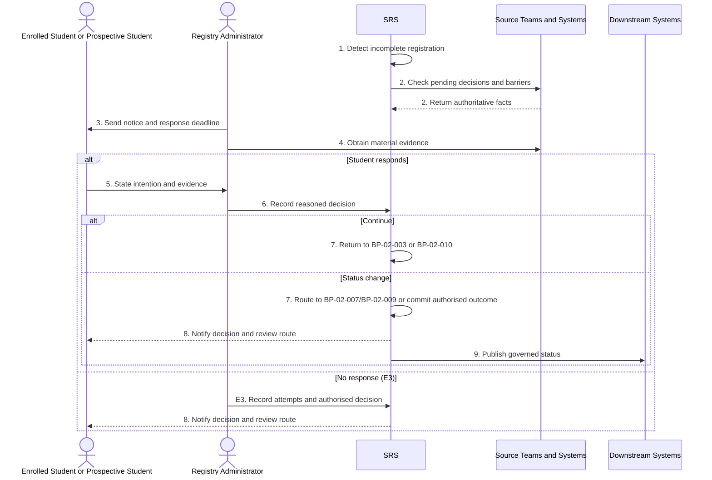

# BP-02-011 — Resolve failure to register or re-register

> Status: Draft
> Domain: 02 — Registration and student status
> Owner: TBC
> Version: 0.1
> Last reviewed: 2026-07-26
> Review by: 2027-01-26

[Previous: BP-02-010](bp-02-010-complete-annual-re-registration.md) · [Domain index](README.md) · [Next: BP-02-012](bp-02-012-close-leaver-record.md) · [Library home](../README.md)

## Applicability

| Dimension | Applies |
|---|---|
| Common | UK |
| Nations | England; Scotland; Wales; Northern Ireland |
| Provider types | All providers retaining responsibility for the student record, including partner-delivered provision |
| Levels and modes | UG; PGT; PGR; full-time; part-time; distance; placement |
| Exclusions | A confirmed voluntary withdrawal; failure to engage after successful registration, handled in BP-04-002 |

## Traceability

| Type | References |
|---|---|
| Revelation workflows | W010; W007 only after an authorised outcome |
| Reference-model flows | F006, F008, F015, F021, F049, F051 as applicable |
| Functional requirements | ENR-002, ENR-006, ENR-008; PLT-AUD and PLT-WFL controls |
| Data entities | `reenrolment_confirmation`, `enrolment`, `student_obligation`, `student_hold`, `slc_notification`, `ukvi_compliance_case`, `integration_exchange` |
| Domain events | `srs.student.status-changed` only after a status decision |
| Integration contracts | `crm-student-lifecycle-updates.v1`, `library-access-entitlement.v1`, `vle-course-provisioning.v1`, `iam-account-provisioning.v1`, `slc-enrolment-exchange.v1`, `ukvi-sponsor-compliance.v1` |

## Purpose and outcome

This process determines what should happen when a student does not complete required registration by the provider's deadline. It distinguishes administrative delay, inability to access the process, pending academic/finance/immigration decisions, an authorised absence, and a genuine intention not to continue.

Its outcome is either completed registration, an approved extension/exception, referral to another status process, or an authorised effective-dated withdrawal/non-registration decision. A deadline alone must not overwrite the student record without the contact, evidence and authority required by the provider's published rules.

## Scope

**Starts when:** A registration deadline or escalation threshold passes with the required confirmation incomplete.

**Ends when:** The student registers, receives an approved exception, enters another status process, or an authorised non-registration outcome is recorded and handed to BP-02-012.

**In scope:** Initial and annual registration failures, inability to contact, unresolved holds, late arrival and partner-confirmation failures.

**Out of scope:** Post-registration non-engagement and retrospective correction of an already decided status.

## Actors and responsibilities

| Actor/system | Responsibility |
|---|---|
| Enrolled Student or Prospective Student | Explains intention and circumstances; completes actions |
| Registry Administrator | Investigates, contacts, evaluates evidence and records/authorises outcome |
| Source Teams and Systems | Supply academic, welfare, finance and sponsor evidence |
| Partner Provider `PROPOSED` | Supplies delivery/engagement evidence under agreement |
| SRS | Creates worklist, preserves evidence and prevents unauthorised automatic status change |
| Downstream Systems | Apply the authorised continuation, suspension or closure outcome |

**Accountable owner:** Registry/student administration owner (TBC)

**System of record:** The SRS is authoritative for registration and enrolment status; source teams remain authoritative for their underlying facts.

## Preconditions

1. A registration requirement, deadline and potentially affected enrolment are recorded.
2. The student has not completed every required stage.
3. Contact routes, disclosed actions and escalation rules are configured.

## Trigger

The deadline or configured escalation point passes, or a partner/service reports that registration cannot be confirmed.

## Main flow

1. **SRS** identifies the incomplete registration, records the unmet stage and creates a Registry work item.
2. **SRS** checks for system failure, pending progression, authorised interruption, approved late arrival, finance/immigration review, disability-related barrier, or partner evidence before classifying the case as non-response.
3. **Registry Administrator** sends an accessible notice stating the missing action, consequences, response route and evidence-based deadline.
4. **Registry Administrator** consults the relevant **Personal Tutor**, **Research Supervisor**, partner, Finance or compliance role where their evidence is material.
5. **Student** responds with their intention and completes registration, requests an exception/status change, or confirms they will not continue.
6. **Registry Administrator** evaluates the evidence against the applicable published rule and records a reasoned decision and effective date.
7. **SRS** either returns the student to BP-02-003/BP-02-010, routes them to BP-02-007/BP-02-009, or records the authorised non-registration/withdrawal status bitemporally.
8. **SRS** notifies the student of the decision, reasons, effective date, consequences and available review/appeal route.
9. If status ended, **SRS** publishes the governed status change and starts BP-02-012; downstream exchanges are acknowledged and reconciled separately.

## Alternative flows

### A2 — Provider or SRS failure

- **A2.1** The student could not register because the provider channel, identity account or source record was defective.
- **A2.2** Registry records a provider-caused extension, corrects the issue without disadvantaging the student, and returns to main step 3.

### A2b — Academic decision pending

- **A2b.1** Progression, reassessment or transfer remains undecided.
- **A2b.2** The SRS holds the case as `pending-decision`, prevents premature withdrawal and re-evaluates after the authoritative outcome.

### A5 — Student intends to continue

- **A5.1** The student completes outstanding actions or receives an authorised extension.
- **A5.2** Continue in BP-02-003 or BP-02-010; close this case without a status-change event.

### A5b — Student requests interruption or withdrawal

- **A5b.1** Preserve the request date and claimed last engagement date.
- **A5b.2** Continue in BP-02-007 or BP-02-009; do not use the missed deadline as the effective date automatically.

### A5c — Sponsored student

- **A5c.1** UKVI Compliance Officer assesses enrolment and reporting duties using current guidance.
- **A5c.2** Provider status and UKVI report are recorded as related but distinct decisions.

## Exception flows

### E3 — Student cannot be contacted

- **E3.1** Registry uses approved contact channels and records each attempt.
- **E3.2** After the published contact period, an authorised decision-maker reviews the evidence.
- **E3.3** Only then may the SRS record the configured presumed-withdrawal/non-registration outcome.

### E4 — Conflicting partner or system evidence

- **E4.1** The SRS retains the case and flags the conflict.
- **E4.2** Registry reconciles the authoritative source and records who resolved it.

### E9 — Downstream rejection

- **E9.1** The status decision remains valid while the failed exchange is queued.
- **E9.2** The integration owner repairs/replays and records acknowledgement.

## Postconditions

### Successful

- There is an evidence-based, authorised outcome with effective and transaction times.
- The student has been notified and a review route recorded.
- Any status-ending outcome proceeds to BP-02-012.

### Unsuccessful or incomplete

- The current status is not silently changed.
- An owned work item, reason and next review date remain.

## Business rules and controls

| ID | Classification | Rule/control | Applicability | Source |
|---|---|---|---|---|
| BR-1 | INSTITUTIONAL | Deadlines, contact periods and presumed-withdrawal rules must be published and configurable | UK | SRC-010, SRC-013, SRC-025, SRC-030 |
| BR-2 | SECTOR | Providers commonly investigate and contact before final non-registration action | UK | SRC-010, SRC-024, SRC-025, SRC-030 |
| BR-3 | MANDATED | Sponsored-student non-enrolment/status reporting follows current sponsor guidance | UK; sponsored students | SRC-001, SRC-002 |
| BR-4 | PROPOSED | W010 lapse must create this decision process, not automatically commit withdrawal | Revelation target | SRC-015 |
| BR-5 | REVELATION | `srs.student.status-changed` is emitted only for a committed enrolment status transition | Revelation | Domain Events catalogue |

## National and institutional variations

### England

Providers define their registration and exclusion/withdrawal rules; student-finance and sponsored-student consequences require their separate evidence.

### Scotland

The unresolved requirement may be described as incomplete matriculation. The provider must identify which component—registration, attendance confirmation, finance or course enrolment—is missing.

### Wales

Published Welsh-provider rules demonstrate both candidature lapse and assumed-withdrawal approaches; Revelation must configure the institution's actual rule rather than generalise either.

### Northern Ireland

Queen's regulations provide a concrete presumed-withdrawal contact process, but its ten-working-day period is institutional, not a UK-wide default.

### Institutional policy points

- Deadline and grace/contact periods.
- Required channels and decision authority.
- Late arrival, disability-related and provider-failure exceptions.
- Whether the outcome is `not-registered`, `lapsed`, `excluded`, or `withdrawn`.
- Review/appeal route and retrospective effective-date rules.

## Data impact

| Data concept | Action | System of record | Effective/provenance requirement | Sensitivity |
|---|---|---|---|---|
| Registration case | Create/update | SRS | Reason, deadline, contacts, evidence and decision | Personal |
| Enrolment status | Update if authorised | SRS | Separate effective and recorded dates | Sensitive |
| Contact/engagement evidence | Read/reference | Owning source/SRS | Minimise and identify provenance | Sensitive |
| Compliance/finance outcome | Read/report | Owning system | Link, do not conflate | Sensitive/regulatory |

## Integration impact

| From | To | Information/purpose | Contract/pattern | Failure and reconciliation |
|---|---|---|---|---|
| SRS | Student/CRM | Notice and decision | Communications/current CRM contract | Record delivery; alternative channel |
| SRS | IAM/Library/VLE | Governed status outcome | Existing entitlement contracts | Retry and snapshot reconciliation |
| SRS | SLC/UKVI | Applicable status report | Existing regulatory contracts | Separate worklist, rejection repair |

## Sequence diagram

## Open questions and decisions

| ID | Question/decision | Owner | Status |
|---|---|---|---|
| OQ-1 | Add a durable non-registration investigation workflow between W010 and W007? | Product/workflow owner | Open |
| OQ-2 | Canonical status taxonomy for lapsed, non-registered, excluded and presumed withdrawn? | Registry/data architect | Open |
| OQ-3 | Which communication evidence must Revelation retain? | DPO/Registry | Open |

## Sources

| Source | Supported content |
|---|---|
| [SRC-001–SRC-002](../source-register.md) | Sponsored-student duties |
| [SRC-010, SRC-013, SRC-023–SRC-025, SRC-030](../source-register.md) | Provider non-registration and return/contact rules |
| [SRC-015–SRC-019](../source-register.md) | Revelation workflow, data and integration baseline |

## Related processes

- [BP-02-010 — Complete annual re-registration](bp-02-010-complete-annual-re-registration.md)
- BP-02-003 — Complete initial academic registration
- BP-02-007 — Interrupt or suspend studies
- BP-02-009 — Withdraw from studies
- [BP-02-012 — Close a leaver record and entitlements](bp-02-012-close-leaver-record.md)

## Review record

| Review | Reviewer | Date | Outcome |
|---|---|---|---|
| Research/documentation | Codex implementation role | 2026-07-26 | Drafted |
| Business/national/student-finance/immigration SMEs | TBC | — | Pending |
| Integration/data/product/editorial | TBC | — | Pending |

## Change history

| Version | Date | Author | Change |
|---|---|---|---|
| 0.1 | 2026-07-26 | Codex | Initial UK-wide draft |
