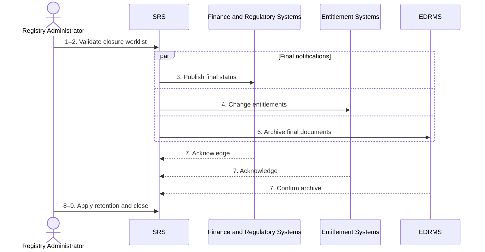

# BP-02-012 — Close a leaver record and entitlements

> Status: Draft
> Domain: 02 — Registration and student status
> Owner: TBC
> Version: 0.1
> Last reviewed: 2026-07-26
> Review by: 2027-01-26

[Previous: BP-02-011](bp-02-011-resolve-failure-to-register.md) · [Domain index](README.md) · [Library home](../README.md)

## Applicability

| Dimension | Applies |
|---|---|
| Common | UK |
| Nations | England; Scotland; Wales; Northern Ireland |
| Provider types | All |
| Levels and modes | All |
| Exclusions | Temporary interruption where entitlements are suspended rather than finally closed |

## Traceability

| Type | References |
|---|---|
| Revelation workflows | W007/W011 partial; gap — no closure orchestration |
| Reference-model flows | F006–F010, F015, F021–F024, F029, F037, F049, F051 |
| Functional requirements | ENR-002–ENR-006; audit, retention and integration requirements |
| Data entities | `enrolment`, `student_obligation`, `fee_liability`, `account_access_state`, `student_document`, `document_archive_confirmation`, `integration_exchange` |
| Domain events | `srs.student.status-changed` plus document/integration events as applicable |
| Integration contracts | IAM, Library, VLE, Finance, CRM, EDRMS, SLC, UKVI and DW contracts |

## Purpose and outcome

This process completes operational closure after withdrawal, transfer-out, exclusion, completion or another permanent leaving outcome. It removes inappropriate active entitlements, settles open work, preserves lawful continuing access, creates final records/documents and establishes retention controls.

## Scope

**Starts when:** A permanent status-ending outcome is authoritative.

**Ends when:** Every required target is acknowledged/reconciled and remaining obligations/retention holds have owners.

**In scope:** Operational, regulatory, document and access closure.

**Out of scope:** Deciding the leaving outcome or disposing records at retention expiry.

## Actors and responsibilities

| Actor/system | Responsibility |
|---|---|
| Registry Administrator | Owns closure worklist and exceptions |
| Finance Administrator | Final liability/refund/debt outcome |
| Records Manager `PROPOSED` | Final documents, holds and retention class |
| SRS | Orchestrates per-target closure and evidence |
| Finance and Regulatory Systems | Close liabilities and record required notifications |
| Entitlement Systems | Remove or retain access and acknowledge final state |

**Accountable owner:** Registry/records owner (TBC)

**System of record:** SRS for final student status; each downstream system for applied access/financial state; EDRMS for archived document acknowledgement.

## Preconditions

1. Permanent status and effective date are authorised.
2. Required external and entitlement targets are known.
3. Any appeal/legal/records hold is visible.

## Trigger

BP-02-009, BP-02-011, BP-06-003/049 or another authorised status-ending process completes.

## Main flow

1. **SRS** creates a closure worklist from status, study mode, funding, sponsorship and active integrations.
2. **Registry Administrator** validates unresolved assessments, exit award, document and obligation tasks.
3. **SRS** sends final status/effective date to Finance, SLC, UKVI and CRM where applicable.
4. **SRS** changes IAM, Library, VLE, attendance and other entitlements according to policy, preserving permitted alumni/appeal access.
5. **Finance Administrator** records final liability/refund/debt position.
6. **SRS/EDRMS** produces and archives final transcript/status documents where authorised.
7. **SRS** records each acknowledgement, retries/reconciles failures and prevents duplicate closure.
8. **Records Manager** assigns retention class and any legal/appeal hold.
9. **Registry Administrator** closes the worklist when no unexplained target remains.

## Alternative flows

### A2 — Exit award pending

- **A2.1** Keep award/document tasks open and route to BP-06-003 while closing unrelated entitlements.

### A4 — Continuing limited access

- **A4.1** Apply explicit alumni, appeal, reassessment or debt-resolution access instead of indiscriminate account deletion.

### A8 — Legal or appeal hold

- **A8.1** Suspend disposal while retaining the minimum necessary record and authority.

## Exception flows

### E3 — External body rejects status

- **E3.1** Keep the closure item open, repair source/reference data and replay.

### E4 — Orphan entitlement detected

- **E4.1** Reconcile from target-system account/roster state and retain evidence of correction.

## Postconditions

### Successful

- Active entitlements and regulatory records match the authoritative leaving outcome.
- Final obligations, documents and retention controls are owned.

### Unsuccessful or incomplete

- Failed targets remain visible; the authoritative status is not rolled back solely due to integration failure.

## Business rules and controls

| ID | Classification | Rule/control | Applicability | Source |
|---|---|---|---|---|
| BR-1 | SECTOR | Leaving affects multiple services and may preserve exit awards/transcripts | UK | SRC-020–SRC-025 |
| BR-2 | MANDATED/contractual | Funding/sponsor changes and record retention follow applicable duties | Applicable | SRC-001–SRC-003 |
| BR-3 | PROPOSED | Closure is per-target and reconciled; never equate leaving with immediate data deletion | Revelation | SRC-017–SRC-018 |

## National and institutional variations

### England

OfS/provider and Student Finance England consequences apply where relevant.

### Scotland

SAAS/SLC and provider record/access arrangements apply where relevant.

### Wales

Student Finance Wales and Welsh-provider document/partner arrangements apply where relevant.

### Northern Ireland

Student Finance NI and provider regulations apply where relevant.

### Institutional policy points

Alumni/appeal access, document timing, debt handling, archive target, retention class and closure SLA.

## Data impact

| Data concept | Action | System of record | Effective/provenance requirement | Sensitivity |
|---|---|---|---|---|
| Closure worklist/exchanges | Create/update | SRS | Per-target status and acknowledgement | Sensitive |
| Account/entitlement | Report/reconcile | Target system | Policy and effective date | Personal |
| Final documents | Create/archive | SRS/EDRMS | Version and archive confirmation | Sensitive |
| Retention/hold | Create | Records control | Authority and review date | Regulatory |

## Integration impact

| From | To | Information/purpose | Contract/pattern | Failure and reconciliation |
|---|---|---|---|---|
| SRS | Regulatory/finance systems | Final status | Existing contracts | Worklist repair/replay |
| SRS | Entitlement systems | Close/change access | Existing contracts | Target-state reconciliation |
| SRS | EDRMS/DW | Archive/final extract | Existing contracts | Confirmation/high-water mark |

## Sequence diagram

## Open questions and decisions

| ID | Question/decision | Owner | Status |
|---|---|---|---|
| OQ-1 | Introduce a durable closure workflow and entitlement policy matrix? | Product/integration owner | Open |

## Sources

| Source | Supported content |
|---|---|
| [SRC-001–SRC-003, SRC-020–SRC-025](../source-register.md) | Consequences and duties |
| [SRC-015–SRC-019](../source-register.md) | Revelation baseline |

## Related processes

[BP-02-009](bp-02-009-withdraw-from-studies.md); [BP-02-011](bp-02-011-resolve-failure-to-register.md); BP-06-003; BP-08-005.

## Review record

| Review | Reviewer | Date | Outcome |
|---|---|---|---|
| Research/documentation | Codex implementation role | 2026-07-26 | Drafted |
| Required reviews | TBC | — | Pending |

## Change history

| Version | Date | Author | Change |
|---|---|---|---|
| 0.1 | 2026-07-26 | Codex | Initial draft |
