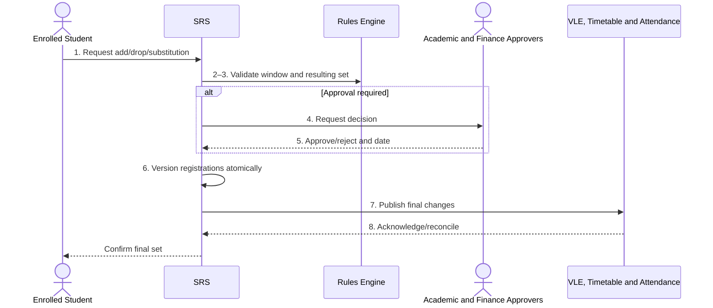

# BP-024 — Change a module registration

> Status: Draft
> Domain: 03 — Curriculum and module registration
> Owner: TBC
> Version: 0.1
> Last reviewed: 2026-07-26
> Review by: 2027-01-26

[Previous: BP-023](bp-023-validate-and-approve-module-selection.md) · [Domain index](README.md) · [Next: BP-025](bp-025-provision-confirmed-registrations.md) · [Library home](../README.md)

## Applicability

| Dimension | Applies |
|---|---|
| Common | UK |
| Nations | England; Scotland; Wales; Northern Ireland |
| Provider types | All modular provision |
| Levels and modes | UG; PGT; part-time and flexible provision particularly affected |
| Exclusions | Correction of erroneous historic registration after assessment/award lock |

## Traceability

| Type | References |
|---|---|
| Revelation workflows | Gap — no durable add/drop approval workflow |
| Reference-model flows | F003, F009, F011, F014–F015 |
| Functional requirements | REG-001–REG-007; ENR-003 |
| Data entities | `module_registration`, `module_offering`, `fee_liability`, assessment/exam entities where already created |
| Domain events | Module registered/registration withdrawn events |
| Integration contracts | Portal, Finance, Timetabling, Attendance and VLE contracts |

## Purpose and outcome

This process adds, drops, substitutes or corrects a module after an initial set was confirmed. It applies time-window, academic, fee, funding, assessment and downstream consequences and preserves the complete effective history.

## Scope

**Starts when:** Student/staff requests a change or an error/cancellation requires one.

**Ends when:** Change is rejected or all affected registration and downstream states are reconciled.

**In scope:** Add/drop/substitute, offering cancellation, semester correction and approved late change.

**Out of scope:** Post-ratification correction and programme transfer.

## Actors and responsibilities

| Actor/system | Responsibility |
|---|---|
| Enrolled Student | Requests change and acknowledges consequences |
| Rules Engine | Evaluates academic, capacity and timing constraints |
| Academic and Finance Approvers | Authorise academic, capacity and financial effects |
| Registry Administrator | Confirms effective date and late/error correction |
| SRS | Validates, versions and coordinates downstream deltas |
| VLE, Timetable and Attendance | Apply the authorised registration change |

**Accountable owner:** Registry/programme owner (TBC)

**System of record:** SRS for module registration; Finance for liability.

## Preconditions

1. Current confirmed registration set exists.
2. Change window/late authority and target offering are known.
3. Existing attendance, assessment, marks and downstream access can be assessed.

## Trigger

Change request, module cancellation or identified registration error.

## Main flow

1. **Student/authorised actor** specifies add, drop or substitution, requested effective date and reason.
2. **SRS** identifies window status and current academic, attendance, assessment, fee and downstream state.
3. **SRS/Rules Engine** validates the resulting complete module set, not only the requested module.
4. If required, **Academic Approver** and **Finance Administrator** assess exception, capacity and financial consequences.
5. **Registry Administrator** approves/rejects and determines effective date/authority.
6. **SRS** versions withdrawn and new registrations atomically, preserving original registration dates and correction provenance.
7. **SRS** publishes add/drop events and recalculates roster, access, timetable, assessment/exam and fee consequences.
8. **Target Systems** acknowledge; SRS reconciles failures and informs the student of the final set.

## Alternative flows

### A1 — Provider cancels/replaces module

- **A1.1** Offer valid alternatives, preserve provider-caused reason and avoid unfair student consequences.

### A4 — Late drop only

- **A4.1** Apply provider rules on credit load, mode classification, fees and assessment record; do not permit an add merely because a drop is allowed.

### A6 — Administrative correction

- **A6.1** Use claimed effective date only with evidence/authority and retain transaction-time history.

## Exception flows

### E3 — Marks/submissions already exist

- **E3.1** Stop automatic change and route to assessment/records governance; never orphan evidence.

### E8 — Partial downstream update

- **E8.1** Keep per-target add/drop state and reconcile from the authoritative final registration set.

## Postconditions

### Successful

- The effective module set remains rule-valid and all consequences are traceable.

### Unsuccessful or incomplete

- Existing set remains authoritative; request/decision and pending target failures remain visible.

## Business rules and controls

| ID | Classification | Rule/control | Applicability | Source |
|---|---|---|---|---|
| BR-1 | SECTOR | Module changes are deadline-controlled and require the formal record to be correct | UK | SRC-043–SRC-046 |
| BR-2 | INSTITUTIONAL | Late add/drop, approval, refund and mode consequences vary | UK | SRC-043–SRC-046 |
| BR-3 | REVELATION | Current service versions `registered` to `withdrawn` and emits an event | Revelation | Registration service |
| BR-4 | PROPOSED | Substitution must be atomic and assess assessment/fee/downstream consequences | Revelation target | Process analysis |

## National and institutional variations

### England

Providers commonly use early-semester change windows and school approval.

### Scotland

Course changes may be adviser-led and use Scottish “course enrolment” terminology.

### Wales

Programme approval and CQFW credit/load rules govern resulting validity.

### Northern Ireland

Ulster illustrates two-week windows and distinct after-deadline add/drop and fee/mode consequences.

### Institutional policy points

Window, late authority, effective date, fee/refund, assessment handling, substitution and cancellation remedy.

## Data impact

| Data concept | Action | System of record | Effective/provenance requirement | Sensitivity |
|---|---|---|---|---|
| Module registration | Version/add | SRS | Requested/effective/recorded dates, authority | Personal |
| Existing assessment | Read/reference | SRS/VLE | Prevent orphaning | Sensitive |
| Fee liability | Update | Finance | Change reference/date | Financial |

## Integration impact

| From | To | Information/purpose | Contract/pattern | Failure and reconciliation |
|---|---|---|---|---|
| Portal | SRS | Change request | `portal-self-service-update.v1` | Durable decision task |
| SRS | VLE/Timetable/Attendance/Finance | Registration delta/final state | Existing contracts | Event retry plus snapshot reconciliation |

## Sequence diagram

## Open questions and decisions

| ID | Question/decision | Owner | Status |
|---|---|---|---|
| OQ-1 | Add reason/authority/request date to module-registration history? | Data architect | Open |
| OQ-2 | Implement atomic substitution and assessment-impact guard? | Product owner | Open |

## Sources

| Source | Supported content |
|---|---|
| [SRC-043–SRC-046](../source-register.md) | Four-nation change patterns |
| [SRC-015–SRC-019](../source-register.md) | Revelation baseline |

## Related processes

[BP-023](bp-023-validate-and-approve-module-selection.md); [BP-025](bp-025-provision-confirmed-registrations.md); BP-033; BP-059.

## Review record

| Review | Reviewer | Date | Outcome |
|---|---|---|---|
| Research/documentation | Codex implementation role | 2026-07-26 | Drafted |
| Required reviews | TBC | — | Pending |

## Change history

| Version | Date | Author | Change |
|---|---|---|---|
| 0.1 | 2026-07-26 | Codex | Initial draft |
