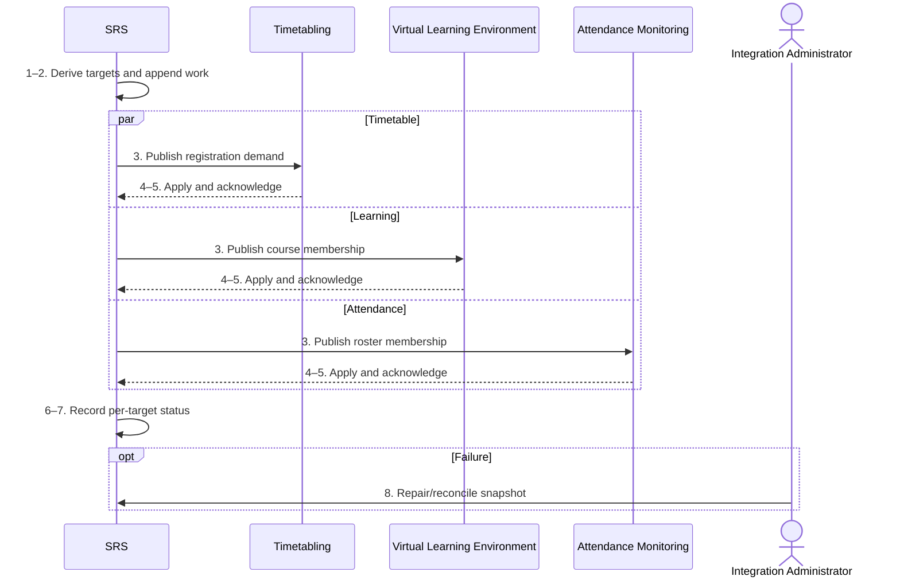

# BP-025 — Provision confirmed registrations downstream

> Status: Draft
> Domain: 03 — Curriculum and module registration
> Owner: TBC
> Version: 0.1
> Last reviewed: 2026-07-26
> Review by: 2027-01-26

[Previous: BP-024](bp-024-change-module-registration.md) · [Domain index](README.md) · [Next: BP-026](bp-026-establish-pgr-supervision.md) · [Library home](../README.md)

## Applicability

| Dimension | Applies |
|---|---|
| Common | UK |
| Nations | England; Scotland; Wales; Northern Ireland |
| Provider types | All with downstream learning/operations systems |
| Levels and modes | All modular provision; target matrix varies |
| Exclusions | Proposed/unapproved selections |

## Traceability

| Type | References |
|---|---|
| Revelation workflows | Gap — integration events/reconciliation, no end-to-end workflow |
| Reference-model flows | F003–F004, F014–F016; later F031/F061/F070 consumers |
| Functional requirements | REG-004–REG-007; VLE-001; ATT and portal requirements |
| Data entities | `module_registration`, `module_offering`, `student_timetable_entry`, `integration_exchange`, target mapping/ledger entities |
| Domain events | `srs.enrolment.module-registered`, module-registration withdrawn/completed |
| Integration contracts | `timetable-demand-feed.v1`, `attendance-roster-feed.v1`, `vle-course-provisioning.v1` |

## Purpose and outcome

This process distributes confirmed module registrations to systems that need them for teaching, learning access, timetabling and engagement. It records each target independently and reconciles final target state so event delivery is not mistaken for successful provisioning.

## Scope

**Starts when:** A module registration is confirmed, changed, withdrawn or superseded.

**Ends when:** Every applicable target acknowledges or has an owned reconciliation exception.

**In scope:** Timetable demand, VLE course access, attendance rosters and portal-visible state.

**Out of scope:** Module approval, timetable construction and mark return.

## Actors and responsibilities

| Actor/system | Responsibility |
|---|---|
| SRS | Authoritative registration and target worklist |
| Timetabling | Consumes demand and publishes timetable separately |
| Virtual Learning Environment | Applies course membership |
| Attendance Monitoring | Applies roster membership |
| Integration Administrator | Resolves failed/mismatched provisioning |

**Accountable owner:** Integration/Registry service owner (TBC)

**System of record:** SRS for registration; targets for applied operational state.

## Preconditions

1. Confirmed, effective module registration and offering exist.
2. Target mappings/contracts and identifiers are current.
3. Idempotency, retries, dead-letter and snapshot reconciliation are configured.

## Trigger

Confirmed add, withdrawal, completion, effective-date change or full reconciliation request.

## Main flow

1. **SRS** derives applicable targets from offering, mode, location and tenant configuration.
2. **SRS** appends one exchange item per target using stable registration/event identifiers and minimal data.
3. **SRS** publishes add/update/remove to **Timetabling**, **VLE** and **Attendance Monitoring**.
4. Each **Target System** validates mapping and applies idempotently.
5. Each **Target System** returns acknowledgement/current target reference.
6. **SRS** records per-target state, attempts and errors.
7. **SRS** exposes operational provisioning status without changing academic registration because a target failed.
8. **Integration Administrator** repairs mappings/replays or reconciles a current-state snapshot until explained.

## Alternative flows

### A1 — Target not applicable

- **A1.1** Record not applicable with rule/configuration basis; do not create a false pending item.

### A3 — Batch/snapshot provisioning

- **A3.1** Send period/offering snapshot with version/high-water mark and reconcile additions/removals.

### A3b — Future-dated registration

- **A3b.1** Publish only when contract supports future state or schedule at effective time.

## Exception flows

### E4 — Mapping missing

- **E4.1** Quarantine target item, alert owner and retain registration; never guess a course/activity ID.

### E5 — Conflicting acknowledgement

- **E5.1** Compare target state with authoritative snapshot, issue corrective add/remove and retain evidence.

## Postconditions

### Successful

- Target rosters/access/demand match authoritative effective registrations.

### Unsuccessful or incomplete

- Academic registration remains valid; target failure and student impact are visible/owned.

## Business rules and controls

| ID | Classification | Rule/control | Applicability | Source |
|---|---|---|---|---|
| BR-1 | SECTOR | Formal module registration controls teaching/access/assessment eligibility | UK | SRC-043–SRC-046 |
| BR-2 | REVELATION | F003, F014 and F015 publish confirmed registration data | Revelation | SRC-017, SRC-019 |
| BR-3 | PROPOSED | Per-target acknowledgement and snapshot reconciliation are mandatory | Revelation target | Integration architecture |
| BR-4 | PROPOSED | Downstream failure must not cause duplicate/repeated academic registration | Revelation target | Process control |

## National and institutional variations

### England

No national technical pattern; provider system landscape determines targets.

### Scotland

Course/class enrolment may require separate mappings below module/course level.

### Wales

Partner-delivered and bilingual service mappings may require distinct target ownership.

### Northern Ireland

Campus/online delivery may use different attendance and VLE services.

### Institutional policy points

Target applicability, provisional access, timing, class allocation, SLA, reconciliation cadence and student support route.

## Data impact

| Data concept | Action | System of record | Effective/provenance requirement | Sensitivity |
|---|---|---|---|---|
| Registration | Read | SRS | Effective current version | Personal |
| Exchange/target mapping | Append/update | SRS | Contract/version/attempt/ack | Personal |
| Target membership | Create/remove | Target | Source event/reference | Personal |

## Integration impact

| From | To | Information/purpose | Contract/pattern | Failure and reconciliation |
|---|---|---|---|---|
| SRS | Timetabling | Demand/registration | `timetable-demand-feed.v1` | Snapshot by period/offering |
| SRS | VLE | Course membership | `vle-course-provisioning.v1` | Event retry/DLQ/snapshot |
| SRS | Attendance Monitoring | Roster | `attendance-roster-feed.v1` | Event/file high-water mark |

## Sequence diagram

## Open questions and decisions

| ID | Question/decision | Owner | Status |
|---|---|---|---|
| OQ-1 | Generalise `adjustment_distribution` pattern for registration provisioning? | Data/integration architect | Open |
| OQ-2 | Does the VLE adapter persist complete add/remove reconciliation for every target? | Integration owner | Open |

## Sources

| Source | Supported content |
|---|---|
| [SRC-043–SRC-046](../source-register.md) | Formal-registration operational consequences |
| [SRC-015–SRC-019](../source-register.md) | Revelation contracts/data/events |

## Related processes

[BP-023](bp-023-validate-and-approve-module-selection.md); [BP-024](bp-024-change-module-registration.md); BP-027; BP-033.

## Review record

| Review | Reviewer | Date | Outcome |
|---|---|---|---|
| Research/documentation | Codex implementation role | 2026-07-26 | Drafted |
| Required reviews | TBC | — | Pending |

## Change history

| Version | Date | Author | Change |
|---|---|---|---|
| 0.1 | 2026-07-26 | Codex | Initial draft |

