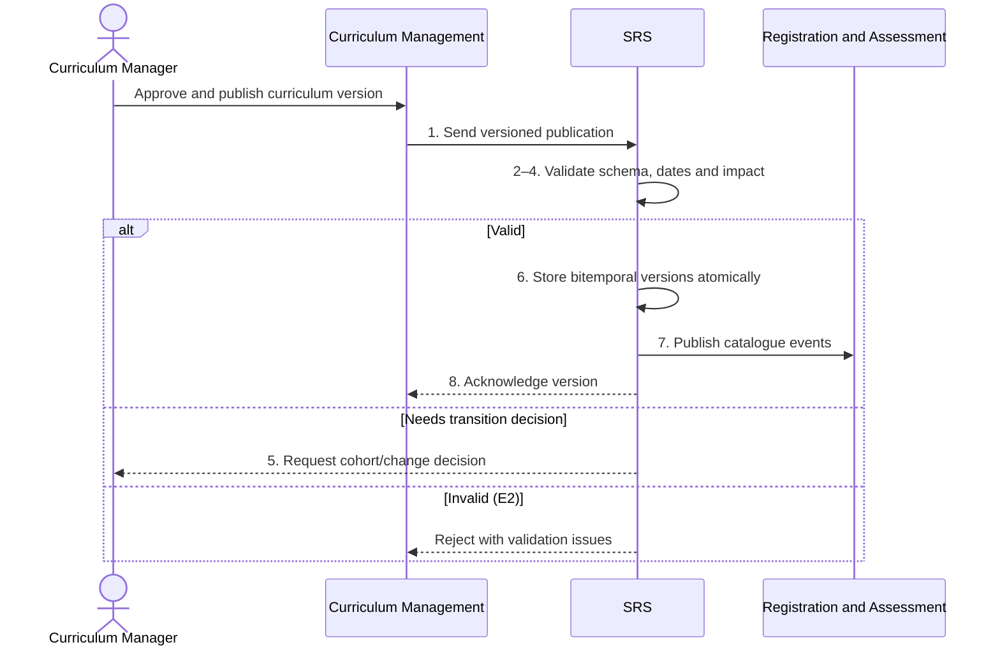

# BP-03-001 — Import and publish curriculum data to the SRS

> Status: Draft
> Domain: 03 — Curriculum and module registration
> Owner: TBC
> Version: 0.1
> Last reviewed: 2026-07-26
> Review by: 2027-01-26

[Domain index](README.md) · [Next: BP-03-002](bp-03-002-assign-programme-route-and-rules.md) · [Library home](../README.md)

## Applicability

| Dimension | Applies |
|---|---|
| Common | UK |
| Nations | England; Scotland; Wales; Northern Ireland |
| Provider types | All; awarding/teaching responsibility must be explicit for collaborative provision |
| Levels and modes | UG; PGT; PGR; apprenticeships, CPD and short credit-bearing provision where configured |
| Exclusions | Academic approval itself; this process consumes an authorised curriculum outcome |

## Traceability

| Type | References |
|---|---|
| Revelation workflows | Gap — no durable publication workflow |
| Reference-model flows | F001 inbound; F002 feedback |
| Functional requirements | CAT-001–CAT-009 |
| Data entities | `awarding_body`, `programme`, `programme_route`, `programme_rule_set`, `module`, `module_relationship`, `learning_outcome`, `assessment_pattern`, `academic_period`, `module_offering` |
| Domain events | Catalogue programme/module/relationship/learning-outcome updated events |
| Integration contracts | `curriculum-catalogue-sync.v1`, `curriculum-performance-metrics.v1` |

## Purpose and outcome

This process makes an approved curriculum version available to the SRS for a stated effective period. It preserves programme, route, module, credit, level, learning-outcome, assessment, relationship and delivery facts so that student records can always be reconstructed against the curriculum that applied to them.

## Scope

**Starts when:** Curriculum Management releases an approved publication/version.

**Ends when:** The SRS has validated, versioned and acknowledged the publication, or rejected it without damaging the current catalogue.

**In scope:** New and changed programmes/modules, closures, routes, rules, assessment structures, offerings and collaborative ownership.

**Out of scope:** Curriculum design/committee approval and assigning a version to an individual student.

## Actors and responsibilities

| Actor/system | Responsibility |
|---|---|
| Curriculum Manager `PROPOSED` | Confirms approval, completeness, effective date and publication authority |
| Curriculum Management | Authoritative source for approved curriculum definitions |
| SRS | Validates referential/temporal integrity and stores governed copies |
| Registry Administrator | Resolves publication exceptions affecting students |
| Registration and Assessment | Consume the published curriculum version |

**Accountable owner:** Academic quality/curriculum owner (TBC)

**System of record:** Curriculum Management for approved curriculum; SRS for the version used by each student transaction.

## Preconditions

1. The curriculum proposal has completed the provider's approval route.
2. Stable source identifiers, approval reference and effective date exist.
3. Related value sets, awarding bodies and academic periods are available.

## Trigger

Curriculum Management publishes an approved version or scheduled full snapshot.

## Main flow

1. **Curriculum Management** sends a versioned publication with source IDs, approval reference, effective dates and complete related structures.
2. **SRS** authenticates the source and validates schema, value sets, references, dates and identifier uniqueness.
3. **SRS** compares the publication with current and future versions and classifies additions, changes, closures and unchanged records.
4. **SRS** checks for unsafe retrospective changes, overlapping effective periods and impact on existing/future students.
5. **Registry Administrator/Curriculum Manager** resolves any change requiring explicit cohort transition or student communication.
6. **SRS** closes superseded transaction/effective versions and inserts the authorised new versions atomically.
7. **SRS** publishes catalogue events and makes the version available to registration, assessment, reporting and integrations.
8. **SRS** acknowledges the source publication with accepted/rejected counts, version and reconciliation reference.

## Alternative flows

### A1 — Full snapshot

- **A1.1** Reconcile every source object and treat absent objects as closures only when the contract explicitly defines that semantic.

### A4 — Future-dated change

- **A4.1** Store alongside the current version and activate only at its effective point.

### A5 — Existing-cohort protection

- **A5.1** Create a cohort/route transition rule instead of applying the new structure indiscriminately.

## Exception flows

### E2 — Invalid or incomplete publication

- **E2.1** Reject/quarantine the whole atomic unit, retain the prior version and return precise validation issues.

### E4 — Retrospective correction

- **E4.1** Require authorised correction rationale and assess student/result/regulatory consequences before recording both effective and transaction times.

## Postconditions

### Successful

- Approved curriculum versions are complete, effective-dated, traceable and safe for downstream use.

### Unsuccessful or incomplete

- The last accepted catalogue remains authoritative and the source owns correction/resubmission.

## Business rules and controls

| ID | Classification | Rule/control | Applicability | Source |
|---|---|---|---|---|
| BR-1 | SECTOR | Curriculum creation/change requires defined approval and management responsibility | UK | SRC-038–SRC-042 |
| BR-2 | INSTITUTIONAL | Approval route and material/minor change classification vary | UK | SRC-039–SRC-042 |
| BR-3 | REVELATION | Programme/module definitions and relationships are bitemporal; offerings are period-specific | Revelation | SRC-018 |
| BR-4 | PROPOSED | Publication is atomic and includes approval/effective/source-version provenance | Revelation target | Process analysis |

## National and institutional variations

### England

QAA reference points inform sector practice; provider approval and OfS/CMA obligations remain provider-specific.

### Scotland

Providers may use “course” for a module and route changes through school/college/university committees.

### Wales

CQFW and bilingual/collaborative documentation may be material to approved versions.

### Northern Ireland

Provider programme/module review bodies determine approval and student-notification requirements.

### Institutional policy points

Approval authority, materiality, lead time, student consultation, PSRB/partner approval, closure semantics and retrospective correction.

## Data impact

| Data concept | Action | System of record | Effective/provenance requirement | Sensitivity |
|---|---|---|---|---|
| Curriculum structures | Create/version/close | Curriculum Management/SRS copy | Source/approval/effective version | Standard |
| Assessment/rules | Create/version | Curriculum Management/SRS | Cohort-safe binding | Standard |
| Publication exchange | Append | SRS | Counts/hash/status/errors | Standard |

## Integration impact

| From | To | Information/purpose | Contract/pattern | Failure and reconciliation |
|---|---|---|---|---|
| Curriculum Management | SRS | Approved catalogue | `curriculum-catalogue-sync.v1` | Reject, retain prior, full snapshot replay |
| SRS | Curriculum Management | Performance feedback | `curriculum-performance-metrics.v1` | Period snapshot/replay |

## Sequence diagram

## Open questions and decisions

| ID | Question/decision | Owner | Status |
|---|---|---|---|
| OQ-1 | Are route/rule/assessment/offering imports complete in the current F001 implementation? | Integration/product owner | Open |
| OQ-2 | Add publication/version entity and atomic reconciliation report? | Data architect | Open |

## Sources

| Source | Supported content |
|---|---|
| [SRC-038–SRC-042](../source-register.md) | UK and four-nation curriculum governance |
| [SRC-015–SRC-019](../source-register.md) | Revelation design baseline |

## Related processes

[BP-03-002](bp-03-002-assign-programme-route-and-rules.md); BP-05-001; BP-07-008.

## Review record

| Review | Reviewer | Date | Outcome |
|---|---|---|---|
| Research/documentation | Codex implementation role | 2026-07-26 | Drafted |
| Curriculum/national/integration/data/product/editorial reviews | TBC | — | Pending |

## Change history

| Version | Date | Author | Change |
|---|---|---|---|
| 0.1 | 2026-07-26 | Codex | Initial UK-wide draft |
