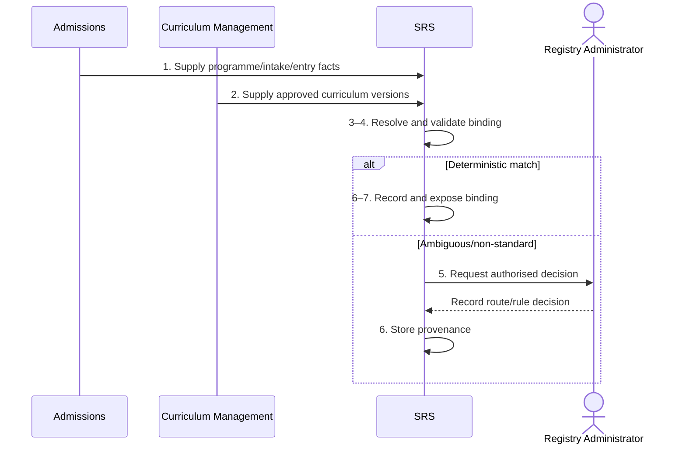

# BP-03-002 — Assign a programme route and rule set

> Status: Draft
> Domain: 03 — Curriculum and module registration
> Owner: TBC
> Version: 0.1
> Last reviewed: 2026-07-26
> Review by: 2027-01-26

[Previous: BP-03-001](bp-03-001-import-and-publish-curriculum-data.md) · [Domain index](README.md) · [Next: BP-03-003](bp-03-003-select-modules.md) · [Library home](../README.md)

## Applicability

| Dimension | Applies |
|---|---|
| Common | UK |
| Nations | England; Scotland; Wales; Northern Ireland |
| Provider types | All |
| Levels and modes | UG; PGT; PGR where structured route/rules apply |
| Exclusions | A later transfer, handled by BP-02-006 |

## Traceability

| Type | References |
|---|---|
| Revelation workflows | W001 partial; no dedicated assignment workflow |
| Reference-model flows | F-CM-SIS-01, F-CRM-SIS-01, F-UCAS-SIS-01 |
| Functional requirements | CAT-001, CAT-007–CAT-009; ENR-001, ENR-009 |
| Data entities | `enrolment`, `programme`, `programme_route`, `programme_rule_set`, `academic_rule`, `enrolment_curriculum_binding` |
| Domain events | No dedicated binding-created event yet — the binding is created synchronously as a side effect of the first module selection proposal (`ModuleSelectionService#resolveCurriculumBinding`) |
| Integration contracts | Curriculum and admissions contracts |

## Purpose and outcome

When a student enrols, they need to be tied to one specific, fixed version of their programme's rules: which route or pathway they're on, which cohort (year group) they belong to, and which set of regulations governs their module choices, progression and eventual award. This process makes that binding explicit and fixed at the point of assignment, so that when the curriculum team later revises the programme — a routine and expected occurrence — an existing student's rules don't silently change underneath them. They continue under the version they were assigned to unless a formal, authorised transfer says otherwise.

## Scope

**Starts when:** Initial registration or an authorised transfer needs a curriculum/rule binding.

**Ends when:** A valid effective-dated binding exists or an exception is owned.

**In scope:** Cohort, entry point, pathway/specialism, mode and transitional rule assignment.

**Out of scope:** Deciding admission, curriculum approval and later transfer.

## Actors and responsibilities

| Actor/system | Responsibility |
|---|---|
| Registry Administrator | Confirms student-specific route/cohort |
| Curriculum Management | Supplies approved route/rule definitions |
| SRS | Resolves deterministic binding and preserves history |
| Academic Approver `PROPOSED` | Authorises non-standard assignment |

**Accountable owner:** Registry/curriculum owner (TBC)

**System of record:** SRS for student binding; Curriculum Management for definitions.

## Preconditions

1. Active/future enrolment and accepted curriculum version exist.
2. Entry year/point, mode and programme are known.
3. Rule precedence and exception authority are configured.

## Trigger

Initial enrolment confirmation, future-dated transfer or authorised correction.

## Main flow

1. **SRS** reads the enrolment programme, intake, entry year/point, mode and declared route.
2. **SRS** finds curriculum versions effective for the student's start/cohort.
3. **SRS** applies deterministic precedence to select programme route and rule set.
4. **SRS** validates that the route supports the intended award, mode, level and module diet.
5. **Registry Administrator** reviews ambiguity or non-standard entry/credit cases.
6. **SRS** records the binding with effective/transaction dates, source version and decision authority.
7. **SRS** exposes the binding to module selection, progression, assessment and reporting.
8. **SRS** notifies Registry if a future curriculum publication threatens an existing binding.

## Alternative flows

### A3 — No named route

- **A3.1** Apply the programme-wide rule set and record route as not applicable, not unknown.

### A5 — Advanced entry or recognised prior credit

- **A5.1** Academic approver records entry level, recognised credit and any approved replacement/diet rules.

### A5b — Transitional curriculum

- **A5b.1** Bind the student to an approved teach-out/transition version rather than the newest catalogue indiscriminately.

## Exception flows

### E3 — Multiple/no matching rule sets

- **E3.1** Stop automatic assignment and create a curriculum data-quality task.

### E8 — Curriculum version withdrawn

- **E8.1** Preserve existing valid binding while authorised replacement/transition is decided.

## Postconditions

### Successful

- One explainable effective route/rule binding governs downstream decisions.

### Unsuccessful or incomplete

- Module/progression decisions are blocked from using an arbitrary default.

## Business rules and controls

| ID | Classification | Rule/control | Applicability | Source |
|---|---|---|---|---|
| BR-1 | SECTOR | Programme structures define compulsory/optional study and award outcomes | UK | SRC-038–SRC-045 |
| BR-2 | INSTITUTIONAL | Cohort, route and transition rules vary | UK | SRC-039–SRC-045 |
| BR-3 | REVELATION | `programme_rule_set` supports route and entry-academic-year binding | Revelation | SRC-018 |
| BR-4 | REVELATION | Binding decision and source curriculum version are explicit: `enrolment_curriculum_binding` is a bitemporal table recording `programme_route_id`, `programme_rule_set_id`, `decision_authority_code` (`automatic`\|`registry-administrator`\|`academic-approver`) and `decision_reason`. Created automatically (preferring the route/entry-year-agnostic default rule set) on first module selection proposal, or explicitly via `POST /api/v1/enrolment-curriculum-bindings/:enrolmentId` for a registry administrator override (main flow / A5) | Revelation | `apps/api/src/platform/module-selection/service.ts` |

## National and institutional variations

### England

Providers define programme diets/routes and obligations to communicate material changes.

### Scotland

Degree programme and course terminology/structures may differ; Scottish qualification/credit frameworks must be represented correctly.

### Wales

CQFW levels and collaborative/validated programme ownership may affect rule binding.

### Northern Ireland

Provider programme approval and module-change rules determine current/teach-out structures.

### Institutional policy points

Rule precedence, route declaration timing, advanced entry, teach-out, student consent and exception authority.

## Data impact

| Data concept | Action | System of record | Effective/provenance requirement | Sensitivity |
|---|---|---|---|---|
| Student route/rule binding | Create/version | SRS | Curriculum version, cohort and authority | Sensitive |
| Recognised credit/entry | Read/reference | SRS | Decision provenance | Sensitive |

## Integration impact

| From | To | Information/purpose | Contract/pattern | Failure and reconciliation |
|---|---|---|---|---|
| Curriculum Management | SRS | Route/rule versions | F-CM-SIS-01 contract | Reject/replay publication |
| Admissions | SRS | Intended programme/route/intake | Admissions contracts | Resolve source mismatch |

## Sequence diagram

## Open questions and decisions

| ID | Question/decision | Owner | Status |
|---|---|---|---|
| OQ-1 | Enrolment currently has programme but no explicit route/rule-set FK; add a binding entity? | Data architect | **Resolved** (2026-08-02) — `enrolment_curriculum_binding` added; see [docs/architecture/module-selection-rules.md](../../architecture/module-selection-rules.md) |
| OQ-2 | How are recognised-credit/diet exceptions represented? | Product/data owner | Open — RPL/recognised-credit modelling is not yet implemented; the current design (`module_group.min_modules`/`min_credits`) covers diet composition and count/credit exceptions via approver decision (BR-4/A5b of BP-03-004) but not formal RPL credit transfer |

## Sources

| Source | Supported content |
|---|---|
| [SRC-038–SRC-045](../source-register.md) | Curriculum structures and national/provider variants |
| [SRC-015–SRC-019](../source-register.md) | Revelation baseline |

## Related processes

[BP-03-001](bp-03-001-import-and-publish-curriculum-data.md); [BP-03-003](bp-03-003-select-modules.md); BP-02-006; BP-06-001.

## Review record

| Review | Reviewer | Date | Outcome |
|---|---|---|---|
| Research/documentation | Codex implementation role | 2026-07-26 | Drafted |
| Required reviews | TBC | — | Pending |

## Change history

| Version | Date | Author | Change |
|---|---|---|---|
| 0.1 | 2026-07-26 | Codex | Initial draft |
| 0.2 | 2026-08-02 | Claude | Resolved OQ-1: implemented `enrolment_curriculum_binding` and the automatic/override binding flow. See [docs/architecture/module-selection-rules.md](../../architecture/module-selection-rules.md) |

