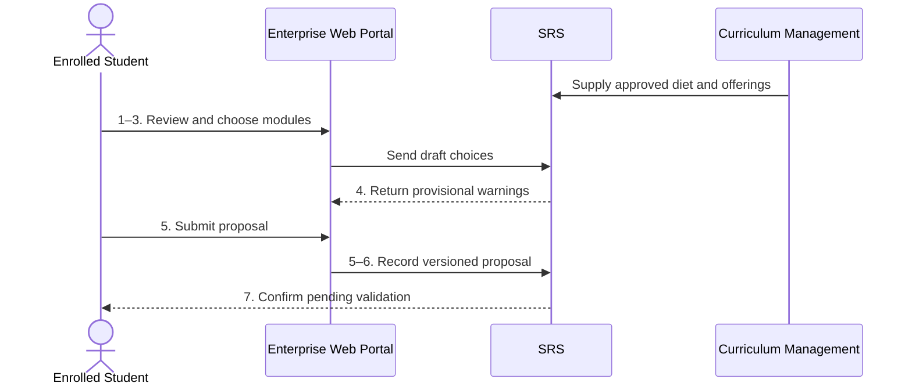

# BP-03-003 — Select modules

> Status: Draft
> Domain: 03 — Curriculum and module registration
> Owner: TBC
> Version: 0.1
> Last reviewed: 2026-07-26
> Review by: 2027-01-26

[Previous: BP-03-002](bp-03-002-assign-programme-route-and-rules.md) · [Domain index](README.md) · [Next: BP-03-004](bp-03-004-validate-and-approve-module-selection.md) · [Library home](../README.md)

## Applicability

| Dimension | Applies |
|---|---|
| Common | UK |
| Nations | England; Scotland; Wales; Northern Ireland |
| Provider types | All modular taught provision |
| Levels and modes | UG; PGT; full-time; part-time; distance; placement as applicable |
| Exclusions | PGR programmes without taught/module choices |

## Traceability

| Type | References |
|---|---|
| Revelation workflows | `module-selection-approval` (workflow_definition), used only for the exception path in BP-03-004 — the proposal-capture step itself has no workflow instance |
| Reference-model flows | F-EWP-SIS-01 |
| Functional requirements | REG-001–REG-003; EWP-002 |
| Data entities | `enrolment`, `programme_rule_set`, `module`, `module_offering`, `module_relationship`, `module_registration`, `module_group`, `module_group_member`, `module_selection_proposal`, `module_selection_proposal_item` |
| Domain events | `srs.enrolment.module-selection-proposal-submitted` fires on submission (BP-03-004 picks up from there); no event on draft creation/edit |
| Integration contracts | `portal-self-service-update.v1` |

## Purpose and outcome

For each study period, a student needs to choose their optional or elective modules — compulsory modules are added automatically and never need choosing — from the module diet their route and level actually permit. This process captures that choice as a proposal: it is not yet a confirmed registration, only a complete, submitted set of preferences ready for the checks and approvals carried out in the next process.

## Scope

**Starts when:** An eligible module-selection window opens.

**Ends when:** A complete proposal is submitted to BP-03-004 or the student is told why submission is not possible.

**In scope:** Compulsory allocation, options/electives, ranked alternatives and cross-school choices.

**Out of scope:** Approval/confirmation and later changes.

## Actors and responsibilities

| Actor/system | Responsibility |
|---|---|
| Enrolled Student | Makes informed choices and ranks alternatives |
| Personal Tutor/Programme Adviser `PROPOSED` | Gives academic advice |
| SRS | Presents only the applicable diet/offerings and records proposal |
| Curriculum Management | Supplies approved diet, relationships and descriptions |
| Enterprise Web Portal | Presents choices and receives the student's proposed selection |

**Accountable owner:** Programme/Registry owner (TBC)

**System of record:** SRS for proposal; Curriculum Management for module/diet definitions.

## Preconditions

1. Active/eligible enrolment and route/rule binding exist.
2. Selection window and period-specific module offerings are published.
3. Completed/current study and recognised credit are available for validation.

## Trigger

Selection window opens or an authorised actor invites/resets selection.

## Main flow

1. **SRS** loads the student's route, level, rule set, completed/current modules and applicable offerings.
2. **SRS** pre-populates compulsory modules and presents option/elective groups, credits, periods, delivery, prerequisites, restrictions and capacity status.
3. **Student** reviews advice/module information and selects choices plus ranked alternatives where required.
4. **SRS** gives immediate provisional warnings for duplicate study, missing prerequisites/co-requisites, exclusions, credit/load imbalance and obvious timetable/capacity issues.
5. **Student** revises or submits the complete proposal and any permitted rationale.
6. **SRS** records the proposal, source curriculum/rule version, actor/time/channel and preferences without yet treating provisional choices as registered.
7. **SRS** routes the proposal to BP-03-004 and confirms submission to the student.

## Alternative flows

### A2 — No choice

- **A2.1** Present compulsory allocation for review and submit it automatically or with acknowledgement under provider policy.

### A3 — Ranked/oversubscribed options

- **A3.1** Collect more preferences than required and preserve priority/order for allocation.

### A3b — Cross-school/external module

- **A3b.1** Capture teaching-unit and any external-provider approval requirement.

### A5 — Staff-assisted selection

- **A5.1** Record acting staff member, authority and student consultation.

## Exception flows

### E1 — Wrong route/rule binding

- **E1.1** Stop selection and route to BP-03-002/BP-02-006 rather than offering an arbitrary diet.

### E4 — Catalogue changes during session

- **E4.1** Pin the proposal to its version, explain material change and require explicit revalidation.

## Postconditions

### Successful

- A versioned, complete proposal and ranked alternatives await validation.

### Unsuccessful or incomplete

- No confirmed registration or downstream access is created.

## Business rules and controls

| ID | Classification | Rule/control | Applicability | Source |
|---|---|---|---|---|
| BR-1 | SECTOR | Programme diets distinguish compulsory, optional and elective study | UK | SRC-043–SRC-046 |
| BR-2 | SECTOR | Normal full-time taught load is commonly 120 UK credits annually, but programme/mode rules govern | UK | SRC-043–SRC-046 |
| BR-3 | INSTITUTIONAL | Windows, ranking, cross-school choice and pre-selection vary | UK | SRC-043–SRC-046 |
| BR-4 | REVELATION | Proposed choices are distinct from confirmed `module_registration`: `module_selection_proposal`/`module_selection_proposal_item` hold the draft/submitted/validated/returned/waitlisted state; `module_registration` rows are only created once BP-03-004 confirms the proposal | Revelation | `apps/api/src/platform/module-selection/service.ts` |
| BR-5 | GAP | Selection windows (open/close dates per period/cohort) are not yet enforced — a proposal can be created at any time | Revelation gap | Process analysis |
| BR-6 | GAP | Ranked/oversubscribed preference ordering (A3) is not yet modelled — `preference_rank` exists on `module_selection_proposal_item` but allocation logic does not yet consume it; oversubscription is currently all-or-nothing per module (BP-03-004 A5 waitlist) | Revelation gap | Process analysis |

## National and institutional variations

### England

Programme diets and parent/teaching department approvals are common institutional constructs.

### Scotland

Providers often use “course enrolment”; Scottish credit structures and adviser processes apply.

### Wales

CQFW-aligned structures and provider programme rules determine credits/options.

### Northern Ireland

Provider regulations define credit loads, deadlines and module amendment authority.

### Institutional policy points

Window, compulsory auto-allocation, preference ranking, timetable warning, reservation/capacity and adviser involvement.

## Data impact

| Data concept | Action | System of record | Effective/provenance requirement | Sensitivity |
|---|---|---|---|---|
| Selection proposal/preferences | Create/version | SRS | Curriculum/rule version and actor/time | Personal |
| Compulsory allocation | Derive | SRS | Rule source | Personal |

## Integration impact

| From | To | Information/purpose | Contract/pattern | Failure and reconciliation |
|---|---|---|---|---|
| Portal | SRS | Proposed choices/preferences | `portal-self-service-update.v1` | Idempotent submission/draft recovery |
| Curriculum Management | SRS | Diet/offering descriptions | F-CM-SIS-01 | Publication reconciliation |

## Sequence diagram

## Open questions and decisions

| ID | Question/decision | Owner | Status |
|---|---|---|---|
| OQ-1 | Add selection proposal/preference entities and draft/pending statuses? | Data/product owner | **Resolved** (2026-08-02) — `module_selection_proposal`/`module_selection_proposal_item` implemented with the full status lifecycle (`draft`→`submitted`→`validated`/`returned`/`waitlisted`→`approved`/`rejected`→`confirmed`); see [docs/architecture/module-selection-rules.md](../../architecture/module-selection-rules.md) |

## Sources

| Source | Supported content |
|---|---|
| [SRC-043–SRC-046](../source-register.md) | Four-nation module-choice patterns |
| [SRC-015–SRC-019](../source-register.md) | Revelation baseline |

## Related processes

[BP-03-002](bp-03-002-assign-programme-route-and-rules.md); [BP-03-004](bp-03-004-validate-and-approve-module-selection.md); BP-02-010.

## Review record

| Review | Reviewer | Date | Outcome |
|---|---|---|---|
| Research/documentation | Codex implementation role | 2026-07-26 | Drafted |
| Required reviews | TBC | — | Pending |

## Change history

| Version | Date | Author | Change |
|---|---|---|---|
| 0.1 | 2026-07-26 | Codex | Initial draft |
| 0.2 | 2026-08-02 | Claude | Resolved OQ-1: implemented proposal/item entities, portal selection UI, and diet-group presentation. Flagged BR-5 (selection windows) and BR-6 (ranked preference allocation) as remaining gaps. See [docs/architecture/module-selection-rules.md](../../architecture/module-selection-rules.md) |
