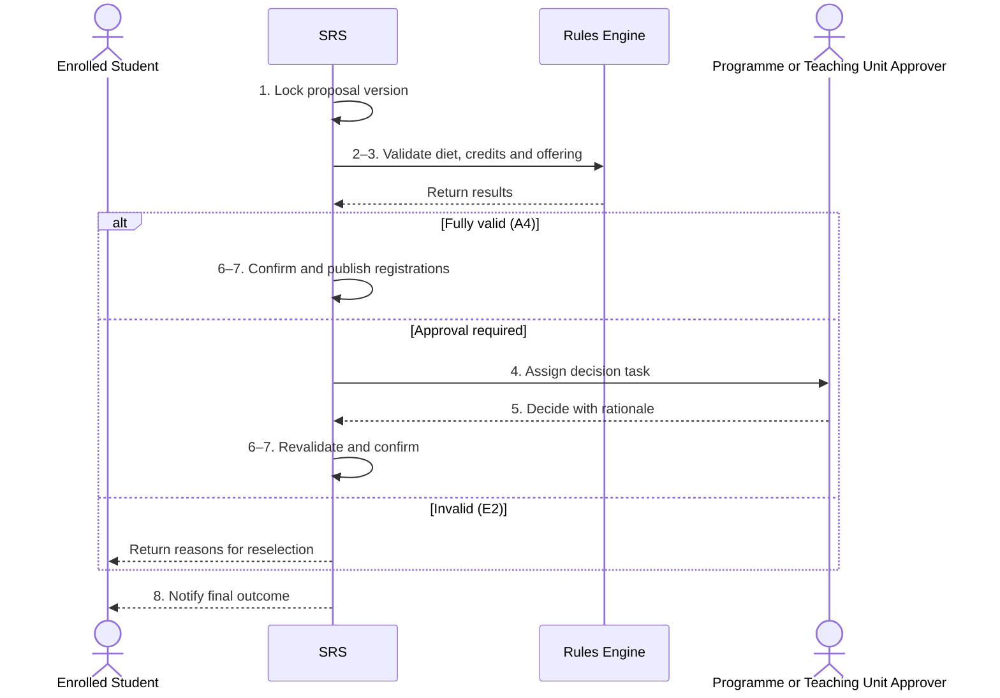

# BP-03-004 — Validate and approve module selection

> Status: Draft
> Domain: 03 — Curriculum and module registration
> Owner: TBC
> Version: 0.1
> Last reviewed: 2026-07-26
> Review by: 2027-01-26

[Previous: BP-03-003](bp-03-003-select-modules.md) · [Domain index](README.md) · [Next: BP-03-005](bp-03-005-change-module-registration.md) · [Library home](../README.md)

## Applicability

| Dimension | Applies |
|---|---|
| Common | UK |
| Nations | England; Scotland; Wales; Northern Ireland |
| Provider types | All modular provision |
| Levels and modes | UG; PGT; taught elements of other awards |
| Exclusions | Automatic compulsory allocation with no exception |

## Traceability

| Type | References |
|---|---|
| Revelation workflows | `module-selection-approval` (workflow_definition, seeded in migration `0005_module_selection_rules.sql`) — started only for the exception path (A5/A5b); the fully-valid automatic path (A4) never creates a workflow instance |
| Reference-model flows | F-EWP-SIS-01; enables F-SIS-TTB-01/F-SIS-AM-01/F-SIS-VLE-01 |
| Functional requirements | REG-001–REG-003 |
| Data entities | `module_registration`, `module_offering`, `module_relationship`, `programme_rule_set`, `academic_rule`, `module_group`, `module_group_member`, `module_selection_proposal`, `module_selection_proposal_item`, `workflow_instance`, `workflow_task` |
| Domain events | `srs.enrolment.module-selection-proposal-submitted`, `srs.enrolment.module-selection-proposal-decided`, `srs.enrolment.module-registered` |
| Integration contracts | Portal self-service; downstream contracts only after confirmation |

## Purpose and outcome

A student's proposed module choices need to be checked against the rules that actually govern their curriculum before they can count as a real registration: do they add up to the right amount of credit, do they come from the module diet actually available to that route, level and period, are prerequisites met and mutually-exclusive combinations avoided, is there capacity on each module, and does anyone with academic authority need to approve an unusual combination? This process runs those checks and confirms a registration only once every applicable rule and required approval is satisfied — a proposal that fails a check is returned or held for a decision, never silently confirmed.

## Scope

**Starts when:** BP-03-003 submits a complete proposal.

**Ends when:** Registrations are confirmed, returned for reselection, waitlisted, or rejected with reasons.

**In scope:** Automated and human validation, allocation and exception approval.

**Out of scope:** Student choice capture and later amendments.

## Actors and responsibilities

| Actor/system | Responsibility |
|---|---|
| SRS | Holds proposed selection and resulting registration state |
| Rules Engine | Performs deterministic validation |
| Programme or Teaching Unit Approver `PROPOSED` | Owns programme, capacity and prerequisite exceptions |
| Registry Administrator | Records exceptional authority and final state |
| Enrolled Student | Reselects or receives outcome |

**Accountable owner:** Programme/Registry owner (TBC)

**System of record:** SRS for confirmed module registrations and approval provenance.

## Preconditions

1. Versioned proposal, route/rule binding and offerings exist.
2. Completed/current registrations and recognised credit are current.
3. Approval responsibilities and exception limits are configured.

## Trigger

Submission of a module-selection proposal.

## Main flow

1. **SRS** locks the proposal version for evaluation.
2. **Rules Engine** validates compulsory/option groups, total/period/level credits, duplicate/repeat rules, prerequisites, co-requisites and exclusions.
3. **SRS** validates offering capacity, delivery eligibility and known timetable/assessment constraints.
4. **SRS** routes only unresolved or policy-defined choices to the appropriate programme/teaching-unit approver.
5. **Approver** approves, rejects, substitutes, waitlists or requests evidence within delegated authority.
6. **Registry Administrator/SRS** confirms an internally consistent final set and records rules version, decision, authority and rationale.
7. **SRS** creates bitemporal `registered` module registrations and publishes one idempotent event per confirmed registration.
8. **SRS** notifies the student and starts BP-03-006.

## Alternative flows

### A4 — Fully valid automatic approval

- **A4.1** Skip human approval; retain the exact validation/rule version as decision evidence.

### A5 — Capacity allocation/waitlist

- **A5.1** Preserve ranked preference and allocation priority; do not create a confirmed registration until allocated.

### A5b — Authorised exception

- **A5b.1** Record rule failed, authority, rationale, scope and expiry; never weaken the underlying rule globally.

## Exception flows

### E2 — Invalid set

- **E2.1** Return actionable reasons and permitted alternatives to BP-03-003 without partial hidden registration.

### E6 — Concurrent approval changes conflict

- **E6.1** Re-run validation against the locked/latest set and require a coherent final decision.

## Postconditions

### Successful

- Confirmed registrations form an auditable, rule-valid set and are ready for provisioning.

### Unsuccessful or incomplete

- Proposal status/reasons/waitlist remain; no unapproved downstream enrolment is published.

## Business rules and controls

| ID | Classification | Rule/control | Applicability | Source |
|---|---|---|---|---|
| BR-1 | SECTOR | Prerequisite, co-requisite, diet, credit and approval controls are common | UK | SRC-043–SRC-046 |
| BR-2 | INSTITUTIONAL | Parent/teaching-unit authority, capacity and timetable checks vary | UK | SRC-043–SRC-046 |
| BR-3 | REVELATION | `ModuleSelectionService#submitProposal` validates: duplicate module selection; prerequisite/co-requisite/exclusion (`module_relationship`, co-requisites additionally satisfied by a sibling item in the same proposal); diet-group count/credit bounds (`module_group`); `credit-load-requirement` and `level-credit-requirement`/`adjacent-level-credit-limit` rules (mode-of-study and FHEQ-level aware); and offering capacity | Revelation | `apps/api/src/platform/module-selection/service.ts` |
| BR-4 | REVELATION | A fully valid proposal with capacity available confirms automatically (A4) by creating `module_registration` rows via the existing `ModuleRegistrationService`. A capacity conflict alone routes to a `programme-approver` via the `module-selection-approval` workflow and a waitlist status, without failing the whole proposal (A5). Any rule violation returns the proposal with itemised, per-item validation messages (E2) — never a silent partial registration | Revelation | `apps/api/src/platform/module-selection/service.ts`; `apps/api/src/routes/module-selection-proposals.ts` |
| BR-5 | REVELATION gap | Timetable clash detection (OQ-2) is not implemented: the schema and rules engine expose a configurable `timetable-clash-policy` (`advisory`\|`blocking`, default `advisory`), but there is no timetable-slot data model yet to actually detect a clash against — the policy getter exists ahead of the check it would gate | Revelation gap | `apps/api/src/platform/rules-engine/engine.ts` |
| BR-6 | REVELATION gap | Joint-honours credit balance and repeat-module requirements are named in the rules taxonomy (`joint-honours-balance`, `repeat-module-requirement` rule types) but not yet consumed by `validateSelection` — there is no "subject area" attribute on programme/module to make the former real, and the latter needs progression/fail data wired in | Revelation gap | `docs/architecture/module-selection-rules.md` |

## National and institutional variations

### England

Some providers require both programme-owning and teaching-unit approval.

### Scotland

Adviser/course enrolment models and credit/load conventions vary by provider.

### Wales

Programme rules and CQFW-aligned credit levels inform validation.

### Northern Ireland

Provider credit loads and director/module-coordinator approvals govern exceptions.

### Institutional policy points

Approval routing, waitlist priority, timetable enforcement, exception authority, reservation and substitution.

## Data impact

| Data concept | Action | System of record | Effective/provenance requirement | Sensitivity |
|---|---|---|---|---|
| Validation/approval | Create | SRS | Rule version/results/authority | Sensitive |
| Module registration | Create/version | SRS | Effective/registration dates | Personal |
| Waitlist/allocation | Create/update | SRS | Priority and fair-decision evidence | Personal |

## Integration impact

| From | To | Information/purpose | Contract/pattern | Failure and reconciliation |
|---|---|---|---|---|
| Portal/SRS | Approvers | Human task and decision | Gap — workflow/UI contract needed | Durable task/escalation |
| SRS | Event bus | Confirmed registration | Module-registered event | Outbox/idempotent publish |

## Sequence diagram

## Open questions and decisions

| ID | Question/decision | Owner | Status |
|---|---|---|---|
| OQ-1 | Add proposal, approval, exception and waitlist entities/statuses? | Data/product owner | **Resolved** (2026-08-02) — `module_selection_proposal` status lifecycle (`draft`/`submitted`/`validated`/`approved`/`returned`/`waitlisted`/`rejected`/`confirmed`) plus the `module-selection-approval` workflow for exception decisions; see [docs/architecture/module-selection-rules.md](../../architecture/module-selection-rules.md) |
| OQ-2 | Is timetable clash hard validation or advisory by tenant/programme? | Curriculum owner | **Partially resolved** — the policy is configurable per tenant/programme (`timetable-clash-policy` rule, default `advisory`) but no clash is actually detected yet, since there is no timetable-slot entity in the current data model (BR-5 gap) |

## Sources

| Source | Supported content |
|---|---|
| [SRC-043–SRC-046](../source-register.md) | Validation/approval practice |
| [SRC-015–SRC-019](../source-register.md) | Revelation requirements/design |

## Related processes

[BP-03-003](bp-03-003-select-modules.md); [BP-03-005](bp-03-005-change-module-registration.md); [BP-03-006](bp-03-006-provision-confirmed-registrations.md).

## Review record

| Review | Reviewer | Date | Outcome |
|---|---|---|---|
| Research/documentation | Codex implementation role | 2026-07-26 | Drafted |
| Required reviews | TBC | — | Pending |

## Change history

| Version | Date | Author | Change |
|---|---|---|---|
| 0.1 | 2026-07-26 | Codex | Initial draft |
| 0.2 | 2026-08-02 | Claude | Resolved OQ-1 (proposal/approval/waitlist entities); partially resolved OQ-2 (policy configurable, detection still a gap — BR-5). Implemented automated validation, the `module-selection-approval` workflow, and the admin decision UI. See [docs/architecture/module-selection-rules.md](../../architecture/module-selection-rules.md) |
