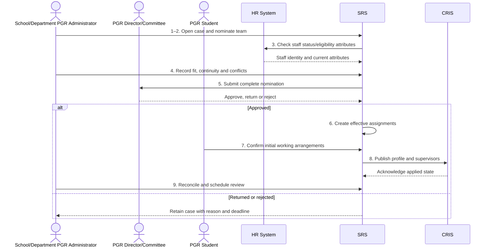

# BP-03-007 — Establish PGR supervision and research context

> Status: Draft
> Domain: 03 — Curriculum and module registration
> Owner: TBC
> Version: 0.1
> Last reviewed: 2026-07-26
> Review by: 2027-01-26

[Previous: BP-03-006](bp-03-006-provision-confirmed-registrations.md) · [Domain index](README.md) · [Next: BP-04-001](../04-learning-engagement-and-support/README.md) · [Library home](../README.md)

## Applicability

| Dimension | Applies |
|---|---|
| Common | UK |
| Nations | England; Scotland; Wales; Northern Ireland |
| Provider types | Providers delivering postgraduate research degrees |
| Levels and modes | PGR; full-time; part-time; distance; collaborative and professional doctorate provision |
| Exclusions | Taught postgraduate dissertation supervision unless governed as PGR |

## Traceability

| Type | References |
|---|---|
| Revelation workflows | Gap — no durable supervision-establishment workflow |
| Reference-model flows | F-HR-SIS-01, F-SIS-CRIS-01, F-CRIS-SIS-01, F-SIS-RP-01, F-RP-SIS-01 |
| Functional requirements | HRP-002–HRP-006 |
| Data entities | `enrolment`, `staff_assignment`, `research_milestone`, `integration_exchange` |
| Domain events | `srs.staff-assignment.updated`; `srs.research.milestone-recorded` |
| Integration contracts | `hr-staff-assignments.v1`, `cris-pgr-profile.v1`, `cris-pgr-milestones.v1`, `research-proposal-eligibility.v1` |

## Purpose and outcome

A postgraduate research student needs a formally approved supervisory team — typically a principal supervisor plus one or more co-supervisors — before their research can properly begin, and that approval needs to be on record with a clear basis (who approved it, under what regulations), not just inferred from whichever member of staff happens to be assigned to them in the HR system. This process establishes that approved, dated supervisory team and the research context — degree aim, research area, school — that the student, supervisors, Registry and the research office all need to see, treating academic approval of the team as a distinct, necessary step rather than assuming a staff assignment alone is evidence that proper governance has taken place.

## Scope

**Starts when:** A PGR offer/enrolment requires its initial supervisory arrangements, or an approved change must replace them.

**Ends when:** The approved team, roles, research context and initial working arrangements are recorded and reconciled with applicable systems.

**In scope:** Eligibility, capacity and conflict checks; principal and additional supervisor roles; external/collaborative members; effective dates; initial expectations; system publication.

**Out of scope:** Routine supervision meetings, annual progress review, thesis examination and employment management.

## Actors and responsibilities

| Actor/system | Responsibility |
|---|---|
| PGR Student | Confirms research context and participates in the initial expectations discussion |
| Principal Research Supervisor | Leads the supervisory team and agrees working arrangements |
| Additional/Co-supervisor | Provides complementary supervision and continuity |
| School/Department PGR Administrator | Coordinates nomination, evidence, approval and recording |
| PGR Director/Committee | Approves the team under provider regulations |
| HR System | Supplies authoritative staff status/assignment attributes |
| SRS | Holds effective student-to-supervisor assignments and approval provenance |
| CRIS | Holds the operational researcher profile and research activity/milestones |

**Accountable owner:** PGR Director/Committee or equivalent academic authority (TBC)

**System of record:** SRS for student-supervisor assignment; HR for staff status; CRIS for research profile/activity, subject to provider architecture.

## Preconditions

1. The person and PGR application, offer or enrolment are identifiable.
2. The intended research area, organisational ownership and degree aim are known.
3. Provider rules define supervisory roles, eligibility, workload/capacity, conflicts and approval authority.

## Trigger

Acceptance/enrolment preparation, research project allocation, transfer of research context or an approved request to change supervision.

## Main flow

1. **PGR Administrator** opens a supervision case linked to the PGR student, degree aim, research area, school and intended start date.
2. **PGR Administrator** records the proposed Principal Research Supervisor and required additional supervisory roles.
3. **SRS/HR System** validates each nominee's identity, active relationship, approved supervisory status, training, workload/capacity and effective availability.
4. **PGR Administrator** records expertise fit, continuity cover, funding/project relationships and declared conflicts of interest.
5. **PGR Director/Committee** reviews the complete team against provider regulations and approves, returns or rejects the nomination.
6. **SRS** creates effective-dated `staff_assignment` records with role, organisational owner, approval authority, decision date and source evidence.
7. **PGR Student** and **Supervisory Team** hold the initial meeting and record responsibilities, expected contact frequency, communication, research location and escalation route.
8. **SRS** publishes the approved assignment and PGR profile to the **CRIS** and other authorised consumers using stable identifiers.
9. **PGR Administrator** reconciles acknowledgements and schedules the next progress/supervision review point.

## Alternative flows

### A2 — External or collaborative supervisor

- **A2.1** Record organisation, contractual/affiliate status, access requirements, role limits and accountable internal supervisor.
- **A2.2** Complete external identity, confidentiality and conflict checks before approval.

### A3 — Distance, split-site or partner-delivered research

- **A3.1** Record locations, partner responsibilities, minimum contact arrangements and the authority responsible for each approval.

### A5 — Change of supervisor or research context

- **A5.1** Obtain the required approval, end-date superseded assignments and create replacement assignments without overwriting history.
- **A5.2** Preserve continuity, student support and any funding, visa, ethics or project consequences.

## Exception flows

### E3 — No eligible or complete team

- **E3.1** Hold approval, assign an owner and deadline, and do not represent proposed nominees as approved supervisors.

### E4 — Conflict, capacity or eligibility failure

- **E4.1** Record only the minimum decision evidence, restrict access and return the nomination for an alternative.

### E8 — Downstream mismatch

- **E8.1** Retain the valid academic assignment, quarantine the failed exchange and reconcile the HR/CRIS identity or role mapping.

## Postconditions

### Successful

- A complete, approved and effective supervisory team is visible to authorised actors.
- Responsibilities and initial working arrangements are recorded.
- SRS, HR-derived attributes and CRIS state are reconciled with explicit authority boundaries.

### Unsuccessful or incomplete

- The case remains proposed/returned with an owner and deadline; no unapproved assignment is published as current.

## Business rules and controls

| ID | Classification | Rule/control | Applicability | Source |
|---|---|---|---|---|
| BR-1 | SECTOR | A PGR student has an approved supervisory team under the awarding provider's regulations | UK | SRC-047–SRC-050 |
| BR-2 | SECTOR | The team should provide appropriate expertise, continuity and defined responsibilities | UK | SRC-047–SRC-050 |
| BR-3 | INSTITUTION | Team size, role names, eligibility, training, workload and approval authority are provider-configured | UK | Provider regulations |
| BR-4 | REVELATION | HR assignment confirmation does not replace the academic nomination and approval decision | Revelation target | HRP-002; F-HR-SIS-01 |
| BR-5 | PROPOSED | Assignments are effective-dated and changes preserve prior teams and approval provenance | Revelation target | Data governance control |
| BR-6 | PROPOSED | External supervisors require an accountable internal relationship and governed identity/access | Where applicable | Process control |

## National and institutional variations

### England

Provider regulations determine team composition and approval. Collaborative doctoral provision may divide responsibilities between the awarding provider, partner and funder.

### Scotland

Scottish providers commonly express supervision through their own postgraduate research regulations and college/school approval structures; Revelation must configure their role names and authorities rather than impose an England-derived model.

### Wales

Awarding-body and collaborative arrangements may require responsibilities to be recorded across provider and partner. Welsh or bilingual communications and role labels are institutional configuration points.

### Northern Ireland

Provider PGR regulations govern appointment and change. Queen's University Belfast evidence illustrates principal/secondary or co-supervisor roles, approved skills and recorded initial expectations.

### Institutional policy points

Minimum team, principal/lead role, independent adviser, eligibility/training, workload, conflicts, external members, student consultation, initial meeting deadline, contact frequency and change authority.

## Data impact

| Data concept | Action | System of record | Effective/provenance requirement | Sensitivity |
|---|---|---|---|---|
| Supervision case/decision | Create/update | SRS or workflow service | Proposer, approver, reason, evidence and timestamps | Personal/confidential |
| Staff assignment | Create/version/end-date | SRS | Role, effective interval, source and approval | Personal |
| Staff eligibility/status | Read | HR/provider source | As-at decision time | Personal |
| Researcher profile/context | Create/update | CRIS | Source assignment/enrolment identifiers | Personal; potentially sensitive |
| Working arrangements | Create/version | Governed provider store | Agreed date, review point and restricted access | Personal/confidential |

## Integration impact

| From | To | Information/purpose | Contract/pattern | Failure and reconciliation |
|---|---|---|---|---|
| HR System | SRS | Staff/supervisor identity and assignment confirmation | `hr-staff-assignments.v1` | Reject unknown person/role; HR resend and snapshot |
| SRS | CRIS | PGR enrolment, profile and approved supervisors | `cris-pgr-profile.v1` | Retry, alert and profile snapshot |
| CRIS | SRS | Later milestones/publications | `cris-pgr-milestones.v1` | Reject invalid milestone; CRIS resend |
| SRS | Research Proposals | Eligibility and supervisor assignment | `research-proposal-eligibility.v1` | Request correlation and current-state replay |

## Sequence diagram

## Open questions and decisions

| ID | Question/decision | Owner | Status |
|---|---|---|---|
| OQ-1 | Which service owns nomination/approval before `staff_assignment` is created? | Product/data architect | Open |
| OQ-2 | Is HR authoritative for supervisor eligibility or only employment/affiliate status? | PGR and HR owners | Open |
| OQ-3 | Where are working arrangements stored and which parts are student-visible? | PGR/data protection owners | Open |
| OQ-4 | Which national/provider team and adviser variants must be configuration rather than extensions? | PGR SME | Open |

## Sources

| Source | Supported content |
|---|---|
| [SRC-047](../source-register.md) | Northern Ireland supervision roles, skills, records and initial expectations |
| [SRC-048](../source-register.md) | Welsh supervision team and record expectations |
| [SRC-049](../source-register.md) | English minimum-team example |
| [SRC-050](../source-register.md) | Welsh awarding-body team appointment and timing example |
| [SRC-015–SRC-019](../source-register.md) | Revelation requirements, entities, events and contracts |

## Related processes

[BP-02-003](../02-registration-and-student-status/bp-02-003-complete-initial-academic-registration.md); [BP-03-002](bp-03-002-assign-programme-route-and-rules.md); BP-04-003; BP-05-010; BP-06-006.

## Review record

| Review | Reviewer | Date | Outcome |
|---|---|---|---|
| Research/documentation | Codex implementation role | 2026-07-26 | Drafted |
| Required reviews | PGR, national, data and integration SMEs (TBC) | — | Pending |

## Change history

| Version | Date | Author | Change |
|---|---|---|---|
| 0.1 | 2026-07-26 | Codex | Initial draft |
