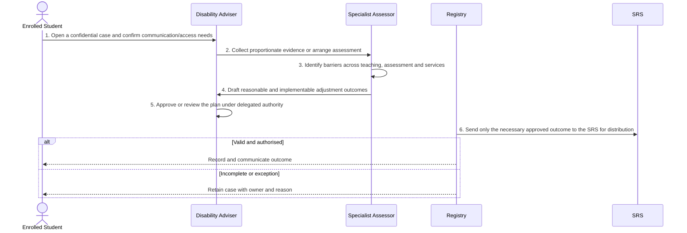

# BP-04-004 — Manage a reasonable adjustment case

> Status: Draft
> Domain: 04 — Learning, engagement and support
> Owner: TBC
> Version: 0.1
> Last reviewed: 2026-07-26
> Review by: 2027-01-26

[Previous: BP-04-003](../04-learning-engagement-and-support/bp-04-003-review-pgr-progress-and-milestones.md) · [Domain index](README.md) · [Next: BP-04-005](../04-learning-engagement-and-support/bp-04-005-manage-exceptional-circumstances.md) · [Library home](../README.md)

## Applicability

| Dimension | Applies |
|---|---|
| Common | UK |
| Nations | England; Scotland; Wales; Northern Ireland |
| Provider types | Providers operating this process; exact regulatory scope is configured |
| Levels and modes | UG; PGT; PGR; full-time; part-time; distance and collaborative provision where relevant |
| Exclusions | Activities outside the stated start/end boundary |

## Traceability

| Type | References |
|---|---|
| Revelation workflows | W002 |
| Reference-model flows | See integration contract catalogue; confirm detailed F-number mapping during architecture review |
| Functional requirements | See functional requirements; detailed mapping remains an SME/architecture review action |
| Data entities | adjustment case and approved support plan; supporting identity, evidence, decision and integration-exchange records |
| Domain events | Proposed: `srs.manage.a.reasonable.adjustment.case.completed` |
| Integration contracts | Case system → SRS; SRS → exam/VLE/attendance |

## Purpose and outcome

This process manages an individual student's reasonable-adjustment case from disclosure through to an approved, implementable support plan. A disability adviser and specialist assessor gather only the evidence needed to identify the barriers a student faces in teaching, assessment and services, and turn that into concrete, approved adjustments. It exists to keep clinical or diagnostic detail inside the specialist service while the SRS and wider Registry receive only the minimum approved outcome needed to implement and track the adjustment across other systems.

## Scope

**Starts when:** A student declares a disability or requests disability-related support.

**Ends when:** The authorised outcome is recorded, communicated and reconciled, or the case is closed with an owned reason.

**In scope:** Intake, validation, evidence, decision, effective dating, communication and downstream reconciliation.

**Out of scope:** Upstream policy creation and later lifecycle processes referenced under Related processes.

## Actors and responsibilities

| Actor/system | Responsibility |
|---|---|
| Enrolled Student | Initiates or owns the principal business action |
| Disability Adviser | Provides evidence, decision, system processing or governed support |
| Specialist Assessor | Provides evidence, decision, system processing or governed support |
| Registry | Provides evidence, decision, system processing or governed support |

**Accountable owner:** Enrolled Student service owner or delegated authority (TBC)

**System of record:** SRS for the student-record outcome; specialist systems retain their governed source evidence.

## Preconditions

1. Canonical person, programme/period and source identifiers are available where applicable.
2. The current policy/rule version and decision authority are configured.
3. Required interfaces use stable identifiers, provenance and reconciliation controls.

## Trigger

A student declares a disability or requests disability-related support.

## Main flow

1. **Enrolled Student** open a confidential case and confirm communication/access needs.
2. **Disability Adviser** collect proportionate evidence or arrange assessment.
3. **Specialist Assessor** identify barriers across teaching, assessment and services.
4. **Specialist Assessor** draft reasonable and implementable adjustment outcomes.
5. **Disability Adviser** approve or review the plan under delegated authority.
6. **Registry** send only the necessary approved outcome to the SRS for distribution.

## Alternative flows

### A1 — Variant

- **A1.1** Temporary, anticipatory and placement adjustments carry their own review dates.

### A2 — Variant

- **A2.1** A student may request review or decline an offered adjustment.

## Exception flows

### E1 — Control exception

- **E1.1** Clinical evidence remains in the specialist service, not the general student record.

### E2 — Control exception

- **E2.1** An unimplementable adjustment is escalated for an effective alternative.

## Postconditions

### Successful

- The adjustment case and approved support plan is authoritative, effective-dated and linked to its evidence and decision authority.
- Each required consumer has acknowledged the correct version or has an owned reconciliation item.

### Unsuccessful or incomplete

- No unapproved outcome is represented as final; the case retains reason, owner and next action.

## Business rules and controls

| ID | Classification | Rule/control | Applicability | Source |
|---|---|---|---|---|
| BR-1 | SECTOR | Apply the current authoritative requirement and provider regulation for the person, level, mode and nation | UK/configured | SRC-055, SRC-057 |
| BR-2 | INSTITUTION | Decision roles, deadlines, evidence and permitted discretion are policy-versioned | Provider | Provider regulations |
| BR-3 | REVELATION | W002 needs explicit data-minimisation, review/effective dates and outcome-versus-evidence boundaries. | Revelation | SRC-015–SRC-019 |
| BR-4 | PROPOSED | Proposed, approved, rejected and superseded states remain distinguishable | Revelation target | Process control |
| BR-5 | PROPOSED | Corrections append provenance and trigger impact/reconciliation; they do not silently overwrite | Revelation target | Data governance |

## National and institutional variations

### England

Provider policy operates alongside English regulatory conditions and, where applicable, Student sponsor duties.

### Scotland

Provider regulations and Scottish academic terminology apply; funding and support ownership may differ.

### Wales

Provider regulations, Welsh-language communication and Medr context apply.

### Northern Ireland

Provider regulations and Department for the Economy context apply.

### Institutional policy points

Terminology, authority, deadlines, evidence, thresholds, communication, appeals/reviews, partner responsibility and target-system ownership.

## Data impact

| Data concept | Action | System of record | Effective/provenance requirement | Sensitivity |
|---|---|---|---|---|
| adjustment case and approved support plan | Create/version | SRS or governed specialist source | Policy, actor, evidence, decision and effective/transaction times | Personal; may be sensitive |
| Workflow/case evidence | Append | Owning service | Immutable source and restricted access | Personal/confidential |
| Integration exchange | Append/update | SRS integration ledger | Contract version, correlation, attempts and acknowledgement | Personal |

## Integration impact

| From | To | Information/purpose | Contract/pattern | Failure and reconciliation |
|---|---|---|---|---|
| Case system | SRS | approved adjustment | Versioned/idempotent contract | Retry, quarantine, acknowledge and reconcile |
| SRS | exam/VLE/attendance | outcome | Versioned/idempotent contract | Retry, quarantine, acknowledge and reconcile |

## Sequence diagram

## Open questions and decisions

| ID | Question/decision | Owner | Status |
|---|---|---|---|
| OQ-1 | Confirm the authoritative owner, workflow boundary and detailed requirement/contract mapping | Process owner/architect | Open |
| OQ-2 | Which national, provider-type and mode variants require configuration? | Four-nation SME | Open |
| OQ-3 | Which evidence stays in a specialist system and what minimum outcome enters the SRS? | Data protection/data owner | Open |

## Sources

| Source | Supported content |
|---|---|
| [SRC-055, SRC-057](../source-register.md) | External process, regulatory or sector evidence |
| [SRC-015–SRC-019](../source-register.md) | Revelation workflows, actors, contracts, data and requirements |

## Related processes

[Process inventory](../process-inventory.md); adjacent lifecycle processes in the [process map](../process-map.md).

## Review record

| Review | Reviewer | Date | Outcome |
|---|---|---|---|
| Research/documentation | Codex implementation role | 2026-07-26 | Drafted |
| Required reviews | Process, national, data and integration SMEs (TBC) | — | Pending |

## Change history

| Version | Date | Author | Change |
|---|---|---|---|
| 0.1 | 2026-07-26 | Codex | Initial research draft |
