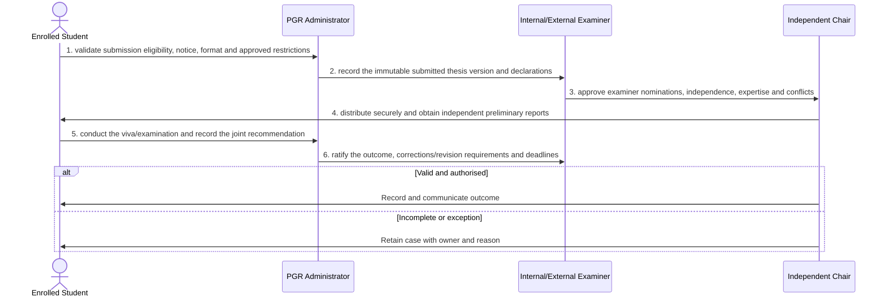

# BP-042 — Submit and examine a PGR thesis

> Status: Draft
> Domain: 05 — Assessment and results
> Owner: TBC
> Version: 0.1
> Last reviewed: 2026-07-26
> Review by: 2027-01-26

[Previous: BP-041](../05-assessment-and-results/bp-041-ratify-and-publish-results.md) · [Domain index](README.md) · [Next: BP-043](../05-assessment-and-results/bp-043-correct-a-ratified-academic-outcome.md) · [Library home](../README.md)

## Applicability

| Dimension | Applies |
|---|---|
| Common | UK |
| Nations | England; Scotland; Wales; Northern Ireland |
| Provider types | Providers operating this process; exact regulatory scope is configured |
| Levels and modes | UG; PGT; PGR; full-time; part-time; distance and collaborative provision where relevant |
| Exclusions | Activities outside the stated start/end boundary |

## Traceability

| Type | References |
|---|---|
| Revelation workflows | Gap |
| Reference-model flows | See integration contract catalogue; confirm detailed F-number mapping during architecture review |
| Functional requirements | See functional requirements; detailed mapping remains an SME/architecture review action |
| Data entities | thesis submission, examiners, viva and examination outcome; supporting identity, evidence, decision and integration-exchange records |
| Domain events | Proposed: `srs.submit.and.examine.a.pgr.thesis.completed` |
| Integration contracts | Repository → SRS; SRS ↔ examiner workspace |

## Purpose and outcome

Submit and examine a PGR thesis creates a controlled, explainable and effective-dated thesis submission, examiners, viva and examination outcome. The outcome preserves the evidence, authority and cross-system state needed for the Revelation SRS rather than reducing the process to a status update.

## Scope

**Starts when:** An eligible PGR student gives notice and submits a thesis.

**Ends when:** The authorised outcome is recorded, communicated and reconciled, or the case is closed with an owned reason.

**In scope:** Intake, validation, evidence, decision, effective dating, communication and downstream reconciliation.

**Out of scope:** Upstream policy creation and later lifecycle processes referenced under Related processes.

## Actors and responsibilities

| Actor/system | Responsibility |
|---|---|
| Enrolled Student | Initiates or owns the principal business action |
| PGR Administrator | Provides evidence, decision, system processing or governed support |
| Internal/External Examiner | Provides evidence, decision, system processing or governed support |
| Independent Chair | Provides evidence, decision, system processing or governed support |

**Accountable owner:** Enrolled Student service owner or delegated authority (TBC)

**System of record:** SRS for the student-record outcome; specialist systems retain their governed source evidence.

## Preconditions

1. Canonical person, programme/period and source identifiers are available where applicable.
2. The current policy/rule version and decision authority are configured.
3. Required interfaces use stable identifiers, provenance and reconciliation controls.

## Trigger

An eligible PGR student gives notice and submits a thesis.

## Main flow

1. **Enrolled Student** validate submission eligibility, notice, format and approved restrictions.
2. **PGR Administrator** record the immutable submitted thesis version and declarations.
3. **Internal/External Examiner** approve examiner nominations, independence, expertise and conflicts.
4. **Independent Chair** distribute securely and obtain independent preliminary reports.
5. **PGR Administrator** conduct the viva/examination and record the joint recommendation.
6. **Internal/External Examiner** ratify the outcome, corrections/revision requirements and deadlines.

## Alternative flows

### A1 — Variant

- **A1.1** Practice-based, published-work, remote viva and resubmission routes use configured evidence.

### A2 — Variant

- **A2.1** No-viva routes occur only where regulations permit.

## Exception flows

### E1 — Control exception

- **E1.1** Late conflict or examiner unavailability triggers replacement approval.

### E2 — Control exception

- **E2.1** Restricted thesis access is enforced without losing the preservation copy.

## Postconditions

### Successful

- The thesis submission, examiners, viva and examination outcome is authoritative, effective-dated and linked to its evidence and decision authority.
- Each required consumer has acknowledged the correct version or has an owned reconciliation item.

### Unsuccessful or incomplete

- No unapproved outcome is represented as final; the case retains reason, owner and next action.

## Business rules and controls

| ID | Classification | Rule/control | Applicability | Source |
|---|---|---|---|---|
| BR-1 | SECTOR | Apply the current authoritative requirement and provider regulation for the person, level, mode and nation | UK/configured | SRC-056, SRC-059 |
| BR-2 | INSTITUTION | Decision roles, deadlines, evidence and permitted discretion are policy-versioned | Provider | Provider regulations |
| BR-3 | REVELATION | No thesis/examiner/viva workflow or correction-period model exists. | Revelation | SRC-015–SRC-019 |
| BR-4 | PROPOSED | Proposed, approved, rejected and superseded states remain distinguishable | Revelation target | Process control |
| BR-5 | PROPOSED | Corrections append provenance and trigger impact/reconciliation; they do not silently overwrite | Revelation target | Data governance |

## National and institutional variations

### England

Awarding-provider regulations and external examining arrangements apply within the English regulatory context.

### Scotland

SCQF levels, Scottish degree structures and provider senate regulations must be configurable.

### Wales

CQFW context, Welsh-language operation and awarding/partner responsibilities must be configurable.

### Northern Ireland

Provider regulations, external examining and any professional-body requirements apply.

### Institutional policy points

Terminology, authority, deadlines, evidence, thresholds, communication, appeals/reviews, partner responsibility and target-system ownership.

## Data impact

| Data concept | Action | System of record | Effective/provenance requirement | Sensitivity |
|---|---|---|---|---|
| thesis submission, examiners, viva and examination outcome | Create/version | SRS or governed specialist source | Policy, actor, evidence, decision and effective/transaction times | Personal; may be sensitive |
| Workflow/case evidence | Append | Owning service | Immutable source and restricted access | Personal/confidential |
| Integration exchange | Append/update | SRS integration ledger | Contract version, correlation, attempts and acknowledgement | Personal |

## Integration impact

| From | To | Information/purpose | Contract/pattern | Failure and reconciliation |
|---|---|---|---|---|
| Repository | SRS | submission | Versioned/idempotent contract | Retry, quarantine, acknowledge and reconcile |
| SRS ↔ examiner workspace | Connected system | reports/outcome | Versioned/idempotent contract | Retry, quarantine, acknowledge and reconcile |

## Sequence diagram

## Open questions and decisions

| ID | Question/decision | Owner | Status |
|---|---|---|---|
| OQ-1 | Confirm the authoritative owner, workflow boundary and detailed requirement/contract mapping | Process owner/architect | Open |
| OQ-2 | Which national, provider-type and mode variants require configuration? | Four-nation SME | Open |
| OQ-3 | Which evidence stays in a specialist system and what minimum outcome enters the SRS? | Data protection/data owner | Open |

## Sources

| Source | Supported content |
|---|---|
| [SRC-056, SRC-059](../source-register.md) | External process, regulatory or sector evidence |
| [SRC-015–SRC-019](../source-register.md) | Revelation workflows, actors, contracts, data and requirements |

## Related processes

[Process inventory](../process-inventory.md); adjacent lifecycle processes in the [process map](../process-map.md).

## Review record

| Review | Reviewer | Date | Outcome |
|---|---|---|---|
| Research/documentation | Codex implementation role | 2026-07-26 | Drafted |
| Required reviews | Process, national, data and integration SMEs (TBC) | — | Pending |

## Change history

| Version | Date | Author | Change |
|---|---|---|---|
| 0.1 | 2026-07-26 | Codex | Initial research draft |
