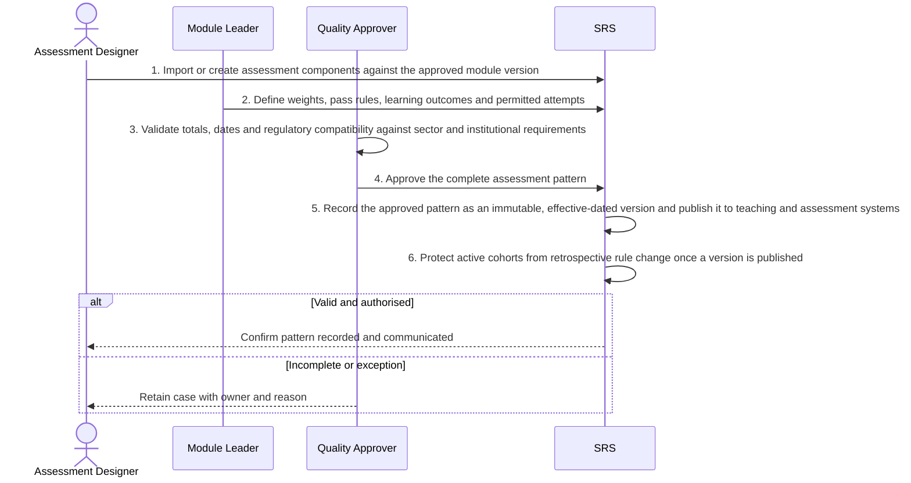

# BP-05-001 — Establish assessment structures

> Status: Draft
> Domain: 05 — Assessment and results
> Owner: TBC
> Version: 0.1
> Last reviewed: 2026-07-26
> Review by: 2027-01-26

[Previous: BP-04-006](../04-learning-engagement-and-support/bp-04-006-distribute-an-approved-support-outcome.md) · [Domain index](README.md) · [Next: BP-05-002](../05-assessment-and-results/bp-05-002-create-examination-entries-and-accommodations.md) · [Library home](../README.md)

## Applicability

| Dimension | Applies |
|---|---|
| Common | UK |
| Nations | England; Scotland; Wales; Northern Ireland |
| Provider types | Providers operating this process; exact regulatory scope is configured |
| Levels and modes | UG; PGT; PGR; full-time; part-time; distance and collaborative provision where relevant |
| Exclusions | Activities outside the stated start/end boundary |

## Traceability

| Type | References |
|---|---|
| Revelation workflows | Gap |
| Reference-model flows | See integration contract catalogue; confirm detailed F-number mapping during architecture review |
| Functional requirements | See functional requirements; detailed mapping remains an SME/architecture review action |
| Data entities | assessment pattern, component and calculation-rule versions; supporting identity, evidence, decision and integration-exchange records |
| Domain events | Proposed: `srs.establish.assessment.structures.completed` |
| Integration contracts | Curriculum/assessment system → SRS |

## Purpose and outcome

This process defines the assessment pattern for a module before teaching begins — the components, weightings, pass rules, learning outcomes and permitted attempts that determine how the module will be assessed. It requires the pattern to be checked for accuracy and regulatory compatibility and formally approved before publication to teaching and assessment systems. Once published and cohorts are relying on it, the pattern is protected from retrospective change; any later correction produces a new version rather than an unrecorded edit.

## Scope

**Starts when:** An approved curriculum offering requires assessment setup.

**Ends when:** The authorised outcome is recorded, communicated and reconciled, or the case is closed with an owned reason.

**In scope:** Intake, validation, evidence, decision, effective dating, communication and downstream reconciliation.

**Out of scope:** Upstream policy creation and later lifecycle processes referenced under Related processes.

## Actors and responsibilities

| Actor/system | Responsibility |
|---|---|
| Assessment Designer | Initiates or owns the principal business action |
| Module Leader | Provides evidence, decision, system processing or governed support |
| Quality Approver | Provides evidence, decision, system processing or governed support |
| SRS | Provides evidence, decision, system processing or governed support |

**Accountable owner:** Assessment Designer service owner or delegated authority (TBC)

**System of record:** SRS for the student-record outcome; specialist systems retain their governed source evidence.

## Preconditions

1. Canonical person, programme/period and source identifiers are available where applicable.
2. The current policy/rule version and decision authority are configured.
3. Required interfaces use stable identifiers, provenance and reconciliation controls.

## Trigger

An approved curriculum offering requires assessment setup.

## Main flow

1. **Assessment Designer** imports or creates assessment components against the approved module version.
2. **Module Leader** defines weights, pass rules, learning outcomes and permitted attempts.
3. **Quality Approver** validates totals, dates and regulatory compatibility against sector and institutional requirements.
4. **Quality Approver** approves the complete assessment pattern.
5. **SRS** records the approved pattern as an immutable, effective-dated version and publishes it to teaching and assessment systems.
6. **SRS** protects active cohorts from retrospective rule change once a version is published.

## Alternative flows

### A1 — Variant

- **A1.1** Different routes/cohorts or reasonable alternative assessment use explicit variants.

### A2 — Variant

- **A2.1** Professional-body constraints add governed rules.

## Exception flows

### E1 — Control exception

- **E1.1** Invalid totals or missing approval block publication.

### E2 — Control exception

- **E2.1** A post-publication correction creates a new version and impact case.

## Postconditions

### Successful

- The assessment pattern, component and calculation-rule versions is authoritative, effective-dated and linked to its evidence and decision authority.
- Each required consumer has acknowledged the correct version or has an owned reconciliation item.

### Unsuccessful or incomplete

- No unapproved outcome is represented as final; the case retains reason, owner and next action.

## Business rules and controls

| ID | Classification | Rule/control | Applicability | Source |
|---|---|---|---|---|
| BR-1 | SECTOR | Apply the current authoritative requirement and provider regulation for the person, level, mode and nation | UK/configured | SRC-038, SRC-059 |
| BR-2 | INSTITUTION | Decision roles, deadlines, evidence and permitted discretion are policy-versioned | Provider | Provider regulations |
| BR-3 | REVELATION | No durable assessment-pattern publication workflow or cohort binding exists. | Revelation | SRC-015–SRC-019 |
| BR-4 | PROPOSED | Proposed, approved, rejected and superseded states remain distinguishable | Revelation target | Process control |
| BR-5 | PROPOSED | Corrections append provenance and trigger impact/reconciliation; they do not silently overwrite | Revelation target | Data governance |

## National and institutional variations

### England

Awarding-provider regulations and external examining arrangements apply within the English regulatory context.

### Scotland

SCQF levels, Scottish degree structures and provider senate regulations must be configurable.

### Wales

CQFW context, Welsh-language operation and awarding/partner responsibilities must be configurable.

### Northern Ireland

Provider regulations, external examining and any professional-body requirements apply.

### Institutional policy points

Terminology, authority, deadlines, evidence, thresholds, communication, appeals/reviews, partner responsibility and target-system ownership.

## Data impact

| Data concept | Action | System of record | Effective/provenance requirement | Sensitivity |
|---|---|---|---|---|
| assessment pattern, component and calculation-rule versions | Create/version | SRS or governed specialist source | Policy, actor, evidence, decision and effective/transaction times | Personal; may be sensitive |
| Workflow/case evidence | Append | Owning service | Immutable source and restricted access | Personal/confidential |
| Integration exchange | Append/update | SRS integration ledger | Contract version, correlation, attempts and acknowledgement | Personal |

## Integration impact

| From | To | Information/purpose | Contract/pattern | Failure and reconciliation |
|---|---|---|---|---|
| Curriculum/assessment system | SRS | assessment pattern | Versioned/idempotent contract | Retry, quarantine, acknowledge and reconcile |

## Sequence diagram

## Open questions and decisions

| ID | Question/decision | Owner | Status |
|---|---|---|---|
| OQ-1 | Confirm the authoritative owner, workflow boundary and detailed requirement/contract mapping | Process owner/architect | Open |
| OQ-2 | Which national, provider-type and mode variants require configuration? | Four-nation SME | Open |
| OQ-3 | Which evidence stays in a specialist system and what minimum outcome enters the SRS? | Data protection/data owner | Open |

## Sources

| Source | Supported content |
|---|---|
| [SRC-038, SRC-059](../source-register.md) | External process, regulatory or sector evidence |
| [SRC-015–SRC-019](../source-register.md) | Revelation workflows, actors, contracts, data and requirements |

## Related processes

[Process inventory](../process-inventory.md); adjacent lifecycle processes in the [process map](../process-map.md).

## Review record

| Review | Reviewer | Date | Outcome |
|---|---|---|---|
| Research/documentation | Codex implementation role | 2026-07-26 | Drafted |
| Required reviews | Process, national, data and integration SMEs (TBC) | — | Pending |

## Change history

| Version | Date | Author | Change |
|---|---|---|---|
| 0.1 | 2026-07-26 | Codex | Initial research draft |
