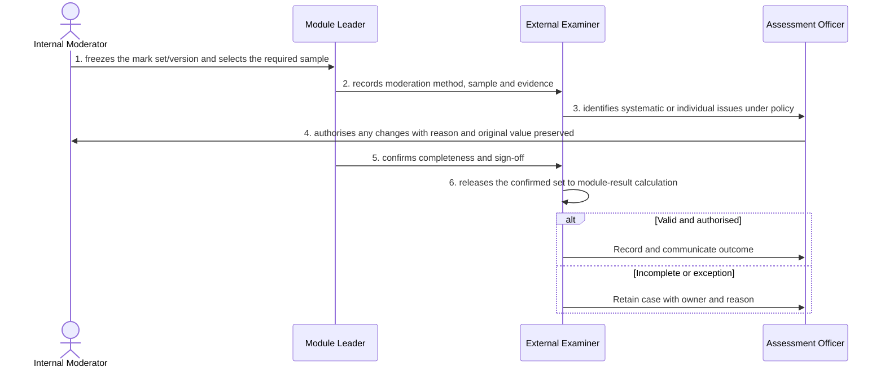

# BP-05-004 — Moderate and confirm marks

> Status: Draft
> Domain: 05 — Assessment and results
> Owner: TBC
> Version: 0.1
> Last reviewed: 2026-07-26
> Review by: 2027-01-26

[Previous: BP-05-003](../05-assessment-and-results/bp-05-003-receive-or-enter-marks.md) · [Domain index](README.md) · [Next: BP-05-005](../05-assessment-and-results/bp-05-005-determine-a-module-result.md) · [Library home](../README.md)

## Applicability

| Dimension | Applies |
|---|---|
| Common | UK |
| Nations | England; Scotland; Wales; Northern Ireland |
| Provider types | Providers operating this process; exact regulatory scope is configured |
| Levels and modes | UG; PGT; PGR; full-time; part-time; distance and collaborative provision where relevant |
| Exclusions | Activities outside the stated start/end boundary |

## Traceability

| Type | References |
|---|---|
| Revelation workflows | W005 partial |
| Reference-model flows | See integration contract catalogue; confirm detailed F-number mapping during architecture review |
| Functional requirements | See functional requirements; detailed mapping remains an SME/architecture review action |
| Data entities | moderation sample, change and confirmed mark; supporting identity, evidence, decision and integration-exchange records |
| Domain events | Proposed: `srs.moderate.and.confirm.marks.completed` |
| Integration contracts | Assessment system ↔ SRS |

## Purpose and outcome

Moderating and confirming marks turns a set of raw marks into a set the institution can stand behind, by sampling and checking them against departmental and external-examiner standards before they are used to calculate results. Any change a moderator or examiner makes is applied with its reason recorded and the original value preserved, so the moderation process itself remains auditable rather than silently overwriting the marker's original judgement. Only a confirmed, signed-off set is released to module-result calculation.

## Scope

**Starts when:** A mark set is ready for moderation.

**Ends when:** The authorised outcome is recorded, communicated and reconciled, or the case is closed with an owned reason.

**In scope:** Intake, validation, evidence, decision, effective dating, communication and downstream reconciliation.

**Out of scope:** Upstream policy creation and later lifecycle processes referenced under Related processes.

## Actors and responsibilities

| Actor/system | Responsibility |
|---|---|
| Internal Moderator | Initiates or owns the principal business action |
| Module Leader | Provides evidence, decision, system processing or governed support |
| External Examiner | Provides evidence, decision, system processing or governed support |
| Assessment Officer | Provides evidence, decision, system processing or governed support |

**Accountable owner:** Internal Moderator service owner or delegated authority (TBC)

**System of record:** SRS for the student-record outcome; specialist systems retain their governed source evidence.

## Preconditions

1. Canonical person, programme/period and source identifiers are available where applicable.
2. The current policy/rule version and decision authority are configured.
3. Required interfaces use stable identifiers, provenance and reconciliation controls.

## Trigger

A mark set is ready for moderation.

## Main flow

1. **Internal Moderator** freeze the mark set/version and select the required sample.
2. **Module Leader** record moderation method, sample and evidence.
3. **External Examiner** identify systematic or individual issues under policy.
4. **Assessment Officer** authorise any changes with reason and original value preserved.
5. **Module Leader** confirm completeness and sign-off.
6. **External Examiner** release the confirmed set to module-result calculation.

## Alternative flows

### A1 — Variant

- **A1.1** Double marking, sampling and negotiated mark routes are configured by assessment type.

### A2 — Variant

- **A2.1** External examiner input may occur here or at programme/board level.

## Exception flows

### E1 — Control exception

- **E1.1** Unresolved marker disagreement escalates to the authorised academic role.

### E2 — Control exception

- **E2.1** Late mark changes return through controlled moderation.

## Postconditions

### Successful

- The moderation sample, change and confirmed mark is authoritative, effective-dated and linked to its evidence and decision authority.
- Each required consumer has acknowledged the correct version or has an owned reconciliation item.

### Unsuccessful or incomplete

- No unapproved outcome is represented as final; the case retains reason, owner and next action.

## Business rules and controls

| ID | Classification | Rule/control | Applicability | Source |
|---|---|---|---|---|
| BR-1 | SECTOR | Apply the current authoritative requirement and provider regulation for the person, level, mode and nation | UK/configured | SRC-059 |
| BR-2 | INSTITUTION | Decision roles, deadlines, evidence and permitted discretion are policy-versioned | Provider | Provider regulations |
| BR-3 | REVELATION | Moderation evidence and mark-set version/sign-off are not first-class. | Revelation | SRC-015–SRC-019 |
| BR-4 | PROPOSED | Proposed, approved, rejected and superseded states remain distinguishable | Revelation target | Process control |
| BR-5 | PROPOSED | Corrections append provenance and trigger impact/reconciliation; they do not silently overwrite | Revelation target | Data governance |

## National and institutional variations

### England

Awarding-provider regulations and external examining arrangements apply within the English regulatory context.

### Scotland

SCQF levels, Scottish degree structures and provider senate regulations must be configurable.

### Wales

CQFW context, Welsh-language operation and awarding/partner responsibilities must be configurable.

### Northern Ireland

Provider regulations, external examining and any professional-body requirements apply.

### Institutional policy points

Terminology, authority, deadlines, evidence, thresholds, communication, appeals/reviews, partner responsibility and target-system ownership.

## Data impact

| Data concept | Action | System of record | Effective/provenance requirement | Sensitivity |
|---|---|---|---|---|
| moderation sample, change and confirmed mark | Create/version | SRS or governed specialist source | Policy, actor, evidence, decision and effective/transaction times | Personal; may be sensitive |
| Workflow/case evidence | Append | Owning service | Immutable source and restricted access | Personal/confidential |
| Integration exchange | Append/update | SRS integration ledger | Contract version, correlation, attempts and acknowledgement | Personal |

## Integration impact

| From | To | Information/purpose | Contract/pattern | Failure and reconciliation |
|---|---|---|---|---|
| Assessment system ↔ SRS | Connected system | moderated mark set | Versioned/idempotent contract | Retry, quarantine, acknowledge and reconcile |

## Sequence diagram

## Open questions and decisions

| ID | Question/decision | Owner | Status |
|---|---|---|---|
| OQ-1 | Confirm the authoritative owner, workflow boundary and detailed requirement/contract mapping | Process owner/architect | Open |
| OQ-2 | Which national, provider-type and mode variants require configuration? | Four-nation SME | Open |
| OQ-3 | Which evidence stays in a specialist system and what minimum outcome enters the SRS? | Data protection/data owner | Open |

## Sources

| Source | Supported content |
|---|---|
| [SRC-059](../source-register.md) | External process, regulatory or sector evidence |
| [SRC-015–SRC-019](../source-register.md) | Revelation workflows, actors, contracts, data and requirements |

## Related processes

[Process inventory](../process-inventory.md); adjacent lifecycle processes in the [process map](../process-map.md).

## Review record

| Review | Reviewer | Date | Outcome |
|---|---|---|---|
| Research/documentation | Codex implementation role | 2026-07-26 | Drafted |
| Required reviews | Process, national, data and integration SMEs (TBC) | — | Pending |

## Change history

| Version | Date | Author | Change |
|---|---|---|---|
| 0.1 | 2026-07-26 | Codex | Initial research draft |
