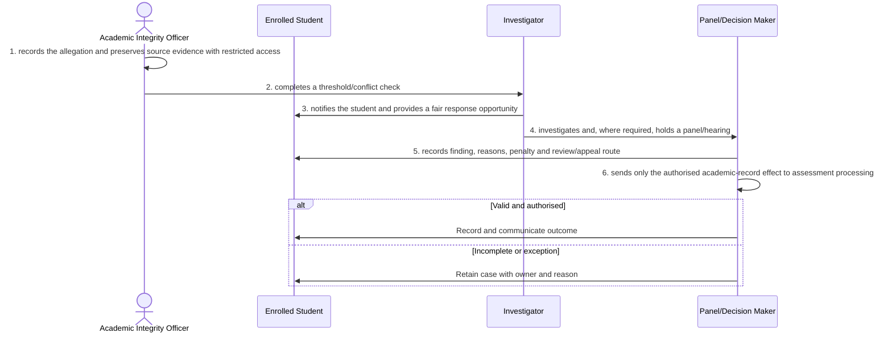

# BP-05-006 — Investigate academic misconduct

> Status: Draft
> Domain: 05 — Assessment and results
> Owner: TBC
> Version: 0.1
> Last reviewed: 2026-07-26
> Review by: 2027-01-26

[Previous: BP-05-005](../05-assessment-and-results/bp-05-005-determine-a-module-result.md) · [Domain index](README.md) · [Next: BP-05-007](../05-assessment-and-results/bp-05-007-prepare-an-exam-board-and-data-pack.md) · [Library home](../README.md)

## Applicability

| Dimension | Applies |
|---|---|
| Common | UK |
| Nations | England; Scotland; Wales; Northern Ireland |
| Provider types | Providers operating this process; exact regulatory scope is configured |
| Levels and modes | UG; PGT; PGR; full-time; part-time; distance and collaborative provision where relevant |
| Exclusions | Activities outside the stated start/end boundary |

## Traceability

| Type | References |
|---|---|
| Revelation workflows | W004 |
| Reference-model flows | See integration contract catalogue; confirm detailed F-number mapping during architecture review |
| Functional requirements | See functional requirements; detailed mapping remains an SME/architecture review action |
| Data entities | misconduct case, finding and authorised penalty effect; supporting identity, evidence, decision and integration-exchange records |
| Domain events | Proposed: `srs.investigate.academic.misconduct.completed` |
| Integration contracts | Case system → SRS |

## Purpose and outcome

Investigating academic misconduct turns an allegation into a fair, evidenced finding, kept separate from the module's academic marking so a live investigation cannot quietly bias a result before it is decided. The student is given a genuine opportunity to respond, and any finding, penalty or review route is recorded with its reasoning, so the process can withstand a later appeal. Only the authorised, final academic-record effect — not the investigation's internal working — is passed to assessment processing.

## Scope

**Starts when:** A sufficiently specific academic misconduct allegation is raised.

**Ends when:** The authorised outcome is recorded, communicated and reconciled, or the case is closed with an owned reason.

**In scope:** Intake, validation, evidence, decision, effective dating, communication and downstream reconciliation.

**Out of scope:** Upstream policy creation and later lifecycle processes referenced under Related processes.

## Actors and responsibilities

| Actor/system | Responsibility |
|---|---|
| Academic Integrity Officer | Initiates or owns the principal business action |
| Enrolled Student | Provides evidence, decision, system processing or governed support |
| Investigator | Provides evidence, decision, system processing or governed support |
| Panel/Decision Maker | Provides evidence, decision, system processing or governed support |

**Accountable owner:** Academic Integrity Officer service owner or delegated authority (TBC)

**System of record:** SRS for the student-record outcome; specialist systems retain their governed source evidence.

## Preconditions

1. Canonical person, programme/period and source identifiers are available where applicable.
2. The current policy/rule version and decision authority are configured.
3. Required interfaces use stable identifiers, provenance and reconciliation controls.

## Trigger

A sufficiently specific academic misconduct allegation is raised.

## Main flow

1. **Academic Integrity Officer** record the allegation and preserve source evidence with restricted access.
2. **Academic Integrity Officer** complete a threshold/conflict check.
3. **Investigator** notify the student and provide a fair response opportunity.
4. **Investigator** investigate and, where required, hold a panel/hearing.
5. **Panel/Decision Maker** record finding, reasons, penalty and review/appeal route.
6. **Panel/Decision Maker** send only the authorised academic-record effect to assessment processing.

## Alternative flows

### A1 — Variant

- **A1.1** Minor/major and admission-without-hearing routes follow regulations and consent rules.

### A2 — Variant

- **A2.1** An appeal creates a linked case and may suspend the penalty effect.

## Exception flows

### E1 — Control exception

- **E1.1** No case to answer closes without an adverse academic flag.

### E2 — Control exception

- **E2.1** Unavailable evidence or conflicted decision maker pauses the case.

## Postconditions

### Successful

- The misconduct case, finding and authorised penalty effect is authoritative, effective-dated and linked to its evidence and decision authority.
- Each required consumer has acknowledged the correct version or has an owned reconciliation item.

### Unsuccessful or incomplete

- No unapproved outcome is represented as final; the case retains reason, owner and next action.

## Business rules and controls

| ID | Classification | Rule/control | Applicability | Source |
|---|---|---|---|---|
| BR-1 | SECTOR | Apply the current authoritative requirement and provider regulation for the person, level, mode and nation | UK/configured | SRC-059–SRC-060 |
| BR-2 | INSTITUTION | Decision roles, deadlines, evidence and permitted discretion are policy-versioned | Provider | Provider regulations |
| BR-3 | REVELATION | W004 needs strict separation of confidential case evidence from academic outcome effects. | Revelation | SRC-015–SRC-019 |
| BR-4 | PROPOSED | Proposed, approved, rejected and superseded states remain distinguishable | Revelation target | Process control |
| BR-5 | PROPOSED | Corrections append provenance and trigger impact/reconciliation; they do not silently overwrite | Revelation target | Data governance |

## National and institutional variations

### England

Awarding-provider regulations and external examining arrangements apply within the English regulatory context.

### Scotland

SCQF levels, Scottish degree structures and provider senate regulations must be configurable.

### Wales

CQFW context, Welsh-language operation and awarding/partner responsibilities must be configurable.

### Northern Ireland

Provider regulations, external examining and any professional-body requirements apply.

### Institutional policy points

Terminology, authority, deadlines, evidence, thresholds, communication, appeals/reviews, partner responsibility and target-system ownership.

## Data impact

| Data concept | Action | System of record | Effective/provenance requirement | Sensitivity |
|---|---|---|---|---|
| misconduct case, finding and authorised penalty effect | Create/version | SRS or governed specialist source | Policy, actor, evidence, decision and effective/transaction times | Personal; may be sensitive |
| Workflow/case evidence | Append | Owning service | Immutable source and restricted access | Personal/confidential |
| Integration exchange | Append/update | SRS integration ledger | Contract version, correlation, attempts and acknowledgement | Personal |

## Integration impact

| From | To | Information/purpose | Contract/pattern | Failure and reconciliation |
|---|---|---|---|---|
| Case system | SRS | penalty effect | Versioned/idempotent contract | Retry, quarantine, acknowledge and reconcile |

## Sequence diagram

## Open questions and decisions

| ID | Question/decision | Owner | Status |
|---|---|---|---|
| OQ-1 | Confirm the authoritative owner, workflow boundary and detailed requirement/contract mapping | Process owner/architect | Open |
| OQ-2 | Which national, provider-type and mode variants require configuration? | Four-nation SME | Open |
| OQ-3 | Which evidence stays in a specialist system and what minimum outcome enters the SRS? | Data protection/data owner | Open |

## Sources

| Source | Supported content |
|---|---|
| [SRC-059–SRC-060](../source-register.md) | External process, regulatory or sector evidence |
| [SRC-015–SRC-019](../source-register.md) | Revelation workflows, actors, contracts, data and requirements |

## Related processes

[Process inventory](../process-inventory.md); adjacent lifecycle processes in the [process map](../process-map.md).

## Review record

| Review | Reviewer | Date | Outcome |
|---|---|---|---|
| Research/documentation | Codex implementation role | 2026-07-26 | Drafted |
| Required reviews | Process, national, data and integration SMEs (TBC) | — | Pending |

## Change history

| Version | Date | Author | Change |
|---|---|---|---|
| 0.1 | 2026-07-26 | Codex | Initial research draft |
