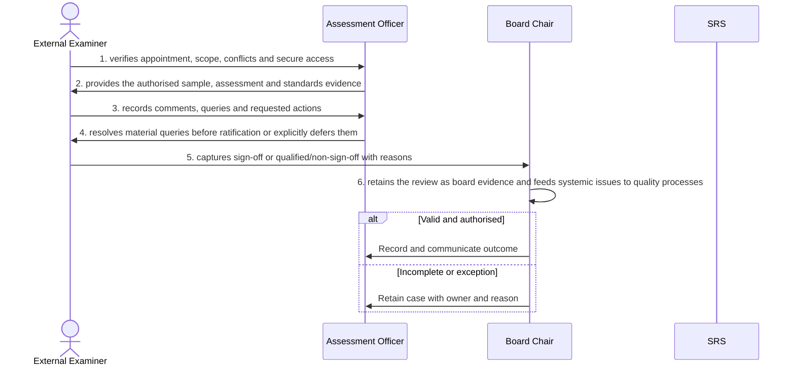

# BP-05-008 — Complete external examiner review

> Status: Draft
> Domain: 05 — Assessment and results
> Owner: TBC
> Version: 0.1
> Last reviewed: 2026-07-26
> Review by: 2027-01-26

[Previous: BP-05-007](../05-assessment-and-results/bp-05-007-prepare-an-exam-board-and-data-pack.md) · [Domain index](README.md) · [Next: BP-05-009](../05-assessment-and-results/bp-05-009-ratify-and-publish-results.md) · [Library home](../README.md)

## Applicability

| Dimension | Applies |
|---|---|
| Common | UK |
| Nations | England; Scotland; Wales; Northern Ireland |
| Provider types | Providers operating this process; exact regulatory scope is configured |
| Levels and modes | UG; PGT; PGR; full-time; part-time; distance and collaborative provision where relevant |
| Exclusions | Activities outside the stated start/end boundary |

## Traceability

| Type | References |
|---|---|
| Revelation workflows | W005 |
| Reference-model flows | See integration contract catalogue; confirm detailed F-number mapping during architecture review |
| Functional requirements | See functional requirements; detailed mapping remains an SME/architecture review action |
| Data entities | external examiner access, review and sign-off; supporting identity, evidence, decision and integration-exchange records |
| Domain events | Proposed: `srs.complete.external.examiner.review.completed` |
| Integration contracts | SRS → examiner workspace; Workspace → SRS |

## Purpose and outcome

Completing external examiner review gives an appointed external examiner secure access to the sample, assessment and standards evidence they need to check the institution's marking and moderation against sector standards, and a formal channel to raise queries before results are ratified. Material queries are resolved or explicitly deferred rather than silently ignored, and the examiner's sign-off — or qualified or withheld sign-off — is captured with its reasons as part of the board's permanent evidence. Systemic issues the examiner raises are fed to quality processes so they inform practice beyond the single board.

## Scope

**Starts when:** The approved mark/result evidence is ready for external review.

**Ends when:** The authorised outcome is recorded, communicated and reconciled, or the case is closed with an owned reason.

**In scope:** Intake, validation, evidence, decision, effective dating, communication and downstream reconciliation.

**Out of scope:** Upstream policy creation and later lifecycle processes referenced under Related processes.

## Actors and responsibilities

| Actor/system | Responsibility |
|---|---|
| External Examiner | Initiates or owns the principal business action |
| Assessment Officer | Provides evidence, decision, system processing or governed support |
| Board Chair | Provides evidence, decision, system processing or governed support |
| SRS | Provides evidence, decision, system processing or governed support |

**Accountable owner:** External Examiner service owner or delegated authority (TBC)

**System of record:** SRS for the student-record outcome; specialist systems retain their governed source evidence.

## Preconditions

1. Canonical person, programme/period and source identifiers are available where applicable.
2. The current policy/rule version and decision authority are configured.
3. Required interfaces use stable identifiers, provenance and reconciliation controls.

## Trigger

The approved mark/result evidence is ready for external review.

## Main flow

1. **External Examiner** verify appointment, scope, conflicts and secure access.
2. **Assessment Officer** provide the authorised sample, assessment and standards evidence.
3. **External Examiner** record comments, queries and requested actions.
4. **Assessment Officer** resolve material queries before ratification or explicitly defer them.
5. **External Examiner** capture sign-off or qualified/non-sign-off with reasons.
6. **Board Chair** retain the review as board evidence and feed systemic issues to quality processes.

## Alternative flows

### A1 — Variant

- **A1.1** Programme, module and award-level external examining scopes differ.

### A2 — Variant

- **A2.1** Emergency substitute appointment preserves authority evidence.

## Exception flows

### E1 — Control exception

- **E1.1** Expired appointment or conflict removes access.

### E2 — Control exception

- **E2.1** Non-sign-off cannot be represented as approval.

## Postconditions

### Successful

- The external examiner access, review and sign-off is authoritative, effective-dated and linked to its evidence and decision authority.
- Each required consumer has acknowledged the correct version or has an owned reconciliation item.

### Unsuccessful or incomplete

- No unapproved outcome is represented as final; the case retains reason, owner and next action.

## Business rules and controls

| ID | Classification | Rule/control | Applicability | Source |
|---|---|---|---|---|
| BR-1 | SECTOR | Apply the current authoritative requirement and provider regulation for the person, level, mode and nation | UK/configured | SRC-059 |
| BR-2 | INSTITUTION | Decision roles, deadlines, evidence and permitted discretion are policy-versioned | Provider | Provider regulations |
| BR-3 | REVELATION | External-examiner appointment scope and sign-off are not durable workflow records. | Revelation | SRC-015–SRC-019 |
| BR-4 | PROPOSED | Proposed, approved, rejected and superseded states remain distinguishable | Revelation target | Process control |
| BR-5 | PROPOSED | Corrections append provenance and trigger impact/reconciliation; they do not silently overwrite | Revelation target | Data governance |

## National and institutional variations

### England

Awarding-provider regulations and external examining arrangements apply within the English regulatory context.

### Scotland

SCQF levels, Scottish degree structures and provider senate regulations must be configurable.

### Wales

CQFW context, Welsh-language operation and awarding/partner responsibilities must be configurable.

### Northern Ireland

Provider regulations, external examining and any professional-body requirements apply.

### Institutional policy points

Terminology, authority, deadlines, evidence, thresholds, communication, appeals/reviews, partner responsibility and target-system ownership.

## Data impact

| Data concept | Action | System of record | Effective/provenance requirement | Sensitivity |
|---|---|---|---|---|
| external examiner access, review and sign-off | Create/version | SRS or governed specialist source | Policy, actor, evidence, decision and effective/transaction times | Personal; may be sensitive |
| Workflow/case evidence | Append | Owning service | Immutable source and restricted access | Personal/confidential |
| Integration exchange | Append/update | SRS integration ledger | Contract version, correlation, attempts and acknowledgement | Personal |

## Integration impact

| From | To | Information/purpose | Contract/pattern | Failure and reconciliation |
|---|---|---|---|---|
| SRS | examiner workspace | evidence | Versioned/idempotent contract | Retry, quarantine, acknowledge and reconcile |
| Workspace | SRS | sign-off | Versioned/idempotent contract | Retry, quarantine, acknowledge and reconcile |

## Sequence diagram

## Open questions and decisions

| ID | Question/decision | Owner | Status |
|---|---|---|---|
| OQ-1 | Confirm the authoritative owner, workflow boundary and detailed requirement/contract mapping | Process owner/architect | Open |
| OQ-2 | Which national, provider-type and mode variants require configuration? | Four-nation SME | Open |
| OQ-3 | Which evidence stays in a specialist system and what minimum outcome enters the SRS? | Data protection/data owner | Open |

## Sources

| Source | Supported content |
|---|---|
| [SRC-059](../source-register.md) | External process, regulatory or sector evidence |
| [SRC-015–SRC-019](../source-register.md) | Revelation workflows, actors, contracts, data and requirements |

## Related processes

[Process inventory](../process-inventory.md); adjacent lifecycle processes in the [process map](../process-map.md).

## Review record

| Review | Reviewer | Date | Outcome |
|---|---|---|---|
| Research/documentation | Codex implementation role | 2026-07-26 | Drafted |
| Required reviews | Process, national, data and integration SMEs (TBC) | — | Pending |

## Change history

| Version | Date | Author | Change |
|---|---|---|---|
| 0.1 | 2026-07-26 | Codex | Initial research draft |
