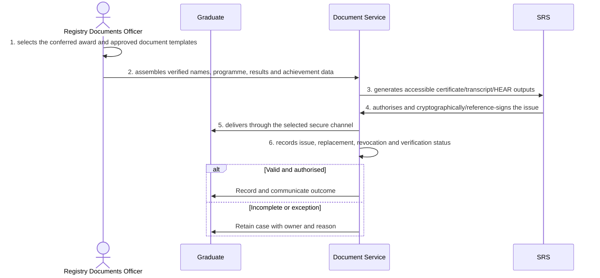

# BP-06-004 — Issue award documentation and HEAR

> Status: Draft
> Domain: 06 — Progression, awards and graduation
> Owner: TBC
> Version: 0.1
> Last reviewed: 2026-07-26
> Review by: 2027-01-26

[Previous: BP-06-003](../06-progression-awards-and-graduation/bp-06-003-determine-and-confer-an-award.md) · [Domain index](README.md) · [Next: BP-06-005](../06-progression-awards-and-graduation/bp-06-005-determine-graduation-eligibility-and-attendance.md) · [Library home](../README.md)

## Applicability

| Dimension | Applies |
|---|---|
| Common | UK |
| Nations | England; Scotland; Wales; Northern Ireland |
| Provider types | Providers operating this process; exact regulatory scope is configured |
| Levels and modes | UG; PGT; PGR; full-time; part-time; distance and collaborative provision where relevant |
| Exclusions | Activities outside the stated start/end boundary |

## Traceability

| Type | References |
|---|---|
| Revelation workflows | W011 |
| Reference-model flows | See integration contract catalogue; confirm detailed F-number mapping during architecture review |
| Functional requirements | See functional requirements; detailed mapping remains an SME/architecture review action |
| Data entities | issued certificate, transcript and HEAR version; supporting identity, evidence, decision and integration-exchange records |
| Domain events | Proposed: `srs.issue.award.documentation.and.hear.completed` |
| Integration contracts | SRS ↔ document/verification service |

## Purpose and outcome

Issuing award documentation and the Higher Education Achievement Report turns a conferred award into the certificate, transcript and HEAR a graduate can actually present to an employer or another institution, generated only from verified, authoritative award and result data. Each document is authorised and signed before it is issued, and delivered only through a secure channel, so a graduate always receives a document the institution can stand behind and later verify. Every issue, replacement, revocation and verification check is recorded, so the institution can always confirm what was issued to whom and whether it remains valid.

## Scope

**Starts when:** A conferred award or authorised academic record is ready for documentation.

**Ends when:** The authorised outcome is recorded, communicated and reconciled, or the case is closed with an owned reason.

**In scope:** Intake, validation, evidence, decision, effective dating, communication and downstream reconciliation.

**Out of scope:** Upstream policy creation and later lifecycle processes referenced under Related processes.

## Actors and responsibilities

| Actor/system | Responsibility |
|---|---|
| Registry Documents Officer | Initiates or owns the principal business action |
| Graduate | Provides evidence, decision, system processing or governed support |
| Document Service | Provides evidence, decision, system processing or governed support |
| SRS | Provides evidence, decision, system processing or governed support |

**Accountable owner:** Registry Documents Officer service owner or delegated authority (TBC)

**System of record:** SRS for the student-record outcome; specialist systems retain their governed source evidence.

## Preconditions

1. Canonical person, programme/period and source identifiers are available where applicable.
2. The current policy/rule version and decision authority are configured.
3. Required interfaces use stable identifiers, provenance and reconciliation controls.

## Trigger

A conferred award or authorised academic record is ready for documentation.

## Main flow

1. **Registry Documents Officer** select the conferred award and approved document templates.
2. **Registry Documents Officer** assemble verified names, programme, results and achievement data.
3. **Document Service** generate accessible certificate/transcript/HEAR outputs.
4. **SRS** authorise and cryptographically/reference-sign the issue.
5. **Document Service** deliver through the selected secure channel.
6. **Document Service** record issue, replacement, revocation and verification status.

## Alternative flows

### A1 — Variant

- **A1.1** Replacement, corrected-name and certified-copy routes preserve issuance history.

### A2 — Variant

- **A2.1** Partner, joint and bilingual documents use approved templates.

## Exception flows

### E1 — Control exception

- **E1.1** Data mismatch blocks issue.

### E2 — Control exception

- **E2.1** Compromised or erroneous document is revoked and replaced without deleting evidence.

## Postconditions

### Successful

- The issued certificate, transcript and HEAR version is authoritative, effective-dated and linked to its evidence and decision authority.
- Each required consumer has acknowledged the correct version or has an owned reconciliation item.

### Unsuccessful or incomplete

- No unapproved outcome is represented as final; the case retains reason, owner and next action.

## Business rules and controls

| ID | Classification | Rule/control | Applicability | Source |
|---|---|---|---|---|
| BR-1 | SECTOR | Apply the current authoritative requirement and provider regulation for the person, level, mode and nation | UK/configured | SRC-062–SRC-063 |
| BR-2 | INSTITUTION | Decision roles, deadlines, evidence and permitted discretion are policy-versioned | Provider | Provider regulations |
| BR-3 | REVELATION | Document instances, verification and revocation lifecycle need stronger modelling. | Revelation | SRC-015–SRC-019 |
| BR-4 | PROPOSED | Proposed, approved, rejected and superseded states remain distinguishable | Revelation target | Process control |
| BR-5 | PROPOSED | Corrections append provenance and trigger impact/reconciliation; they do not silently overwrite | Revelation target | Data governance |

## National and institutional variations

### England

Provider award regulations apply within the English regulatory framework.

### Scotland

SCQF levels, ordinary/honours routes and Scottish degree structures require configurable rules.

### Wales

CQFW context, bilingual documentation and awarding/partner responsibilities may apply.

### Northern Ireland

Provider award regulations and Department for the Economy context apply.

### Institutional policy points

Terminology, authority, deadlines, evidence, thresholds, communication, appeals/reviews, partner responsibility and target-system ownership.

## Data impact

| Data concept | Action | System of record | Effective/provenance requirement | Sensitivity |
|---|---|---|---|---|
| issued certificate, transcript and HEAR version | Create/version | SRS or governed specialist source | Policy, actor, evidence, decision and effective/transaction times | Personal; may be sensitive |
| Workflow/case evidence | Append | Owning service | Immutable source and restricted access | Personal/confidential |
| Integration exchange | Append/update | SRS integration ledger | Contract version, correlation, attempts and acknowledgement | Personal |

## Integration impact

| From | To | Information/purpose | Contract/pattern | Failure and reconciliation |
|---|---|---|---|---|
| SRS ↔ document/verification service | Connected system | award documents | Versioned/idempotent contract | Retry, quarantine, acknowledge and reconcile |

## Sequence diagram

## Open questions and decisions

| ID | Question/decision | Owner | Status |
|---|---|---|---|
| OQ-1 | Confirm the authoritative owner, workflow boundary and detailed requirement/contract mapping | Process owner/architect | Open |
| OQ-2 | Which national, provider-type and mode variants require configuration? | Four-nation SME | Open |
| OQ-3 | Which evidence stays in a specialist system and what minimum outcome enters the SRS? | Data protection/data owner | Open |

## Sources

| Source | Supported content |
|---|---|
| [SRC-062–SRC-063](../source-register.md) | External process, regulatory or sector evidence |
| [SRC-015–SRC-019](../source-register.md) | Revelation workflows, actors, contracts, data and requirements |

## Related processes

[Process inventory](../process-inventory.md); adjacent lifecycle processes in the [process map](../process-map.md).

## Review record

| Review | Reviewer | Date | Outcome |
|---|---|---|---|
| Research/documentation | Codex implementation role | 2026-07-26 | Drafted |
| Required reviews | Process, national, data and integration SMEs (TBC) | — | Pending |

## Change history

| Version | Date | Author | Change |
|---|---|---|---|
| 0.1 | 2026-07-26 | Codex | Initial research draft |
