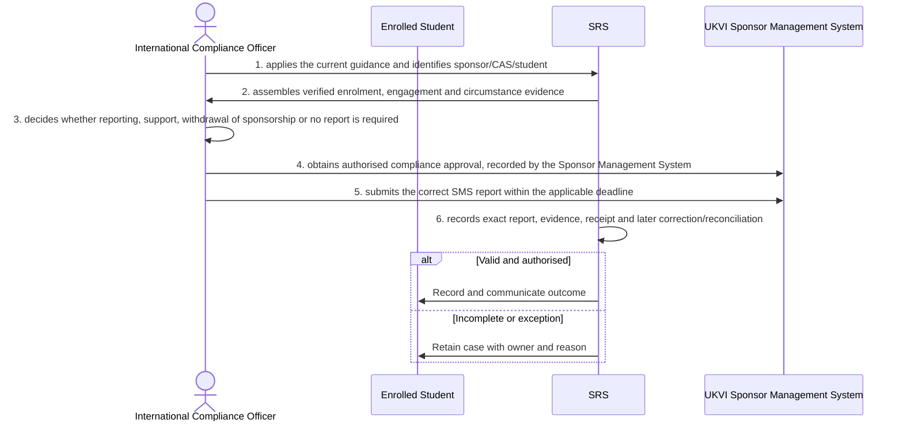

# BP-07-003 — Manage Student sponsor reporting and compliance

> Status: Draft
> Domain: 07 — Regulatory and statutory reporting
> Owner: TBC
> Version: 0.1
> Last reviewed: 2026-07-26
> Review by: 2027-01-26

[Previous: BP-07-002](../07-regulatory-and-statutory-reporting/bp-07-002-exchange-registration-attendance-and-changes-with-student-finance-bodies.md) · [Domain index](README.md) · [Next: BP-07-004](../07-regulatory-and-statutory-reporting/bp-07-004-produce-ofs-regulatory-extracts.md) · [Library home](../README.md)

## Applicability

| Dimension | Applies |
|---|---|
| Common | UK |
| Nations | England; Scotland; Wales; Northern Ireland |
| Provider types | Providers operating this process; exact regulatory scope is configured |
| Levels and modes | UG; PGT; PGR; full-time; part-time; distance and collaborative provision where relevant |
| Exclusions | Activities outside the stated start/end boundary |

## Traceability

| Type | References |
|---|---|
| Revelation workflows | W009/W012 |
| Reference-model flows | See integration contract catalogue; confirm detailed F-number mapping during architecture review |
| Functional requirements | See functional requirements; detailed mapping remains an SME/architecture review action |
| Data entities | sponsor compliance case, SMS report and evidence; supporting identity, evidence, decision and integration-exchange records |
| Domain events | Proposed: `srs.manage.student.sponsor.reporting.and.compliance.completed` |
| Integration contracts | SRS ↔ UKVI SMS |

## Purpose and outcome

Managing student sponsor reporting and compliance turns evidence about a Student-route sponsored student's engagement and circumstances into the correct compliance decision — report, support, consider withdrawing sponsorship, or no report required — under the current UKVI guidance. Because a report can affect a student's visa status, the decision and the approval to act on it are kept as distinct, accountable steps, and only the correct report is submitted to the Sponsor Management System within its statutory deadline. Every report, its supporting evidence and its receipt are recorded, so the institution can demonstrate compliance with its sponsor duties at any later point.

## Scope

**Starts when:** A sponsored-student event or compliance review becomes due.

**Ends when:** The authorised outcome is recorded, communicated and reconciled, or the case is closed with an owned reason.

**In scope:** Intake, validation, evidence, decision, effective dating, communication and downstream reconciliation.

**Out of scope:** Upstream policy creation and later lifecycle processes referenced under Related processes.

## Actors and responsibilities

| Actor/system | Responsibility |
|---|---|
| International Compliance Officer | Initiates or owns the principal business action |
| Enrolled Student | Provides evidence, decision, system processing or governed support |
| SRS | Provides evidence, decision, system processing or governed support |
| UKVI Sponsor Management System | Provides evidence, decision, system processing or governed support |

**Accountable owner:** International Compliance Officer service owner or delegated authority (TBC)

**System of record:** SRS for the student-record outcome; specialist systems retain their governed source evidence.

## Preconditions

1. Canonical person, programme/period and source identifiers are available where applicable.
2. The current policy/rule version and decision authority are configured.
3. Required interfaces use stable identifiers, provenance and reconciliation controls.

## Trigger

A sponsored-student event or compliance review becomes due.

## Main flow

1. **International Compliance Officer** apply the current guidance and identify sponsor/CAS/student.
2. **SRS** assemble verified enrolment, engagement and circumstance evidence.
3. **International Compliance Officer** decide whether reporting, support, withdrawal of sponsorship or no report is required.
4. **International Compliance Officer** obtain authorised compliance approval, recorded by the UKVI Sponsor Management System.
5. **International Compliance Officer** submit the correct SMS report within the applicable deadline.
6. **SRS** record exact report, evidence, receipt and later correction/reconciliation.

## Alternative flows

### A1 — Variant

- **A1.1** Partner, placement, study-abroad, remote and PGR engagement use guidance-specific evidence.

### A2 — Variant

- **A2.1** A permitted non-reporting decision retains reasons and policy version.

## Exception flows

### E1 — Control exception

- **E1.1** Welfare/academic status decisions remain separate from sponsor reporting.

### E2 — Control exception

- **E2.1** Incorrect SMS data is corrected through a linked report.

## Postconditions

### Successful

- The sponsor compliance case, SMS report and evidence is authoritative, effective-dated and linked to its evidence and decision authority.
- Each required consumer has acknowledged the correct version or has an owned reconciliation item.

### Unsuccessful or incomplete

- No unapproved outcome is represented as final; the case retains reason, owner and next action.

## Business rules and controls

| ID | Classification | Rule/control | Applicability | Source |
|---|---|---|---|---|
| BR-1 | SECTOR | Apply the current authoritative requirement and provider regulation for the person, level, mode and nation | UK/configured | SRC-001–SRC-002 |
| BR-2 | INSTITUTION | Decision roles, deadlines, evidence and permitted discretion are policy-versioned | Provider | Provider regulations |
| BR-3 | REVELATION | W009/W012 need one governed reporting case with guidance version and SMS evidence. | Revelation | SRC-015–SRC-019 |
| BR-4 | PROPOSED | Proposed, approved, rejected and superseded states remain distinguishable | Revelation target | Process control |
| BR-5 | PROPOSED | Corrections append provenance and trigger impact/reconciliation; they do not silently overwrite | Revelation target | Data governance |

## National and institutional variations

### England

OfS and other England-specific requirements apply only to providers in scope.

### Scotland

SFC and SAAS requirements apply in addition to UK-wide collections; do not reuse England-only codes.

### Wales

Medr and Student Finance Wales requirements apply, including Welsh-medium data uses.

### Northern Ireland

Department for the Economy and Student Finance NI requirements apply.

### Institutional policy points

Terminology, authority, deadlines, evidence, thresholds, communication, appeals/reviews, partner responsibility and target-system ownership.

## Data impact

| Data concept | Action | System of record | Effective/provenance requirement | Sensitivity |
|---|---|---|---|---|
| sponsor compliance case, SMS report and evidence | Create/version | SRS or governed specialist source | Policy, actor, evidence, decision and effective/transaction times | Personal; may be sensitive |
| Workflow/case evidence | Append | Owning service | Immutable source and restricted access | Personal/confidential |
| Integration exchange | Append/update | SRS integration ledger | Contract version, correlation, attempts and acknowledgement | Personal |

## Integration impact

| From | To | Information/purpose | Contract/pattern | Failure and reconciliation |
|---|---|---|---|---|
| SRS ↔ UKVI SMS | Connected system | sponsor report | Versioned/idempotent contract | Retry, quarantine, acknowledge and reconcile |

## Sequence diagram

## Open questions and decisions

| ID | Question/decision | Owner | Status |
|---|---|---|---|
| OQ-1 | Confirm the authoritative owner, workflow boundary and detailed requirement/contract mapping | Process owner/architect | Open |
| OQ-2 | Which national, provider-type and mode variants require configuration? | Four-nation SME | Open |
| OQ-3 | Which evidence stays in a specialist system and what minimum outcome enters the SRS? | Data protection/data owner | Open |

## Sources

| Source | Supported content |
|---|---|
| [SRC-001–SRC-002](../source-register.md) | External process, regulatory or sector evidence |
| [SRC-015–SRC-019](../source-register.md) | Revelation workflows, actors, contracts, data and requirements |

## Related processes

[Process inventory](../process-inventory.md); adjacent lifecycle processes in the [process map](../process-map.md).

## Review record

| Review | Reviewer | Date | Outcome |
|---|---|---|---|
| Research/documentation | Codex implementation role | 2026-07-26 | Drafted |
| Required reviews | Process, national, data and integration SMEs (TBC) | — | Pending |

## Change history

| Version | Date | Author | Change |
|---|---|---|---|
| 0.1 | 2026-07-26 | Codex | Initial research draft |
