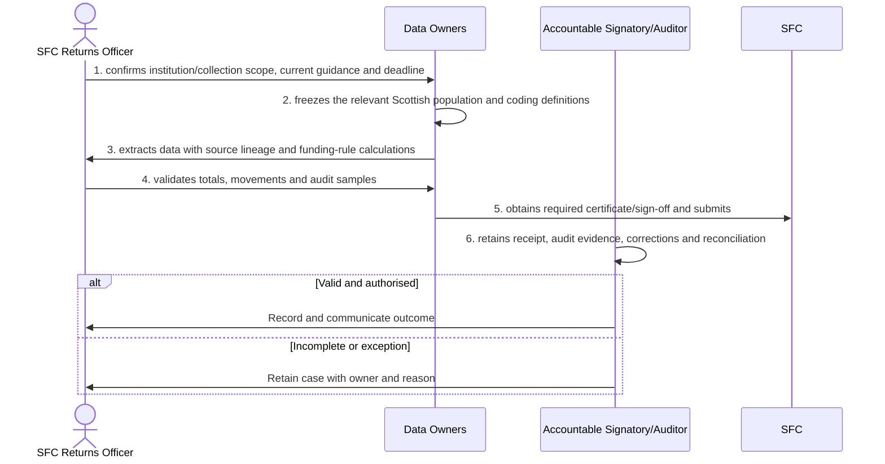

# BP-07-005 — Produce Scottish Funding Council returns

> Status: Draft
> Domain: 07 — Regulatory and statutory reporting
> Owner: TBC
> Version: 0.1
> Last reviewed: 2026-07-26
> Review by: 2027-01-26

[Previous: BP-07-004](../07-regulatory-and-statutory-reporting/bp-07-004-produce-ofs-regulatory-extracts.md) · [Domain index](README.md) · [Next: BP-07-006](../07-regulatory-and-statutory-reporting/bp-07-006-produce-medr-regulatory-and-funding-returns.md) · [Library home](../README.md)

## Applicability

| Dimension | Applies |
|---|---|
| Common | UK |
| Nations | England; Scotland; Wales; Northern Ireland |
| Provider types | Providers operating this process; exact regulatory scope is configured |
| Levels and modes | UG; PGT; PGR; full-time; part-time; distance and collaborative provision where relevant |
| Exclusions | Activities outside the stated start/end boundary |

## Traceability

| Type | References |
|---|---|
| Revelation workflows | Gap |
| Reference-model flows | See integration contract catalogue; confirm detailed F-number mapping during architecture review |
| Functional requirements | See functional requirements; detailed mapping remains an SME/architecture review action |
| Data entities | SFC return, certification and audit evidence; supporting identity, evidence, decision and integration-exchange records |
| Domain events | Proposed: `srs.produce.scottish.funding.council.returns.completed` |
| Integration contracts | SRS/data platform → SFC |

## Purpose and outcome

Producing Scottish Funding Council returns turns the institution's Scotland-specific student population and funding-rule calculations into the certified return the SFC requires, with every figure traceable back to its source. Validating totals, movements and audit samples against the institution's own records before certification catches a discrepancy before an external auditor does, and the required certificate or sign-off is obtained before anything is submitted. Receipt, audit evidence, corrections and reconciliation are retained together, so a later audit can be answered from the original submission record.

## Scope

**Starts when:** An applicable SFC collection or funding information request is due.

**Ends when:** The authorised outcome is recorded, communicated and reconciled, or the case is closed with an owned reason.

**In scope:** Intake, validation, evidence, decision, effective dating, communication and downstream reconciliation.

**Out of scope:** Upstream policy creation and later lifecycle processes referenced under Related processes.

## Actors and responsibilities

| Actor/system | Responsibility |
|---|---|
| SFC Returns Officer | Initiates or owns the principal business action |
| Data Owners | Provides evidence, decision, system processing or governed support |
| Accountable Signatory/Auditor | Provides evidence, decision, system processing or governed support |
| SFC | Provides evidence, decision, system processing or governed support |

**Accountable owner:** SFC Returns Officer service owner or delegated authority (TBC)

**System of record:** SRS for the student-record outcome; specialist systems retain their governed source evidence.

## Preconditions

1. Canonical person, programme/period and source identifiers are available where applicable.
2. The current policy/rule version and decision authority are configured.
3. Required interfaces use stable identifiers, provenance and reconciliation controls.

## Trigger

An applicable SFC collection or funding information request is due.

## Main flow

1. **SFC Returns Officer** confirm institution/collection scope, current guidance and deadline.
2. **Data Owners** freeze the relevant Scottish population and coding definitions.
3. **Data Owners** extract data with source lineage and funding-rule calculations.
4. **SFC Returns Officer** validate totals, movements and audit samples.
5. **Data Owners** obtain required certificate/sign-off and submit.
6. **Accountable Signatory/Auditor** retain receipt, audit evidence, corrections and reconciliation.

## Alternative flows

### A1 — Variant

- **A1.1** University and college collections, including FES where applicable, use distinct schemas.

### A2 — Variant

- **A2.1** HESA-derived uses are not duplicated as an England-only return.

## Exception flows

### E1 — Control exception

- **E1.1** Funding-impact uncertainty is escalated.

### E2 — Control exception

- **E2.1** Audit qualification and resubmission remain linked to the original.

## Postconditions

### Successful

- The SFC return, certification and audit evidence is authoritative, effective-dated and linked to its evidence and decision authority.
- Each required consumer has acknowledged the correct version or has an owned reconciliation item.

### Unsuccessful or incomplete

- No unapproved outcome is represented as final; the case retains reason, owner and next action.

## Business rules and controls

| ID | Classification | Rule/control | Applicability | Source |
|---|---|---|---|---|
| BR-1 | SECTOR | Apply the current authoritative requirement and provider regulation for the person, level, mode and nation | UK/configured | SRC-067 |
| BR-2 | INSTITUTION | Decision roles, deadlines, evidence and permitted discretion are policy-versioned | Provider | Provider regulations |
| BR-3 | REVELATION | No SFC contract, certification workflow or Scottish coding boundary exists. | Revelation | SRC-015–SRC-019 |
| BR-4 | PROPOSED | Proposed, approved, rejected and superseded states remain distinguishable | Revelation target | Process control |
| BR-5 | PROPOSED | Corrections append provenance and trigger impact/reconciliation; they do not silently overwrite | Revelation target | Data governance |

## National and institutional variations

### England

OfS and other England-specific requirements apply only to providers in scope.

### Scotland

SFC and SAAS requirements apply in addition to UK-wide collections; do not reuse England-only codes.

### Wales

Medr and Student Finance Wales requirements apply, including Welsh-medium data uses.

### Northern Ireland

Department for the Economy and Student Finance NI requirements apply.

### Institutional policy points

Terminology, authority, deadlines, evidence, thresholds, communication, appeals/reviews, partner responsibility and target-system ownership.

## Data impact

| Data concept | Action | System of record | Effective/provenance requirement | Sensitivity |
|---|---|---|---|---|
| SFC return, certification and audit evidence | Create/version | SRS or governed specialist source | Policy, actor, evidence, decision and effective/transaction times | Personal; may be sensitive |
| Workflow/case evidence | Append | Owning service | Immutable source and restricted access | Personal/confidential |
| Integration exchange | Append/update | SRS integration ledger | Contract version, correlation, attempts and acknowledgement | Personal |

## Integration impact

| From | To | Information/purpose | Contract/pattern | Failure and reconciliation |
|---|---|---|---|---|
| SRS/data platform | SFC | return | Versioned/idempotent contract | Retry, quarantine, acknowledge and reconcile |

## Sequence diagram

## Open questions and decisions

| ID | Question/decision | Owner | Status |
|---|---|---|---|
| OQ-1 | Confirm the authoritative owner, workflow boundary and detailed requirement/contract mapping | Process owner/architect | Open |
| OQ-2 | Which national, provider-type and mode variants require configuration? | Four-nation SME | Open |
| OQ-3 | Which evidence stays in a specialist system and what minimum outcome enters the SRS? | Data protection/data owner | Open |

## Sources

| Source | Supported content |
|---|---|
| [SRC-067](../source-register.md) | External process, regulatory or sector evidence |
| [SRC-015–SRC-019](../source-register.md) | Revelation workflows, actors, contracts, data and requirements |

## Related processes

[Process inventory](../process-inventory.md); adjacent lifecycle processes in the [process map](../process-map.md).

## Review record

| Review | Reviewer | Date | Outcome |
|---|---|---|---|
| Research/documentation | Codex implementation role | 2026-07-26 | Drafted |
| Required reviews | Process, national, data and integration SMEs (TBC) | — | Pending |

## Change history

| Version | Date | Author | Change |
|---|---|---|---|
| 0.1 | 2026-07-26 | Codex | Initial research draft |
