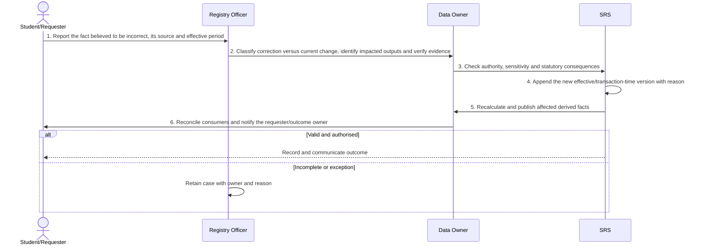

# BP-08-002 — Correct personal or enrolment data

> Status: Draft
> Domain: 08 — Record governance and lifecycle
> Owner: TBC
> Version: 0.1
> Last reviewed: 2026-07-26
> Review by: 2027-01-26

[Previous: BP-08-001](../08-record-governance-and-lifecycle/bp-08-001-resolve-a-duplicate-or-uncertain-identity.md) · [Domain index](README.md) · [Next: BP-08-003](../08-record-governance-and-lifecycle/bp-08-003-fulfil-a-data-subject-access-request.md) · [Library home](../README.md)

## Applicability

| Dimension | Applies |
|---|---|
| Common | UK |
| Nations | England; Scotland; Wales; Northern Ireland |
| Provider types | Providers operating this process; exact regulatory scope is configured |
| Levels and modes | UG; PGT; PGR; full-time; part-time; distance and collaborative provision where relevant |
| Exclusions | Activities outside the stated start/end boundary |

## Traceability

| Type | References |
|---|---|
| Revelation workflows | W006 partial |
| Reference-model flows | See integration contract catalogue; confirm detailed F-number mapping during architecture review |
| Functional requirements | See functional requirements; detailed mapping remains an SME/architecture review action |
| Data entities | authorised bitemporal correction and reason; supporting identity, evidence, decision and integration-exchange records |
| Domain events | Proposed: `srs.correct.personal.or.enrolment.data.completed` |
| Integration contracts | SRS → downstream systems/returns |

## Purpose and outcome

Student and enrolment facts sometimes need correcting: a date of birth was mistyped, a programme code was wrong at enrolment, or a fact that was once true has since changed. This process gives Registry and the relevant data owner a controlled way to verify the evidence, check who has the authority to change the record and whether the change has statutory consequences, before the correction is applied. Because the SRS is bitemporal, the correction is appended as a new dated version with its reason recorded rather than overwriting history, and any reports, returns or derived figures that depended on the old value are recalculated and reissued to the systems that consumed them.

## Scope

**Starts when:** An evidenced error or effective change to a core fact is reported.

**Ends when:** The authorised outcome is recorded, communicated and reconciled, or the case is closed with an owned reason.

**In scope:** Intake, validation, evidence, decision, effective dating, communication and downstream reconciliation.

**Out of scope:** Upstream policy creation and later lifecycle processes referenced under Related processes.

## Actors and responsibilities

| Actor/system | Responsibility |
|---|---|
| Student/Requester | Initiates or owns the principal business action |
| Registry Officer | Provides evidence, decision, system processing or governed support |
| Data Owner | Provides evidence, decision, system processing or governed support |
| SRS | Provides evidence, decision, system processing or governed support |

**Accountable owner:** Student/Requester service owner or delegated authority (TBC)

**System of record:** SRS for the student-record outcome; specialist systems retain their governed source evidence.

## Preconditions

1. Canonical person, programme/period and source identifiers are available where applicable.
2. The current policy/rule version and decision authority are configured.
3. Required interfaces use stable identifiers, provenance and reconciliation controls.

## Trigger

An evidenced error or effective change to a core fact is reported.

## Main flow

1. **Student/Requester** reports the fact believed to be incorrect, its source and the effective period affected.
2. **Registry Officer** classifies correction versus current change, identifies impacted outputs and verifies the evidence.
3. **Data Owner** checks authority, sensitivity and statutory consequences.
4. **SRS** appends the new effective/transaction-time version with reason.
5. **SRS** recalculates and publishes affected derived facts.
6. **Data Owner** reconciles consumers and notifies the requester/outcome owner.

## Alternative flows

### A1 — Variant

- **A1.1** Self-service changes may be auto-approved for low-risk current contact data.

### A2 — Variant

- **A2.1** Historic corrections require explicit effective dates and return impact review.

## Exception flows

### E1 — Control exception

- **E1.1** Academic judgement uses BP-05-011 rather than general correction.

### E2 — Control exception

- **E2.1** Unverified change remains requested, not authoritative.

## Postconditions

### Successful

- The authorised bitemporal correction and reason is authoritative, effective-dated and linked to its evidence and decision authority.
- Each required consumer has acknowledged the correct version or has an owned reconciliation item.

### Unsuccessful or incomplete

- No unapproved outcome is represented as final; the case retains reason, owner and next action.

## Business rules and controls

| ID | Classification | Rule/control | Applicability | Source |
|---|---|---|---|---|
| BR-1 | SECTOR | Apply the current authoritative requirement and provider regulation for the person, level, mode and nation | UK/configured | SRC-061, SRC-070 |
| BR-2 | INSTITUTION | Decision roles, deadlines, evidence and permitted discretion are policy-versioned | Provider | Provider regulations |
| BR-3 | REVELATION | W006 needs consistent bitemporal correction semantics and impact orchestration. | Revelation | SRC-015–SRC-019 |
| BR-4 | PROPOSED | Proposed, approved, rejected and superseded states remain distinguishable | Revelation target | Process control |
| BR-5 | PROPOSED | Corrections append provenance and trigger impact/reconciliation; they do not silently overwrite | Revelation target | Data governance |

## National and institutional variations

### England

UK GDPR and the Data Protection Act 2018 apply; provider retention and legal obligations define implementation.

### Scotland

The common data-protection framework applies with Scottish provider governance and public-records obligations where relevant.

### Wales

The common data-protection framework applies; Welsh-language communication preferences must be honoured.

### Northern Ireland

The common data-protection framework applies with Northern Ireland provider governance.

### Institutional policy points

Terminology, authority, deadlines, evidence, thresholds, communication, appeals/reviews, partner responsibility and target-system ownership.

## Data impact

| Data concept | Action | System of record | Effective/provenance requirement | Sensitivity |
|---|---|---|---|---|
| authorised bitemporal correction and reason | Create/version | SRS or governed specialist source | Policy, actor, evidence, decision and effective/transaction times | Personal; may be sensitive |
| Workflow/case evidence | Append | Owning service | Immutable source and restricted access | Personal/confidential |
| Integration exchange | Append/update | SRS integration ledger | Contract version, correlation, attempts and acknowledgement | Personal |

## Integration impact

| From | To | Information/purpose | Contract/pattern | Failure and reconciliation |
|---|---|---|---|---|
| SRS | downstream systems/returns | corrected fact | Versioned/idempotent contract | Retry, quarantine, acknowledge and reconcile |

## Sequence diagram

## Open questions and decisions

| ID | Question/decision | Owner | Status |
|---|---|---|---|
| OQ-1 | Confirm the authoritative owner, workflow boundary and detailed requirement/contract mapping | Process owner/architect | Open |
| OQ-2 | Which national, provider-type and mode variants require configuration? | Four-nation SME | Open |
| OQ-3 | Which evidence stays in a specialist system and what minimum outcome enters the SRS? | Data protection/data owner | Open |

## Sources

| Source | Supported content |
|---|---|
| [SRC-061, SRC-070](../source-register.md) | External process, regulatory or sector evidence |
| [SRC-015–SRC-019](../source-register.md) | Revelation workflows, actors, contracts, data and requirements |

## Related processes

[Process inventory](../process-inventory.md); adjacent lifecycle processes in the [process map](../process-map.md).

## Review record

| Review | Reviewer | Date | Outcome |
|---|---|---|---|
| Research/documentation | Codex implementation role | 2026-07-26 | Drafted |
| Required reviews | Process, national, data and integration SMEs (TBC) | — | Pending |

## Change history

| Version | Date | Author | Change |
|---|---|---|---|
| 0.1 | 2026-07-26 | Codex | Initial research draft |
