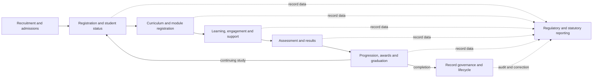

# Business Process Map

> Status: Complete draft decomposition
> Last updated: 2026-07-26

This map decomposes the student-record lifecycle into outcome-oriented processes. The full working list and status are in the [process inventory](process-inventory.md).

## Domain decomposition

### 1. Recruitment and admissions

Application receipt → application assessment → offer management → condition confirmation → CAS preparation where applicable → applicant-to-student conversion.

### 2. Registration and student status

Initial registration → annual re-registration → ongoing study → programme/status change → intermission or withdrawal → return or closure.

### 3. Curriculum and module registration

Catalogue intake → programme/route assignment → module selection → approval and validation → registration change → downstream provisioning.

### 4. Learning, engagement and support

Engagement evidence → non-engagement intervention → reasonable adjustment → exceptional circumstances → relevant outcome distribution.

### 5. Assessment and results

Assessment setup → entry → submission/mark intake → moderation → module result → misconduct/exception handling → board preparation → ratification → publication/correction.

### 6. Progression, awards and graduation

Progression evaluation → decision → reassessment or continuation → award determination → conferment → document/HEAR issue → graduation eligibility.

### 7. Regulatory and statutory reporting

Data preparation → validation → submission/exchange → error resolution → acceptance/reconciliation, with nation and scheme-specific variants.

### 8. Record governance and lifecycle

Identity resolution → correction → disclosure/restriction/erasure assessment → archive/retention → disposal → audit assurance.

## Cross-cutting hand-offs

| From | To | Typical record effect |
|---|---|---|
| Admissions | Registration | Applicant identity, offer and programme intent become registration preconditions |
| Registration | Finance/IAM/library/VLE | Status and entitlement activation |
| Curriculum | Registration/assessment | Effective-dated programme, module and assessment structures |
| Engagement/support | Assessment/boards | Approved outcomes and governed visibility |
| Assessment | Progression/awards | Confirmed results become decision inputs |
| All domains | Regulatory reporting | Versioned student data is extracted and validated |
| Governance | All domains | Authorised corrections and lifecycle controls |
