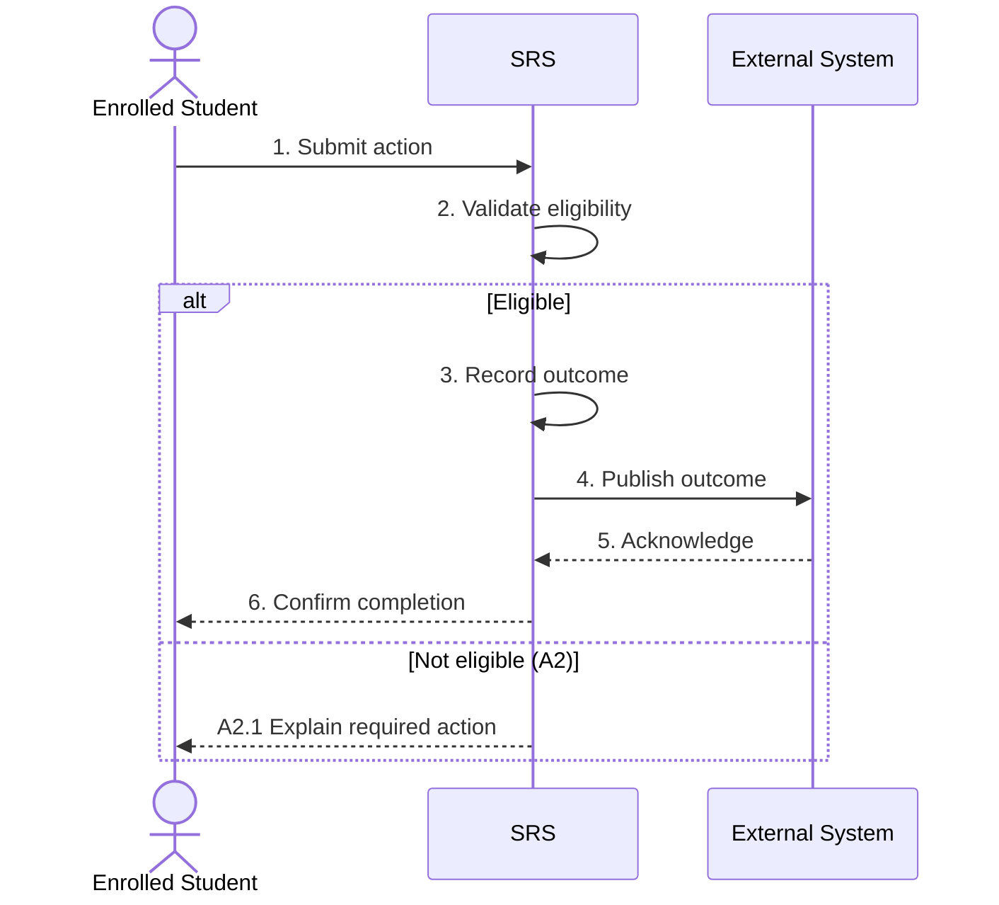

# BP-nnn — Process title

> Status: Candidate
> Domain: NN — Domain name
> Owner: TBC
> Version: 0.1
> Last reviewed: YYYY-MM-DD
> Review by: YYYY-MM-DD

[Previous](path.md) · [Domain index](README.md) · [Next](path.md) · [Library home](README.md)

## Applicability

| Dimension | Applies |
|---|---|
| Common | UK / None |
| Nations | England; Scotland; Wales; Northern Ireland |
| Provider types | State applicable provider types |
| Levels and modes | UG; PGT; PGR; full-time; part-time; distance; placement |
| Exclusions | State exclusions or `None identified` |

## Traceability

| Type | References |
|---|---|
| Revelation workflows | Wnnn or `None` |
| Reference-model flows | Fnnn or `None` |
| Functional requirements | REQ-AREA-nnn or `To map` |
| Data entities | `entity_name` |
| Domain events | `event.name` or `None` |
| Integration contracts | `contract-name.v1` or `Gap — no current contract` |

## Purpose and outcome

Describe the business outcome in plain language and explain why it matters to the student record.

## Scope

**Starts when:** State the start event.

**Ends when:** State the observable end state.

**In scope:** State the included cases.

**Out of scope:** Link to predecessor, successor, or separate variant processes.

## Actors and responsibilities

| Actor/system | Responsibility in this process |
|---|---|
| Canonical actor | Responsibility |
| SRS | Authoritative record responsibility |

**Accountable owner:** TBC

**System of record:** State the authoritative system for each material outcome if there is more than one.

## Preconditions

1. State required prior record state.
2. State permissions and open period.
3. State required external data or prior process outcome.

## Trigger

State the business event or schedule and who is responsible for initiating it.

## Main flow

1. **Actor** performs an action and states the relevant business information.
2. **SRS** validates the request and identifies any material restriction.
3. **SRS** records the outcome, including effective date and provenance.
4. **SRS** notifies a downstream system using the mapped contract.
5. **Receiving System** acknowledges the hand-off.
6. **SRS** marks the process complete.

## Alternative flows

### A2 — Descriptive alternative name

- **A2.1** At main step 2, state the different condition.
- **A2.2** State the alternative action and record effect.
- **A2.3** Rejoin the main flow at step 3, continue in another process, or end with a named outcome.

## Exception flows

### E4 — Descriptive exception name

- **E4.1** At main step 4, the integration rejects or fails to acknowledge the message.
- **E4.2** The SRS retains the pending exchange, retries according to the contract, and alerts the responsible actor.
- **E4.3** The SRS reconciles the outcome before the process is treated as fully complete.

## Postconditions

### Successful

- State the student record status.
- State downstream acknowledgements or pending reconciliation.
- State the next process enabled.

### Unsuccessful or incomplete

- State retained state and responsibility.
- State whether access, funding, sponsorship, or study may proceed.

## Business rules and controls

| ID | Classification | Rule/control | Applicability | Source |
|---|---|---|---|---|
| BR-1 | MANDATED/SECTOR/INSTITUTIONAL/REVELATION/PROPOSED | Rule | UK/nation/provider | SRC-nnn |

## National and institutional variations

### England

State only material England-specific bodies, rules, terms, or exchanges.

### Scotland

State only material Scotland-specific bodies, rules, terms, or exchanges.

### Wales

State only material Wales-specific bodies, rules, terms, or exchanges.

### Northern Ireland

State only material Northern Ireland-specific bodies, rules, terms, or exchanges.

### Institutional policy points

- List configuration choices without representing them as universal rules.

## Data impact

| Data concept | Action | System of record | Effective/provenance requirement | Sensitivity |
|---|---|---|---|---|
| Concept | Create/read/update/report | System | Requirement | Classification |

## Integration impact

| From | To | Information/purpose | Contract/pattern | Failure and reconciliation |
|---|---|---|---|---|
| Actor/system | Actor/system | Information | Contract | Behaviour |

## Sequence diagram

## Open questions and decisions

| ID | Question/decision | Owner | Status |
|---|---|---|---|
| OQ-1 | Question | TBC | Open |

## Sources

| Source | Supported content |
|---|---|
| [SRC-nnn](source-register.md) | Sections/rules supported |

## Related processes

- **Predecessor:** [BP-nnn — Process](path.md)
- **Successor:** [BP-nnn — Process](path.md)
- **Related:** [BP-nnn — Process](path.md)

## Review record

| Review | Reviewer | Date | Outcome |
|---|---|---|---|
| Business SME | TBC | — | Pending |
| Regulatory/data | TBC | — | Pending |
| Integration architecture | TBC | — | Pending |
| Data architecture | TBC | — | Pending |
| Revelation product/workflow | TBC | — | Pending |
| Editorial/accessibility | TBC | — | Pending |

## Change history

| Version | Date | Author | Change |
|---|---|---|---|
| 0.1 | YYYY-MM-DD | Documentation team | Initial draft |
