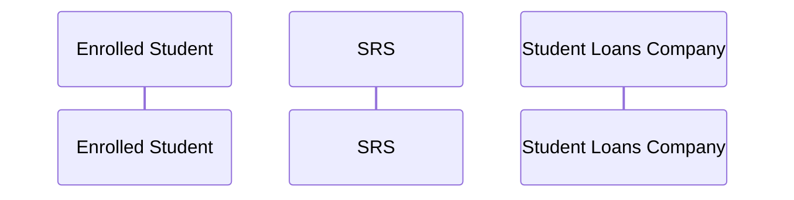

# Terminology and Authoring Conventions

> Status: Working baseline
> Last updated: 2026-07-26
> Primary terminology authority: [Revelation Domain Glossary](../domain-glossary.md)

## 1. Canonical system name

Use **Revelation SRS** for the product and **SRS** for its system boundary.

| Do not use as an unqualified synonym | Use |
|---|---|
| SIS | SRS |
| student information system | student records system, or SRS |
| student system | SRS |
| core system | SRS, unless a different core is explicitly defined |

Quoted source language may retain its original term. Technical identifiers are not renamed.

## 2. Canonical human actors

The following working names reconcile current usage. Proposed additions are marked `PROPOSED` and require inclusion in the actor catalogue before becoming authoritative there.

| Canonical actor | Current source labels reconciled | Notes |
|---|---|---|
| Prospective Student | Applicant; prospective student | Use Prospective Student until initial registration completes |
| Enrolled Student | Student; respondent student | Add a contextual qualifier only when material |
| Registry Administrator | Registry; Registry staff; Admissions/Registry staff | Use for student-record administration |
| Admissions Officer `PROPOSED` | Admissions staff | Separate from Registry Administrator where admissions decisions are material |
| Module Tutor | Module Tutor; academic staff | Use Academic Staff only for a genuinely broader population |
| Personal Tutor | Personal Tutor | |
| Research Supervisor | Research Supervisor | PGR-specific |
| Disability Adviser | Disability Advisor; Wellbeing Practitioner | UK spelling uses “Adviser”; determine whether wellbeing casework needs a separate actor |
| Wellbeing Practitioner | Wellbeing Practitioner | Do not combine with Disability Adviser where responsibilities differ |
| Exam Board Chair | Exam Board Chair | |
| Exam Board Member `PROPOSED` | Exam Board member; panel member | |
| External Examiner | External Examiner | |
| Academic Integrity Officer | AI Officer; integrity officer | Do not abbreviate to “AI” in business prose |
| Finance Administrator | Finance; Finance staff | |
| UKVI Compliance Officer `PROPOSED` | International/Registry team; UKVI Compliance Officer | Human institutional role, not UKVI |
| Student Data Officer `PROPOSED` | Data/Registry team | Owns statutory data preparation and quality |
| Graduation Administrator `PROPOSED` | Graduation/Ceremonies team | |
| Data Protection Officer | DPO | Spell out on first use |
| Tenant Administrator | Tenant Administrator | Revelation configuration role |
| System Administrator | System Administrator | Revelation platform role |

An organisational team, committee, human role, and system must not be represented as the same participant.

## 3. Canonical system actors

Use the names in the [Actor Catalogue](../requirements/actor-catalogue.md), including:

- UCAS;
- HESA;
- Student Loans Company;
- UK Visas and Immigration;
- Curriculum Management;
- Timetabling;
- CRM;
- Finance;
- Library;
- Enterprise Web Portal;
- Attendance Monitoring;
- Virtual Learning Environment;
- Identity and Access Management;
- EDRMS;
- Online ID Verification;
- Business Intelligence;
- Data Warehouse;
- Academic Integrity;
- Exam Scheduling; and
- Wellbeing and Disability.

In diagrams, long names may use an alias:

The displayed participant name must remain canonical.

## 4. UK applicability

Every page declares:

| Field | Allowed value |
|---|---|
| Common applicability | `UK` or `None` |
| National applicability | any of `England`, `Scotland`, `Wales`, `Northern Ireland` |
| Provider applicability | `Higher education provider`, `Further education provider delivering HE`, `Alternative provider`, `Partner-delivered provision` |
| Level/mode | `UG`, `PGT`, `PGR`, `Full-time`, `Part-time`, `Distance`, `Placement`, or stated exclusions |

Use these variation rules:

1. Write a common UK main flow only when the business outcome and principal sequence are genuinely shared.
2. Put a national rule in a named national alternative/variation, not in an England-centred main flow.
3. Name the relevant national body and scheme.
4. Treat provider policy as `INSTITUTIONAL`, even if several providers use it.
5. Do not infer that a funding or regulatory rule applies to a student merely from the provider's location; domicile, delivery location, funding body, immigration status, and programme can affect applicability.

## 5. Evidence classification

Prefix each material rule or variant with one of:

- `MANDATED`
- `SECTOR`
- `INSTITUTIONAL`
- `REVELATION`
- `PROPOSED`

The label describes authority, not confidence. Uncertain claims belong in open questions.

## 6. Process identity and filenames

- Business process identifier: `BP-dd-nnn`, where `dd` is the two-digit domain number (`01`–`08`, matching the domain folder) and `nnn` is a three-digit sequence local to that domain.
- Page title: `BP-dd-nnn — Verb-led outcome`.
- Filename: `bp-dd-nnn-kebab-case-title.md`.
- A new process is always assigned the next free `nnn` within its own domain, appended at the end of that domain's sequence. Adding a process to one domain never renumbers a page in another domain.
- Published identifiers are never reused or renumbered.
- A split or merge retires the old page with links to successors.

The BP-01-001–BP-08-006 working inventory was baselined on 2026-07-26 and migrated from a flat `BP-nnn` global sequence to the domain-scoped `BP-dd-nnn` scheme on 2026-07-28, precisely so that future additions never require renumbering an unrelated domain. These identifiers are stable; pages remain `Draft` until authorised SME review.

## 7. Numbered flows

### Main flow

Use ordinary integers:

1. The actor performs an action.
2. The SRS validates or records the outcome.
3. The receiving actor/system acknowledges the hand-off.

Every step must state:

- initiating actor;
- material action;
- receiving actor or system, if any; and
- student-record effect, if any.

### Alternative and exception flows

- `A3.1` is an alternative branching from main step 3.
- `E5.1` is an exception arising from main step 5.
- Subsequent steps increment the final number: `A3.2`, `A3.3`.
- State the rejoin point, successor process, or terminal outcome.
- Use one identifier consistently in prose, diagram notes, rules, and tests.

## 8. Mermaid sequence diagrams

- Use `sequenceDiagram`.
- Order participants from human initiator through SRS to downstream systems.
- Use `alt`/`else` for material alternatives, `opt` for optional behaviour, and `loop` only for genuine repetition.
- Put the prose step identifier at the start of each message where practical.
- Show synchronous response arrows only where acknowledgement affects the business outcome.
- Do not add an interaction unsupported by the prose.
- Do not omit a material cross-system hand-off described by the prose.
- Keep sensitive data categories in notes rather than example payloads.

## 9. Data and integration language

- **System of record** means the authoritative source of the stated fact, not simply a system holding a copy.
- State whether data is created, read, updated, corrected, superseded, reported, or disposed.
- Distinguish effective date from the date the SRS learned or recorded the change.
- Use current contract and domain-event identifiers in backticks.
- If no contract exists, write `Gap — no current contract`, not a speculative identifier.

## 10. Source citation

For every source record:

- publisher;
- title;
- direct URL;
- jurisdiction;
- version or effective/publication date;
- access date;
- relevant section;
- supported process IDs; and
- review-by date.

Do not commit third-party documents. Record citations and concise evidence notes within quotation and licensing limits.
