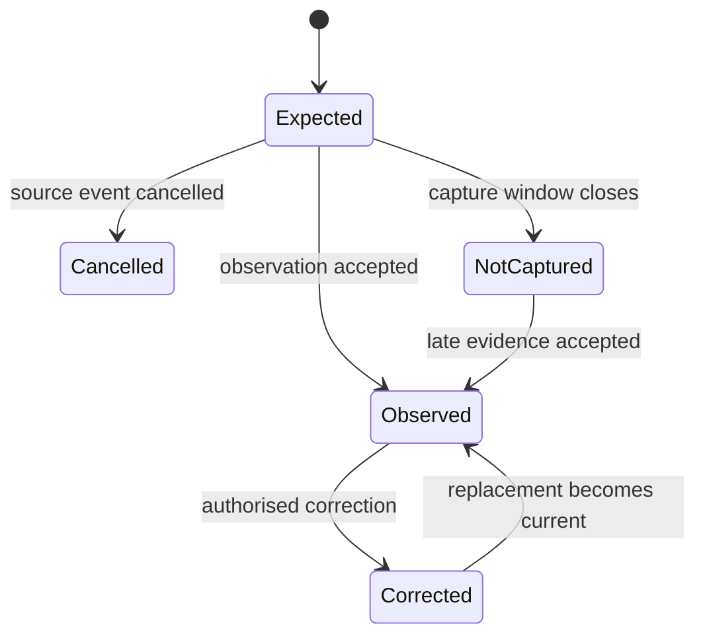
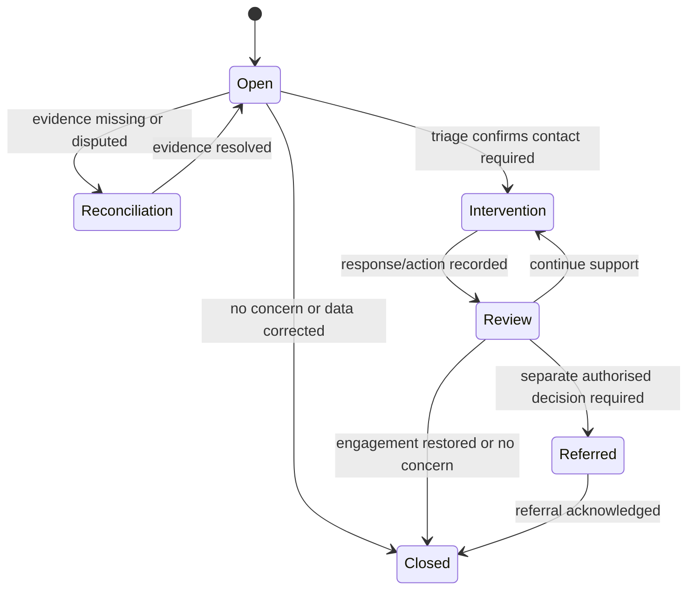

# Attendance and Academic Engagement Vertical Slice

> Status: Generic implementation in progress; institutional deployment approval remains local
>
> Version: 0.1
>
> Date: 2026-07-27

## Objective

Deliver the first demonstrable, end-to-end capability created from the UK HE business-process review: derive expected academic engagement events, record and correct observations, identify possible non-engagement, and manage a proportionate intervention without allowing raw attendance to trigger an academic-status or sponsor-reporting decision.

The slice implements [BP-027](../business-processes/04-learning-engagement-and-support/bp-027-record-attendance-and-academic-engagement-evidence.md) and the alert, triage, contact and closure portion of [BP-028](../business-processes/04-learning-engagement-and-support/bp-028-investigate-and-respond-to-non-engagement.md).

## Scope boundary

### Included

- derive expected events from authoritative enrolment, module registration, timetable or approved non-timetabled activity;
- accept teaching-staff entry and versioned inbound observations from attendance, VLE and approved specialist sources;
- preserve source, capture method, event time, received time and correction provenance;
- show expected and observed activity without presenting either as a final engagement judgement;
- apply a versioned tenant policy to create a reviewable non-engagement alert;
- triage missing/bad data, authorised absence, approved support outcome and immediate-risk indicators;
- manage accessible contact attempts, student responses, actions and review deadlines;
- close the case, continue support, or create a minimum-necessary referral;
- audit material actions and expose an operational admin journey.

### Excluded

- automated change to enrolment, registration or academic status;
- automated UKVI report/no-report decision or Sponsor Management System transaction;
- storage of medical, disability, safeguarding or welfare narrative in general engagement records;
- predictive-risk scoring;
- PGR milestone design beyond accepting configured non-timetabled evidence types;
- student-facing challenge workflow, which follows after the operational slice.

## Actors and permissions

| Actor | Minimum capability |
|---|---|
| Teaching Staff | View assigned expected events; record or correct an observation with reason |
| Engagement Officer | View alerts; open, assign, triage and manage intervention cases |
| Personal Tutor | View assigned minimum-necessary case context; record contacts, responses and actions |
| Wellbeing or Safeguarding Practitioner | Receive a restricted referral in the specialist service; return minimum status only |
| Student Sponsor Compliance Officer | Receive a governed referral; make a separate sponsor decision outside this slice |
| Integration Operator | Review quarantined exchanges and reconciliation tasks; replay safely |
| Tenant Administrator | Configure value sets, policy versions and role assignments without changing historical evaluations |
| Enrolled Student | Represented as the subject; student self-service is outside the first delivery |

Proposed permissions:

`engagement:event:read`, `engagement:observation:create`, `engagement:observation:correct`, `engagement:alert:read`, `engagement:case:manage`, `engagement:case:refer`, `engagement:policy:manage`, and `engagement:integration:reconcile`.

## User journey

1. The SRS derives an expected event for each in-scope student and activity using the effective enrolment/module/timetable version.
2. Teaching Staff or an authorised source records an observation as attended, absent, authorised absence, partial, alternative engagement, cancelled or not captured.
3. The API validates tenant, person, enrolment, expected event, source, method, event time and idempotency key.
4. The SRS appends the observation and source provenance. A correction creates a new version linked to the superseded observation.
5. The engagement view displays the expected event, latest observation and data-quality state separately.
6. A scheduled evaluation applies the policy version effective for the student's cohort, nation, mode, location and sponsor classification.
7. If evidence meets an alert rule, the SRS creates one alert for the policy/evidence-window/idempotency combination. The alert records its evidence snapshot and explanation.
8. An Engagement Officer triages the alert. Missing, disputed or unreconciled evidence suspends adverse progression and creates a reconciliation task.
9. If intervention is warranted, the system creates a domain case correlated with a workflow instance and assigns a due task.
10. The assigned officer records accessible contact attempts, the student's response and agreed action without copying restricted context.
11. At review, the officer closes the case as data corrected, engagement restored, no concern, no response, support continuing or referred.
12. A welfare/safeguarding or sponsor referral carries only the authorised minimum outcome. The receiving service owns its separate evidence and decision.

## Alternative and exception flows

| Flow | Behaviour |
|---|---|
| PGR, placement, distance or asynchronous study | Use configured expected-event and evidence types; do not require a room-based timetable event |
| Accessibility-related alternative engagement | Record the approved operational outcome without diagnosis or adjustment narrative |
| Cancelled or materially changed teaching event | Supersede the expected event; do not count the event as student absence |
| Offline capture | Retain device, local capture time, received time and uploader; deduplicate on source event/version |
| Duplicate scan or source replay | Return the existing result for the idempotency key and record no second observation |
| Late correction | Append a corrected version, mark affected alerts for re-evaluation and preserve prior decisions |
| Disputed evidence | Mark disputed, suspend automated escalation and create a reconciliation task |
| Immediate welfare risk | Create a restricted referral using the emergency/safeguarding route; do not expose narrative in the engagement view |
| Sponsored student | Permit a compliance referral only; a compliance officer makes the independent report/no-report decision |
| Welsh-language preference | Issue student communications bilingually or in Welsh according to the recorded preference and provider policy |

## Domain model

The physical design follows the target aggregate but table and field names remain provisional until the ADR gate passes.

| Aggregate/entity | Purpose and essential fields |
|---|---|
| `engagement_policy_version` | Tenant, policy code/version, applicability expression, effective interval, evidence window, alert rules, review deadlines and approval metadata |
| `expected_engagement_event` | Tenant, student/person, enrolment, activity type, module/placement/PGR reference, scheduled interval, mode, location/source version, status and bitemporal provenance |
| `engagement_observation` | Expected event, source system/event/version, method, outcome, event time, received time, actor/device, data classification and idempotency key |
| `engagement_observation_revision` | Original observation, replacement value, correction reason, disputed flag, authorised actor and recorded time |
| `engagement_alert` | Student/enrolment, policy version, evidence-window bounds, immutable evidence snapshot/hash, explanation, severity, status and re-evaluation state |
| `engagement_intervention_case` | Alert, case status/outcome, assigned role/actor, opened/review/due/closed times, workflow correlation and authoritative version |
| `engagement_contact_attempt` | Case, channel, attempted time, outcome and minimum-necessary notes/classification |
| `engagement_action` | Case, action type, owner, due date, completion and operational instruction |
| `engagement_referral` | Case, target service, referral type, minimum status, external reference and exchange-ledger reference |

All tenant-owned tables require row-level security. Expected events and observations are append/version oriented; correction must not erase the prior source assertion. Alert evidence snapshots are immutable. Restricted evidence is referenced, not embedded.

## State models

## API surface

| Method and route | Behaviour |
|---|---|
| `GET /api/v1/engagement/events` | Filter expected events by date, module, cohort, student, status and assignment |
| `POST /api/v1/engagement/events/{eventId}/observations` | Record an idempotent observation |
| `POST /api/v1/engagement/observations/{observationId}/corrections` | Append an authorised correction with reason |
| `GET /api/v1/engagement/students/{personId}/timeline` | Return expected events, current observations and alerts with role-based redaction |
| `POST /api/v1/engagement/evaluations` | Run or schedule evaluation for an explicit policy version and evidence window |
| `GET /api/v1/engagement/alerts` | List explainable alerts and reconciliation state |
| `POST /api/v1/engagement/alerts/{alertId}/triage` | Record triage and optionally open an intervention |
| `GET /api/v1/engagement/cases/{caseId}` | Return the case, tasks, contacts and actions permitted to the actor |
| `POST /api/v1/engagement/cases/{caseId}/contacts` | Record an accessible contact attempt or response |
| `POST /api/v1/engagement/cases/{caseId}/actions` | Add or complete a re-engagement action |
| `POST /api/v1/engagement/cases/{caseId}/review` | Continue, close or create a minimum-necessary referral |
| `POST /api/v1/engagement/exchanges/{exchangeId}/reconcile` | Resolve a quarantined or mismatched source exchange |

Mutation requests require an idempotency key and authoritative-version precondition. Errors use the existing RFC 7807 API standard. OpenAPI operation class is `record` for observations/corrections and `workflow` for evaluation, triage and case transitions.

## Events and integrations

Proposed domain events:

- `srs.engagement.expected-event.created.v1`
- `srs.engagement.expected-event.superseded.v1`
- `srs.engagement.observation.recorded.v1`
- `srs.engagement.observation.corrected.v1`
- `srs.engagement.alert.raised.v1`
- `srs.engagement.alert.suspended.v1`
- `srs.engagement.intervention.opened.v1`
- `srs.engagement.intervention.reviewed.v1`
- `srs.engagement.referral.created.v1`
- `srs.engagement.intervention.closed.v1`

Inbound contracts must carry source event ID/version, tenant, canonical student/activity identifiers, event and received times, observation outcome, capture method, correction link and idempotency key. Dead-letter payloads contain no restricted narrative.

The existing UKVI report endpoint must continue to state `pending-attendance-integration` until it consumes an approved engagement read model. Even after that integration, it may present evidence to a sponsor-compliance case but must not auto-submit a report.

## Admin application

Add an `Engagement` area containing:

1. an expected-events/observation worklist for Teaching Staff;
2. an alert queue with evidence-quality and policy explanations;
3. an intervention case view with task, contact, response, action and referral timeline;
4. a reconciliation queue for Integration Operators; and
5. policy/version configuration for Tenant Administrators.

The default demonstration should show one cohort and four students: attended, authorised alternative engagement, disputed/missing source data, and a sustained non-engagement case referred for human sponsor review.

## UK-wide and institutional variation

The core evidence and intervention model is UK-wide. Configuration, not national forks, represents:

- provider engagement policy and academic regulations;
- sponsor status and current UKVI guidance where applicable across the UK;
- SLC attendance-confirmation use where scheme rules apply;
- Scottish, Welsh and Northern Irish funding/reporting ownership;
- Welsh-language communications;
- term/semester/block calendars;
- campus, placement, distance, transnational and collaborative provision;
- UG, PGT and PGR evidence patterns; and
- provider thresholds, review deadlines, role assignments and escalation routes.

No nation implies an automatic adverse outcome from an attendance threshold.

## Delivery increments

| Increment | Deliverable | Exit evidence |
|---|---|---|
| A | ADR/SME decisions and contract vocabulary | Complete for generic product development; institutional decisions remain deployment configuration |
| B | Migration `0037`, Drizzle schema and RLS | Implemented; integration tests authored for tenant isolation, idempotency and correction-history immutability; execution awaits a working container runtime |
| C | Expected-event and observation API | Implemented: OpenAPI and typed events cover creation/query, idempotent capture, correction history and timelines; integration tests are authored and await a working container runtime |
| D | Policy evaluation and explainable alert | Implemented: approved policy versions drive deterministic evidence snapshots and duplicate-safe explainable alerts; unsafe evidence suspends for reconciliation and no direct adverse decision is permitted |
| E | Intervention workflow and restricted referral | Workflow tests cover reconciliation, contact, review, closure and referral boundary |
| F | Admin UI and demo data | Accessible end-to-end walkthrough for the four demonstration students |
| G | UKVI boundary integration and operational controls | Placeholder removed only with approved read model; monitoring, replay and reconciliation verified |

## Acceptance criteria

1. ESP-001–ESP-006 have automated requirement-level tests.
2. An expected event remains distinct from every observation and engagement judgement.
3. Duplicate inbound evidence cannot create duplicate observations or alerts.
4. Corrections preserve the original assertion and re-evaluate affected alerts.
5. Missing, disputed or unreconciled evidence prevents automatic escalation.
6. No route, event or workflow transition changes academic status or submits a sponsor report.
7. General engagement responses contain no restricted welfare, medical, disability or safeguarding narrative.
8. Tenant isolation is enforced in the database and tested through the API.
9. The alert explains the policy version, evidence window and evidence facts used.
10. All material transitions record actor, time, correlation, authoritative version and audit event.
11. Welsh-language preference and non-room-based study modes are demonstrated through configuration.
12. The end-to-end demo runs from expected event through observation, alert, intervention and human referral.

## Traceability

| Concern | References |
|---|---|
| Business processes | BP-027; BP-028; referral boundary to BP-052 |
| Backlog | BPR-W07; BPR-D08; BPR-I03 |
| Requirements | ESP-001–ESP-006; BPC-007; XIC-001–XIC-007 |
| Architecture decisions | ADR-016; ADR-017; ADR-019; ADR-022 |
| Target model | Engagement and intervention aggregate; migration `0037` |
| Capability matrix | Attendance and academic engagement — Proposed target |
| ADR review | [Attendance vertical-slice ADR review](../decisions/attendance-vertical-slice-adr-review.md) |
| Increment A governance | [Approval pack](attendance-engagement-increment-a-approval-pack.md); [contract vocabulary](../architecture/attendance-engagement-contract-vocabulary.md); [privacy/threat assessment](../architecture/attendance-engagement-privacy-threat-assessment.md) |
