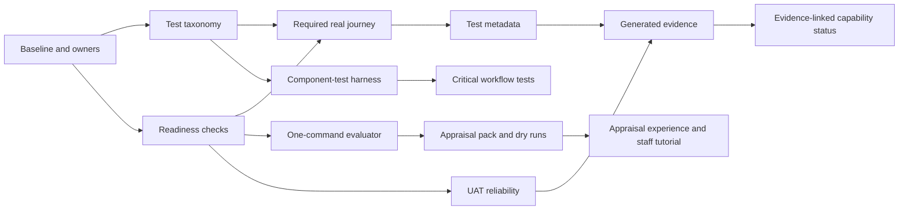

# Testing and User Appraisal Accessibility Implementation Plan

> Status: Proposed implementation plan
>
> Planning horizon: Five dependency-ordered phases (0–4), advanced by exit-gate readiness rather than fixed calendar weeks — see [Delivery cadence](#delivery-cadence)
>
> Created: 2026-08-14
>
> Updated: 2026-08-14 — phasing reframed from calendar weeks to dependency-gated stages; P2.14 narrowed to reflect that README and the capability matrix already agree
>
> Scope: Test entry points, full-stack verification, evaluator setup, UAT evidence, appraisal materials, frontend component testing, traceability and reporting

## Rationale

Revelation SRS already has substantial automated testing, deterministic demo data, product walkthroughs and detailed domain documentation. The immediate problem is not a simple shortage of tests or documents. It is that the available evidence and evaluation paths are difficult for a new contributor, domain specialist or prospective user to interpret and operate.

The current default browser suite uses injected authentication and mocked API responses. It is useful frontend verification, but its `test:e2e` name makes its evidence boundary unclear. A separate real-backend golden suite exists, but it depends on a pre-started environment, runs in CI only on `main`, and can skip when the API is unavailable. The admin, portal and shared UI packages also have no component-level test layer, leaving a gap between service integration tests and broad browser tests.

User appraisal has a similar accessibility problem. The repository provides realistic scenarios, demo accounts, walkthroughs, an issue template and a student-portal tutorial pipeline, but an evaluator must still understand Docker, migrations, scenario loading, Keycloak, multiple application processes and known product limitations. Automated UAT evidence can also amplify a single environment outage into many apparent product defects, reducing confidence in the results.

This plan therefore prioritises four outcomes:

1. make every test command state clearly what it proves and what it does not prove;
2. make one real, deterministic product journey a required and non-skippable pull-request check;
3. give evaluators one dependable entry point and a short, honest appraisal pack; and
4. build the missing component-test, traceability and evidence-reporting layers without attempting a disruptive test-suite rewrite.

The order is intentional. Phases 0–2 establish trustworthy names, environment readiness, a real journey and usable appraisal entry points. Phases 3–4 expand coverage and generate durable evidence only after those foundations are stable — see [Delivery cadence](#delivery-cadence) for how phase sequencing relates to elapsed time.

## Objectives and success measures

| Objective | Measure at Phase 2 exit | Measure at Phase 4 exit |
|---|---|---|
| Clear test evidence boundaries | Test commands and CI jobs distinguish unit, component, mocked UI, service integration and real journey evidence | Generated evidence uses the same classification |
| Accessible functional verification | One real-backend journey is required on pull requests and cannot silently skip | Principal journeys are tagged and selectively runnable by capability/persona |
| Low-friction evaluation | `pnpm evaluate` prepares a supported appraisal environment or exits with an actionable diagnosis | Appraisal landing experience and hosted-environment design are ready for repeated reviews |
| Trustworthy UAT findings | Infrastructure failures invalidate or block a run and duplicate symptoms are grouped | UAT reports carry commit, run, scenario and health provenance and feed the evidence report |
| Faster frontend feedback | Test harness and conventions are agreed | Shared components and five critical workflows have component tests |
| Discoverable product appraisal | A one-page appraisal pack offers three goal-based journeys | Feedback instruments and an admin/staff overview recording are available |

## Delivery principles

- Preserve existing test coverage; rename and regroup before replacing anything.
- A test must fail, not skip, when a required CI prerequisite is missing.
- Local commands must check their own prerequisites and give remediation instructions.
- Mocked UI tests and full-stack journeys remain separate evidence classes.
- Appraisal journeys state product maturity, scenario, persona, goal, completion condition and known limitations.
- User appraisal tasks describe goals rather than exact clicks unless the document is explicitly a regression script.
- Generated evidence is derived from machine-readable results; manually written historical pass counts are not the primary source of truth.
- Demo and test data remain fictional, deterministic and safe to reset.
- Accessibility is included in every delivery increment, not deferred to a final audit.

## Delivery cadence

This plan is five dependency-ordered phases, not five fixed calendar periods. Every phase of this codebase delivered so far — module selection rules, the PGR lifecycle build, the full-stack integration-test root-cause pass — was completed in concentrated sessions rather than staffed week-long workstreams, and this plan should be read the same way:

- A phase starts when the phase(s) it depends on have met their exit gate, not on a calendar date.
- A phase ends when its exit gate is met, however long or short that takes in practice.
- Phase names below retain informal "week"/"month" language only to convey expected relative size (Phase 1 is smaller than Phase 3, for example); treat it as sizing, not a deadline.
- The six roles in [Work allocation guidance](#work-allocation-guidance) describe responsibilities, not headcount. On a small or single-operator team, one person or one working session carries several roles in sequence rather than all roles running concurrently.
- Phase 3 (component-test layer) depends only on P1.1 and can proceed in parallel with Phase 2, not strictly after it. Phase 4 depends on outputs from Phases 0, 2 and 3 as listed in each task's "Depends on" column — consult that column, not phase order, for the true critical path.

## Target test taxonomy and commands

The following vocabulary is the target public interface. Existing package-level commands may remain where useful.

| Command | Evidence class | Infrastructure | Intended use |
|---|---|---|---|
| `pnpm test:quick` | Typecheck, lint, unit and component tests | No Docker | Frequent local feedback |
| `pnpm test:unit` | Pure unit tests | No Docker | Domain and utility behaviour |
| `pnpm test:component` | React component tests with controlled HTTP mocks | No Docker | UI states, forms and interaction behaviour |
| `pnpm test:ui:mocked` | Playwright frontend tests with injected auth and mocked APIs | Vite apps only | Routing, page composition, keyboard and browser behaviour |
| `pnpm test:service` | API, database, module and adapter integration tests | Docker/Testcontainers | Service contracts and persistence |
| `pnpm test:journey` | Real frontend, API and database with deterministic demo data | Supported full stack | Product-level functional confidence |
| `pnpm test:all` | All required release evidence | Full prerequisites | Release candidate verification |

`pnpm test` should remain as a compatibility alias during this plan. Its eventual meaning must be documented and changed only after contributors have had one release cycle of notice.

## Phase 0: Baseline and ownership

**Sequencing:** First phase; blocks every other phase. Expected to be a short, single-session exercise rather than a calendar-day allocation.

**Purpose:** Freeze the evidence baseline and assign decision ownership before command, CI and documentation changes begin.

| ID | Task | Deliverable | Acceptance criteria | Depends on |
|---|---|---|---|---|
| P0.1 | Record current root/package scripts, CI jobs, test file counts, suite durations and infrastructure needs | Baseline section in the implementation PR or linked issue | Every existing suite maps to one target evidence class; no suite is silently omitted | None |
| P0.2 | Assign responsible roles for test tooling, CI, demo environment, appraisal content and accessibility review | Named owners in tracking issues | Every phase-one task has one accountable owner and one reviewer | P0.1 |
| P0.3 | Agree the first real pull-request journey | Short decision record in the tracking issue | Journey uses real API/database, deterministic data, one staff or student persona, at least one meaningful read and mutation, and a visible persisted result | P0.1 |
| P0.4 | Define performance budgets for the new checks | Recorded local and CI targets | Target budgets cover `test:quick`, environment preparation and the PR journey; exceptions require evidence | P0.1 |

Recommended first journey: student module registration request followed by staff approval and student-visible confirmation. If its current workflow is not stable enough, use student search and an auditable profile/contact update as the initial journey, but retain a real mutation and persistence check.

### Phase 0 exit gate

- The current suites and proposed commands have a one-to-one mapping.
- The selected journey, owners and time budgets are agreed.
- Any existing flaky tests are recorded separately and not hidden by retries.

## Phase 1: Truthful tests and dependable readiness

**Sequencing:** Begins once the Phase 0 exit gate is met. Comparable in scope to roughly a week of focused effort — run as one or more concentrated sessions, not a fixed calendar week.

### Workstream 1A: Rename and expose test levels

| ID | Task | Implementation detail | Acceptance criteria | Verification |
|---|---|---|---|---|
| P1.1 | Add the target root commands | Compose existing package scripts; avoid duplicating runner configuration | Each command prints a short description, runs only its documented evidence class and returns the underlying exit status | Run every command locally with and without Docker as applicable |
| P1.2 | Rename the mocked browser entry point | Introduce `test:ui:mocked`; retain `test:e2e` temporarily as a documented compatibility alias | CI and contributor docs call the suite “Mocked UI” rather than “E2E” | `pnpm test:ui:mocked -- --list` lists the existing browser tests |
| P1.3 | Rename CI jobs and reports to match evidence class | Use names such as “Mocked UI & Accessibility” and “Real Full-stack Journey” | GitHub checks do not describe a mocked suite as full stack | Inspect required-check names on a test PR |
| P1.4 | Add a test taxonomy page or section to developer setup | Explain mocks, real dependencies, expected duration and failure ownership | A new contributor can select the correct command from a goal-oriented table | Documentation review by someone not implementing the change |
| P1.5 | Preserve backward compatibility | Add deprecation output or documentation for old commands | Existing documented workflows keep working during the transition | Run legacy commands and confirm they invoke the intended new command |

### Workstream 1B: Environment preflight and readiness

| ID | Task | Implementation detail | Acceptance criteria | Verification |
|---|---|---|---|---|
| P1.6 | Implement a reusable preflight command | Check Node/pnpm versions, Docker availability, required ports, environment file and minimum configuration without printing secrets | Failures name the failing check and exact remediation; command is read-only | Exercise every failure branch in automated tests where practical |
| P1.7 | Implement service readiness checks | Check PostgreSQL, Keycloak, API health/readiness and both frontend URLs with bounded timeouts | Startup does not proceed to seeding or journeys until dependencies are actually ready | Stop each dependency in turn and confirm a precise failure |
| P1.8 | Make CI prerequisite absence fatal | Replace real-journey reachability skips with a failing setup/project check in CI; optionally retain explicit local skip mode | A missing API, database or scenario fails the CI job before journey assertions | Run the journey job once with the API deliberately unavailable |
| P1.9 | Emit a diagnostic bundle on setup failure | Capture Compose status, health responses and relevant redacted logs | CI artifact identifies which service failed without exposing tokens or secrets | Review artifact from the deliberate failure run |

### Workstream 1C: First required real journey

| ID | Task | Implementation detail | Acceptance criteria | Verification |
|---|---|---|---|---|
| P1.10 | Create a self-contained journey setup | Start essential dependencies, migrate, load `ci-golden` or a purpose-built small scenario, start API and frontends | A clean runner reaches the journey without manual processes | Execute from a clean CI workspace |
| P1.11 | Implement or harden the selected journey | Use deterministic identifiers; exercise real HTTP and persistence; avoid mocking domain endpoints | Journey verifies initial state, action, response, persisted state and user-visible result | Deliberately break the API mutation and confirm failure |
| P1.12 | Add journey cleanup and isolation | Use a resettable scenario or unique correlation identifiers | Repeated local and CI runs produce the same outcome without manual cleanup | Run the journey three times consecutively |
| P1.13 | Make the journey a pull-request check | Run on pull requests after relevant build/service checks; upload trace, screenshot and logs on failure | A broken journey blocks merge; ordinary failure is diagnosable from artifacts | Test in a draft PR with an intentional assertion failure |
| P1.14 | Bound execution time | Cache dependencies/images where safe; report setup and test durations separately | The agreed P0.4 budget is met on two consecutive CI runs | Compare CI timing output |

### Phase 1 exit gate

- Public commands distinguish all test evidence classes.
- Mocked browser coverage is no longer labelled as full-stack E2E.
- Real-journey CI fails when prerequisites are missing.
- One deterministic real journey runs from a clean CI workspace.
- Existing suites remain runnable through compatibility aliases.

## Phase 2: Evaluator entry point and trustworthy appraisal

**Sequencing:** Begins once the Phase 1 exit gate is met (the evaluator command and UAT reliability work both reuse Phase 1's readiness checks). Comparable in scope to roughly a further week of focused effort.

### Workstream 2A: One-command evaluation environment

| ID | Task | Implementation detail | Acceptance criteria | Verification |
|---|---|---|---|---|
| P2.1 | Add `pnpm evaluate` | Orchestrate preflight, essential services, readiness, migrations, a small appraisal scenario, persona provisioning and application startup | A developer with prerequisites installed reaches working URLs without knowing internal service order | Trial from a clean clone or isolated worktree |
| P2.2 | Add `pnpm evaluate:status` | Show service health, active scenario, data version, application URLs and safe persona names | Output is concise, does not reveal secrets and distinguishes healthy/degraded/stopped | Check all three states |
| P2.3 | Add `pnpm evaluate:reset` | Reset only the named demo environment after an explicit scope check | Reset is deterministic and refuses production-like environments | Test safe reset and protected-environment refusal |
| P2.4 | Add `pnpm evaluate:stop` | Stop only processes/containers owned by the evaluator workflow | Existing unrelated developer processes are not terminated | Start an unrelated process and verify it survives |
| P2.5 | Print or serve a launch summary | Present URLs, personas, active scenario, three suggested journeys, reset command and support link | Evaluator can begin without reading developer setup | Observe a new evaluator starting a journey from the summary |

The evaluator command should initially support the documented local Docker configuration. A hosted environment is a later extension and must not block the local outcome.

### Workstream 2B: UAT runner reliability

| ID | Task | Implementation detail | Acceptance criteria | Verification |
|---|---|---|---|---|
| P2.6 | Add run-level preflight | Record health and scenario state before executing stories | Core infrastructure failure marks the run `invalid-environment` and no product defect count is published | Run with the API unavailable |
| P2.7 | Classify findings | Separate product assertion, accessibility, console, network, authentication, data and environment findings | Every finding has exactly one primary class | Validate report schema |
| P2.8 | Group duplicate symptoms | Fingerprint repeated failures by class, endpoint/error and likely root cause while retaining affected stories | One connection outage produces one root finding with an affected-story count | Replay a fixture containing repeated connection failures |
| P2.9 | Add provenance | Record run ID, commit SHA, timestamp, browser, OS, scenario slug/version and service health | Markdown and JSON reports contain the same provenance | Schema test and sample-report review |
| P2.10 | Generate machine-readable output | Produce stable JSON alongside Markdown | CI and later evidence reporting can consume results without parsing prose | JSON schema or snapshot test |

### Workstream 2C: Appraisal pack and status reconciliation

| ID | Task | Implementation detail | Acceptance criteria | Verification |
|---|---|---|---|---|
| P2.11 | Create `TRY.md` or an equivalent appraisal start page | Explain audience, Alpha status, prerequisites, launch command, support and safety | Page is understandable without architecture knowledge and links directly to the appraisal pack | Non-developer editorial review |
| P2.12 | Create a concise appraisal pack | Include a five-minute orientation and three 20–30 minute goal-based journeys covering student, operational staff and governance/compliance perspectives | Every journey states persona, scenario, goal, completion condition, known limitations and feedback questions | Facilitate one dry run per journey |
| P2.13 | Separate appraisal from regression instructions | Keep exact-click walkthroughs for verification; use goal-led tasks for appraisal | Appraisal tasks do not reveal the intended click path unless needed for access | UX/research review |
| P2.14 | Safeguard status consistency | README and the capability matrix already agree (both declare Alpha and README cites the matrix as authority); `check:current-capabilities` already enforces this but is not wired into CI. Wire it in as a required check and extend its coverage to new entry documents this plan introduces (`TRY.md`, appraisal pack) | `pnpm check:current-capabilities` runs as a required CI check; new entry documents added by this plan are covered by the same or an equivalent check | Introduce a deliberate contradiction and confirm CI fails; remove it and confirm CI passes |
| P2.15 | Improve visible mutation feedback in the selected journey | Add accessible success, pending or failure feedback, beginning with module registration if selected | User receives programmatically determinable confirmation and a clear next state | Component/browser assertion plus keyboard and axe check |
| P2.16 | Add appraisal feedback template | Capture task completion, assistance, confidence, terminology, usefulness, missing information, severity and optional attachment | Feedback distinguishes usability, missing capability, defect and environment issue | Pilot with sample submissions |

### Phase 2 exit gate

- `pnpm evaluate`, `evaluate:status`, `evaluate:reset` and `evaluate:stop` work as documented.
- A new evaluator can launch and begin an appraisal journey from one page.
- Three goal-based appraisal journeys have completed dry runs.
- UAT infrastructure failures no longer inflate the product-defect count.
- Root README and capability status consistency is enforced by a required CI check, not just manual review.
- The first selected mutation provides clear accessible feedback.

## Phase 3: Frontend component-test layer

**Sequencing:** Depends only on P1.1 (the target root commands), so it can start as soon as that lands and run in parallel with Phase 2 rather than strictly after it. Comparable in scope to roughly two weeks of focused effort.

### Workstream 3A: Test harness and conventions

| ID | Task | Deliverable | Acceptance criteria | Depends on |
|---|---|---|---|---|
| P3.1 | Add Vitest browser-like environment, React Testing Library, `user-event` and MSW where appropriate | Shared component-test configuration and utilities | Admin, portal and shared UI can run isolated component tests using the same conventions | P1.1 |
| P3.2 | Provide standard render helpers | Router, auth, tenant, permissions, i18n and query/API wrappers | Tests declare only relevant state; helpers do not silently grant all permissions | P3.1 |
| P3.3 | Document selector and mocking rules | Testing conventions page | Tests prefer roles/labels, assert user-visible outcomes and mock at the HTTP boundary | P3.1 |
| P3.4 | Add accessibility checks to component tests | Reusable axe helper for stable rendered states | Critical interactive components have automated accessibility assertions without replacing manual review | P3.1 |
| P3.5 | Add component tests to `test:quick` | Root command and CI integration | Component failures appear in fast local/PR feedback and the time budget remains acceptable | P3.1–P3.4 |

### Workstream 3B: Shared components and critical workflows

Prioritise behavioural risk rather than raw file coverage.

| ID | Target | Minimum states/interactions | Completion criterion |
|---|---|---|---|
| P3.6 | Shared form controls and validation summary | Label/error association, required state, keyboard submission, server error | Representative components pass interaction and axe checks |
| P3.7 | Dialog/confirmation pattern | Initial focus, focus trap, cancel, Escape, destructive confirmation, focus return | Pattern tests replace duplicated low-level assertions where possible |
| P3.8 | Data table/list pattern | Loading, empty, error, populated, filter and pagination | Tests cover accessible names and status announcements |
| P3.9 | Module registration/approval workflow | Eligible, validation failure, submitted/pending, approved/returned and API failure | Student and staff components reflect the same authoritative state |
| P3.10 | Student record update workflow | Initial load, valid edit, conflict/stale version, forbidden and success | Persistence request and visible outcome are asserted |
| P3.11 | Exam-board authority workflow | Conflict, quorum, decision, ratification lock and read-only state | Unsafe transitions cannot be invoked from the UI |
| P3.12 | Engagement intervention workflow | Explainable alert, disputed evidence, action/contact, restricted referral | Minimum-necessary information boundary is asserted |
| P3.13 | Regulatory submission workflow | Draft, validation errors, approval, submitted and failed exchange | Lineage/status and retry affordances are unambiguous |

### Phase 3 exit gate

- All three frontend workspaces have a functioning component-test harness.
- Shared interaction patterns have reusable behavioural tests.
- Five critical workflows have meaningful state and interaction coverage.
- `test:quick` remains within the agreed feedback budget.
- Browser tests that merely duplicate component behaviour are identified for later simplification, not deleted automatically.

## Phase 4: Traceability, evidence and appraisal maturity

**Sequencing:** Depends on outputs from Phase 0 (P0.1), Phase 2 (P2.10) and Phase 3 (component-harness conventions), so it begins once those specific tasks — not necessarily the whole of Phases 2 and 3 — have landed. Comparable in scope to a further two weeks of focused effort.

### Workstream 4A: Test metadata and selective execution

| ID | Task | Deliverable | Acceptance criteria | Depends on |
|---|---|---|---|---|
| P4.1 | Define metadata vocabulary | Capability, requirement, persona, scenario and evidence-class identifiers | Values reuse existing authoritative identifiers and avoid a parallel taxonomy | P0.1 |
| P4.2 | Tag principal journeys | Metadata in test titles/annotations or adjacent manifests | Every required real journey identifies at least one capability and persona | P4.1 |
| P4.3 | Add selective commands | `test:capability`, `test:persona` and, if reliable, `test:changed` | Unknown identifiers fail clearly; selected runs list included evidence | P4.1–P4.2 |
| P4.4 | Validate metadata in CI | Lightweight schema/check script | Required journeys cannot merge with missing or invalid metadata | P4.1 |

`test:changed` should be introduced only if dependency mapping is conservative. When impact is uncertain it must run more tests, not fewer.

### Workstream 4B: Generated evidence report

| ID | Task | Deliverable | Acceptance criteria | Depends on |
|---|---|---|---|---|
| P4.5 | Define a common result manifest | JSON schema for suite, commit, environment, duration, evidence class, metadata, result and artifact links | Vitest, Playwright and UAT adapters can populate the schema | P4.1, P2.10 |
| P4.6 | Add result adapters | Machine-readable output from required CI suites | A failed adapter cannot convert a failed suite into a pass | P4.5 |
| P4.7 | Generate an HTML/Markdown evidence summary | Release evidence page grouped by capability and evidence class | Reader can distinguish mocked, service and full-stack evidence at a glance | P4.6 |
| P4.8 | Publish reports for passing and failing runs | CI artifacts or approved static publication | Reports include retention policy and do not expose credentials or sensitive logs | P4.7 |
| P4.9 | Link status claims to current evidence | Capability matrix references generated/immutable evidence rather than prose-only historical counts | Status entries remain readable when an artifact expires by retaining stable summary data | P4.7 |

### Workstream 4C: Appraisal experience and learning loop

| ID | Task | Deliverable | Acceptance criteria | Depends on |
|---|---|---|---|---|
| P4.10 | Add visible demo context | Banner or appraisal landing view with scenario, persona/role, reset time, Alpha status and known-limitations link | Context is accessible, non-dismissible where safety requires it and never appears in production | P2.1, P2.12 |
| P4.11 | Add contextual glossary/help links | Help on the three appraisal journeys' highest-friction terms | Links preserve user state and use authoritative glossary definitions | P2.12 |
| P4.12 | Produce admin/staff overview recording | Captioned overview with transcript and current-version marker | Recording covers one coherent staff journey and passes media quality checks | Stable appraisal journey |
| P4.13 | Pilot structured appraisal sessions | At least one participant or proxy review for each of the three journeys | Findings record task completion, assistance, confidence and issue classification | P2.16 |
| P4.14 | Establish triage cadence | Recurring review of appraisal findings by product, domain and engineering owners | Every finding is accepted, rejected with rationale, merged as duplicate or scheduled | P4.13 |
| P4.15 | Design hosted disposable evaluation environments | Short architecture/operations proposal, not necessarily implementation | Proposal covers lifetime, reset, access, fictional data, cost, observability and support | P2.1 experience |

### Phase 4 exit gate

- Principal journeys are traceable and selectively runnable.
- CI publishes a current evidence summary with explicit evidence classes.
- Capability claims link to reproducible evidence.
- The appraisal UI exposes scenario and maturity context.
- An accessible staff overview and structured appraisal feedback loop exist.
- A decision-ready proposal describes hosted disposable evaluation environments.

## Dependencies and sequencing

The real journey and evaluator command should share readiness and scenario-building code. The UAT runner should consume the same health checks rather than introducing a third implementation. Component-test HTTP handlers may share contract fixtures, but full-stack journeys must not use those handlers.

## Work allocation guidance

| Role | Primary responsibility |
|---|---|
| Test/platform engineer | Commands, runner configuration, journey isolation and result manifests |
| CI/operations engineer | Readiness, caching, diagnostics and required checks |
| Frontend engineer | Component harness, shared patterns and visible feedback |
| Product/domain lead | Appraisal goals, capability metadata and known limitations |
| UX/accessibility reviewer | Goal-led task design, feedback instrument, keyboard/screen-reader review |
| Documentation maintainer | Entry pages, taxonomy, status reconciliation and navigation |

With limited staffing, complete workstreams in dependency order rather than running all roles concurrently — one person or one working session can hold multiple roles across successive phases. The minimum viable early outcome, achievable well before the full five-phase programme is complete, is P1.1–P1.14, P2.1–P2.3, P2.6–P2.12 and P2.14–P2.15.

## Risks and mitigations

| Risk | Consequence | Mitigation |
|---|---|---|
| Full-stack PR check is slow or flaky | Developers lose trust and bypass it | Use one small deterministic scenario, explicit readiness, no arbitrary sleeps, bounded retries only for startup and timing telemetry |
| Renaming commands disrupts existing users | Local/CI workflows fail unexpectedly | Retain aliases for one release cycle and document deprecation |
| Evaluator reset affects developer or non-demo data | Data loss or unsafe operation | Require demo-mode/environment assertions and explicit target resolution before reset |
| Component harness creates a second API contract model | Mock drift | Use generated types and shared contract fixtures; reserve MSW for controlled UI states |
| Traceability metadata becomes bureaucratic | Tests carry stale or meaningless tags | Require metadata only for principal journeys initially and validate against authoritative catalogues |
| Evidence report presents quantity as quality | False confidence | Separate evidence classes and show limitations, skipped/invalid runs and capability gaps |
| Appraisal scripts bias participants | Usability findings become overly positive | Use goals and completion conditions, not click-by-click instructions |
| Demo accounts expose reusable credentials | Poor security practice | Limit to local/disposable environments, display demo status clearly and prevent production use |

## Definition of done for every task

A task is complete only when:

1. implementation and user-facing documentation agree;
2. success and relevant failure paths are verified;
3. CI behaviour is deterministic and artifacts are redacted;
4. accessibility impact has been considered and tested in proportion to the change;
5. no existing command or workflow is silently removed;
6. status or capability claims cite current evidence where applicable; and
7. the change is usable from a clean or explicitly documented starting state.

## Final programme acceptance criteria

Once all five phases have met their exit gates:

1. contributors can choose a test command by desired evidence and receive accurate prerequisite guidance;
2. pull requests exercise at least one non-skippable real product journey;
3. a new evaluator can start the supported local appraisal environment with one command and recover/reset it safely;
4. infrastructure outages cannot be reported as hundreds of independent product defects;
5. the frontend has component-level coverage for shared patterns and five critical workflows;
6. principal journeys are traceable by capability and persona and can be selected accordingly;
7. CI publishes a current evidence summary that distinguishes mocked, integration and full-stack results;
8. product-status documents continue to agree, that agreement is enforced by a required CI check rather than manual review, and status claims link to reproducible evidence;
9. three goal-based appraisal journeys and a structured feedback instrument have been piloted; and
10. evaluators can see the active demo scenario, product maturity and known limitations while using the application.

## Explicitly deferred beyond this plan

- broad visual-regression coverage across every page;
- a full cross-browser and mobile-device matrix for all journeys;
- blanket component-test coverage targets based only on line percentage;
- implementation of hosted disposable review environments;
- replacement of every historical walkthrough;
- production analytics collection from appraisal users; and
- expansion of the tutorial pipeline to every admin capability.

These are candidates for the next planning cycle after the phased evidence and appraisal foundations have been measured in actual use.
